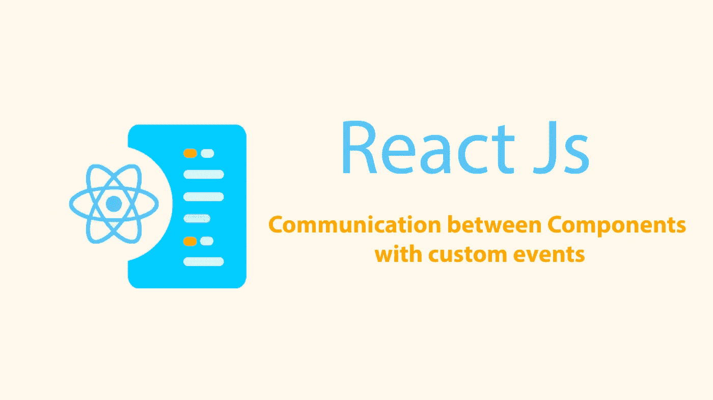
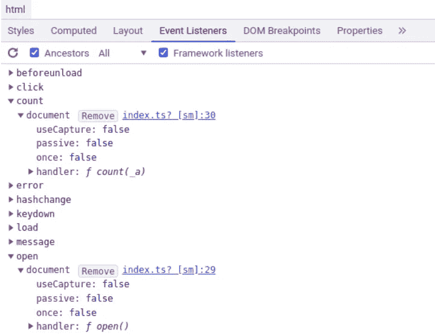
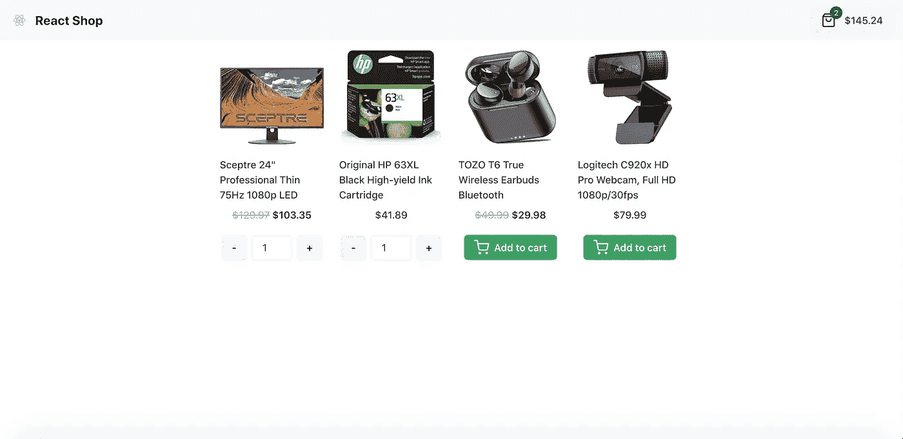

# 如何使用自定义事件在组件之间进行通信

> 原文：<https://javascript.plainenglish.io/how-to-communicate-between-components-with-custom-events-f92519d51271?source=collection_archive---------5----------------------->

需要使用不同的 JavaScript 框架，从而在应用程序的所有组件之间进行通信？您可以使用的解决方案之一是使用浏览器自带的自定义事件。在这篇文章中找到答案。

# 自定义事件:是什么？

与经典事件如**点击**、**提交**、**聚焦**……相同，只是它们是手工创建的。创建一个 [**客户事件**](https://developer.mozilla.org/en-US/docs/Web/API/CustomEvent/CustomEvent) 有两种可能，要么使用客户事件(如果需要传递数据)，要么简单地调用事件。

在下面的示例中，函数用于创建自定义事件:

现在只需发送自定义事件:

> `*document*` 用作所有自定义事件的单个事件处理程序，因为它集中了所有事件方法，并将自定义事件与页面上的特定节点分离。

最后一步，您必须监听这些事件并实现逻辑:

请记住在必要时清理和删除事件侦听器，请参见下面的示例:

此外，确保事件侦听器在那里并且没有多次附加到网页的一种方法是使用 Chrome 开发工具检查这一点。这可能是这样的:

为了更进一步，对于前面没有提到的[***addevent listener***](https://developer.mozilla.org/en-US/docs/Web/API/EventTarget/addEventListener)*方法，还有第三个参数。这是`once`参数，它很有用，这样事件监听器只执行一次，并在调用后自动销毁。*

# *让我们以 React 为例*

*这个 app 是用 **Create React App** 和 **Chakra UI** 创建的。它代表了一个关于电子商务的经典课程，也就是说，向篮子中添加一个产品，显示篮子的总量，并显示完成的篮子。*

**

*这是应用程序容器。在它里面有三个容器(**ViewCartButtonContainer**、**AddToCartButtonContainer**、 **CartContainer** )。*

*`src/containers/App.tsx`*

*所有这些容器都是完全独立的，通过`useCart`钩子通过事件总线系统进行通信。*

*这个挂钩公开了购物车中的产品列表及其总价，还公开了三个定制方法和事件:*

*   *更新购物车`updateCart`。*

*为此，通过触发`onUpdateCart`方法的 useEffect 监听`updateCart`事件。该方法添加或更改购物车中产品的数量。最好记住使用 useCallback 的函数，以避免不必要的渲染。注意，在 ***useEffect*** 中，每次方法改变`onUpdateCart`时，监听器都会被移除。这适用于示例中的所有 useEffects。*

*   *清空购物车`clearCart`。*
*   *而这辆大车的开口`openCart`。*

*对于后两个事件，事件侦听器的逻辑是相似的。*

*`src/hooks/useCart.ts`*

*关于容器，其中的第一个`CartButtonViewContainer`显示购物车的数量，并允许您进入购物车。*

*src/`containers`/CartButtonView/CartButtonView.tsx*

*第二个容器`AddToCardButtonContainer`允许您将产品添加到购物车并更改其数量。*

*`src/containers/`AddToCartButton`/AddToCartButton.tsx`*

*最后，最后一个容器`CartContainer`显示购物车中的产品。*

*`src/containers/Cart/Cart.tsx`*

*此处可访问[代码。](https://github.com/crayOmn/react-app-with-custom-events)*

*定制事件非常受特性团队和微前端架构项目的欢迎，因为它们可以相互独立，也不受 JavaScript 框架的影响。*

**More content at* [***PlainEnglish.io***](https://plainenglish.io/)*. Sign up for our* [***free weekly newsletter***](http://newsletter.plainenglish.io/)*. Follow us on* [***Twitter***](https://twitter.com/inPlainEngHQ), [***LinkedIn***](https://www.linkedin.com/company/inplainenglish/)***,*** [***YouTube***](https://www.youtube.com/channel/UCtipWUghju290NWcn8jhyAw)***, and***[***Discord***](https://discord.gg/GtDtUAvyhW)***.*** *Interested in Growth Hacking? Check out* [***Circuit***](https://circuit.ooo/)***.****