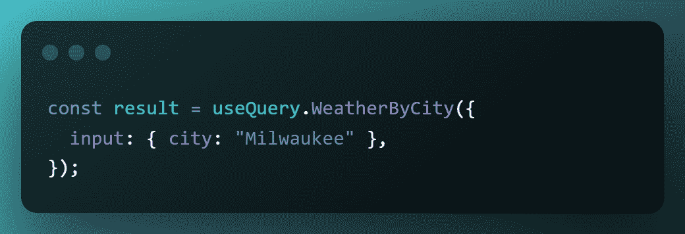

# 如何将 API 组合和集成在一起，就像您正在使用 API 的 NPM 一样

> 原文：<https://javascript.plainenglish.io/how-to-compose-and-integrate-apis-together-as-if-you-were-using-npm-for-apis-4a6113108cb3?source=collection_archive---------7----------------------->

## *了解如何将 React 的可组合性范式引入 API、微服务和数据库领域——由 Wundergraph、构建时 GraphQL 和 BFF/API 网关模式提供支持。*

Bringing together two APIs for an app that shows the biggest concerts, historically, by country capital.

使用 React/Next.js，你正在解决的基本问题是将一些“状态”的概念转化为 DOM，重点是可组合性——使用较小的东西来构建较大的东西*。*

恭喜你，你已经找到了 web 开发的最终老板:构建可重复使用的“乐高积木”,可以无限扩展。如果您没有从一开始就使用 React/Next.js 来进行这场战斗，那么在某个时候，您将不可避免地重新实现一个更糟糕的、特别的 jQuery“React”——并负责维护它。

但是构建可组合的 ui 只是成功的一半。如果没有数据显示，世界上最具可伸缩性的用户界面将一无是处。那么，这里是另一半:使用 API、数据库和微服务。如果我们要全力以赴开发可伸缩的、模块化的 web 应用，我们**也不能**忘记这个问题空间中的可组合性。

这就是 WunderGraph(一个开源 API 开发平台)可以提供帮助的地方。在 React 心智模型中，您已经习惯于在`package.json`文件中列出您的所有依赖项，并在您`npm install && npm start`一个项目时让包管理器来完成剩下的工作。 **WunderGraph 让你保持这种直觉，并对你的数据源做同样的事情**:

1.  以配置即代码的格式明确命名您需要的 API、微服务和数据库，然后，
2.  WunderGraph 生成客户端代码，当您在前端工作时，这些代码为您提供了对所有这些数据源的一流的类型安全访问(通过 Next.js/React 钩子)。

在本教程中，我们将有点冒险，在一个 Next.js 应用程序中将两个完全不同、非常不同的 API 放在一起，以展示 WunderGraph(没有其他依赖项)作为独立的服务器/API 网关/ [BFF](https://learn.microsoft.com/en-us/azure/architecture/patterns/backends-for-frontends) 与您的前端一起运行，您可以针对多个 REST、GraphQL、MySQL、Postgres、DBaaS(如 Fauna、MongoDB 等)**编写前端代码，就好像它们是一个单一的整体**。

不过，在我们开始之前，让我们快速了解一下 TL；DR a 概念:

# “可组合性”对 API 意味着什么？

现在，您与数据源的交互完全是用代码实现的。您编写代码来调用 API 端点或数据库(在您的。env 文件)，然后编写更多的代码。这一次，异步样板/胶水管理返回的数据。

What’s wrong with this picture?

代码本身是正确的，什么是“错误的”是现在**你把一个依赖项耦合到你的代码，而不是你的配置文件**。当然，这个天气 API 不是 axios 或 react-dom(库/框架包)，但它**仍然是**一个依赖项，现在，一个只镜像临时数据的第三方 API，已经被提交给你的回购，成为你的核心业务的一部分，你现在将支持它的整个生命周期。

坚持乐高类比:这就像把你的玩具粘在一起。欢迎来到臃肿、可读性差、难以维护的硬约束代码库。

你将在现代大中型应用程序上做上述十倍的工作，这些应用程序被分成许多微服务，具有复杂的交互，并且每个应用程序都有独立的团队，每个团队都可能会相互影响。这还没有算上为获得所需数据而跨多个服务/API 进行的所有连接。

那么，在不牺牲开发人员体验的情况下，API 可组合性的可伸缩方法会是什么样的呢？

1.  它需要支持各种数据，而不需要为每种类型提供单独的客户端，我们需要能够在我们的应用程序代码之外显式定义这些数据依赖关系——可能在一个配置文件中。
2.  它应该允许我们在需要时添加更多的数据源，从依赖数组中删除过时/失效的数据源，并自动更新客户端以反映这些变化。
3.  它应该允许我们将来自多个来源(API、数据库、Apollo 联邦、微服务等)的数据缝合在一起。)所以我们可以完全避免在前端进行代码内连接。

事实证明，这正是 WunderGraph 所实现的，它结合了 API Gateway 和 BFF 架构。

如果您在 WunderGraph 配置中显式命名您的 API 依赖项，如右图所示，则如下所示:

Conceptually, what’s the difference? There are none; both are config files with a list of things your app needs. Sure, you’re writing a little more code on the right, but that’s just stuff React/Next.js does for you under the hood anywayon the left.

WunderGraph 检查并合并这些数据源(不仅仅是端点)到一个命名空间的虚拟图中，并从中构建一个模式。

现在，你不再关心:

1.  您的数据依赖关系在幕后的工作方式有多么不同。
2.  将任何第三方客户端放在前端，以支持这些不同的数据源。
3.  你的团队应该如何跨域交流。

因为现在你已经有了所有的数据依赖作为一个规范层，一个**真实的单一来源** — **GraphQL。**

正如您可能已经猜到的，接下来，只需编写操作(WunderGraph 在 IDE 中为您提供的 GraphQL 查询/变异)就可以从这个标准化的数据层中获得您想要的数据。这些在构建时被编译到一个 native client 中，持久化，并使用 JSON-RPC (HTTP)公开。

All the DevEx wins of using GraphQL without actually having a public GraphQL endpoint, so none of its security/caching/bundle size concerns on the client side.

最后，在您的前端代码中，您使用这个生成的客户端的类型安全数据获取挂钩。

Clear, intuitive, and maintainable.

最终结果？**一个码头工人或 NPM 式的集装箱化/包装管理器范例，但用于数据源**。以及随之而来的所有好处:

*   API、数据库和微服务变成了**模块化、可组合的乐高积木**，就像你的 UI 组件一样。
*   前端的连接和过滤器不再有代码膨胀，大大提高了代码可读性，并且在尝试通过微服务进行事务处理时不再有竞争情况。
*   最终的“端点”是良好的老式 HTTP 上的 JSON-RPC；不管数据源是什么类型，缓存、权限、身份验证和安全性都成为需要解决的问题。

但是为什么要拘泥于理论呢？让我们开始吧！

# 像对待乐高那样对待 API 的冒险

像在图书馆一样组合和汇集数据源的能力可以带你去非常有趣的地方，那里有任何普通的公共 API 都不能给你的想法。

比方说，如果你想找出最大的音乐事件——音乐会、独奏会、节日等等，该怎么办？历史上曾在某个国家的首都？

There’s literallyno API like this out there. You could build the first one. The world’s your oyster!

# 步骤 1:决定数据

所以我们在这里使用的两个 API 是[国家 API](https://countries.trevorblades.com/) 和 [MusicBrainz 聚合器](https://graphbrainz.herokuapp.com/)。您可以随意使用失眠症/邮递员/游乐场，并感受一下使用这些 API 可以合理地查询哪些数据。您可能会发现大量额外的、创造性的用例。

# 第二步:快速启动 WunderGraph + Next.js 应用程序

当你准备好继续前进时，在 WunderGraph 的 repo 中使用 starter 模板，用于 Next.js 应用程序，该应用程序使用前者作为 BFF/API 网关。

`npx -y @wundergraph/wunderctl init — template nextjs-starter -o wg-concerts`

这将创建一个名为 wg-concerts 的新项目目录(或者您选择的文件夹名)，通过使用 npm-run-all 包，启动一个 WunderGraph(位于 localhost:9991)和一个 Next.js 服务器(位于 localhost:3000)；特别是使用 run-p 别名来并行运行两者。

# 步骤 3:Concerts by Capital——无需代码的跨 API 连接。

这是这本指南的要点。我已经详细讨论了跨源数据连接是如何在代码中完成的，现在，您将直接看到 WunderGraph 如何简化它们。

您可以将两个 API 响应缝合在一起——在我们的示例中，获取一个国家的首都，然后使用该信息到查询在那里举行的音乐会——如下所示:

Imagine implementing this query in JavaScript. Truly, spooky season. 🎃

*   args 的`@internal`指令表示，虽然这个参数在技术上是一个“输入”，但它只能在这个查询内部找到，在我们调用这个操作时不需要提供。
*   `@export`指令与`@internal`协同工作，无论您要导出什么(或者别名——这就是'`as`'关键字的用途)都必须与您标记为内部的 arg 具有相同的名称和类型。
*   `_join`表示实际的加入操作:
*   可以看出，第二个查询的输入(查询)使用了我们在 GraphQL 查询的顶层标记为 internal 的同一个参数。
*   虽然是可选的，但我们使用了`@transform`指令(然后是指向我们需要的确切数据结构的“`get`”字段)将第二个查询的响应别名为“concerts”，因为我们加入的任何额外查询当然会添加另一个复杂、烦人的嵌套结构，并且我们希望简化它，使其尽可能具有可读性。
*   我们还(可选地)为每场音乐会包含了`relationships` 字段，以在这里获取`mbid` (参与音乐会的艺术家的 MusicBrainz 内部 ID ),因为我们仍然希望稍后单独查询艺术家实体(横幅、缩略图、bios 等。同样，可选)。

# 步骤 4:获取艺术家详细信息

Speaking of developer experience…here’s a little gotcha with the `artistId` variable being of type `MBID!` and not `String!`. Thanks to WunderGraph, you get code hinting for that in your IDE!

我们的第二个和第三个操作分别是通过他们的 MusicBrainz ID 获得艺术家的 1000x185 像素横幅图像(来自音频数据库),然后是缩略图/传记。这只是为了美化我们的 UI，如果您只想要音乐会的细节而不想要其他的，您可以跳过这些查询(可能因为您的用例根本不需要 UI)。

# 步骤 5:在前端显示我们的数据

我们在最后冲刺阶段！让我们不要在这里太疯狂，只是每个音乐会映射到`<ConcertCard>`组件，和一个`<NavBar>`与一个`<Dropdown>`来选择一个国家在其首都获取音乐会。哦，当然还有造型用的 TailwindCSS。

全部完成！启动 `localhost:3000`，你将看到你的应用程序。

但是在我们结束之前，这里有一个非常重要的问题。

# 如果我不用 Next.js/React?呢

WunderGraph 仍然作为一个简单的 API 网关/BFF 工作，不需要自动生成前端客户端来获取数据。

不过，在这种情况下，您将无法访问 WunderGraph 为您的客户端生成的类型安全的 React 挂钩，因此您将不得不承担更多的问题——自己实现数据获取，注意类型安全，并手动进行内部 GET/POST 调用。

使用默认的 WunderGraph 配置，每个操作(。graphql 文件)被公开为 JSON-RPC (HTTP ),位于:

`[http://localhost:9991/app/main/operations/[operation_name]](http://localhost:9991/app/main/operations/[operation_name]?[params)`

因此，您的数据获取将如下所示:

其中`Weather.graphql`是您的操作的文件名。

# 成就解锁:数据的可组合性

有了 WunderGraph 作为工具的一部分来整合所有的 API、数据库和微服务——无论是作为 BFF、API 网关、只镜像只读数据的视图聚合器，还是其他什么——您就能在数据领域获得**UI 可组合性的所有好处。**

1.  **渐进增强**:随着业务需求的增长，随时修改代码以充实内容，或者添加新的部分。

**2。灵活性**:根据需要更换部件，这样您的技术组合就不会僵化。

3.改进的端到端**开发人员体验**:

*   **所有数据的单一真实来源** (GraphQL 层)。
*   通过代码生成实现的**完美塑造的客户端**意味着每个团队在将操作编写为 GraphQL 查询或变体时，都确切地知道他们可以或不可以对数据做什么(通过 IDE 中的自动完成),从而允许您为您的用户精心制作您想要的准确的体验，而不会出现试用&错误。
*   与 Next.js 一起，您可以在您的`<Suspense>` 边界中准备好查询，这样您就可以确切地知道每个边界中呈现了什么，以及它到底运行了哪些查询。这种知识导致**更好的修补和优化**,因为您会确切地知道任何问题或瓶颈在哪里。

就现代的无服务器 web 开发而言， **WunderGraph 可以在任何可以运行 Docker** 的设备上运行，因此可以无缝集成到您的技术堆栈中。

那是神童的 powerplay。所有依赖项的可组合性，允许您为现代网络构建模块化的数据密集型体验，而不会影响开发人员的体验。

*更多内容请看*[***plain English . io***](https://plainenglish.io/)*。报名参加我们的* [***免费周报***](http://newsletter.plainenglish.io/) *。关注我们关于*[***Twitter***](https://twitter.com/inPlainEngHQ)[***LinkedIn***](https://www.linkedin.com/company/inplainenglish/)*[***YouTube***](https://www.youtube.com/channel/UCtipWUghju290NWcn8jhyAw)***，以及****[***不和***](https://discord.gg/GtDtUAvyhW) *对成长黑客感兴趣？检查* [***电路***](https://circuit.ooo/) ***。*****