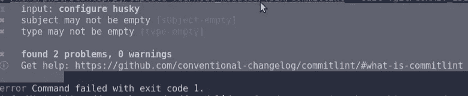

# 如何配置 Commitlint 并从 Git 提交消息中生成有用的 CHANGELOGs

> 原文：<https://javascript.plainenglish.io/how-to-configure-commitlint-and-generate-useful-changelogs-from-git-commit-messages-baa50764da4b?source=collection_archive---------10----------------------->

## 从 git 提交消息中配置和生成有用的变更日志


Photo by [Brina Blum](https://unsplash.com/@brina_blum?utm_source=medium&utm_medium=referral) on [Unsplash](https://unsplash.com?utm_source=medium&utm_medium=referral)

在整个软件开发生命周期(SDLC)过程中，软件开发包含了各种模式、实践和约定。在整个 SDLC 过程中实施的实践总是很方便，并对最终产品产生重大影响。像特性一样，环境可能会迫使某些约定在开发的早期或后期被合并。

实施和采用这些约定带来了许多好处，这些好处取代了缺点。一些好处包括减少错误的发生，提高效率和软件质量。

这篇短文将介绍如何通过实施提交林挺来编写更好的提交消息。我们将在一个项目中配置 commitlint 来实现 [***常规提交格式***](https://www.conventionalcommits.org/en/v1.0.0/) **。**在软件项目中实现传统的提交格式有很多好处，比如:

*   对开发人员、团队和公众有用的变更的流线型本质。
*   自动生成变更日志(发行说明)。
*   对您的项目做出更方便、更有效的贡献。

**配置提交信息**

Commitlint，顾名思义，在提交消息被注册到 git 提交历史之前，lints 提交消息并确保它们遵守 [***常规提交格式***](https://www.conventionalcommits.org/en/v1.0.0/)*。配置 commitlint 使更改的性质变得透明，并且更加直观地说明了更改的必要性和原因。*

*在本文中，我们将在基于 JavaScript 的环境中配置 commitlint。*

***安装 commitlint cli 和常规配置***

```
*yarn add --dev @commitlint/{config-conventional,cli}*
```

*现在您的项目中已经有了 commitlint，我们需要配置它来使用传统的配置。传统配置采用如下所示的模式。*

```
 *type(scope?): subject// scope is optional to include*
```

*commitlint 默认支持的类型有: ***(build，chore，ci，docs，feat，fix，perf，refactor，revert，style，test)。*** 类型可以根据您的偏好和项目需求的范围进行修改。您可以查看 [***配置提交类型。***](https://github.com/conventional-changelog/commitlint#config)*

***配置哈士奇***

*在 lint 提交被注册到 git 提交历史之前，我们利用 Husky 中的 ***commit-msg*** 钩子来处理 lint 提交。*

```
*yarn add husky*
```

*添加**T5【提交-消息】T6**钩子。*

```
*yarn husky add .husky/commit-msg 'yarn commitlint --edit $1'*
```

*您需要在 package.json 中设置***" post install ":" husky install "***，以便在安装后自动启用 git 挂钩。*

*此时，您应该已经在您的开发环境中成功配置了 commitlint，并准备好体验它所提供的强大功能。*

*现在，每当您提交更改时，都会检查提交消息，以确保为给定的更改提供了类型( ***、构建、任务、配置项、文档、功能、修复、性能、重构、恢复、样式和测试*** )。如果我们提供一个没有类型的提交消息，commitlint 将抛出如下所示的错误。*

**

*Screenshot by Author*

*正确提交消息的一个例子是。*

```
*fix: mobile styling*
```

***生成变更日志***

*Changelogs 是一个包含特定时间点(通常是在发布之后)的变更记录(错误修复、特性、样式、增强)的文件。这样的变更记录对于软件开发团队跟踪交付给产品的内容非常有益。*

> *“变更日志是对项目进行的所有显著变更的日志或记录。该项目通常是一个网站或软件项目，变更日志通常包括诸如错误修复、新功能等变更的记录。”—维基百科*

*根据不同的发布版本，您可以检索到描述项目变更的优秀的提交历史。这些信息对于团队成员、公众和其他利益相关者交流项目变更的不同性质是非常有益的。*

*要生成变更日志，我们需要在项目中添加标准版本。标准版本使用[***SEM ver***](https://semver.org/)进行版本控制和由常规提交支持的变更日志生成。*

****安装标准版****

```
*yarn add --dev standard-version*
```

*现在，我们可以在 package.json 上创建一个运行脚本，并随时运行该脚本来自动生成变更日志。*

*要自动生成 CHANGELOGs，需要运行命令 ***纱运行释放*** 。*

## ***资源***

*   *[标准版。](https://github.com/conventional-changelog/standard-version)*
*   *[提交信息](https://github.com/conventional-changelog/commitlint)*

## ***最终想法***

*在 SDLC 流程中实现 commitlint 可以更有效地执行编写提交消息的更好约定。类似地，它使得从您的提交中自动生成 CHANGELOG 变得更加容易，使得其他涉众能够更容易地快速识别为什么以及每个项目发布中发生了什么变化。*

*每周三，我都会发送一封独家邮件，里面有我发现的有用的、与技术写作相关的技巧、文章、应用、书籍和想法。*

*[***加入像你一样想提高写作技巧的人。***](https://artisanal-thinker-2556.ck.page/6e2ba71172)*

## ***更读***

*[](/how-to-create-api-documentation-eb4561ab6f4f) [## 如何创建 API 文档

### 第 2 部分:设置您的第一个 API 文档

javascript.plainenglish.io](/how-to-create-api-documentation-eb4561ab6f4f) [](/5-no-code-tools-you-need-to-try-out-b8e7859a1c14) [## 你需要尝试的 5 种无代码工具

### 开发人员友好的无代码工具，你需要检查

javascript.plainenglish.io](/5-no-code-tools-you-need-to-try-out-b8e7859a1c14) 

*更多内容看* [***说白了。报名参加我们的***](https://plainenglish.io/) **[***免费周报***](http://newsletter.plainenglish.io/) *。关注我们关于*[***Twitter***](https://twitter.com/inPlainEngHQ)*和*[***LinkedIn***](https://www.linkedin.com/company/inplainenglish/)*。加入我们的* [***社区***](https://discord.gg/GtDtUAvyhW) *。****