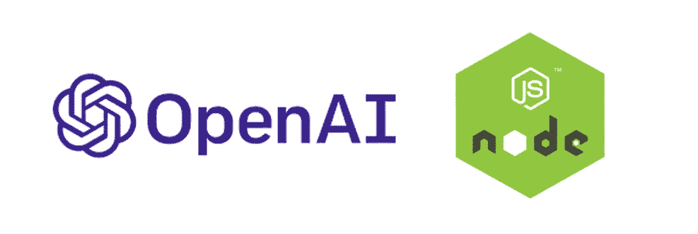
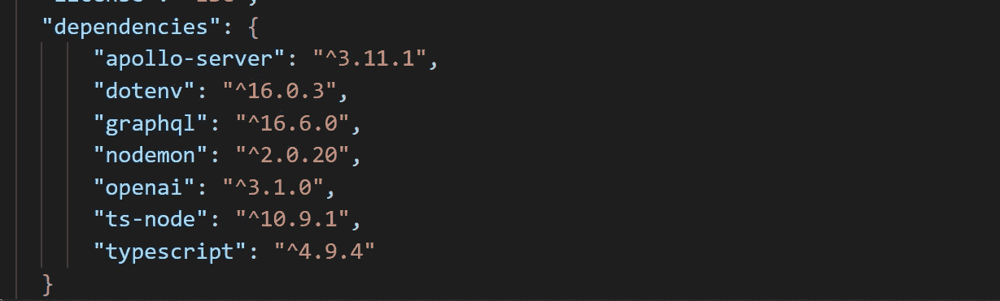
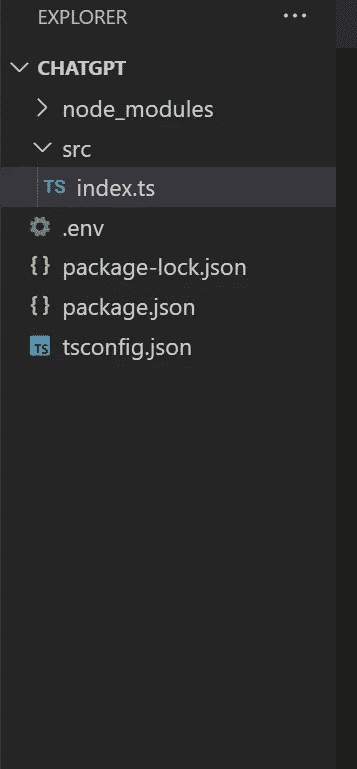
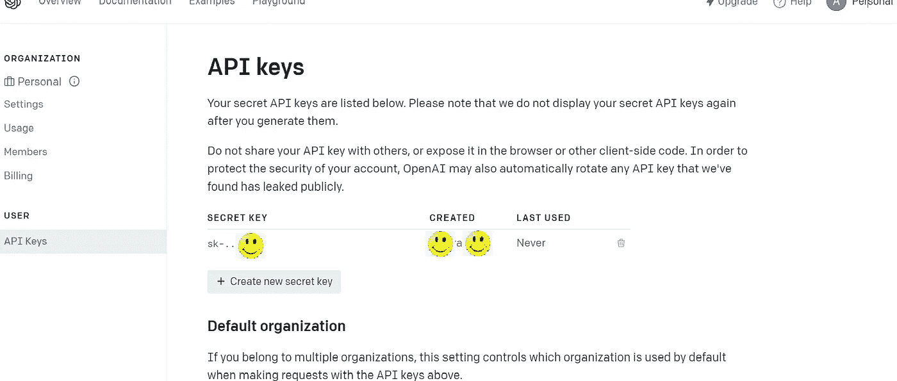
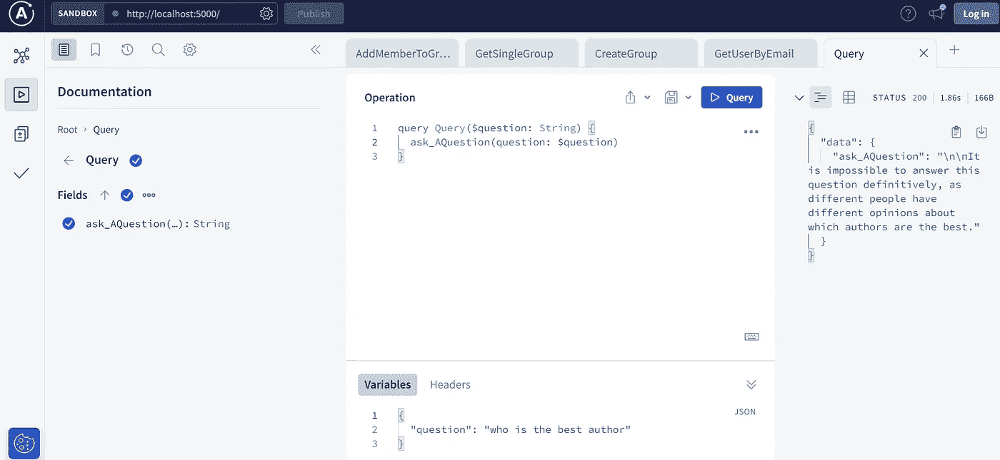

# 如何连接 ChatGPT 和 NodeJS

> 原文：<https://javascript.plainenglish.io/how-to-connect-chatgpt-with-nodejs-b176ae418c7e?source=collection_archive---------4----------------------->



> 人工智能是现在对技术感兴趣的人的热门话题之一。那到底是什么？它能控制人类吗？或者它能取代谷歌？这个问题目前没有答案。但是我们可以利用 OpenAI 提供的机会来测试它。

[**OpenAI**](https://openai.com/) 的应用是 [**ChatGPT**](https://openai.com/) 。你想问什么都可以。当然，它不可能像 [**Google**](https://www.google.com) 一样回答所有问题，对未来毫无概念。但它可以写诗，并根据你的问题提供一些选项。

在本文中，我将介绍如何使用**chat GPT API**创建应用程序。

我将使用 [**NodeJS**](https://nodejs.org/en/) 创建一个服务器。而且我会用 [**GraphQL**](https://www.apollographql.com/) 和 **TypeScript** 代替 Restful API 和普通 JavaScript。而我的 IDE 将是 [**VSCode**](https://code.visualstudio.com/) 。

我需要一个秘密的 API 密钥来连接。

我在终端上键入下面的代码来创建 ***package.json*** 文件。

```
npm init
```

我安装创建 **GraphQL** 所需的包。

```
npm install apollo-server graphql
```

我安装**打字稿**需要的包:

```
npm install ts-node typescript
```

我输入创建 **tsconfig.json** 文件的代码

```
npx tsc -init
```

以及 ***openAI*** 包和两个工具:

```
npm install openai nodemon dotenv
```

而现在**依赖的**在 ***package.json*** 文件夹中需要的样子是:



我加上**。env** 和 **index.ts** 文件:



我将下面的代码添加到 **index.ts** 文件中:

你在文件中看到了有价值的 **OPENAI_API_KEY。**你可以在 [OpenAI](https://openai.com/) 网站上得到。首先，您应该在网站上创建一个帐户，然后转到“查看 API 密钥”页面。您可以在这里创建 API 密钥。



最后，如果你在终端上输入

```
npm start
```

您可以看到这个页面:



但是请确保将下面的节点添加到文件 **package.json** 中。

```
“scripts”: {
  “test”: “echo \”Error: no test specified\” && exit 1",
  “start”: “nodemon src/index.ts”
},
```

而且在**沙盒**页面，你可以问 ChatGPT 任何你想问的问题！

## 更多内容请访问 [PlainEnglish.io](https://plainenglish.io/) 。

*报名参加我们的* [***免费每周简讯***](http://newsletter.plainenglish.io/) *。关注我们关于*[***Twitter***](https://twitter.com/inPlainEngHQ)，[***LinkedIn***](https://www.linkedin.com/company/inplainenglish/)***，***[***YouTube***](https://www.youtube.com/channel/UCtipWUghju290NWcn8jhyAw)***，以及****[***不和***](https://discord.gg/GtDtUAvyhW) *

## *希望扩大你的科技创业公司的知名度和采用率吗？检查[电路](https://circuit.ooo/?utm=publication-post-cta)。*