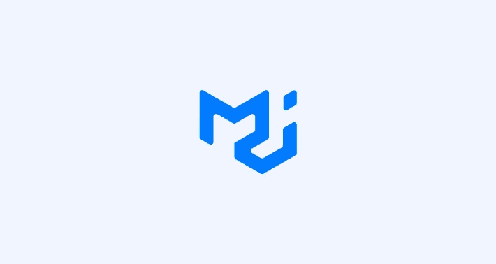
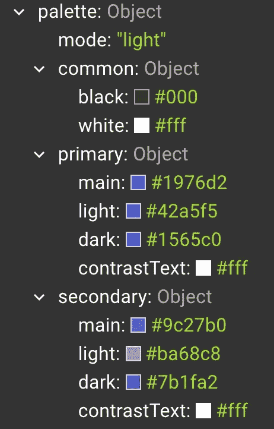
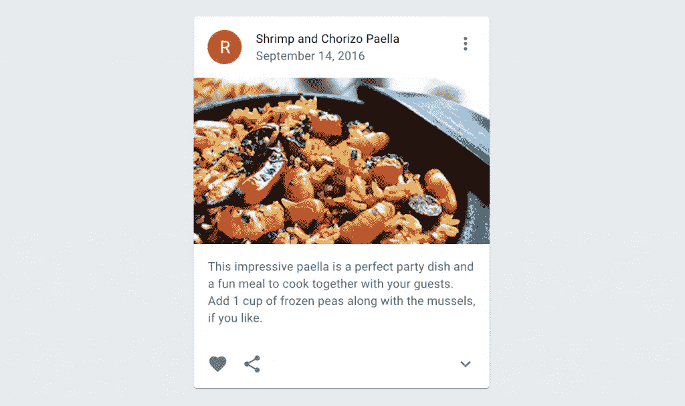
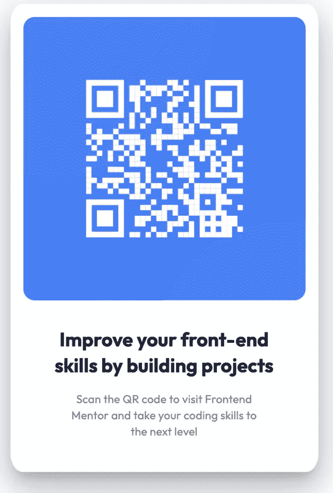

# 如何将组件设计转换成 MUI React 代码

> 原文：<https://javascript.plainenglish.io/how-to-convert-a-component-design-into-an-mui-react-code-c4811d782e30?source=collection_archive---------8----------------------->



Material UI 或 MUI 库为您提供了强大的、可定制的、可访问的高级组件，使您能够构建自己的设计系统并更快地开发 React 应用程序。其中包括大量的材质图标、带有 MUI 核心的基础组件、带有 MUI X 的高级和强大组件、模板和设计工具包！

在本教程中，我们将了解如何采用给定的设计，并通过为 React 应用程序设计 MUI 核心配置来将其转换为实际的组件代码。我们开始吧！

# 在 React 中将组件设计转换为 MUI 代码

如果您提供了一个带有简单组件的设计文件来构建 React，那么有很多方法，但是这里有了 MUI 广泛的预构建组件，这个过程变得更加容易、快速、可访问，最重要的是可定制！

# 我们会做什么？

我们将采用以下条形码组件设计，并将其与 MUI 一起用于 React:

如你所见，我们有三个项目:

1.  具有两个部分的条形码组件。
2.  第一部分将条形码图像保存在蓝色容器中。
3.  条形码图像下面的第二部分包含了所有的排版元素，如标题和段落。

# 第一步。开始一个新的 React 项目

确保您的系统上安装了[node . js](https://docs.npmjs.com/downloading-and-installing-node-js-and-npm/)，然后运行以下命令:

```
<code>npx create-react-app mui-barcode-app
cd mui-barcode-app
npm start</code>
```

这将引导一个新的 React 应用程序，并通过 [Create React App](https://create-react-app.dev/) 工具在您的默认浏览器中运行 [http://localhost:3000/](http://localhost:3000/) 上的默认应用程序。

# 第二步。安装材料用户界面(MUI)包

在我们开始修改默认的 React 代码之前，我们需要核心的 MUI 包，因为所有这些图标都使用 MUI [](https://mui.com/api/svg-icon/#main-content)`[SvgIcon](https://mui.com/api/svg-icon/#main-content)`组件来呈现每个图标的 SVG 路径。对于每个 SVG 图标，我们从`@mui/icons-material`包中导出各自的 React 组件。

从终端运行以下命令:

```
npm install @mui/material @emotion/react @emotion/styled
```

或者，如果您使用的是纱线:

```
yarn add @mui/material @emotion/react @emotion/styled
```

# 第三步。对默认代码进行一些整理

让我们进行这些初始更改:

1.  删除 *App.js* 文件中的所有代码，简单地返回< Barcode / >组件:

```
import Barcode from "./barcode";
function App() {
  return <Barcode />;
}
export default App;
```

1.  在 *src* 目录下新建一个名为 *Barcode.jsx* 的组件文件。这将包含我们组件的所有 MUI 定制代码。
2.  将您拥有的条形码图像添加到*图像*文件夹下的*资产*目录中，以便您在需要渲染时可以访问该文件。

**步骤 4:用 MUI 对组件进行主题化！**

事实是这样的！我们现在可以开始创建条形码组件了。

仍然在 *Barcode.jsx* 文件中，导出 Barcode 函数，后面跟着一个 return 语句。首先，您也可以简单地呈现一个写着“条形码组件”的`<p>`标签。如果你保存你的代码，渲染应该工作。

```
export default function Barcode() {
  return <p>Barcode component</p>;
}
```

# 主题提供者包装

默认情况下，您将使用的所有 MUI 组件和样式都有一组默认主题，如下所示:



正如您在上面所看到的，这个默认主题是一个包含属性和值的对象集合。例如，这里显示了一个 MUI 应用程序的调色板。如果您希望在任何 React 元素中使用原色，如按钮背景色或分隔线颜色，那么它的十六进制值将是所列的 [#1976d2](https://paper.dropbox.com/?q=%231976d2) 。

但是在我们的设计中，我们看不到在他们的文档中列出的颜色，所以为了让我们自己的主题工作，我们需要来自`@material-ui/core`的 [](https://mui.com/customization/theming/#theme-provider) `[ThemeProvider](https://mui.com/customization/theming/#theme-provider)` 组件，并在我们的渲染方法中将所有的元素作为它们的子元素。

这个组件需要一个 `theme` 道具。需要注意的一点是，它最好用在组件树的根**处。因此，让我们删除之前的占位符 `<p>`标签，并将其用作:**

```
return <ThemeProvider theme={theme}>...</ThemeProvider>;
```

确保您也导入它:

```
import { ThemeProvider } from "@material-ui/core";
```

# 创建自定义主题

显而易见的下一步是添加我们自己的主题值，这样`theme` 道具就可以工作了。在条形码函数定义之外，创建一个使用 [](https://mui.com/customization/theming/#createtheme-options-args-theme) `[createMuiTheme()](https://mui.com/customization/theming/#createtheme-options-args-theme)` 方法的新主题对象。这用于根据收到的选项生成一个主题，该主题随后被传递给`<ThemeProvider>`的`theme` 变量。

c `reateMuiTheme()`接受两个参数，其中第一个非常重要。是`options` 对象接受了一个不完整的主题对象，这是唯一被处理的参数。在这个对象中，我们可以为每个不同的属性定义自定义值，比如字体、颜色、间距、字体大小等。

在这个演示中，让我们尝试实现当前的字体样式。根据我们的设计，标题和下面段落中使用的字体叫做[装备，可以在谷歌字体](https://fonts.google.com/specimen/Outfit)目录中找到。因此，要在 MUI 项目中添加自定义字体，我们需要遵循以下步骤:

1.  从自定义字体 CDN 复制 HTML/CSS 导入。在我们的例子中，简单地复制谷歌提供的`<link>`标签，在选择了我们需要的服装字体家族的两个权重之后。
2.  通过粘贴这些链接标签并删除 MUI 项目中包含的默认 Roboto 字体来更新*index.html*文件。

```
<link rel="preconnect" href="https://fonts.googleapis.com" />
<link rel="preconnect" href="https://fonts.gstatic.com" crossorigin />
<link
  href="https://fonts.googleapis.com/css2?family=Outfit:wght@400;700&display=swap"
  rel="stylesheet"
/>
```

3.在`createMuiTheme`调用下创建排版对象，给它正确的名称和值，如:

```
typography: {
  fontFamily: "Outfit",
  fontWeightRegular: 400,
  fontWeightBold: 700
}
```

现在 MUI 知道了要使用的自定义字体，让我们在条形码组件中实现它。但是首先，我们需要制作卡片布局并添加图片！

# 使用默认的 MUI 组件

我们将需要 MUI 提供的总共 3 个新组件来使我们的条形码看起来完全像设计上的一样。这些是:

1.  **卡片组件**:卡片的基本目的是包含单个主题的内容和动作。MUI 拥有各种类型的卡组件。这里有一个例子:



关于 MUI 中的大多数元素，有一点很棒，那就是我们可以使用 [](https://mui.com/system/the-sx-prop/#main-content) `[sx](https://mui.com/system/the-sx-prop/#main-content)` [属性](https://mui.com/system/the-sx-prop/#main-content)将自定义样式传递给任何元素。这就像是定义一个可以访问主题的自定义样式的快捷方式。因此，如果我们想快速改变页边距，或者不在我们设计系统中的任何元素的宽度，我们可以简单地使用`sx` 道具。

例如在我们的`<Card>`组件中，我们可以为它提供一个自定义的`padding`、`boxShadow`、`borderRadius`、水平边距和`maxWidth`作为:

```
<Card
  sx={{
    maxWidth: 350,
    mx: "auto",
    padding: "1rem",
    borderRadius: "4%",
    boxShadow: 24
    }}
>
```

2.**[**卡片媒体**](https://mui.com/components/cards/#media) **组件**:这种类型的卡片非常适合我们的设计，因为它上面有图像，下面有内容。让我们如下使用它:**

```
<CardMedia
  component="img"
  height="350"
  image="path/to/image.png"
  alt="Barcode image"
  sx={{ borderRadius: "4%" }}
/>
```

**这将为卡片提供一个新的 `[](https://mui.com/api/card-content/#main-content) [<CardContent>](https://mui.com/api/card-content/#main-content)` [API](https://mui.com/api/card-content/#main-content) ，我们可以在其中嵌套所有卡片内容文本，如标题和副标题:**

```
<CardContent>
// Other components 
</CardContent>
```

**3.**[**排版**](https://mui.com/components/typography/#main-content) **组件**:专门用于渲染文本元素，从一个章节的大粗体标题到视频上生成的小字幕。因此，它带有各种各样的道具，如`align`、`mt`、`variant`等。在我们的应用程序中，我们将其用作卡片的标题:****

```
**<Typography
  gutterBottom
  variant="h5"
  component="div"
  align="center"
  fontFamily="Outfit"
  fontWeight="fontWeightBold"
  mt={2}
  mb={2}
  sx={{ color: "#182036" }}
>
Improve your front-end <br /> skills by building projects
</Typography>**
```

****注意我们自定义字体的使用和它们的粗细。我们可以用上面定义的`theme` 对象中的设置值轻松地将字体系列和字体粗细属性传递给它。****

****接下来，我们对副标题做了类似的事情，对颜色和`fontWeight`做了一些调整:****

```
**<Typography
  variant="body2"
  align="center"
  fontFamily="Outfit"
  fontWeight="fontWeightRegular"
  sx={{ color: "#7b879d" }}
>
Scan the QR code to visit Frontend <br /> Mentor and take your coding skills to <br /> the next level
</Typography>**
```

****有了这些代码，您应该可以在浏览器中获得预期的样式，如下所示:****

********

****如果您成功实现了上述步骤，您应该有以下代码:****

```
**import Card from "@mui/material/Card";
import CardContent from "@mui/material/CardContent";
import CardMedia from "@mui/material/CardMedia";
import Typography from "@mui/material/Typography";
import { createMuiTheme, ThemeProvider } from "@material-ui/core";const theme = createMuiTheme({
  typography: {
    fontFamily: "Outfit",
    fontWeightRegular: 400,
    fontWeightBold: 700
  }
});export default function Barcode() {
  return (
    <ThemeProvider theme={theme}>
      <Card
        sx={{
          maxWidth: 350,
          mx: "auto",
          padding: "1rem",
          borderRadius: "4%",
          boxShadow: 24
        }}
      >
        <CardMedia
          component="img"
          height="350"
          image="https://i.imgur.com/AJJqWpN.png"
          alt="Barcode image"
          sx={{ borderRadius: "4%" }}
        />
        <CardContent>
          <Typography
            gutterBottom
            variant="h5"
            component="div"
            align="center"
            fontFamily="Outfit"
            fontWeight="fontWeightBold"
            mt={2}
            mb={2}
            sx={{ color: "#182036" }}
          >
            Improve your front-end <br /> skills by building projects
          </Typography>
          <Typography
            variant="body2"
            align="center"
            fontFamily="Outfit"
            fontWeight="fontWeightRegular"
            sx={{ color: "#7b879d" }}
          >
            Scan the QR code to visit Frontend <br /> Mentor and take your
            coding skills to <br /> the next level
          </Typography>
        </CardContent>
      </Card>
    </ThemeProvider>
  );
}**
```

****就这样，您能够理解 MUI 的核心组件，这些组件需要从零开始创建一个带有自定义主题的组件！****

****在本教程中，您将了解设置 MUI React UI 库，它的安装，以及如何利用它的重要组件，如`ThemeProvider, Card, Typography,`等，最终将设计转换为自定义代码。****

****接下来，您可以进一步在`createMuiTheme()`函数中定义更多的值，如间距、颜色等，以创建更多的自定义界面。****

****此外，如果你正在寻找预建的[材料用户界面模板](https://www.wrappixel.com/templates/category/react-material-ui-template/)可以让你的开发过程突飞猛进，那么现在就访问这个页面。祝你好运！****

*****更多内容请看*[***plain English . io***](http://plainenglish.io/)*。报名参加我们的* [***免费周报***](http://newsletter.plainenglish.io/) *。在我们的* [***社区***](https://discord.gg/GtDtUAvyhW) *获得独家获得写作机会和建议。*****