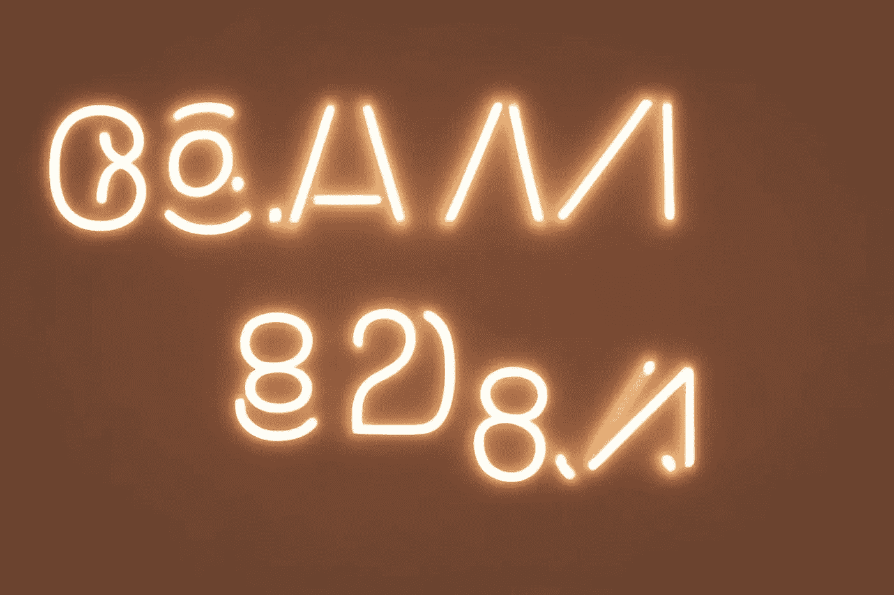

# 如何在 JavaScript 中将字符串转换成骆驼大小写

> 原文：<https://javascript.plainenglish.io/how-to-convert-a-string-to-camel-case-in-javascript-386f9b9ec571?source=collection_archive---------13----------------------->

## 毁灭 2022

## 或者，如果您知道如何使用 Regex，总会有更聪明的解决方案！


今天的 De 降临问题需要一些正则表达式的知识。我承认我不太擅长这个。这个问题很有趣，因为它让我可以更好地探索自己的极限。

# 问题是

链接到[形](https://www.codewars.com/kata/517abf86da9663f1d2000003)

完成方法/函数，以便它将破折号/下划线分隔的单词转换为骆驼大小写。只有当原始单词大写时，输出中的第一个单词才应该大写(称为大写字母，通常也称为 Pascal 大小写)。接下来的单词应该总是大写。

例子

`the-stealth-warrior`转换为`theStealthWarrior`

`The_Stealth_Warrior`转换为`TheStealthWarrior`

# 我的解决方案


和往常一样，解决问题的好方法是把它分解成更小的部分。总的来说，这总是一个好主意。当你不知道最短的路时尤其如此。

所以，要做的步骤是:

1.  了解如何识别分隔单词的字符(在本练习中，它们是`_`和`-`)
2.  了解如何定位特殊字符后面的字符
3.  将字母转换成大写
4.  删除特殊字符
5.  返回结果

我的想法是用一个正则表达式来解决所有这些问题。但不幸的是，我不记得正确的语法。所以我决定尝试混合动力车。

我使用 [String.split()](https://developer.mozilla.org/en-US/docs/Web/JavaScript/Reference/Global_Objects/String/split) 方法将字符串拆分成许多元素，每个元素包含一个单词。

使用独特的分离器非常简单。我可以写:

```
const stringSplitted_A = str.split("-");
const stringSplitted_B = str.split("_");
```

如果有两种或两种以上的字体，事情会很快变得复杂。为此，我使用一个简单的正则表达式来传递两个或更多不同的字符:

```
const stringSplitted = str.split(/[_-]+/g);
```

这个正则表达式是这样的:

*   `+`:寻找每一个关系
*   方括号之间的字符的`[ ]`(本例中为`_`和`-`)
*   `g`搜索整个字符串

这样我得到了一个包含所有单词的数组。


下一步是弄清楚如何大写一个单词的第一个字母。FreeCodeCamp 已经发布了一个关于这个话题的不错的指南([链接](https://www.freecodecamp.org/news/javascript-capitalize-first-letter-of-word/))。

我使用 [String.charAt()](https://developer.mozilla.org/en-US/docs/Web/JavaScript/Reference/Global_Objects/String/charAt) 方法获取单词的第一个字符。然后我使用 [String.toUpperCase()](https://developer.mozilla.org/en-US/docs/Web/JavaScript/Reference/Global_Objects/String/toUpperCase) 方法将其转换成大写。最后，我使用 [String.slice()](https://developer.mozilla.org/en-US/docs/Web/JavaScript/Reference/Global_Objects/String/slice) 方法获取单词的剩余部分。

```
const capitalizeFirstLetter = (w) => w.charAt(0).toUpperCase() + w.slice(1);
```

下一步是遍历数组的所有元素。我的第一个想法是使用 [Array.map()](https://developer.mozilla.org/en-US/docs/Web/JavaScript/Reference/Global_Objects/Array/map) 方法:

```
const camelized = stringSplitted.map((w) => capitalizeFirstLetter(w));
```

但是这段代码有一个问题。它还修改字符串的第一个字母。然而，这个问题要求第一个字母要小写。幸运的是，Array.map()允许您读取正在处理的元素的索引。然后我在索引上添加一个检查，只修改第一个单词后面的单词(在位置`0`的那个)

```
const camelized = stringSplitted.map((w, i) =>
  i > 0 ? capitalizeFirstLetter(w) : w
);
```

最后我再次加入各个单词，他们使用了 [Array.join()](https://developer.mozilla.org/en-US/docs/Web/JavaScript/Reference/Global_Objects/Array/join) 方法。

这是我的解决方案的完整代码:

```
const capitalizeFirstLetter = (w) => w.charAt(0).toUpperCase() + w.slice(1);

function toCamelCase(str) {
  const stringSplitted = str.split(/[_-]+/g);
  const camelized = stringSplitted.map((w, i) =>
    i > 0 ? capitalizeFirstLetter(w) : w
  );
  return camelized.join("");
}
```

# 最聪明的解决方案



CodeWars 最有趣的事情之一是可以看到其他参与者提出的解决方案。正如我所怀疑的，有一种更好的方法来解决将字符串转换为骆驼大小写的问题。

许多人提出了类似的解决方案:

```
const toCamelCase = (s) => s.replace(/[-_](.)/g, (_, c) => c.toUpperCase());
```

在这种情况下，我使用了 [String.replace()](https://developer.mozilla.org/en-US/docs/Web/JavaScript/Reference/Global_Objects/String/replace) 方法。我不知道的一件事是[使用函数](https://developer.mozilla.org/en-US/docs/Web/JavaScript/Reference/Global_Objects/String/replace#specifying_a_function_as_the_replacement)作为这个方法的参数的可能性。

但是我从正则表达式开始。与我的相比，他补充道:

*   `( )`它告诉表达式捕捉括号之间的任何字符
*   `.`表示一个(`1`)字符

换句话说，`[_-](.)`允许您只取方括号中任何字符后面的第一个字符。

replace 方法的第二个参数是一个函数。这个函数的第一个参数是匹配正则表达式的字符串。第二个参数是正则表达式捕获的第一个字符。

我受够了。这个问题特别有趣，因为它很好地突出了正则表达式的潜力。也是第一个，在这场灾难中，让我陷入寻找最佳解决方案的困境。

感谢阅读！敬请关注更多内容。

***不要错过我的下一篇文章—报名我的*** [***中邮箱列表***](https://medium.com/subscribe/@el3um4s)

[](https://el3um4s.medium.com/membership) [## 通过我的推荐链接加入 Medium—Samuele

### 阅读萨缪尔的每一个故事(以及媒体上成千上万的其他作家)。不是中等会员？在这里加入一块…

el3um4s.medium.com](https://el3um4s.medium.com/membership) 

*原载于 2022 年 12 月 9 日 https://blog.stranianelli.com*[](https://blog.stranianelli.com/devadvent-2022-09-convert-string-to-camel-case/)**。**

## *更多内容请访问 [PlainEnglish.io](https://plainenglish.io/) 。*

*报名参加我们的 [**免费每周简讯**](http://newsletter.plainenglish.io/) 。关注我们 [**推特**](https://twitter.com/inPlainEngHQ) 、[**LinkedIn**](https://www.linkedin.com/company/inplainenglish/)**、**[**YouTube**](https://www.youtube.com/channel/UCtipWUghju290NWcn8jhyAw)**、** [**不和谐**](https://discord.gg/GtDtUAvyhW) **。***

## *想用内容来扩展你的科技创业吗？检查[电路](https://circuit.ooo/?utm=publication-post-cta)。*

*我们提供免费的专家建议和定制解决方案，帮助您建立对您的技术产品或服务的认知和采用。*