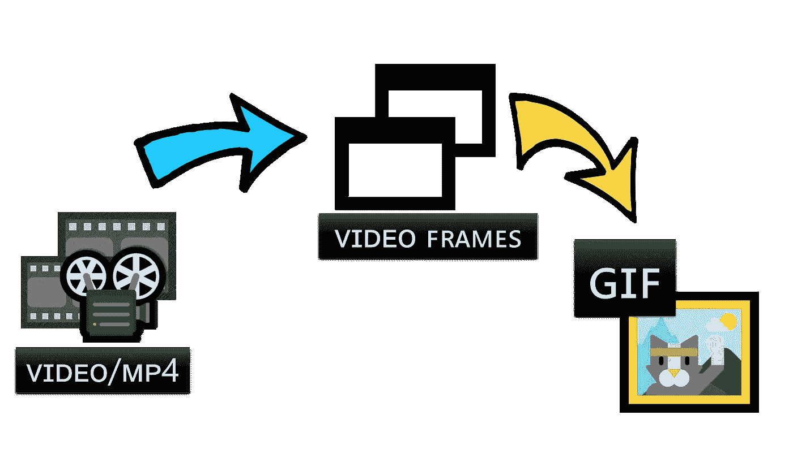
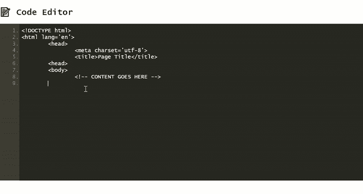

# 如何使用客户端 JavaScript 将视频剪辑转换为 GIF 文件

> 原文：<https://javascript.plainenglish.io/how-to-convert-a-video-clip-to-a-gif-file-with-client-side-javascript-56575d093191?source=collection_archive---------0----------------------->

基于浏览器的离线实现。包含完整代码的链接。



Illustration by Author | Showcases the conversion process which involves a video file split into multiple frames and merged into a single GIF file

作为一个沉迷于技术写作的人，我个人认为*与读者有效沟通*是任何技术写作中最具挑战性的部分。

由于一篇技术文章的质量很大程度上取决于其内容的可消化性，我倾向于利用以[**【GIF】**格式](https://docs.fileformat.com/image/gif/)编码的屏幕截图，在适当的时候尽量减少额外的文本描述。例如，在更倾向于 [Web 开发内容](https://geek-cc.medium.com/list/webrelated-content-86503714f3ff)的文章中，比如:

[](https://medium.com/weekly-webtips/enable-line-numbering-to-any-html-textarea-35e15ea320e2) [## 对任何 HTML 文本区域启用行编号

### 没有代码编辑器插件的轻量级解决方案

medium.com](https://medium.com/weekly-webtips/enable-line-numbering-to-any-html-textarea-35e15ea320e2) 

在这种情况下，我总是发现嵌入动画 GIF 来演示我创建的开源工具的任何用法是有益的:



Illustration by Author | The above is a short animated clip file to communicate the use-case of an open-sourced utility created | Animated clips are .GIF files commonly embedded in web pages

鉴于 [Microsoft Powerpoint 的内置屏幕录制](https://support.microsoft.com/en-us/office/record-your-screen-in-powerpoint-0b4c3f65-534c-4cf1-9c59-402b6e9d79d0)功能易于访问，虽然可以轻松完成自己的屏幕录制以输出屏幕截图，但我觉得更有益的探索领域应该是— **转换视频屏幕截图(. mp4，..avi 等。)到。GIF 图像文件。**

**— *注意:*** *按照惯例，如果目的是渲染一个短的动画剪辑(≤ 30 秒)，GIF 文件更合适*

# 使用 GIFEncoder.js 构建视频到 GIF Maker

为了构建浏览器实用程序，如下所示:


Illustration by Author | A simple demo of the GIF browser tool implemented in JavaScript

## 这 3 个 JavaScript 插件是必要的:

*   [GIFEncoder.js](https://raw.githubusercontent.com/incubated-geek-cc/video-to-GIF/main/js/GIFEncoder.js)
*   LZWEncoder.js
*   [NeuQuant.js](https://github.com/incubated-geek-cc/video-to-GIF/blob/main/js/NeuQuant.js)

**参考消息:**这些插件最初是由 GitHub 用户 [Kevin Kwok](https://github.com/antimatter15) (创建者)从 GitHub repo [jsgif](https://github.com/antimatter15/jsgif) 中检索出来的。

# 视频到 GIF 转换概述

## 先决条件:包含在以上 3 个文件中+ [b64.js](https://raw.githubusercontent.com/antimatter15/jsgif/master/b64.js) 如下:

```
<script type="text/javascript" src="LZWEncoder.js"></script>
<script type="text/javascript" src="NeuQuant.js"></script>
<script type="text/javascript" src="GIFEncoder.js"></script>

<script type="text/javascript" src="b64.js"></script>
```

## 技术实施—总共 4 个步骤

## **步骤(1)**上传一段视频片段( *≤ 30 秒)*

因此，在 HTML 代码中，包含一个简单的用户输入界面:

```
<input id='inputVideoClipFile' type='file' multiple='false' accept='.mp4,.webm,.avi,.mpeg,.flv,.mov,.3gp' />
```

在上面标记一个事件处理程序(onchange ),并继续用 JavaScript 初始化一个 [FileReader](https://developer.mozilla.org/en-US/docs/Web/API/FileReader) 实例:

```
inputVideoClipFile.onchange = function(uploadFle) {
  let file = inputVideoClipFile.files[0];
let fileName=file.name;
  let fileSize=(file.size/1024).toFixed(2);
  let fileType=file.type;
let fileredr = new FileReader();
fileredr.onload = function (fle) {
    var b64Str=fle.target.result;
}; // end file-reader onload
  fileredr.readAsDataURL(file);
};
```

*   注意，`new FileReader()`实例调用`readAsDataURL`，因此分配给`b64Str`的视频文件内容被读取为一个 [Base64](https://developer.mozilla.org/en-US/docs/Glossary/Base64) 字符串
*   从`file`对象中检索视频文件的信息，以便稍后显示

## 步骤(2):处理视频二进制数据并提取帧。有两个主要部分需要考虑—

**第一部分**通过创建一个`<video></video>` DOM 元素并在 JavaScript 中分配各自的属性来预览显示的视频内容

```
// rendered as <video></video> in HTML code
var videoObj = document.createElement('video');
var displayedHeight=500;
if(videoObj.canPlayType(fileType)) {
  videoObj.setAttribute('id','inputVideo');
  videoObj.setAttribute('src', b64Str);
  videoObj.setAttribute('height', displayedHeight);
}
```

*   注意`b64Str`是前面步骤中`FileReader()`读取的视频文件数据。

第二部分。帧提取— 每个视频帧指的是在唯一时间戳的剪辑的图像快照。

> 由于 GIF 文件是通过合并一组连续图像而创建的，因此对于视频的每次按时间顺序的图形更新，应提取一帧嵌入的图像数据，用于后续的 GIF 创建过程。

虽然不能从 DOM 元素`<video></video>`中直接提取每个视频帧**所需的图像数据，但是可以将`<video></video>`中预览的内容**渲染到** `<canvas></canvas>` **元素**上以提取帧图像数据。**

接下来，在 JavaScript 中创建一个`<canvas></canvas>`元素并为其分配相应的属性(类似于`<video></video>`):

```
var vidHeight=videoObj.videoHeight;
var vidWidth=videoObj.videoWidth;
var bitmap = document.createElement('canvas');

bitmap.setAttribute('id', 'bitmap');
bitmap.setAttribute('width', vidWidth);
bitmap.setAttribute('height', vidHeight);
```

*   注意`vidWidth` & `vidHeight`是从`<video></video>`中检索出来的。*(这些是夹子的原始尺寸。)*

接下来的几行代码根据标记给每个元素的`'id'`属性来引用`<video></video>`和`<canvas></canvas>`:

```
const inputVideo=document.getElementById('inputVideo');
const bitmapCanvas=document.getElementById('bitmap');
const bitmapCtx = bitmapCanvas.getContext('2d');

inputVideo.muted = true;
inputVideo.loop = false;
inputVideo.autoplay=true;

const background = () => {
  bitmapCtx.fillStyle = '#FFFFFF';
  bitmapCtx.fillRect(0, 0, vidWidth, vidHeight);
};
```

*   由于 video 被设置为`autoplay`，当`play`事件被发出时，这触发了`background()`的执行，它不仅将 GIF 背景填充为白色，还设置了绘制到 canvas 元素上的每一帧的尺寸:

```
const step = async() => {
  let bgStatus=await background();
  await new Promise(resolve => {
    bitmapCtx.drawImage(inputVideo, 0, 0, vidWidth, vidHeight);
    frameB64Str = bitmapCanvas.toDataURL();
    resolve();
  });
  window.requestAnimationFrame(step);
};
inputVideo.addEventListener('play', () => {
  step();
  window.requestAnimationFrame(step);
});
```

*   `window.requestAnimationFrame(step)`取一个回调函数(即`step()`)来处理每一帧的图像数据
*   `bitmapCtx.drawImage()`继续将每个图像快照渲染到画布上，以便`bitmapCanvas.toDataURL()`返回每个快照的 base64 编码图像

## 步骤(3):顺序合并所有图像快照

最后实现了 JS 插件 **GIFEncoder.js** 。使用与上面相同的代码片段，下面加粗的代码行引用了当 **GIFEncoder** `encoder`捕获嵌入在`<canvas></canvas>`中的每个数据帧时的实例。

```
const encoder = new GIFEncoder(vidWidth, vidHeight);
encoder.setRepeat(0);
encoder.setDelay(500);

const step = async() => {
  let bgStatus=await background();
  await new Promise(resolve => {
    bitmapCtx.drawImage(inputVideo, 0, 0, vidWidth, vidHeight);
    frameB64Str = bitmapCanvas.toDataURL();
    encoder.addFrame(bitmapCtx);
    resolve();
  });
  window.requestAnimationFrame(step);
};

inputVideo.addEventListener('play', () => {
  encoder.start();
  step();
  window.requestAnimationFrame(step);
});
```

当上传的视频最终运行到其最大持续时间长度时，事件`ended`将在`GIFEncoder`调用方法`finish()`时发出:

```
inputVideo.addEventListener('ended', () => {
  encoder.finish();
});
```

## 步骤(4):通过 GIFEncoder 创建 GIF

为了从`encoder`中提取出所有帧*(即 GIF 输出)*的合并版本，需要实现以下 JavaScript 代码片段:

```
var fileType='image/gif';
var readableStream=encoder.stream();
var binary_gif=readableStream.getData();
var b64Str='data:'+fileType+';base64,'+encode64(binary_gif);
```

*   `encode64()`是 [b64.js](https://raw.githubusercontent.com/antimatter15/jsgif/master/b64.js) 中的一个方法，用于将`GIFEncoder`捕获的流数据转换为 Base64 格式。
*   `b64Str`指的是通过合并`GIFEncoder`中出现的所有帧为 GIF 文件编码的数据。因此，在 HTML 代码中，继续包含:``以预览输出的 GIF 文件。

## 最后，GIF 文件的下载链接创建如下:

```
let dwnlnk = document.createElement('a');
dwnlnk.download = fileName;
dwnlnk.innerHTML = `💾 <small>Save</small>`;
dwnlnk.className = 'btn btn-outline-dark';
dwnlnk.href = b64Str;
```

## 仅供参考:完整的代码实现在我的 GitHub: [video-to-GIF](https://github.com/incubated-geek-cc/video-to-GIF) (随意★它或🔱叉起来！)或者在[试玩](https://incubated-geek-cc.github.io/video-to-GIF/)试试看！

## 个人评论

*   虽然在 [GIFEncoder.js](https://raw.githubusercontent.com/incubated-geek-cc/video-to-GIF/main/js/GIFEncoder.js) 中还有进一步探索输出 GIF 文件的可定制调整的空间，但这篇文章旨在对一种潜在的轻量级方法进行基本介绍，这种方法可以完全在浏览器中使用纯客户端 JavaScript 将视频剪辑转换为 GIF 文件
*   **建议注意:**上传的视频不应超过 30 秒，因为 GIF 文件旨在呈现简短的动画剪辑。

现在你知道了！非常感谢你坚持到这篇文章的结尾！❤希望你觉得这个指南有用，如果你想了解更多 GIS、数据分析& Web 应用相关的内容，请随时[关注我的 Medium](https://medium.com/@geek-cc) 。会非常感激—😀

— 🌮请给我买个玉米卷🎀˶❛◡❛)

[](https://geek-cc.medium.com/membership) [## 通过我的推荐链接加入灵媒——李思欣·崔

### 获得李思欣·崔和其他作家在媒体上的所有帖子！😃您的会员费直接…

geek-cc.medium.com](https://geek-cc.medium.com/membership) 

*更多内容看* [***说白了。报名参加我们的***](http://plainenglish.io/) **[***免费周报***](http://newsletter.plainenglish.io/) *。在我们的* [***社区不和谐***](https://discord.gg/GtDtUAvyhW) *获得独家获取写作机会和建议。***