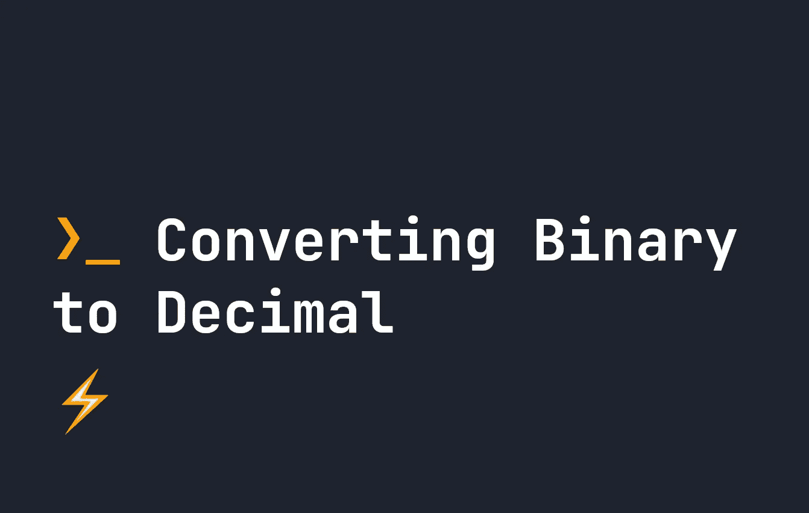

# 如何用 parseInt 的基本特性将二进制转换成十进制

> 原文：<https://javascript.plainenglish.io/how-to-convert-binary-to-decimal-with-parseints-base-feature-d4d09a0d280c?source=collection_archive---------19----------------------->



二进制数是以 2 为基数表示的数，而不是我们习惯的以 10 为基数的数。考虑一下我们通常如何以 10 为基数计数——当我们达到 10 时，我们必须添加一个额外的数字来表示它。同样，在以 2 为基数的情况下，当我们达到 1 时，下一个数必须通过添加一个新数来表示。所以当 **1** 等于 1 时， **10** 等于 2。

您可以使用下面的计算器将任何二进制数转换成十进制数。

# 二进制到十进制计算器

# 在 JavaScript 中使用 parseInt 将二进制转换为十进制

如果你以前用过 JavaScript，你可能用过`parseInt`——但是你知道你可以用`parseInt`设置**基**吗？如果用`parseInt`的第二种说法，可以设定基数:

```
let x = parseInt('10101', 2);
console.log(x); // Returns 21
```

最有可能的是，你会想要使用基数 2，但是你可以在这里使用任何你喜欢的基数。所以`parseInt('10010', 3)`也会将基数为 3 的数字转换成十进制数。这是一个非常有用但很少使用的`parseInt`特性。

# 使用计算将二进制转换为十进制

如前所述，当你考虑到你只能在二进制中达到`1`时，你可以在十进制中计算二进制值，正如你只能在十进制中达到`9`一样。所以就像在十进制中，到了`9`就要加另一个数来代表`10`，在二进制中，到了`1`就要加另一个数来代表`2`——所以`10`就是`2`。

将二进制数转换为十进制数的最简单方法是理解二进制数中的每个数可以表示为:

```
BINARY:  1   0   1   0   1   0   1
DECIMAL: 64  32  16  8   4   2   1
```

要将二进制数转换成十进制数，我们所要做的就是知道每个数都可以用二进制表示为十进制数，每次增加 2 的倍数。所以最后一个数字，是`1`，然后下一个是`2`，再下一个是`4`，以此类推。

为了将类似于`1010101`的二进制转换成十进制，我们将每个数字乘以它的十进制表示。所以我们可以做:

*   `1 * 1` -给我们 1
*   `0 * 2` -给我们 0
*   `1 * 4` -给我们 4
*   `0 * 8` -给我们 0
*   `1 * 16`——给我们 16
*   `0 * 32` -给我们 0
*   `1 * 64` -给我们 64

然后我们把它们都加起来！所以`1`+`0`+`4`+`0`+`16`+`0`+`64`-给我们 **85** ！

*更多内容看* [***说白了。报名参加我们的***](https://plainenglish.io/) **[***免费周报***](http://newsletter.plainenglish.io/) *。关注我们上* [***推特***](https://twitter.com/inPlainEngHQ)[***领英***](https://www.linkedin.com/company/inplainenglish/)**和* [***不和谐***](https://discord.gg/GtDtUAvyhW) ***。******