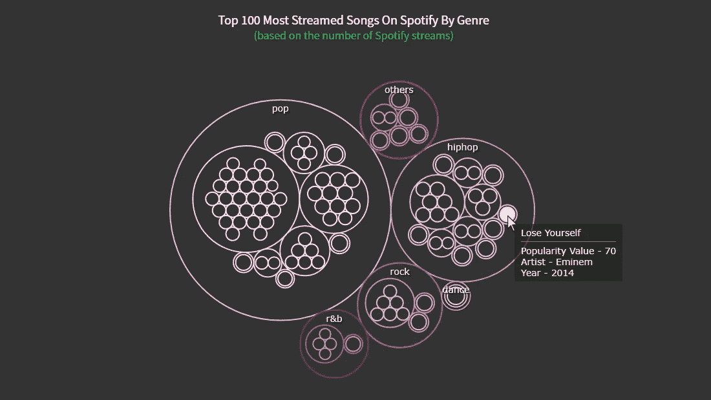
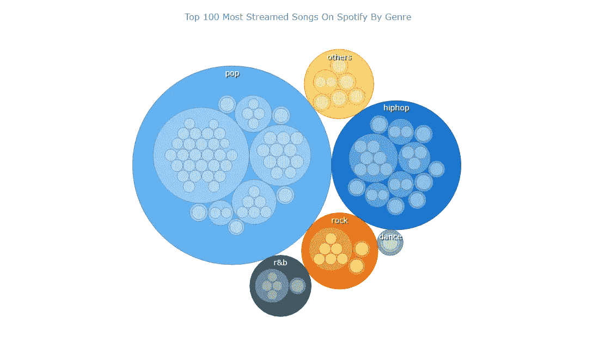
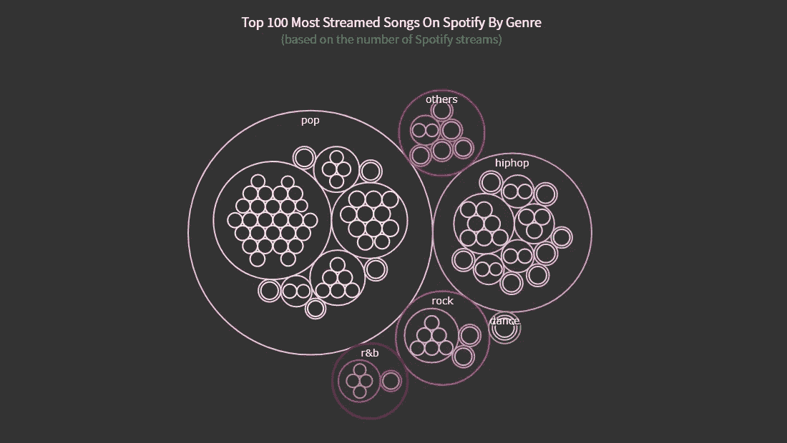

# 如何用 JavaScript 创建圆形包装图

> 原文：<https://javascript.plainenglish.io/how-to-create-a-circle-packing-chart-in-javascript-8d3e857c819b?source=collection_archive---------19----------------------->


***一个清晰的分步指南，用于构建一个交互式 JS Circle 包装图表，以可视化 Spotify 上最热门的 100 首歌曲。***

想学习如何以令人惊叹的圆形包装图可视化分层数据，并以轻松的方式添加到网页或应用程序中吗？不要感到不知所措，只要按照我的逐步数据可视化教程！使用 Spotify 上最热门的 100 首歌曲的数据，我将向您展示如何使用 JavaScript 轻松创建和定制一个漂亮的交互式圆形包装图。

# 什么是圆形包装图

让我先给你简单介绍一下什么是圆形包装图，以及如何使用它。

也称为圆形树，圆形包装图基本上是展示分层数据的树形图，其中圆形表示节点，子节点是节点圆形内的圆形。

圆圈的大小表示节点的值。

圆形包装表示法很好地表示了层次结构，通过组和子组提供了方便的可视化分解。

# 预览将要制作的圆形包装图

看看我将要构建的东西——最终的 JS circle 包装图将在本教程结束时创建——并加入这场音乐之旅！



# 用 4 个简单的步骤构建 JS 圆形包装图

一个可嵌入的圆形包装图看起来令人兴奋，但很难创建。然而，有许多 [JavaScript 图表库](https://en.wikipedia.org/wiki/Comparison_of_JavaScript_charting_libraries)专门用来帮助每个人构建各种数据可视化。一旦你找到了一个开箱即用的内置圆形打包选项，即使你是一个编程技能有限的初学者，通常也能非常快速和直接地得到这样一个交互式图表。

从技术上讲，创建圆形包装数据可视化的整个过程所包含的步骤与任何 JS 图表库大致相同。在本教程中，我将使用 [AnyChart](https://www.anychart.com/) 进行说明。这很容易开始，详细的[文档](https://docs.anychart.com/)和许多现成的[示例](https://www.anychart.com/products/anychart/gallery/)可以作为快速构建任何类型图表的良好起点，包括这一个。同样重要的是，该库对于非商业用途是免费的。

所以，创建一个 JS 四号圆形包装图的基本步骤如下:

1.  为图表制作一个 HTML 页面。
2.  包括必要的 JS 文件。
3.  添加数据。
4.  编写绘制图表所需的 JavaScript 代码。

## 1.创建 HTML 页面

我做的第一件事是创建一个放置图表的基本 HTML 页面。接下来，我创建一个 HTML 块元素，`div`,并给它分配一个 ID 属性，如“container ”,以便在代码中容易地识别它。

```
<!DOCTYPE html>
<html lang="en">
  <head>
    <meta charset="utf-8">
    <title>JavaScript Circle Packing Chart</title>
    <style type="text/css">      
      html, body, #container { 
        width: 100%; 
        height: 100%; 
        margin: 0; 
        padding: 0; 
      } 
    </style>
  </head>
  <body>
    <div id="container"></div>
  </body>
</html>
```

我定义了块的样式，通过给高度和宽度属性赋予 100%的值，使图表呈现在整个页面上。当然，您可以随意指定您想要完成任务的方式。

## 2.包括必要的 JavaScript 文件

然后，我需要添加我要用来创建我想要开发的圆形包装图的脚本。通常可以从您正在使用的库的 CDN 中引用必要的文件，或者将它们下载到您的本地机器上。

为了在本教程中创建这个图表，我使用了 AnyChart 库。它有一个模块化的结构，可以很容易地只连接您当前需要的图表类型和特性，从而减少运行 JavaScript 代码的大小。在这种情况下，我需要[核心](https://docs.anychart.com/Quick_Start/Modules#core)模块和特定的[圆形包装](https://docs.anychart.com/Quick_Start/Modules#circle_packing)模块。所以我在第一步中创建的 HTML 页面的`head`部分包含了这两者。

```
<!DOCTYPE html>
<html lang="en">
  <head>
    <meta charset="utf-8">
    <title>JavaScript Circle Packing Chart</title>
    <script src="https://cdn.anychart.com/releases/8.11.0/js/anychart-core.min.js"></script>
    <script src="https://cdn.anychart.com/releases/8.11.0/js/anychart-circle-packing.min.js"></script>
    <script src="https://cdn.anychart.com/releases/8.11.0/js/anychart-data-adapter.min.js"></script> <style type="text/css">      
      html, body, #container { 
        width: 100%; height: 100%; margin: 0; padding: 0; 
      } 
    </style>
  </head>
  <body>  
    <div id="container"></div>
    <script>
 ***// All the code for the JS Circle Packing Chart will be here.***    </script>
  </body>
</html>
```

## 3.添加数据

我决定使用来自 [Kaggle](https://www.kaggle.com/pavan9065/top-100-most-streamed-songs-on-spotify) 的专用数据集来可视化 Spotify 上 100 首最热门的歌曲。我稍微修改了一下数据，使它看起来像我需要的那样，并把它保存在一个 [JSON 文件](https://gist.githubusercontent.com/shacheeswadia/17dc3b3d4ac9b63ac5ac6833944f3a94/raw/07c4bec103d22ec2824453a33d41868fd476db3d/dataPackedCircles.json)中。

为了从 JSON 文件加载数据，我将利用一个叫做[数据适配器](https://docs.anychart.com/Quick_Start/Modules#data_adapter)的便利模块。所以我将它包含在`head`部分的引用脚本列表中，并使用`anychart.data.loadJsonFile`函数将这个数据文件添加到代码中。

现在所有的准备工作都完成了，让我们进入创建这个令人印象深刻的、交互式的、基于 JS 的包装圆图的最后一步！

## 4.为您的图表编写 JavaScript 代码

在创建可视化和编写看似复杂的代码时，对 HTML 和 JavaScript 等 web 开发技术的一些背景知识总是一个优势。然而，用这种方式创建一个圆形包装图只需要 6 到 7 行代码。所以这一点也不复杂。你不觉得那是音乐吗？

最初，我添加了一个包含所有代码的函数，确保一旦页面准备好就执行它。然后我把数据包含在这个函数里。

现在我用数据参数定义一个函数，并使用`data.tree`函数映射数据。我将映射的数据添加到`circlePacking`函数中。

```
anychart.onDocumentReady(function () {anychart.data.loadJsonFile('https://gist.githubusercontent.com/shacheeswadia/17dc3b3d4ac9b63ac5ac6833944f3a94/raw/07c4bec103d22ec2824453a33d41868fd476db3d/dataPackedCircles.json',function(data) { var treeData = anychart.data.tree(data, 'as-table');
  var chart = anychart.circlePacking(treeData);}
);
});
```

最后，我还做了一个标题，添加了对之前定义的容器的引用，并画出了结果的圆形装箱图。

```
anychart.onDocumentReady(function () {
  anychart.data.loadJsonFile('https://gist.githubusercontent.com/shacheeswadia/17dc3b3d4ac9b63ac5ac6833944f3a94/raw/07c4bec103d22ec2824453a33d41868fd476db3d/dataPackedCircles.json',function(data) { ***// add data***  var treeData = anychart.data.tree(data, 'as-table'); ***// create a circle packing chart instance***  var chart = anychart.circlePacking(treeData);

 ***// add a chart title***  chart.title("Top 100 most streamed songs on Spotify by genre")

  chart.container('container');
  chart.draw();

}
);
});
```

Tada！一个功能齐全的圆形包装图就这么不费吹灰之力就搭建好了！



在 Spotify 的 100 首最热门的流媒体歌曲中，流行音乐显然是最受欢迎的。我本人更倾向于舞蹈流派，而你可能是摇滚或节奏布鲁斯的粉丝。但不出所料，流行音乐和嘻哈音乐绝对是大众的最爱。

你可以在 [CodePen](https://codepen.io/shacheeswadia/pen/ExwXmOd) 和 [AnyChart Playground](https://playground.anychart.com/dY0R0BWp/) 上找到这个基本 JavaScript 打包圆图的完整代码。)

# 定制 JS 圆形包装图

这个基于 JavaScript 的圆形包装图的初始版本看起来非常漂亮，可以马上使用。但是我还想向您展示一些简单的方法，使这种类型的数据可视化更加令人印象深刻、时尚和强大。

## 颜色修改

为了给图表添加更多的爵士乐，我改变了气泡的颜色。使用 AnyChart 的一个预先构建的设计主题可以非常容易地做到这一点。我选择“黑暗魅力”主题，所以我添加它的脚本并在代码中设置主题。

```
<script src="https://cdn.anychart.com/releases/8.11.0/themes/dark_glamour.min.js"></script>...anychart.theme('darkGlamour');
```

我想给圆形一个透明的背景效果，所以我把圆形的背景和填充设置为相同的颜色。我将圆形的笔画加粗，并将笔画的颜色设置为主题颜色。

```
chart.background('#333');

chart.fill('#333');chart.stroke(function () {
  return {
    thickness: 2,
    color: this.sourceColor
  };
});
```

## 标题改进

为了使标题更加突出，我使用 HTML 来指定字体大小和颜色。我还加了第二行做字幕。

```
chart
  .title()
  .enabled(true)
  .useHtml(true)
  .text(
    '<span style = "color: #fff; font-size:20px;">Top 100 most streamed songs by genre</span>' +
    '<br/><span style="color:#1db954; font-size: 18px;">(Based on the number of Spotify Streams)</span>'
  );
```

点击这里或者在 [AnyChart 游乐场](https://playground.anychart.com/3MO3NENz/)查看这个定制版的 JS 包装圈图表[。]](https://codepen.io/shacheeswadia/pen/MWEomxQ)



## 工具提示格式

使交互式数据可视化更具信息性的最好方法之一是在工具提示中添加更多的细节。该数据集包含关于每首歌曲的艺术家和年份的信息，以及其流行度值。因此，我使用 HTML 将所有这些信息包含在圆形包装图的工具提示中。

```
chart
  .tooltip()
  .useHtml(true)
  .titleFormat('{%name}')
  .format( function(){
    let dataValue = this.item.ka;
    if(this.depth == 2){ 
      return '<span style = font-size:14px;">Popularity Value - ' + dataValue.value + '</span>' +
      '<br/>lt;span style = font-size:14px;">Artist - ' + dataValue.artist + '</span>' + 
      '<br/><span style = font-size:14px;">Year - ' + dataValue.year + '</span>'  
    }else{
      return '<span style = "color: #fff; font-size:14px;">Popularity Value - ' + this.value + '</span>'
    }
  });
```

仅此而已！一个优雅而富有启发性的 JavaScript Circle Packing Chart 被设计出来并准备好了。


在 [CodePen](https://codepen.io/shacheeswadia/pen/rNGwwYb) 或 [AnyChart Playground](https://playground.anychart.com/OhusPMBK/) 上检查整个代码和所有定制。]

# 结论

你可以看到构建一个像包装好的圆圈这样有创意的图表是多么简单。你可以学习使用各种 [JS 图表库](https://en.wikipedia.org/wiki/Comparison_of_JavaScript_charting_libraries)创建大量不同类型的数据可视化。或者从查看 AnyChart 中可用的其他[图表选项](https://docs.anychart.com/Quick_Start/Supported_Charts_Types)开始。

如果您对构建此图表有任何问题或任何其他疑问，请告诉我。音乐有益于灵魂，创造形象有益于大脑，所以让我们多听些歌，多做些图表吧！

*经 Shachee Swadia 许可出版。原载于 2022 年 1 月 3 日*[*Level Up Coding*](https://levelup.gitconnected.com/how-to-create-a-circle-packing-chart-using-javascript-6771648882cc)*标题为《如何使用 JavaScript 创建圆形装箱图》。*

*不要错过我们的其他* [*JavaScript 制图教程*](https://www.anychart.com/blog/category/javascript-chart-tutorials/) *。*

如果你有一个有趣的客座博文的想法，欢迎来到 [*让我们知道*](https://www.anychart.com/support/) *吧！*

*原载于 2022 年 3 月 15 日 https://www.anychart.com*[](https://www.anychart.com/blog/2022/03/15/circle-packing-chart-js/)**。**

**更多内容请看*[***plain English . io***](https://plainenglish.io/)*。报名参加我们的* [***免费周报***](http://newsletter.plainenglish.io/) *。关注我们关于*[***Twitter***](https://twitter.com/inPlainEngHQ)*和*[***LinkedIn***](https://www.linkedin.com/company/inplainenglish/)*。加入我们的* [***社区不和谐***](https://discord.gg/GtDtUAvyhW) *。**