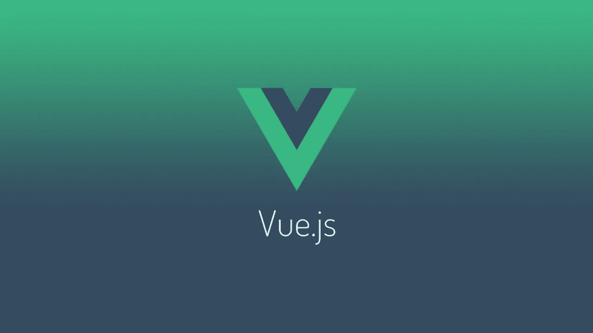
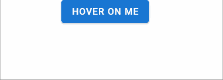
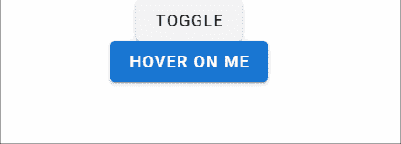
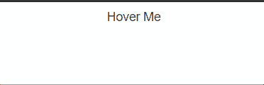
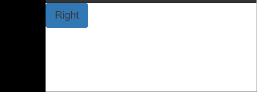
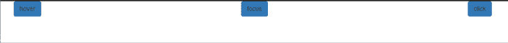
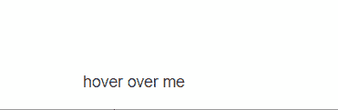

# 如何在 Vue.js 中创建自定义工具提示组件

> 原文：<https://javascript.plainenglish.io/how-to-create-a-custom-tooltip-component-in-vue-js-11ff5e2194d9?source=collection_archive---------15----------------------->

## 从头开始创建自定义 Vue.js 工具提示组件的完整指南。



Source: [https://devdojo.com/](https://devdojo.com/)

工具提示是提供关于元素的提示、描述性消息或信息片段的功能。当用户悬停、聚焦或单击元素时，工具提示会在元素附近显示为一个小标签。工具提示特别有助于为用户提供说明、定义或后续步骤，而不会弄乱用户界面。

在本文中，我们将回顾当前在 Vue.js 应用程序中创建工具提示可用的选项。然后，我们将使用提供的信息从头开始创建我们自己的 Vue.js 工具提示组件。对于我们的例子，我们将使用 [Vuetify 和 BootstrapVue 库](https://blog.logrocket.com/top-10-vue-component-libraries-for-2020/)。

# 入门指南

首先，确保你有 Vue CLI 4。x 安装在您的机器上。要创建新的 Vue 项目，请在终端中运行以下命令:

```
vue create tooltips
```

让我们删除新项目中的默认组件，并确保浏览器中没有呈现任何内容。我们的`App.vue`文件应该类似于下面的代码块:

```
<template></template><script>export default {
  name: 'App', components: {
  }, data: () => ({
    //
  }),
};
</script>
```

# 在 Vuetify 中创建工具提示

要安装 Vuetify，请在终端中运行以下命令:

```
vue add vuetify
```

现在，Vue.js CLI 将为我们安装 Vuetify。要创建一个工具提示，将下面的代码添加到`app.vue`中，并再次为项目提供服务:

```
<template>
<div> <v-app>
  <div class="text-center d-flex align-center justify-space-around">
    <v-tooltip bottom>
      <template v-slot:activator="{ on, attrs }">
        <v-btn
          color="primary"
          dark
          v-bind="attrs"
          v-on="on"
        >
          Hover on me
        </v-btn>
      </template>
      <span>Bottom tooltip</span>
    </v-tooltip>
 </div>
</v-app></div>
</template><script>export default {
  name: 'App', components: {
  }, data: () => ({
    //
  }),
};
</script>
<style>
.container{
margin-top:50px
}
</style>
```

Vuetify 中的每个组件都必须呈现在`<v-app>`组件中，而`<v-tooltip>`可以环绕任何组件。

在上面的代码中，我们有两个主要元素，`<template>`，它呈现为一个简单的文本，和`<span>`。当我们悬停在按钮上时，`v-slot`属性激活工具提示，并且`<span>`内容显示在屏幕上:



您也可以使用以下代码动态触发工具提示的行为:

```
<template>
<div>
<v-app>
  <div class="text-center d-flex align-center justify-space-around">
<v-btn @click="show = !show">
          toggle
        </v-btn>
</div>
  <div class="text-center d-flex align-center justify-space-around">
    <v-tooltip v-model="show"
 bottom>
      <template v-slot:activator="{ on, attrs }">
        <v-btn
          color="primary"
          dark
          v-bind="attrs"
          v-on="on"
        >
          Hover on me
        </v-btn>
      </template>
      <span >Bottom tooltip</span>
    </v-tooltip>
  </div>
</v-app></div>
</template><script>export default {
  name: 'App',
  components: {
  },
   data () {
      return {
        show: false,
      }
    },
};
</script>
<style>
.container{
  margin-top:50px
}
</style>
```

在上面的代码块中，我们创建了一个新按钮，并在组件中添加了一个状态。

最初，工具提示设置为 false。`v-modal`让我们选择是否显示工具提示。状态随着按钮的单击而改变，如下图所示:



# 在 BootstrapVue 中创建工具提示

要安装 BootstrapVue，请在终端中运行以下命令:

```
npm install vue bootstrap bootstrap-vue
```

现在，我们必须在应用程序的主入口点注册 BootstrapVue。导航到`main.js`并添加以下代码:

```
import Vue from "vue";
import App from "./App.vue";
import { BootstrapVue, IconsPlugin } from "bootstrap-vue";
import "bootstrap/dist/css/bootstrap.css";
import "bootstrap-vue/dist/bootstrap-vue.css";import vuetify from "./plugins/vuetify";Vue.config.productionTip = false;
Vue.use(BootstrapVue);
Vue.use(IconsPlugin);
new Vue({
  vuetify,
  render: (h) => h(App),
}).$mount("#app");
```

我们有两种不同的方法在 BootstrapVue 中创建工具提示，组件方法和指令方法。虽然组件方法非常适合简单、标准的使用，但是指令方法为定制工具提示的行为提供了更大的潜力。

请记住，我们可以通过悬停、聚焦或单击某个元素来触发工具提示。

我们也有 12 种定位工具提示的选择，默认为`top`:`top`，`topleft`，`topright`，`right`，`righttop`，`rightbottom`，`bottom`，`bottomleft`，`bottomright`，`left`，`lefttop`和`leftbottom`。

# 组件方法

在 BootstrapVue 中，工具提示是通过组件 ID 附加到目标元素的组件。要使用组件方法创建工具提示，我们可以简单地创建一个按钮，并将 ID 放在目标属性中。

将以下代码添加到`App.vue`:

```
<template>
  <div class='main'>
  <b-button id="tooltip-target-1">
    Hover Me
  </b-button>
  <b-tooltip target="tooltip-target-1" triggers="hover"   placement="bottom"
>
    I am tooltip <b>component</b> content!
  </b-tooltip>
  </div>
</template><script>
export default {
  name: "App", components: {},
};
</script>
<style>
.main{
display:flex;
justify-content:space-around;
}
</style>
```

在上面的代码中，我们创建了一个名为`b-button`的按钮，并给了它一个特定的 ID`tooltip-target-1`。要在`hover`上触发工具提示，我们可以简单地使用`b-tooltip`组件，并将按钮的 ID 放入目标属性中。

触发器属性负责工具提示的行为。默认情况下，我们有`hover`、`focus`、`click`和`hover+focus`的触发器。我们可以使用`placement`来定义工具提示的位置:



# 指令方法

指令方法允许我们使用自定义指令来指定工具提示组件的行为。要使用指令方法创建工具提示，只需在组件内部使用`v-b-tooltip`。

例如，我们可以将下面的代码块添加到`App.vue`:

```
<template>
  <div>
         <b-button v-b-tooltip.hover.right="'Tooltip!'" variant="primary">Right</b-button> </div>
</template><script>
export default {
  name: "App", components: {}, };
</script>
<style></style>
```

服务项目并导航到浏览器。您的工具提示应该如下图所示:



我们可以使用指令来改变鼠标操作的工具提示行为。让我们在`App.vue`中添加更多按钮:

```
<template>
  <div class='main'>
    <b-button v-b-tooltip.hover.right="'Tooltip!'" variant="primary"
      >hover</b-button
    >
    <b-button v-b-tooltip.focus.right="'Tooltip!'" variant="primary"
      >focus</b-button
    >
    <b-button v-b-tooltip.click.left="'Tooltip!'" variant="primary"
      >click</b-button
    >
  </div>
</template><script>
export default {
  name: "App", components: {},
};
</script>
<style>
.main{
display:flex;
justify-content:space-around;
}
</style>
```



# 从头开始创建工具提示

对于我们到目前为止已经讨论过的方法，我们必须安装外部包来创建工具提示，这导致了依赖大小的增加。依赖关系的变化可能会导致我们的应用程序崩溃。然而，如果你使用一个工具提示，你可以在几分钟内从头开始创建一个，而不是安装一个库。

在您的`component`文件夹中，创建一个名为`Tooltip.vue`的新文件并添加以下代码:

```
<template>
  <div class="tooltip-container">
    <slot />
    <div
      class="tooltip"
    >
      <span
        class="text"
      >{{ text }}</span>
    </div>
  </div>
</template>
```

在上面的代码块中，我们创建了主工具提示容器，它将容纳整个组件。`slot`标签注入将启用工具提示的子组件。最后，一个简单的`<span>`保存了我们工具提示的文本:

```
<script>
export default {
  props: { 
    text: {
      type: String,
      required: true
    }
  },
}
</script>
```

最后，我们将为文本添加一个字符串形式的道具:

```
<style scoped>
.tooltip-container { 
  position: relative;
  display: inline-block;
  margin:100px;
}.tooltip-container:hover .tooltip{
  opacity: 1;}.tooltip { 
  color: #ffffff;
  text-align: center;
  padding: 5px 0;
  border-radius: 2px; width: 120px;
  bottom: 100%;
  left: 50%;
  margin-left: -60px; opacity: 0;
  transition: opacity 1s; position: absolute;
  z-index: 1; background: #000000;
}.text::after {
  content: " ";
  position: absolute;
  top: 100%;
  left: 50%;
  margin-left: -5px;
  border-width: 5px;
  border-style: solid;
  border-color: #000000 transparent transparent transparent;}
</style>
```

主容器的位置是相对的。对于工具提示，我们将`z-index`设置为`1`，在元素上方显示工具提示。

接下来，我们渲染了一个小而简单的箭头。默认情况下，不透明度设置为`0`。当用户将鼠标悬停在工具提示组件内的组件上时，不透明度被设置为`1`，在元素上方显示工具提示。

要使用我们的自定义工具提示，请在`App.vue`中导入并注册工具提示:

```
<template>
  <div ><Tooltip
  text="I am  button"
 &gt;
   <button> hover over me </button>
 </Tooltip> </div>
</template><script>
  import Tooltip from './components/Tooltip';export default { name: "App", components: {
    Tooltip
  },
};
</script>
```

让我们服务于我们的项目，并在浏览器中查看结果:



# 结论

工具提示是应用程序的一个有用且直观的附加功能，它通过提前指导用户和回答问题来提高 UX。现在，您知道了在 Vue.js 中创建工具提示的几种不同方法，从使用 BootstrapVue 和 Vuetify 这样的库到从头开始。

使用一个库来创建一个工具提示是相当容易的，但是，如果你关心你的依赖树的大小，创建你自己的工具提示也同样简单。

虽然我们的例子中有一个简单的工具提示组件，但是你可以用不同的颜色、图标、动作等等来定制你的工具提示组件。我希望你喜欢这个教程！

*原帖发布于*[*LogRocket*](https://blog.logrocket.com/create-custom-tooltip-component-vue/)

*更多内容请看*[***plain English . io***](https://plainenglish.io/)*。报名参加我们的* [***免费周报***](http://newsletter.plainenglish.io/) *。关注我们关于*[***Twitter***](https://twitter.com/inPlainEngHQ)*和*[***LinkedIn***](https://www.linkedin.com/company/inplainenglish/)*。加入我们的* [***社区不和谐***](https://discord.gg/GtDtUAvyhW) *。*