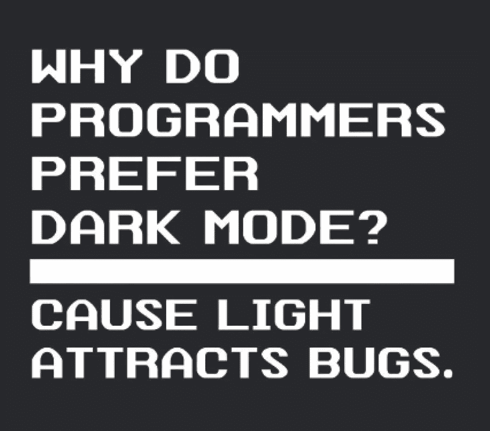
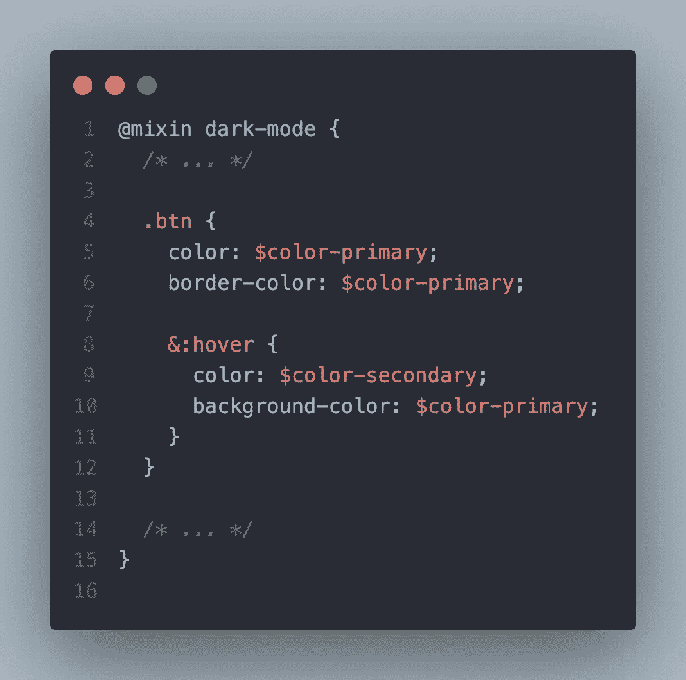
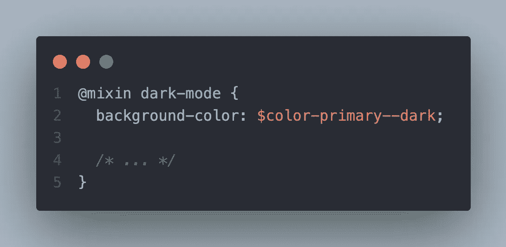
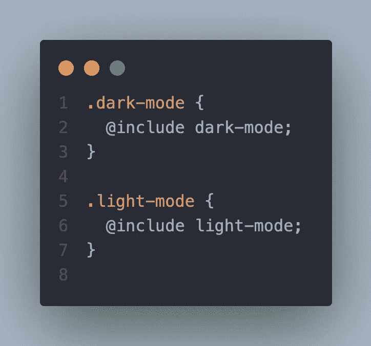
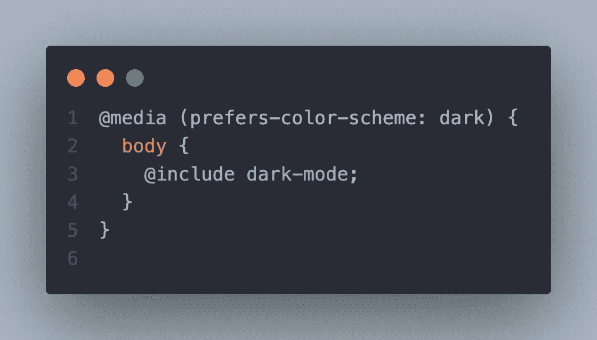
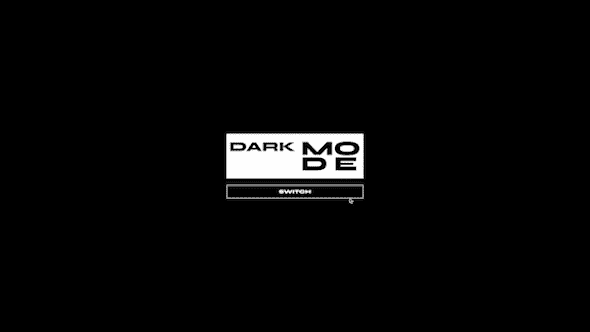

# 如何用萨斯/SCSS 和香草 JavaScript 创建一个黑暗模式

> 原文：<https://javascript.plainenglish.io/how-to-create-a-dark-mode-with-sass-scss-and-vanilla-javascript-e1c7835cf474?source=collection_archive---------0----------------------->

## 试图在萨斯/SCSS 创建一个黑暗模式？完成本教程后，你将学会最简单的技术。

Ok now let’s get serious 👨🏻‍💻

# 语境

当我在构建一个必须第一次实现黑暗模式的项目时，我立即谷歌了一下，看看是否有什么最佳实践或简单的方法来实现这一点。

尽管到处都有一些好文章，但大多数(如果不是全部的话)都只是简单的 CSS。然而，我需要一个 [SCSS](https://sass-lang.com) 实现，它稍后也将使用一些普通的 JS 来实现切换功能。

我对互联网上大多数实现的最初问题是，他们的解决方案在 JS 中没有任何逻辑，可以看到用户的偏好并相应地添加主题。他们提供的唯一选项是添加`@media (prefers-color-scheme: dark)`，这肯定会派上用场，我们将在本教程中使用它，但如果没有 JS 逻辑，它就毫无用处。

所以我必须利用我从所有这些文章和 YouTube 视频中收集的知识，提出我的实现来完成项目的所有挑战。

# 1.初始设置

最初的设置主要是一些文本和非常基本的样式。你可能已经注意到的一件事是，初始设置不包括任何颜色。那是因为我们要在 [SCSS 混合色](https://sass-lang.com/documentation/at-rules/mixin)中添加颜色。

SCSS 混合是实现中的一个重要因素，稍后您会看到原因。在这个阶段还没有 JavaScript，但是一旦我们完成了 SCSS 部分，我们会添加它们。

# 2.添加 SCSS 混音

这里是最重要的事情发生的地方，所以请密切注意这一部分。

我们刚刚添加了两个 SCSS 混合名，`dark-mode`和`light-mode`。所以添加这两个 mixins 的原因是这样的，你应该考虑将`light-mode`作为你的网站的默认主题，它不一定是浅色的。这只是 mixin 的一个名字，你可以随意命名，比如:`main-theme`、`default-theme`等等。

而`dark-mode`顾名思义，是一个黑暗的主题。再说一次，这只是一个名字，你可以随便叫你的 mixins。不过，为了简单起见，我在本教程中称它们为`dark-mode`和`light-mode`。

正如你在`styles.scss`中看到的，有些颜色是在类中编写的，就像这样:

有些是直接写在 mixin 里的，就像这样:

在第一张图中，我们选择 mixin 中的`.btn`类，并给它和它的`hover`颜色，这是我们希望它在应用黑暗模式时的颜色。而在第二张图中，我们在 mixin 中直接应用了`background-color`，没有选择任何类。如果我们给我们的`body`一些默认的`background-color`，这是一样的。

不仅仅是`background-color`，你可以给`color`给你的文档的`body`中的文本一些默认的颜色，或者如果你想给你的文档的`body`应用渐变，你可以给`background-image`一些默认的颜色。

在`styles.scss`文件的底部，我们还创建了两个与我们的 mixin 同名的类，以及`include`其中的 mixin。`include`是 SCSS 的关键字，将 mixin 中的任何内容应用于某个类。在这种情况下，我们将`dark-mode`和`light-mode`分别应用于它们的类。

最后，我们用 CSS 媒体查询检查首选的配色方案，如果用户喜欢深色方案，CSS 会立即将我们的`dark-mode` mixin 应用到文档的`body`。稍后，这将帮助我们使用 JavaScript 添加切换功能。

# 3.添加 JavaScript

## 变量

在文件的顶部，我们选择两个东西，`body`、`btn`和`preferenceQuery`。

*   `body`将用于添加先前创建的已经包含`dark-mode`和`light-mode`混合的类。
*   `btn`将用于添加事件监听器，这样我们可以在黑暗和光明模式之间切换。 ***注意:*** 不一定是按钮，可以在[自定义设计的复选框](https://codepen.io/himalayasingh/pen/EdVzNL)上添加相同的功能。
*   还记得我说过`(prefers-color-scheme: dark)`会在 JavaScript 中帮助我们吗？好吧，这里我们从`window`对象获取`window.matchMedia("(prefers-color-scheme: dark)")`，这样我们就可以检查此刻应用了什么配色方案。稍后，在`ternary expression`中，我们将添加从黑暗切换到光明的功能，反之亦然。

## 功能

接下来，我们创建两个非常相似且非常简单的函数，`addDarkMode`和`addLightMode`。这些将接合我们在上一节中添加的预制的`.dark-mode`和`.light-mode`类。

*   `addDarkMode`从`body`的`classList`中删除`.light-mode`类，增加`.dark-mode`类。
*   `addLightMode`从`body`的`classList`中删除`.dark-mode`类，增加`.light-mode`类。

之后，我们又创建了两个函数，`toggleTheme()`和`checkPreference()`。这些处理切换主题的核心功能。

*   `toggleTheme()`是为`btn`创建的，使用`ternary expression`它检查`body`是否不包含`.dark-mode`类，或者换句话说，灯光模式是否激活。如果不包含，则调用`addDarkMode()`，这将删除`.light-mode`并添加`.dark-mode`。否则，调用`addLightMode()`，它将删除`.dark-mode`并添加`.light-mode`。
*   `checkPreference()`不像`btn`，更多的是为了浏览器而不是用户。它还使用`ternary expression`来检查浏览器是否已经应用了`dark-mode`。如果有，那么它不会做任何事情，因为`preferenceQuery.matches`将返回`true`并调用`addDarkMode()`，这不会改变任何事情，因为浏览器已经使用 CSS 中的`@media(prefers-color-scheme: dark)`检查了用户的偏好并自动应用了`dark-mode`。然而，如果`preferenceQuery.matches`返回`false` ，那么`addLightMode()`将被调用。

## 事件监听器

我们将添加三个事件侦听器，并使用上面创建的函数。我们来看看怎么做。

*   首先，我为`btn`添加了`click`事件，并使用`toggleTheme`作为它的回调。因此，当用户点击按钮时，主题就会在暗和亮之间切换。
*   其次，我为`preferenceQuery`附加了`change`事件，并使用`checkPreference`作为它的回调，尽管这个有点花哨。直到用户转到他们的设置，手动将他们的偏好从暗改变为亮，或者相反，它都不会做太多。它可能在每个项目中都是不必要的，但既然我们在讨论这个话题，我想它可能对你们中的一些人有用。所以即使你跳过这一条，它仍然会完美地工作。但是有它真好，以防万一🙃
*   最后，让我们在`window`上添加`DOMContentLoaded`事件，并调用`checkPreference`作为其回调。但是在本教程中对其进行了注释，因为 **codesandbox** 似乎并不认识它。所以，我想出了一个临时的解决办法，给在 IFEE 的 T21 打电话。

***注意:*** *在本地为你的项目进行构建时，我建议使用带注释的版本(* `*window.addEventListener(“DOMContentLoaded”, checkPreference);*` *)。因为它比 IFEE 更符合语法。*

# 4.决赛成绩

Final Result

一旦你按照我上面展示的做了，结果应该看起来像上面的 GIF。当然，这只是如何应用逻辑的简单演示。

# 综上

这可能是我能想到的用 SCSS 和 JavaScript 给网站添加黑暗模式或任何类型主题的最简单的方法。

正如你所看到的，我们利用了 SCSS 混合色，并在混合色中添加了所有的颜色。虽然我只是添加了一个黑暗模式，但是你可以使用这个技术添加任意多的主题。你只需要几个`if...else`语句来检查和切换主题。

你所要记住的是，你应该把你的常规风格，如字体大小，空白，填充等。在类本身中(除非你想在主题改变时改变字体大小或其他什么)。但是一定要把颜色放在 mixins 和类中，就像我在上面的演示中展示的那样。

我希望这篇文章能帮助你达到你想要的结果。如果是的话，一定要让我在推特上知道，分享你的项目，给我加标签@kens_visuals🐦

 [## 通过我的推荐链接加入 Medium-Ken Nersisyan

### 用媒介释放你的潜能。立即加入，阅读我和其他顶尖作家的文章。读书，学习，变得更好…

medium.com](https://medium.com/@kens_visuals/membership) 

# 进一步阅读

 [## 象棋和编程的哲学

### 我一直在思考国际象棋和编程之间的相似之处，下面是我的体会。

javascript.plainenglish.io](/the-philosophy-of-chess-and-programming-3e435ef8bf14)  [## 如何用普通 JavaScript 制作响应式步骤进度条

### 你曾经想要建立一个完全自定义的步骤进度条吗？嗯，这是你一直在寻找的文章。

javascript.plainenglish.io](/how-to-make-responsive-steps-progress-bar-with-vanilla-javascript-65dfa0515811)  [## 作为程序员如何掌握解决问题的能力

### 14 种练习解决问题的资源以及我是如何掌握技能的。

javascript.plainenglish.io](/how-to-master-problem-solving-as-a-programmer-d16a0b8780ab)  [## 如何在 30 天内掌握 Web 开发

### 什么是前端导师，它如何帮助我练习技能并走出教程地狱？

javascript.plainenglish.io](/how-to-master-web-development-in-30-days-8f6d29237361) 

# 让我们连接

 [## 在推特上关注我﹫kens_visuals

### 👨🏻‍💻👾

twitter.com](https://twitter.com/kens_visuals)  [## kens-视觉效果-概述

### 前端开发者| JS 爱好者|科技写手。kens-visual 有 67 个存储库。遵循他们的准则…

github.com](https://github.com/kens-visuals) 

*更多内容请看*[***plain English . io***](https://plainenglish.io/)*。报名参加我们的* [***免费周报***](http://newsletter.plainenglish.io/) *。关注我们关于*[***Twitter***](https://twitter.com/inPlainEngHQ)*和*[***LinkedIn***](https://www.linkedin.com/company/inplainenglish/)*。查看我们的* [***社区不和谐***](https://discord.gg/GtDtUAvyhW) *加入我们的* [***人才集体***](https://inplainenglish.pallet.com/talent/welcome) *。*