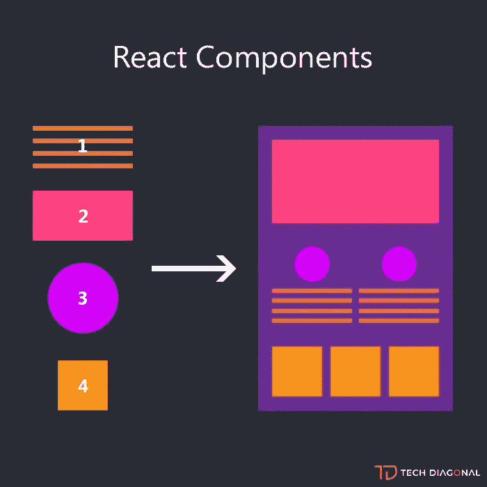
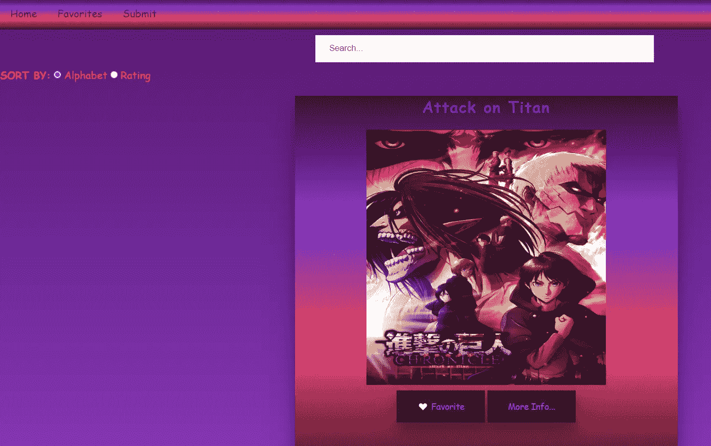
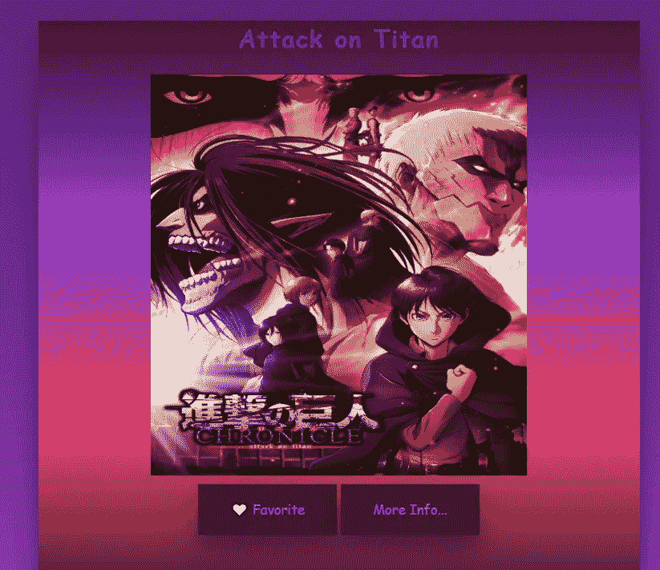

# 如何创建动态的 React 应用程序

> 原文：<https://javascript.plainenglish.io/how-to-create-a-dynamic-react-app-49e02d303436?source=collection_archive---------3----------------------->

## 创建动态 React 应用程序的指南。

所以…你想构建一个用户和开发者都可以轻松导航的应用程序，它的元素可以在你代码中的任何地方重用，并且更容易编写和理解？似乎不可能，对吧？也许我们真的永远注定要手工选择 DOM 上的每一个元素，并无休止地修改它，直到完美为止。或者，我们可以试着反应一下。

# 什么是反应？

很高兴你问了！React 是脸书创建的一个开发库，它允许开发人员将他们的代码分解成小块的、可重用的组件。组件是单独创建的，然后放在一起创建一个动态的、功能齐全的应用程序。以下是 React 组件以及它们如何一起构建应用程序的可视化效果:



React Components Visualization. Source: [https://www.techdiagonal.com/](https://www.techdiagonal.com/)

这里展示了四个组件，然后将它们放在一起创建一个完整的应用程序。请注意，有些组件在我们的应用程序中使用了不止一次。这就是 React 如此有用的原因！我们可以在应用程序中多次使用每个组件，而无需重写代码。

每个组件都是通过使用一个返回 JSX 的大写函数创建的，该函数看起来很像 HTML:

```
function Component(){
  return(
    <h2>Hello World</h2>
  )
}
```

如果我们想在应用程序的其他地方声明我们的组件，我们应该写:

```
<Component />
```

React 允许我们返回与 HTML (JSX)几乎相同的代码，使我们的代码更容易编写，也更容易被其他开发人员阅读和理解。在我最近使用 React 创建的应用程序中，我有几个组件，它们一起工作来创建最终形式的应用程序。让我们确定一下我添加到应用程序中的一些组件:



A screenshot of my React application

你能数出在我的动画应用程序的这个片段中显示了多少组件吗？我数了 4 个。导航栏、搜索栏、排序栏和标题卡都是独立的组件，都有各自的代码。将我的应用程序分解成独立的组件，让我更容易专注于应用程序每个部分的独立功能。使用 React 语法将组件组合成一个单独的应用程序，如下所示:

```
function App(){
  return(
    <div>
      <NavBar />
      <Search Bar />
      <SortBar />
      <TitleCard />
    </div>
  )
}
```

在这里，我们将所有的组件组合成一个单一的应用程序组件来创建一个完整的应用程序！

我们已经了解了 React 和组件，以及为什么它们非常有用，但是我们还遗漏了一大块拼图！现在我们知道 React 组件*返回* JSX，看起来与 HTML 非常相似，我们想知道 React 组件*接受什么*作为参数，使这些组件如此动态。

# 小道具

什么是道具，它们在 React 中有什么用？简单地说，props 是传递给 React 组件的参数。道具作为属性传递，很像 HTML 中的。它们允许我们将不同的值传递给同一个组件，并得到不同的结果。让我们看一个来自我的 React 应用程序的例子:

```
function AnimeCard({ **anime** }){
   return(
        <div >
            <h2>{anime.title}</h2>
            
            <button>'🤍 Favorite'</button>
            <button>'More Info...'</button>
        </div>
}
```

这里传下来的道具叫动漫，在一个父组件中声明。您可能会注意到，每当我们在返回函数中使用{anime.title}时，它周围都有括号。当我们希望在 React 组件中返回 Javascript 而不是 JSX 时，我们需要指明它是 Javascript，以便 React 可以为我们将它转换为 JSX。请注意，我们可以将任何想要的动画对象传递给这段代码，只要它有标题和图像键。因此，我们可以在代码中的任何地方使用这个组件，传递一个带有标题和图像键的动画对象，一张卡片将在页面上呈现，显示我们传递的数据。下面是传递道具的样子:

```
const anime1 = {
  title: 'Attack on Titan',
  image: "AOT.jpeg"
}const anime2 = {
  title: 'Demon Slayer',
  image: "DS.jpeg"
}<AnimeCard **anime={anime1}**/>
<AnimeCard **anime={anime2}**/>
```

请注意，我们在这里还将声明的动画变量括起来，因为我们将 Javascript 传递给了 JSX 组件。这段代码将显示如下内容:



Card Components from my react application

这里我们可以看到，由于使用了道具，同一个卡片组件可以在我的应用程序中多次使用，而且每张卡片上的数据不同。道具在我们的组件中非常有用，因为我们可以将几乎任何东西作为道具传递下去，甚至是函数！

# 事件

现在，我们知道如何用 React 创建一个基本的应用程序，但正如我们从我的上一篇帖子中所知，一个应用程序的交互性越强越好！我们应该关注几个事件，以增加用户的体验和参与度！但是我们如何做到这一点呢？我们知道如何在普通的 Javascript 中监听事件，通过定位 DOM 元素并向该元素添加事件监听器，但是如果我告诉您所有这些定位都是过去的事情了呢？要在 React 中检测一个事件，我们需要做的就是在我们要寻找的事件前面添加一个简单的关键字:' *on* '。如果我们使用 onClick 侦听器，我们知道我们的 JSX 元素应该在被单击时做出反应；如果我们使用 onChange 侦听器，那么它应该在发生变化时做出反应；这同样适用于 onSubmit、onLoad 和页面上发生的任何其他事件。让我们来看看我在 react 应用程序中添加到搜索栏的变更事件监听器:

```
<input className="search" type="text" placeholder="Search..." value={input} **onChange={handleChange}**></input>
```

在这里，我将一个 *onChange* 事件添加到我的< input >标签中，这样每当字段被更改时(即另一个字母被键入或删除)，函数 handleChange 就会被调用。我们在这里看到，react 为我们向 JSX 元素添加事件侦听器提供了一个非常简单的方法。

然而，在为我们的应用程序添加动态和变化方面，这并不是 React 为我们做的全部。React 还为我们提供了一个奇妙的功能，叫做*状态*。

# 状态

*状态*是随着用户与你的应用程序交互而不断变化的数据。在上面的例子中，我们希望输入值是一个状态值，因为每次有人在表单中输入时它都会改变。让我们看一个深入的例子来更好地理解这个状态。为了访问状态，我们需要从 react 导入它，并在 React 组件中声明它:

```
import React, **{ useState }** from 'react';function Search({ animes }){
  **const [input, setInput] = useState('');**// ...
}
```

让我们把这段代码分解一下。我们可以看到{ useState }正在从 reaction 导入。我们必须导入它，以便在代码中使用 state。接下来，让我们看看我们的变量声明。我们看到有一个数组，其中一个变量叫做 *input* ，另一个变量叫做 *setInput* 。这是因为 State 返回一个值(这是您在 use State 括号中声明的值，在我们的例子中是一个空字符串)和一个函数，该函数只是用来重置调用时给定的值。所以现在我们已经将*输入*变量设置为一个空字符串，但是如果我们调用*设置输入*，那么我们作为参数传入的任何内容都将成为我们新的*输入*变量。让我们继续:

```
function Search({ animes }){
  const [input, setInput] = useState(''); **const animeList = animes.filter((anime)=>{
    return anime.title.toLowerCase().includes(input.toLowerCase())
   })** //...}
```

在这里，我们可以看到我们使用*输入*变量的目的。我们想创建一个过滤的动画列表，只包含我们的标题包含*输入*变量的动画，即用户正在输入的内容。接下来的大问题是，我们怎样才能根据用户类型来改变动画列表？这就是*设置状态*的地方！

```
function Search({animes}){
  const [input, setInput] = useState(''); const animeList = animes.filter((anime)=>{
      return anime.title.toLowerCase().includes(input.toLowerCase())
   }) console.log(animeList); **function handleChange(e){
      setInput(e.target.value);
    }** return(  
       <input className="search" type="text" placeholder="Search..."
        **value={input}** **onChange={handleChange}**></input>
}
```

在这里，我们可以看到，每次用户键入时，我们都在重置输入变量。State 不可思议的一点是，每次它重置时，整个组件都会重新渲染，因此每次用户键入时都会重新运行动画列表，每键入一个字母就会显示一个最新的动画列表！在我们的 react 应用程序中使用 State 和 Event Listeners，我们拥有了创建一个动态的、用户交互的应用程序所需的一切！

下面是我使用反应状态能够实现的几个函数:

# 客户端路由

令人惊讶的是，我们已经学会了如何用反应组件、道具、事件和状态来创建一个完善的 web 应用程序。现在，我们需要担心的只是那个讨厌的小网址。你知道你放在浏览器中的小文本，它引导人们找到你的确切网站和站点页面吗？React 应用程序是为了允许单页应用程序而创建的。这意味着我们的应用程序只需要使用初始的 GET 请求以及初始的 HTML、CSS 和 JS。这使得很多事情变得更简单，但是我们需要一种方法来确保我们的 URL 反映我们想要显示的页面(或组件),而不必刷新页面。幸运的是，和其他所有事情一样，React 让我们很容易做到这一点！

React 给了我们 3 个主要的钩子，我们可以用来让我们的 URL 对我们的使用有效:Route、Switch 和 NavLink。让我们先讨论路由和交换。

## 路由和交换机

假设我们有一个叫 www.anime-app.com 的网站。我们有 3 个主要组件:主页、动画和收藏夹。这些组件中的每一个都包含非常不同的元素，我们希望它们能够被单独描述。反应给了我们一种导航到特定 URL 的方式，该 URL 只显示我们想要显示的组件:反应挂钩*路由*。

```
**import { Route, Switch } from 'react-router-dom';**. . . . .**<Switch>
    <Route path='/submit'>** <AnimeForm /> **</Route>** **<Route path='/favorites'>** <Favorites /> **</Route>** **<Route path='/'>** <Home /> **</Route>
</Switch>**
```

我们在这里看到，为了使用 *Route* 钩子，我们必须从‘react-router-DOM’中导入它。然后，我们需要将我们想要显示在单独页面上的组件包装在< Route *>* 标签中。在这个例子中，URL www.anime-app.com/*提交*将只显示**aniform**组件。类似地，如果我们使用 URL www.anime-app.com/*收藏夹*，只有**收藏夹**组件会显示。如果我们使用 URL www.anime-app.com**/**，我们将被带到应用程序的 **Home** 组件。这确保了如果我们的用户特别想提交一个表单，他们可以通过表单的 URL 直接进入表单，而不必从主页开始。但是我们还没有完成。

我们还需要用<switch>标签包装我们的路由，这些标签也是从“react-router-dom”导入的。在 <switch class="mc">> 标签中包装我们的所有路线将确保这些组件不会同时呈现，如果它们具有相同的字符(即，如果在我们的 URL 中有'/list '，则不会同时调用'/list2 ')。React 的开关钩子检查给定的第一个路径，并继续下去，直到找到与当前 URL 的任何部分匹配的路径。例如，如果我们将 Home 路径*移动到提交路径*之前，那么无论如何 Home 组件都会显示；这是因为它的路径('/')可以在我们给定的所有路径的*中找到。“/submit”和“/favorites”都包含“/”字符。因此，一旦 Switch 看到这个路径是我们的 URL 的一部分，它就停止寻找其他要显示的组件。因此，我们将 Home 组件*放在最后*，这样一来，只有当 URL 中既没有“/submit”也没有“/favorites”时，才会显示“/”路径。我们也可以通过使用属性 **exact** 来解决这个问题:*</switch></switch>

```
<Route **exact** path='/'> <Home /></Route>
```

**精确**属性使得组件仅在*精确*路径在 URL 中时才显示，而不仅仅是路径的*任何部分*匹配 URL 的。

## NavLink

现在，我们所需要的是一种方法，让我们的用户能够访问我们的其他组件，而不必在浏览器中手动键入 URL。这就是 NavLink 的用武之地！以我的动漫 app 为例，让我们来看看 NavLink 及其在运行中的功能:

```
**import { NavLink } from 'react-router-dom';** //imports NavLink. . .<nav> **<NavLink  to='/'exact>** <li><a>Home</a></li> **</NavLink>** **<NavLink to='/favorites'>** <li><a>Favorites</a></li> **</NavLink>** **<NavLink to='/submit'exact>** <li><a>Submit</a></li> **</NavLink>**</nav>
```

在

标签中是在 NavBar 组件中返回的 JSX。看一下导航链接标签，我们可以看到每个导航链接都有一个名为*到*的属性。这个属性指向当我们的导航栏上的一个<一个>标签被点击时我们应该导航到的路径。例如，一旦点击了“Favorites”<a>标签，根据我们的< NavLink >，我们应该在浏览器中导航到“/favorites”。我们知道，通过前面使用的路由和交换，这个 URL 将我们带到我们的收藏夹组件:

在这里，我们可以看到 NavLink 是 React 应用程序中非常有用的工具，因为它允许我们指定哪些页面将我们带到哪些 URL。

现在，我们已经了解了如何使用 Route、Switch 和 NavLink 来提供一种使用不同 URL 在我们的应用程序中导航的方法，为我们的应用程序提供了更多的维度！

# 为什么应该使用 React

React 是创建有趣的、动态的、互动的网站的一种不可思议的方式，同时也是组织和改变的一种很好的方式！如果你不喜欢你的生活变得更容易，那么就不要选择 React。如果你知道什么对你有好处，那就迈出这一步，今天就开始学习反应吧！你不会后悔的！

*更多内容尽在* [***说白了. io***](https://plainenglish.io/) *。报名参加我们的* [***免费周报***](http://newsletter.plainenglish.io/) *。关注我们关于* [***推特***](https://twitter.com/inPlainEngHQ) *和*[***LinkedIn***](https://www.linkedin.com/company/inplainenglish/)*。加入我们的* [***社区***](https://discord.gg/GtDtUAvyhW) *。*