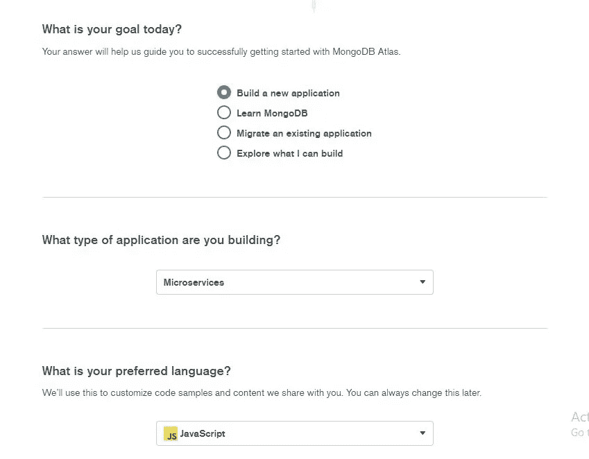
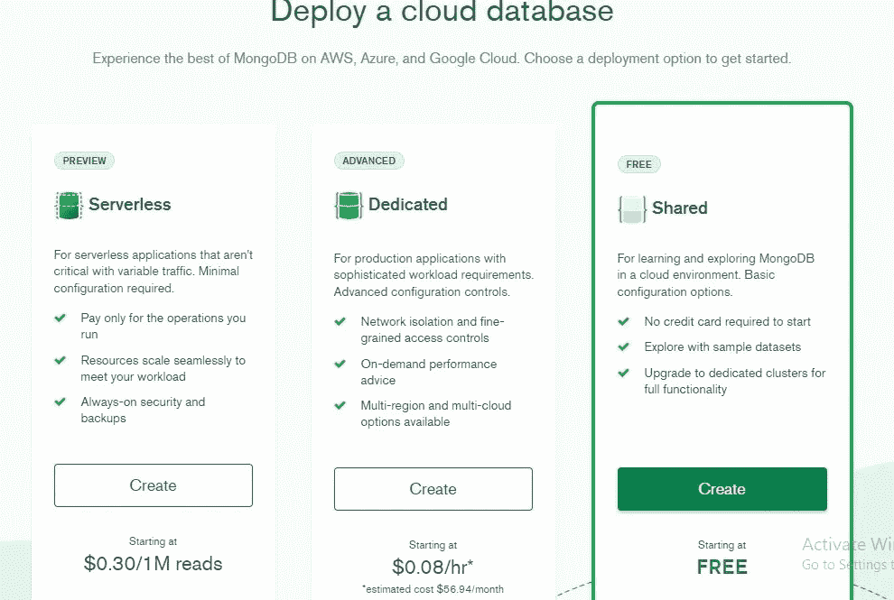
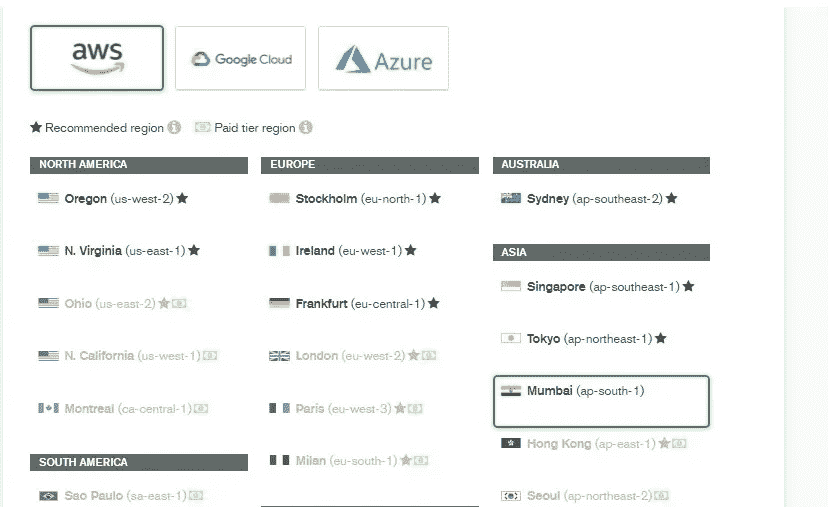
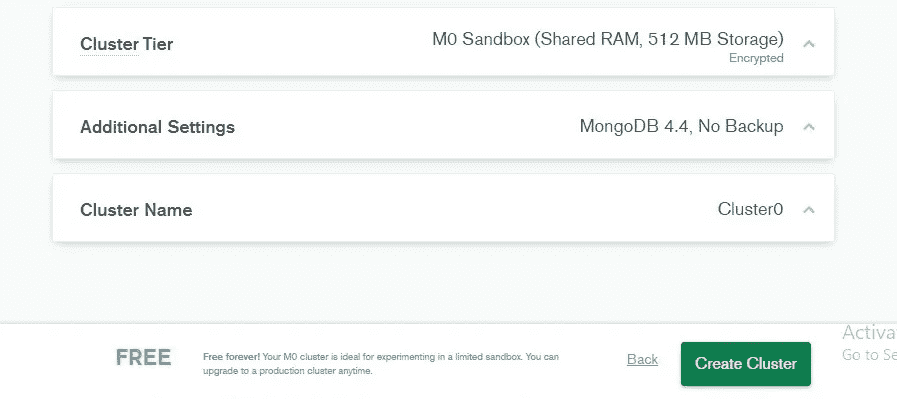
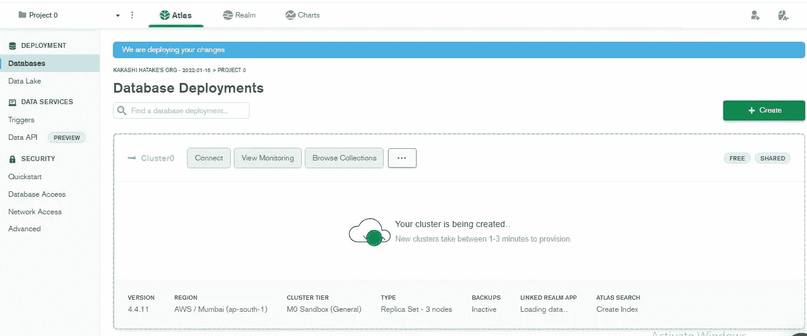
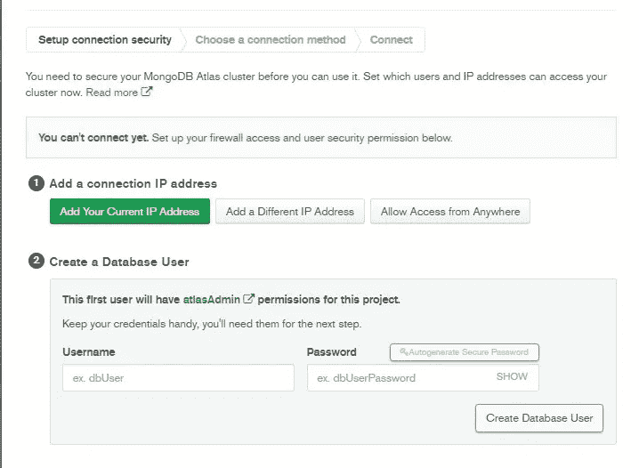

# 如何在 MongoDB (MERN 堆栈)中创建自由集群

> 原文：<https://javascript.plainenglish.io/how-to-create-a-free-cluster-in-mongodb-mern-stack-ba96a9240e12?source=collection_archive---------7----------------------->

## 关于如何在 MongoDB 中创建自由集群的指南。

在上一篇文章中，我们了解了 MERN 堆栈以及与传统的 web 开发方法相比它有哪些额外的特性，MongoDB 是其中使用的主要技术之一。

文章链接:[为什么 MERN·斯塔克变得流行？|我们来详细看看](https://www.mayhemcode.com/2022/01/why-mern-stack-is-becoming-popular-lets.html)。

# 获得免费 MongoDB 集群的步骤

MongoDB 提供了一个完全由其管理的免费集群，我们可以对其进行定制更改，如部署和**服务提供商，如 AWS、Azure 或 Google Cloud** 等。此外，我们还可以自定义数据库的大小和存储。所有的管理和系统设置将由 MongoDB 负责，我们可以使用不同的方法连接到数据库，并使用查询开始交互。

*   **首先转到 MongoDB Atlast 网站，使用给定的方法之一登录:**

链接: [MongoDB 图集](https://draft.blogger.com/blog/post/edit/3504568035593819778/2768631615493736821#)

使用 google 帐户或电子邮件登录后，您将被重定向到隐私和政策页面，单击我接受条款，然后单击提交。在此之后，您的帐户将在 MongoDB 中创建，有时可能需要 20-30 秒，所以请耐心等待。

*   **接下来，您需要设置 MongoDB Atlas 集群，其配置大部分是默认的。**

在这里，你需要选择建立一个新的应用程序，在这里，你使用数据库的应用程序的类型，选择用于开发应用程序的语言，在这种情况下，因为我们正在开发 MERN 应用程序，需要选择 JavaScript，如果你使用 Django，你可以选择 Python，等等。

*   **下一步是在云中部署数据库，这里有 3 种不同类型的部署。**

**无服务器** : —这是可变流量和可扩展数据库管理系统的最佳选择，它基于**按需付费**原则，您可以终止未使用的实例，并在需要时运行实例。

**专用** :-这种类型的部署提供了更好的隔离，用于需要专用实例的复杂应用。无服务器部署的成本高于专用部署，在这种情况下，始终运行的实例数量是固定的。

**共享** :-这是一个类似的示例部署，用于学习 MongoDB，不需要输入信用卡或任何卡的详细信息，您可以使用这些选项直接启动集群，这是 MongoDB 提供的自由层，您需要选择此选项。

选择共享部署并单击创建按钮。

*   **在这一步中，您需要选择服务提供商和您想要部署实例的地区。**

最好选择离您的国家或地区近的位置，否则数据交互过程可能会因延迟而花费大量时间。您还可以选择其他配置，如主内存和辅助内存，集群名称您可以根据自己的意愿命名集群。

对于大多数配置，您可以将其保留为默认值，因为自由层不提供许多功能，并且仅用于学习目的。命名集群并选择区域后，单击创建集群。

可以跳过邮件等设置，直接进入图集首页。

现在，当您单击左侧控制面板上的数据库时，您可以看到正在使用指定的配置创建您的集群，这通常需要大约 2-3 分钟，请耐心等待。

现在剩下的工作是连接到应用程序，为此，我们需要为群集创建一个用户，单击“connect”按钮，您可以使用用户名和密码创建一个用户，然后单击“create Database user ”,之后单击“Choose connection Method”。在进入下一页之前，您需要点击添加您当前的 IP 地址。

在连接方法中，有 **3 个不同的选项，使用一个 Shell，使用一个应用程序，以及使用一个 MongoDB compass** ，它是一个 GUI 应用程序。因为我们正在开发一个 Web 应用程序选择应用程序。在下一页，您可以看到它已经生成了一个我们将在应用程序中使用的首选语言的代码。

欲了解更多信息，请访问:

 [## 如何在 MongoDB | MERN 堆栈中创建自由集群

### MongoDB 是一个非 SQL 数据库，它还提供了一个免费层，您可以通过它为个人用途设置数据库，例如…

www.mayhemcode.com](https://www.mayhemcode.com/2022/01/how-to-create-free-cluster-in-mongodb.html) 

*原载于 2022 年 1 月 15 日 https://www.mayhemcode.com***。**

**更多内容看* [***说白了。报名参加我们的***](http://plainenglish.io/) **[***免费周报***](http://newsletter.plainenglish.io/) *。在我们的* [***社区不和谐***](https://discord.gg/GtDtUAvyhW) *获得独家获取写作机会和建议。****