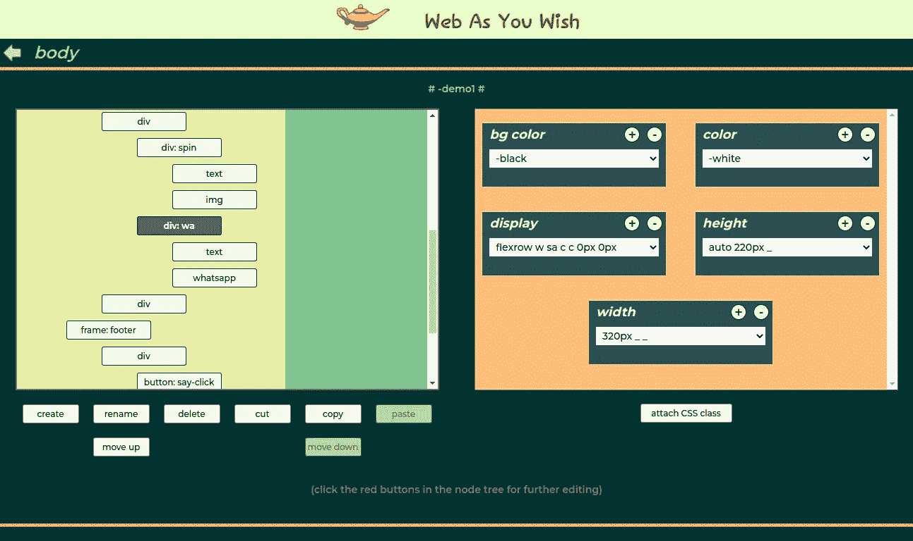
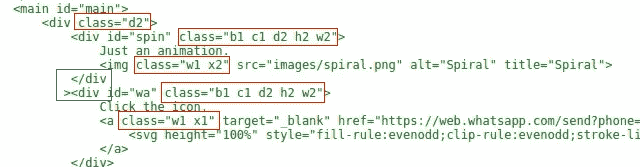
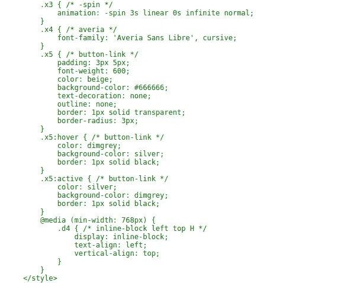
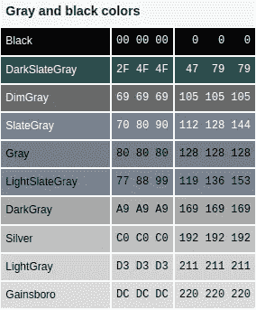
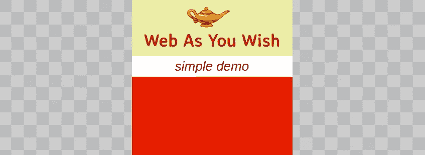

# 如何不用写代码就创建一个轻量级的纯 HTML/CSS 网页

> 原文：<https://javascript.plainenglish.io/how-to-create-a-lightweight-pure-html-css-webpage-without-writing-code-6e207a322083?source=collection_archive---------11----------------------->

或者如何逃离 CSS 迷宫

Web As You Wish — main section

## 重要编辑:本文是关于该工具的一个过时版本。该工具正在全面改进。

## 重要编辑 2:昨天，2023 年 3 月 21 日，我发布了新版本编辑器的* [预告图](https://webasyouwish.com/teaser) *，你可以在那里玩一些功能。虽然文章的一部分已经过时，一些概念也有所改进，但我会把它作为编辑器演变的守望者保留下来。也许你应该跳过这篇文章，去[用 CSS 分子复制媒体网站](https://medium.com/@joanaborgeslate/replicating-the-medium-website-using-css-molecules-7aa0849568e1)。

下面的视频是关于行动中的挑逗:

有一种新的 web 开发工具。它是免费的。你所需要的只是你的浏览器。如果你的电脑在远处，没问题。你可以使用你的智能手机，即使它的屏幕很小，像 IPhone5 的屏幕。

这个工具就是 [Web 如你所愿](https://www.webasyouwish.com/)，从此 WAYW。

## 主要部分

上图显示了道路的主要部分。它由两个面板组成。

左侧面板是网页节点的**树形视图。这不仅仅是一个观点。每个节点都由一个可点击的图标表示，该图标允许您对选定的节点/分支执行许多操作:创建、删除、重命名、移动、复制、剪切和粘贴。当*高亮图标为红色*时，您可以对该节点进行进一步编辑。绿色区域只是帮助理解树有多大的水印。**

右边的面板显示了**附加到**所选节点的所有 CSS 类，组织在方框中。专家组不仅仅是为了提供信息。你可以按类别添加和删除框(比如“宽度”、“背景颜色”、“显示”…)。在每个框中，都有一个选择器，您可以从中选择应该附加哪个类。您可以按“加号”按钮来创建一个新的类。如果某个介质查询条件被设置为类，槽框会显示有关它的信息。

## 所以…我不写代码，真的吗？

真的。

没有 HTML 代码。

并且没有 CSS 代码，除了关键帧和一些特殊的 CSS 属性。

最近看到 CSS 有 540 个属性。其中很多都不为人知，很少使用。在 WAYW 中将它们都表示为表单是不可行的。这就是为什么创建了 **X class** 类别。稍后将详细介绍。

## 纯 HTML/CSS？

没错。所有的 HTML 元素，布局和外观都是在纯 HTML/CSS 中完成的。

当然，也有适合你的 JavaScript 文件的位置。

## 轻量级(和快速)？

是的。**没有库**(之前说过没有 JavaScript)。**只是一个嵌入了**样式表**的小 HTML 文件**。

有一个小小的(**和固执己见的** ) CSS 重置样式表。和特定于您的网页的样式表。**样式表中没有未使用的 CSS 类**！此外，WAYW 保证您附加的所有类确实存在。

每个 CSS 类都有一个别名:

Small names for classes

## 人类可读的

正如您在上面的代码片段中看到的，代码是缩进的，可读性很强。

HTML 代码缩进时有一个问题(标记之间有空格)。浏览器会自动在 display“inline-block”的两个同级节点之间插入一个空格(至少在这种情况下)。

上面代码片段中的蓝色矩形显示了一个特殊的( **valid** )语法，该语法防止出现这种不需要的空格。WAYW 算法只在真正需要的时候使用这种语法**，以使代码尽可能的美观和易懂。**

## **你不写，所以你不读**

**在你抱怨 CSS 类的短名字如“x5”是个坏主意之前，让我告诉你**你不需要阅读代码。“x5”只是一个又长又有意义的名字的别名。****

**请不要问"*如果代码不应该被阅读，为什么要在小细节上花那么多精力让它变得漂亮呢？*”。**

****

**Part of style sheet**

**如果您想知道“x5”指的是什么，在嵌入式样式表中按字母顺序查找，您会发现它是“button-link”的别名(在本例中)。**

## **固执己见？**

**是的。**

**在 WAYW 中，网页正文只直接包含 ***框架*** 和代码 ***备注*** 。**

**一个 ***框架*** 是一个“div”标签，其宽度总是浏览器窗口宽度的 100%。当 ***帧*** 的 ID 为‘header’(‘main’或‘footer’)，则创建‘header’(‘main’或‘footer’)标签，而不是‘div’标签。**

**由于 ***框架*** 在网页中的作用，您不能对其应用类别为“width”(以及其他)的 CSS 类。**

**这没什么大不了的，因为这是你通常创建网页的方式。但是……如果你想要一个在左侧有一个大导航栏(菜单)的网页(*所有的东西都在同一层*)，那么这个可堆叠的大“div”系统( ***框架*** )是不合适的。你仍然可以使用一个 ***框架*** 来推动你的导航条和更多的东西。但是你不应该那样做。除了别扭，这也违背了 WAYW 的一个原则:**一个网页对所有屏幕**。这种布局对智能手机来说是不可行的。**

**WAYW 有自己做 CSS 的方式。**

**您不能将 CSS 属性设置为标签。或者通过其 ID (#id)连接到特定节点。**你做的所有 CSS 都是基于类的**。这个系统非常简单和干净。最重要的是:没有优先权冲突！**

**CSS 中的优先级比乍看起来更复杂。但是这是另一篇文章的主题。**

**例如，*对于标准类别*您不能**

1.  **将“display”属性的值设置为“inline”或“block”；“无”、“内嵌块”或“灵活”都是可以接受的**
2.  **将“框大小”属性的值设置为不同于“边框-框”的值**
3.  **将“溢出”属性的值设置为“可见”**

**依我拙见，网络世界中第二愚蠢的决定是为“溢出”创造“可见”值。**

> **比把“深灰色”命名为比命名为“灰色”的颜色更浅的颜色更愚蠢！**
> 
> **如果到目前为止，你还没有意识到网络从第一天起就是一团糟，这就是你的机会！！！**

****

**From Wikipedia — Web Colors**

**而且，依我拙见，网络世界中第一个最愚蠢的决定是将【可见】设置为 ***默认*** 的“溢出”值。**

## **不固执己见？**

**是的。**

**尽管固执己见，但 WAYW 让您轻松地覆盖 99%的 WAYW CSS 方式。**

**你所要做的就是创建一个 X 类。在一个 **X 类**的声明里面，你想写什么都可以。唯一的问题是，WAYW 不解析内容。因此，声明中的错误将是网页中的错误。**

**当 WAYW 创建嵌入的样式表时(“重置”样式表和特定样式表), **X 类**的声明最后编写。这意味着它们自然会覆盖之前的所有内容，包括“重置”样式表的声明。**

## **X 级**

**一个 **X 类**的主要目的是让你完成 WAYW 的 CSS 标准类别中缺少的东西。**

**第二个目的是让你从 WAYW 标准方式中获得自由。**

**现在，X 类还有第三种用法。这种用法与 CSS 无关，而是与 JavaScript 有关:按类名选择元素。在这种情况下，您创建一个(或多个)带有空值的 **X 类**，只是为了附加到您希望被选择的节点。**

## **命名类别**

**在**关键帧**和 **X 类**的情况下，你编写代码并命名类。**

**但是对于标准类(**颜色**、**背景颜色**、**显示**、**字体**、**高度**、**边距**、**填充**、**溢出**和**宽度**)，名称是由 WAYW 自动给出的， ***类似于属性*** 的选择值**

**在给定名称的同时，该类的*属性的值被永远锁定*。**

**WAYW 遵循的原则是 CSS 类名必须给出关于其值的信息。CSS 书籍说将一个红色的类命名为“red”是一种不好的模式，因为以后你不能将颜色改为蓝色(否则会造成混乱)。他们说像“xyz”(没有任何意义)这样的名字会更恰当。**

**WAYW 不同意。如果一个颜色类中的值是“red”，那么这个类最好的名字就是“red”！**

**假设您有数百个附加了“red”类的节点，您想将它们的颜色改为蓝色。在传统的 CSS 中，你只需要在样式表中改变一次颜色的值。那么“红色”节点看起来会是蓝色的。仅仅是这个类的名字就会引起误解。**

**在 WAYW 中，您不能这样做，因为属性值是锁定的。您必须进行两个步骤:**

1.  **用蓝色创建另一个类，命名为“blue”(实际上这个名字类似于“rgb 0 0 200”)**
2.  **按下 ***按钮，替换节点*** 中的类，并回答旧类的名称和新类的名称**

**再见昨天-红色-今天-蓝色问题！**

## ****临时* *和预览**

**WAYW 想让你的生活更轻松。具有锁定值的类非常健壮和可靠，但是当我们创建一个样式时似乎太死板了；我们需要实验的灵活性和自由。**

**这就是为什么类有一个专门的名字:**** *临时***** 。**

**这显然是一个临时的名字。这是唯一允许您随意更改任何类的属性值的名称。然后只需按下按钮 ***应用*** ，该类将获得一个确定的名称。**

**以及如何看到设置属性后的结果？简单回答(电脑用):*只需按空格键，带有预览的标签就会打开*。**

**再次按空格键关闭选项卡。**

## **所有屏幕的预览**

****

**Preview for Iphone5 (in desktop)**

**WAYW 考虑以下设备(屏幕宽度):**

1.  **320px IPhone5**
2.  **360 像素银河 S3**
3.  **375px IPhone 6/7/8**
4.  **412 像素谷歌像素**
5.  **480 像素诺基亚 N9**
6.  **540 像素 Surface Duo**
7.  **768 像素 IPad**
8.  **800px Kindle Fire HDX**
9.  **1024px 嵌套集线器**
10.  **1280px 旧笔记本电脑**
11.  **1366px 现代笔记本电脑**
12.  **1536px 大型桌面屏幕**
13.  **1920 像素更大的桌面屏幕**

**您可以轻松地为上面列出的设备之一设置预览。**

**如果工作设备的屏幕大于所选宽度，可用空间将被一个国际象棋图案填充(如上图所示)。**

**如果它更小，将提供一个水平滚动条。**

**WAYW 允许你在 IPhone5 上预览网页在 1920 像素屏幕上的样子。**

## **内置媒体查询**

**对于某些 CSS 类，WAYW 提供了一个基于屏幕宽度列表的选择器。例如，如果您将选择器设置为“800px ”,则只有当屏幕宽度等于或大于 800 像素时，该类才会影响节点。**

## **剪切/复制和粘贴**

**由于我们将原子 CSS 类应用于一个节点(而不是一个包含所有 CSS 的类)，您可能会认为将相同的类附加到相似的节点会很繁琐并且容易出错。你是对的！但是我们不需要重复所有的过程。我们可以复制并粘贴节点！**

**剪切/复制&粘贴是 WAYW 的一个******特色。我们不能选择一个以上的节点进行复制，但是选择的节点带有所有的子节点和子节点的子节点。我们复制并粘贴整个分支！**

**我们可以**在一个网页中复制一个节点/分支，然后粘贴到另一个**！而且 WAYW 还会粘贴所有相对于源节点/分支的 CSS 声明！**

**WAYW 将*自动解决*任何节点的 ID 冲突和任何类的名称冲突！**

****警告**:目前，WAYW 不复制**关键帧**或
头中的数据，如“ **@import** ”和“**@ font-face”**。**

## **定义和网页**

**在内部，网页只是输出。WAYW 致力于网页的定义(整体数据)。**

**定义是一个普通的 JavaScript 对象(字典)。**

**WAYW 不读取/解析 HTML 或 CSS 它只读取 JSON。您必须**备份定义**。**

**顺便说一句，拥抱和亲吻创建 JSON.parse 和 JSON.stringify 的人，不管他们是谁。我经常使用这些功能。**

## **含电池**

**WAYW 的理念不仅是提供开发人员需要的所有组件，而且还提供通过简单的几次点击来访问它们的途径，就像 WhatsApp node 的情况一样。**

**WAYW 正在建设中，目前错过了很多功能。**

## **SEO 和屏幕阅读器**

**由于生成的网页是一个独特的文件，用不臃肿、干净的 HTML/CSS 编写，它非常适合搜索引擎和屏幕阅读器。**

## **受到 W3C——万维网联盟的祝福**

**创建的网页通过了 [HTML 验证器](https://validator.w3.org/)，没有错误或警告。**

## **服务器端渲染？谢谢，但是不用了，谢谢！**

**在互联网的初期，浏览器做不了什么。大量使用的服务器端渲染。**

**现在，在计算机/设备和浏览器引擎的所有发展之后，客户端被框架弄得如此臃肿，以至于[新的大事件](https://fresh.deno.dev/)又是服务器端渲染…**

**我不明白为什么人们喜欢制作一个有数十个样式表和 JavaScript 文件链接的网页。**

**为什么要做很重的一页？为什么要让 app 更加依赖连接？为什么要花钱做服务器端渲染？**

## **麻省理工学院许可证**

**WAYW 的源代码是在麻省理工学院许可下在 GitHub 上发布的[。](https://github.com/JoanaBLate/webasyouwish)**

## **最后**

**发布方式我正在履行文章中的承诺"[嘿，HTML…我回来了，亲爱的！](https://medium.com/javascript-in-plain-english/hey-html-i-am-back-darling-4505b557a66d)”。**

**如果您有任何问题或建议，请告诉我！**

***更多内容请看*[***plain English . io***](https://plainenglish.io/)*。报名参加我们的* [***免费周报***](http://newsletter.plainenglish.io/) *。关注我们上*[***Twitter***](https://twitter.com/inPlainEngHQ)[***LinkedIn***](https://www.linkedin.com/company/inplainenglish/)*[***YouTube***](https://www.youtube.com/channel/UCtipWUghju290NWcn8jhyAw)**和* [***不和***](https://discord.gg/GtDtUAvyhW) *对成长黑客感兴趣？检查* [***电路***](https://circuit.ooo/) ***。*******