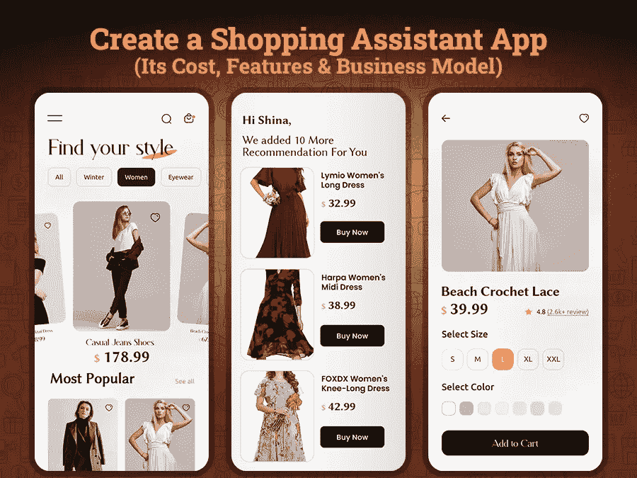

# 如何创建一个个人购物助理应用程序:它的成本、必备功能和商业模式

> 原文：<https://javascript.plainenglish.io/how-to-create-a-personal-shopping-assistant-app-its-cost-must-have-features-and-business-model-9009ced07096?source=collection_archive---------5----------------------->

无论你是一家为加入电子商务行业铺平道路的初创公司，还是在寻找扩大业务规模的机会——考虑开发一款虚拟助理购物应用程序将是 2022 年百万美元的商业想法。

对一些人来说，购物是一种艺术，而对另一些人来说，购物是一种压力。想知道购物对任何人来说都有压力吗？

你还记得过去没有互联网的日子吗，人们不得不花很长时间探索事物，决定什么最适合他们？但在这种快节奏的生活中，人们没有时间去购物等普通的事情。然而，随着技术的出现，事情已经发生了变化。网上购物门户彻底改变了传统的购物模式。最近，人工智能、人工智能和大数据已经成为一个大趋势，并迅速重塑购物世界。

移动应用程序开发行业的创新和进步提供了战略性的方法，帮助零售商或企业快速抓住客户，在几秒钟内做出最佳的购物决策。只需在手机屏幕上轻点几下，顾客就可以从成千上万的选项中快速挑选出最佳选项，而不必亲自去任何一家商店。

尽管如此，在线购物助手应用程序的流行势头越来越大，并帮助零售商发现新的创收机会。

作为一个初创企业或商业爱好者，如果你想知道如何创建一个在线个人购物助理应用程序，那么这里有完整的博客指南。

**你需要了解的博客重点:**

*   *用市场统计了解网购助手类 app 的受欢迎程度
    ——网购统计调查报告*
*   *你可以开发哪些类型的购物辅助应用？*
*   *网购助手应用如何工作？*
*   *如何创建个人网购助手 App？
    -了解购物助手应用算法
    -构建购物助手应用的必备功能*
*   *创建一个个人购物助手 App 需要多少钱？*
*   *结论:准备好打造自己的购物辅助 App 了吗？*

为了更好地理解，让我们深入了解每一点的细节…

## **1。通过市场统计了解网购助手应用的受欢迎程度**

除非你不是住在山洞里，否则你必须明白这样一个事实:网上购物正在快速增长，并成为经济的主要组成部分。但是你是否想知道有多少人真正在网上购物，以及他们的购物行为在不同的垂直市场上是什么样的？在你着手雇佣一个 [**移动应用程序开发公司**](https://www.xicom.ae/services/mobile-app-development/) 来创建一个在线购物辅助应用程序之前，是时候从一个高层次来看待在线销售了。让我们慢慢转向描绘这个价值数十亿美元、为投资者提供数百万机会的行业的渐进图景的统计数据。

因此，如果你有一个网上商店或有兴趣建立一个，那么这里有几个最重要的网上购物统计数据，将引导你在 2022 年的正确方向。

> **网购行业市场统计**

*   *根据调查，仅美国的数字购买者总数就有 2.589 亿，预计到 2023 年将超过 3.07 亿。*
*   *调查报告显示，2021 年全球有 21.4 亿人在网上购买商品。*
*   全球购物统计预测，到 2024 年，他们的收入将达到 6.4 万亿美元。
*   **63%的购物场合都是在线的，确保改善客户体验。**
*   **根据《市场与市场》调查报告，预计到 2026 年，全球语音助手应用市场价值将达到 112 亿美元，2021-2026 年 CAGR 增长率为 32.4%。**

*正如世界不可能一成不变，客户心理也随着时间不断变化。亚马逊、易贝等数字市场是在线购物帮助的早期采用者，提供方便、快捷和个性化的购物体验。人们在网上花费数百万美元，当他们想要购物和在几秒钟内过滤搜索选项时，他们倾向于移动。*

*为了证明我们的观点，我们已经提到了表明网上购物行业发展状况的统计数据。如果你已经决定创建一个在线购物应用程序，那么是时候了解你应该为你的企业开发什么类型的在线购物辅助应用程序了。*

## ***2。你可以开发什么类型的购物辅助应用程序？***

*在当今时代，个人助理应用程序已经脱颖而出，成为企业最迷人的选择。*

*像电子商务行业就利用了这一机会，并在这种算法的帮助下帮助用户浏览成千上万的选项。是时候让其他垂直商业领域占据先机，在数百个竞争对手中脱颖而出了。其实可以考虑 [**聘请手机 app 开发者**](https://www.xicom.ae/services/mobile-app-developers/) 定制 app 架构。一个精心策划和周到的购物助手应用程序可以让客户寻找最佳折扣券，寻找不同商店的类似产品，预订各种活动的门票等等。要开始使用一个应用程序，你需要注意你应该建立什么类型的购物助手应用程序。*

> ***你可以考虑在 2022 年打造的购物助手应用类型***

*   ***旅行和行程规划应用:**你必须打电话给旅行社定制旅行套餐的日子已经一去不复返了。在数字化时代，允许顾客直接从智能手机上预订旅行套餐。通过在线旅行规划应用程序，你可以让用户定制他们的整个旅行，包括机票、酒店预订、汽车租赁、火车票等。事实上，基于他们的旅行兴趣和预算，一个应用程序将帮助用户定制旅行套餐。*
*   ***个人商业服务应用:**这是一种多市场应用类型，用户可以从不同的商店购买不同的产品和服务。他们可以比较价格、交货时间等等。所有这些活动都可以通过一个应用程序来完成。*
*   ***送礼物 App:** 为不同的场合选择一份完美的礼物似乎是最具挑战性的任务。但通过个性化的礼品配送购物助手应用程序，您可以向用户推荐最佳的礼品选项。这将节省选择合适礼物的时间和压力。他们只需要提到场合、年龄、预算或性别来筛选礼物选项。*
*   ***订票:**通过在线订票助手应用程序，您可以根据他们对地点、预算、偏好等的选择，探索各种娱乐活动，并订票。*

*无论你在进入应用程序开发流程之前决定构建什么类型的应用程序，你都需要了解在线购物助手应用程序的机制。*

## ***网购助手应用如何工作？***

*无论你是打算建立一个电子商务购物助手应用程序还是一个旅行助手应用程序，请记住，人工智能算法是这些购物助手应用程序的心脏和灵魂。任何购物助手应用程序都与基于人类和基于人工智能的算法的独特组合一起工作。*

*由于它包括两种类型的分析，因此让我们将应用程序结构分为两类-基于人类和基于人工智能的应用程序。*

**“一流是基于包括数据智能在内的人类洞察力。第二种类型的应用程序是基于人工智能的购物助手应用程序，它在人工智能的帮助下工作。利用人工智能算法的丰富性，设计了一种基于用户行为提供个人购物建议的方式。**

*这些购物助手应用程序支持的算法允许企业收集所有重要信息，帮助他们扩大增长规模。事实上，应用程序开发过程涉及各种机器学习算法，这些算法有助于分析客户的购物习惯和个人偏好。*

*现在的问题是，如何在 2022 年为你的企业打造一款成功的网购助手 app。*

## ***如何创建个人网购助手 App？***

*你知道为什么在线购物助手应用程序越来越受顾客欢迎吗？只是因为创新的功能和独特的解决方案，迅速改变了用户的购物体验。*

*但问题是，你如何让你的应用程序更具互动性和吸引力？如何与市场领导者竞争，吸引目标受众？成功的关键是什么？*

*如果你也计划 [**为你的企业创建一个网上购物助手应用**](https://www.xicom.ae/services/mobile-app-development/) ，那么这里有几个主要功能可以帮助你构建一个购物助手应用。*

> ***打造网购助手 App 的关键特性***

*   ***App 登录/注册:**为了帮助用户入门一个 App，可以提供多个登录选项。帮助他们注册一个电子邮件 ID 或联系方式或社交媒体整合。此外，为了欢迎新用户，你可以提供一个教程，解释使用它的所有功能和优势。*
*   ***个人资料设置:**通过此功能，允许用户编辑个人资料的详细信息，如用户名、性别、付款信息等。*
*   ***个性化推荐:**该功能由人工智能算法提供支持，帮助您分析用户的行为、品牌、风格偏好，并相应地提供购物建议。个人购物助理应用程序可以推荐商品以快速完成购物，并建议折扣券。*
*   ***价格过滤算法**:它跟踪众多零售商和在线商店的价格，并发现销售和折扣。有了这些算法，你就可以更好地预测价格需要变动和超额支付的情况。*
*   *人工智能聊天机器人:为了确保无缝的购物体验，你可以以虚拟顾问、虚拟咨询师等形式提供 24*7 的客户支持。许多品牌已经实现了基于人工智能的聊天机器人，以自动回答客户的查询。事实上，聊天机器人的实现可以帮助你削减雇佣客户支持专家的费用。*
*   ***跟踪订单:**这是您的在线购物助手应用程序最重要的功能之一，它提供在线跟踪订单、购买和支付的应用内支持。*
*   ***语音识别:**据预测，到 2025 年，95%的在线销售都是通过语音识别产生的，因此考虑在您的在线购物助手应用程序中实现该功能是有意义的。使用语音命令，允许用户过滤搜索选项，并帮助客户快速做出购物决定。*
*   *比较价格:当顾客以最便宜的价格购买产品和服务时，他们总是感到满意。一个个人购物助理应用程序可以在你向客户提供购买产品和比较价格和质量时取得成功。价格比较功能将有助于根据用户的需求和以前的购物经验选择最佳交易。为了让这个功能完美地工作，你可以从不同的商店收集数据，并向用户提供最好的交易。*
*   ***价格过滤算法:**既然网购辅助应用都是基于算法的，那么雇佣一家 [**移动应用开发公司**](https://www.xicom.ae/services/mobile-app-development/) 来实现尽可能多的基于算法的功能在其中总是值得的。价格过滤器将跟踪众多的零售商和在线商店，分析折扣和销售，预测价格并相应地改变它。*
*   ***交易和折扣券:**一个理想的网购助手 app，总是会根据不同的购物金额，提供大量的交易、折扣和优惠券。向用户展示他们感兴趣的产品有哪些优惠券，并允许他们在最终结算时直接使用。*

*这些是你可以考虑集成到在线购物助手应用程序中的几个最常见的功能，可能会花费你 17，000 到 20，000 美元。但是，如果你是在和这样的行业巨头竞争，那么总是建议你寻找独特而突出的功能。有了这些高级功能，您可以提供更好的用户体验，并能够在繁荣的市场中树立自己的品牌形象。*

## ***创建一个个人购物助手 App 需要多少钱？***

*创建一个在线个人购物助理 app 需要多少钱？这是创业公司和商业爱好者最常问的问题之一。但是，即使对于应用程序开发专家来说，也很难给出一个通用的答案。虽然不同的购物应用程序都在购物应用程序的大伞下。每种类型的购物助手应用程序都有自己不同的功能、设计、复杂性和技术要求。因此，期望所有类型的购物应用程序都有一个固定的开发成本可能会误解你。*

*但是，估算创建一个在线购物应用程序的最终开发成本并不是什么难事。你所需要的是理解所有这些导致应用程序开发成本的因素。*

*一般来说，对于 Android/iOS 本地应用程序，创建一个购物应用程序的估计值在 20，000 到 25，000 美元之间，但是这些数字是从哪里来的呢？网购 app 开发如何制定合适的预算？*

> *让我们来了解一下创建一个成功的虚拟助手应用程序的应用程序开发成本的影响因素:*

*   ***操作系统的选择:**这是最关键的成本推动因素之一。为 iOS 或 Android 开发一个包含基本功能的本地应用大约需要 20，000 到 25，000 美元。由于两个本地平台需要不同的应用程序开发方法，因此您需要 [**为不同的平台雇佣移动应用程序开发人员**](https://www.xicom.ae/services/mobile-app-developers/) 。此外，开发这两种原生应用程序需要更长的上市时间，这最终会让你付出昂贵的代价。节省应用程序开发成本的简单方法是寻找可以节省高达 40%成本的混合购物应用程序。事实上，使用相同的代码库，您可以更快、更高效地启动您的应用程序。*
*   ***特性和功能的复杂性:**特性和功能的复杂选择将需要更长的应用程序开发时间。较高的 app 开发时间会增加 app 开发成本。因此，如果你是一家初创公司，那么建议你考虑开发一个 MVP 解决方案，这将需要 4 到 6 个月的应用程序开发时间，可能会花费你 17，500 到 20，000 美元，并包括基本功能。有了这个解决方案，您可以用最少的投资启动项目。*
*   ***应用程序开发团队:**要创建一个成熟的在线购物助手应用程序，你需要雇佣一家移动应用程序开发公司，该公司可以提供一个由移动应用程序开发人员、业务分析师、项目经理、UI/UX 设计师、应用程序测试人员等组成的团队。雇佣这些专家的时薪取决于他们的技能、经验和地理位置。*

*这些是主要影响在线购物助手应用程序开发成本的几个因素。但是最终的估计完全取决于您的业务需求及其复杂性。所以我们总是建议预约一个免费的专家咨询时段。*

## ***总结:如何为网购助手 App 设定合适的预算和功能***

*不可否认的事实是，个人购物助理应用程序正在创造一个行业流行语。通过使用这种基于人类和人工智能的算法，购物助理应用程序正在推荐个性化的购物建议，从而节省时间和压力。此外，这些类型的应用程序正在帮助企业更好地了解客户的行为和购物习惯。你所需要的就是期待雇佣一个 [**移动应用程序开发公司**](https://www.xicom.ae/services/mobile-app-development/) ，它可以帮你为你的企业建立一个完美的解决方案。在专家的专业协助下，您可以实现基于算法的功能的正确选择，并能够在过度拥挤的市场中脱颖而出。无论你是拥有一个巨大的商店还是一个当地的小店，你肯定需要一个个人购物助理应用程序来扩大你的客户群和促进销售。*

*如果你有想法开发一个定制的移动应用程序来实现你的梦想，那么你可以 [**联系我们**](https://www.xicom.ae/contact/) 并在下面留下一个问题来获得更多的项目细节并了解真正的应用程序开发评估。*

*=======================================*

**更多内容请看*[*plain English . io*](https://plainenglish.io/)*。报名参加我们的* [*免费每周简讯*](http://newsletter.plainenglish.io/) *。关注我们*[*Twitter*](https://twitter.com/inPlainEngHQ)*和*[*LinkedIn*](https://www.linkedin.com/company/inplainenglish/)*。加入我们的* [*社区不和谐*](https://discord.gg/GtDtUAvyhW) *。**