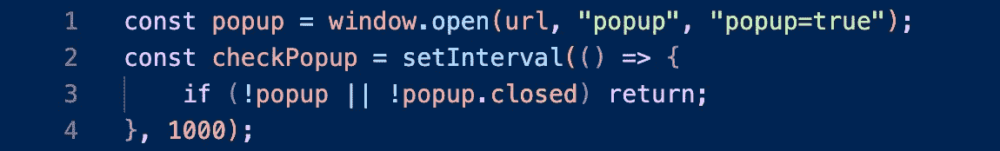
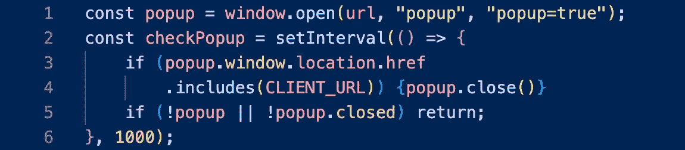
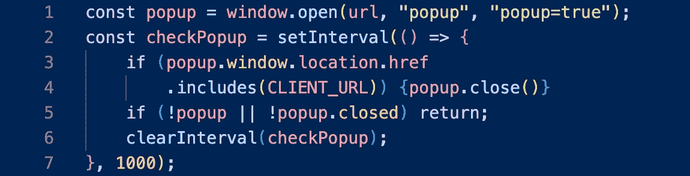

# 如何为 OAuth 登录创建弹出窗口

> 原文：<https://javascript.plainenglish.io/how-to-create-a-popup-for-oauth-login-38dee97f5f3b?source=collection_archive---------4----------------------->

## 关于为 OAuth 登录创建登录弹出窗口而不是将用户重定向到另一个页面的教程。


Photo by [Micah Williams](https://unsplash.com/@mr_williams_photography?utm_source=medium&utm_medium=referral) on [Unsplash](https://unsplash.com?utm_source=medium&utm_medium=referral)

您已经启动并运行了 OAuth，但是不喜欢它重定向用户登录。你更希望登录是一个弹出窗口。幸运的是，有一个简单的方法可以做到这一点。

# 1.打开一个新窗口并创建对它的引用。

首先，我们需要创建弹出窗口。我们通过调用`[window.open()](https://developer.mozilla.org/en-US/docs/Web/API/Window/open)`来做到这一点。我们还需要将对这个新窗口的引用存储在一个变量中，以便以后使用:


`window.open()`函数接受 3 个可选参数:

1.  `url`是要加载到`window`中的资源。
2.  `target`控制`url`将被加载到哪个`window`。如果现有的`window`与给定的名称匹配，那么`url`将被加载到那个`window`中。如果不匹配，则创建一个具有给定名称的新的`window`。`target`参数也可以接受[特殊关键字](https://developer.mozilla.org/en-US/docs/Web/HTML/Element/a#attr-target)。
3.  `windowFeatures`接受一个特殊格式的属性字符串给`window`，就像`height`和`width`一样。如果你传递任何东西给这个参数，结果将是一个弹出窗口`window`。还有一个专用的`popup`属性，它将使`window`成为一个最小的弹出窗口。

对于 OAuth 工作流，将`url`设置为您正在使用的 API，将`target`设置为现有的或新的`window`的名称，并将`windowFeatures`设置为`"popup=true"`:


这将打开一个弹出窗口，显示用户登录页面。

# 2.使用 setInterval 检查弹出窗口。

现在我们有了一个弹出窗口，我们需要监听任何变化。这就是为什么保存对新的`window`的引用很重要:有了这个引用，我们可以使用`[setInterval](https://developer.mozilla.org/en-US/docs/Web/API/setInterval)`定期检查状态。


`setInterval`函数接受两个参数:一个回调函数和调用它的频率，以毫秒为单位。在上面的示例代码中，匿名回调函数(`() => {}`)将每 1 秒被调用一次。对`setInterval`函数的引用被存储为`checkPopup`，这对以后阻止它永远检查弹出窗口很重要。

# 3.弹出窗口打开时继续检查。

当我们的`popup`打开时，我们想继续检查它的状态。为此，如果弹出窗口仍然打开，我们将简单地返回而不做任何事情:



# 4.准备好后关闭弹出窗口。

根据您在弹出窗口中使用的登录 API，这一部分看起来会有所不同。在示例项目中，API 重定向回网站，附加某些查询参数。因此，为了知道何时关闭弹出窗口，我们检查`popup`是否被重定向回我们的网站:



如果我们在检查了`popup`是否关闭后试图关闭它，我们将会陷入一个无限循环的情况，在那里`popup`将永远无法关闭。所以在检查`popup`是否关闭之前，我们需要确保关闭`popup`。

# 5.关闭状态检查。

最后，一旦`popup`关闭，我们要关闭`checkPopup`功能。我们通过在`checkPopup`上调用`[clearInterval](https://developer.mozilla.org/en-US/docs/Web/API/clearInterval)`来实现这一点:



```
const popup = window.open(url, “popup”, “popup=true”);
const checkPopup = setInterval(() => {
   if (popup.window.location.href
      .includes(CLIENT_URL)) {popup.close()}
   if (!popup || !popup.closed) return;
   clearInterval(checkPopup);
}, 1000);
```

当我使用 [Spotify 的授权代码流](https://developer.spotify.com/documentation/general/guides/authorization/code-flow/)来请求访问用户的图书馆时，这段代码对我有效。这对你有用吗？下面让我知道！

*更多内容请看*[***plain English . io***](https://plainenglish.io/)*。报名参加我们的* [***免费周报***](http://newsletter.plainenglish.io/) *。关注我们关于*[***Twitter***](https://twitter.com/inPlainEngHQ)[***LinkedIn***](https://www.linkedin.com/company/inplainenglish/)*[***YouTube***](https://www.youtube.com/channel/UCtipWUghju290NWcn8jhyAw)*[***不和***](https://discord.gg/GtDtUAvyhW) *。对增长黑客感兴趣？检查* [***电路***](https://circuit.ooo/) *。***