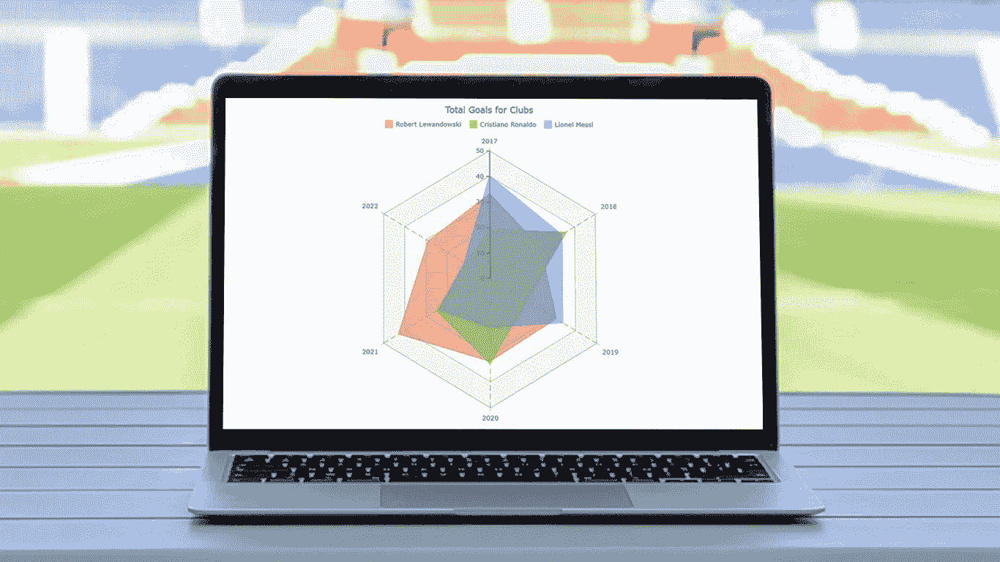
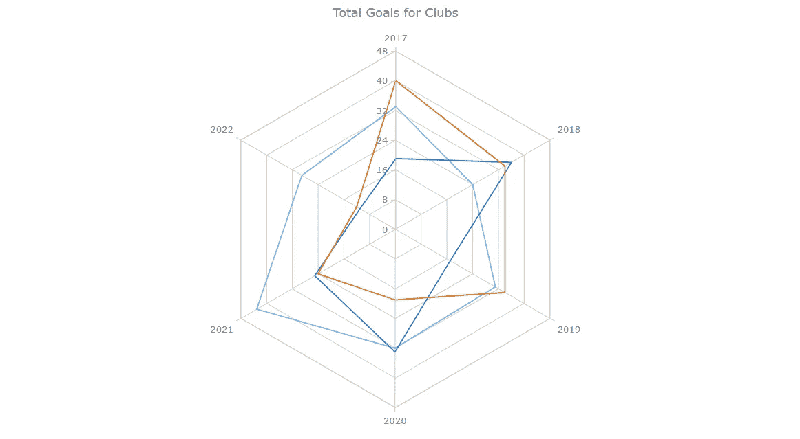
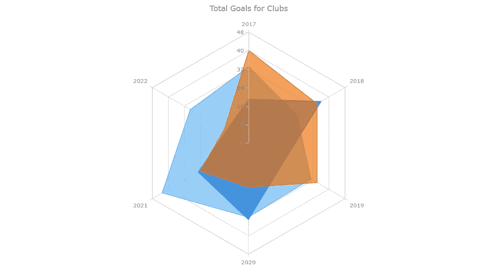
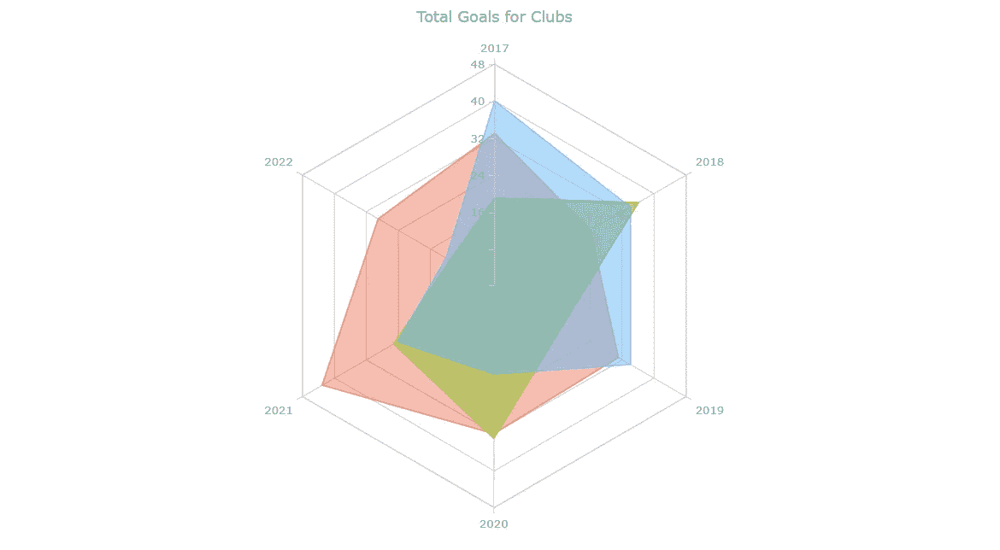
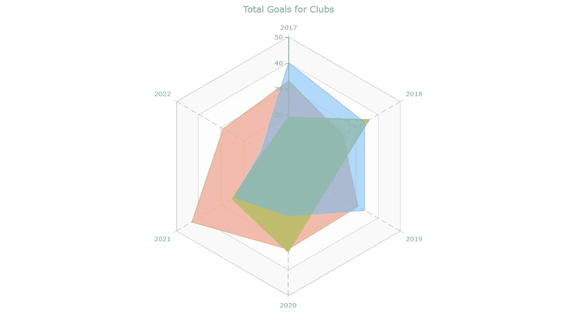
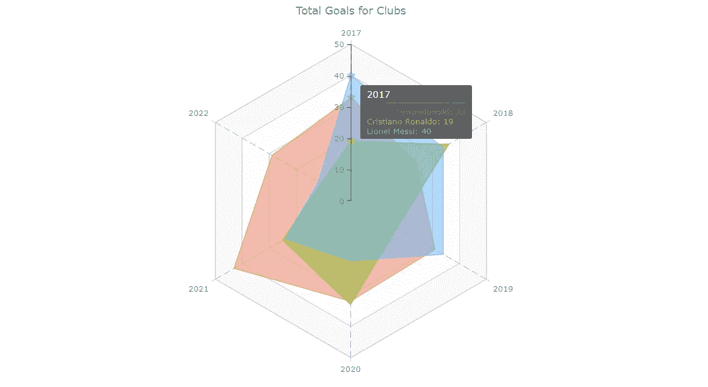
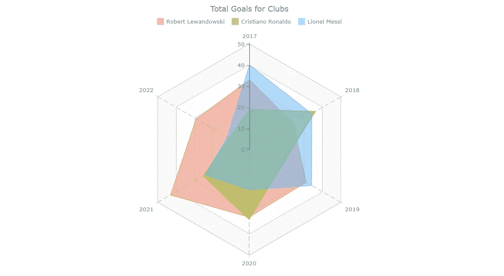

# 如何用 JavaScript 创建雷达图

> 原文：<https://javascript.plainenglish.io/how-to-create-a-radar-chart-in-javascript-c4dbeff44854?source=collection_archive---------12----------------------->



有各种各样的[数据可视化](https://www.anychart.com/blog/2018/11/20/data-visualization-definition-history-examples/)技术，旨在揭示仅凭数字无法揭示的洞见。在本教程中，我们将看到如何使用 JavaScript 轻松创建一个**雷达图**。这是一种用图形表示多个数量变量的多元数据的有效方法。

在 2022 年 FIFA 世界杯期间写这篇教程时，我忍不住拿了一些足球数据来做实际说明。这里一步一步构建和定制的 JS 雷达图示例将绘制三名顶级球员在过去六年中为各自俱乐部进球的数量:莱昂内尔·梅西、克里斯蒂亚诺·罗纳尔多和罗伯特·莱万多夫斯基。

开球的哨子吹响了，一切开始了！

# 构建 JS 雷达图

阅读完本教程后，您将能够轻松地构建自己的交互式、基于 JavaScript 的雷达图，适用于任何网页或应用程序。基本上，这个过程只有四个基本步骤:

*   创建一个 HTML 容器
*   包括必要的 JavaScript 文件
*   加载数据
*   写一些 JS 代码来画雷达图

## 1.创建一个 HTML 容器

创建一个基本的 HTML 页面或使用现有的页面。添加一个 HTML 块元素，`<div>`,它将包含您将要制作的图表，不要忘记为它提供一个惟一的 ID 属性，以便在接下来的 JS 图表代码中引用它。

在`<style>`块中添加一些 CSS 规则可以让你控制雷达图的显示方式。例如，如果将 width 和 height 属性设置为 100%,并将边距和填充设置为 0，则它将占用整个页面。

```
<!DOCTYPE html>
<html lang="en">
  <head>
    <meta charset="utf-8">
    <title>Radar Chart in JavaScript</title>
    <style type="text/css">      
      html, body, #container { 
        width: 100%; height: 100%; margin: 0; padding: 0; 
      } 
    </style>
  </head>
  <body>
    <div id="container"></div>
  </body>
</html>
```

## 2.包括必要的 JavaScript 文件

在`<head>`部分，包含将用于构建雷达图的 JS 脚本，这是使用`<head>`部分的`<script>`标签完成的。

在本教程中，我们将使用 [AnyChart JS Charts](https://www.anychart.com) ，这是一个健壮的、屡获殊荣的 JavaScript 图表库。它支持多种图表类型中的雷达图，提供预构建的功能来轻松创建它们，并且没有自定义限制。重要的是，AnyChart 有详细的[图表文档](https://docs.anychart.com/)和现成的[图表示例](https://www.anychart.com/products/anychart/gallery/)。

让我们从 CDN 获取 AnyChart 的 JS 文件。(或者，您可以下载它们。)构建雷达图需要库的核心和雷达[模块](https://docs.anychart.com/Quick_Start/Modules)。使用`<body>`部分中的`<script>`标签放置 JavaScript 代码。

```
<!DOCTYPE html>
<html lang="en">
  <head>
    <meta charset="utf-8">
    <title>Radar Chart in JavaScript</title>
    <script src="https://cdn.anychart.com/releases/8.11.0/js/anychart-core.min.js"></script>
    <script src="https://cdn.anychart.com/releases/8.11.0/js/anychart-radar.min.js"></script>
    <style type="text/css">      
      html, body, #container { 
        width: 100%; height: 100%; margin: 0; padding: 0; 
      } 
    </style>
  </head>
  <body>
    <div id="container"></div>
    <script>
      // Put your JS column charting code here.
    </script>
    </body>
</html>
```

# 3.设置数据

现在该准备数据了。正如我前面提到的，我们将可视化莱万多夫斯基，罗纳尔多和梅西从 2017 年到 2022 年为他们的俱乐部的总目标。

我已经从 [Transfermarkt](https://www.transfermarkt.com/spieler-statistik/jahrestorschuetzen/statistik/stat/plus/0/galerie/0?jahr=2021&compFilter=top5&monatVon=01&monatBis=12&altersklasse=&land_id=&ausrichtung=alle&spielerposition_id=alle&art=0) 获取了进球者统计数据，现在我们可以为我们的雷达图设置数据(查看所有可用的[数据格式](https://docs.anychart.com/Working_with_Data/Supported_Data_Formats)以了解在您的情况下什么是最好的):

```
var chartData = {
  header: ['#', 'Robert Lewandowski', 'Cristiano Ronaldo', 'Lionel Messi'],
  rows: [
    ['2017', 33, 19, 40],
    ['2018', 24, 36, 34],
    ['2019', 31, 17, 34],
    ['2020', 32, 33, 19],
    ['2021', 43, 25, 24],
    ['2022', 29, 11, 12]
  ]
};
```

这里，数据被设置为具有两个属性的对象。第一个是 header，它是玩家名字的数组。第二个是 rows，每个项目包括年份和每个球员的总进球数(以他们的名字在标题中出现的顺序相同)。例如，最后一行指定在 2022 年，罗伯特·莱万多夫斯基进了 29 个球，c 罗进了 11 个球，梅西进了 12 个球。

# 4.写一些 JS 代码来画雷达图

现在，网页已经准备好了，脚本也包括在内，数据也准备好了，让我们用一些 JS 代码来实现雷达图形可视化。

首先，添加`anychart.onDocumentReady()`函数，将图表的全部 JavaScript 代码包装在里面。

```
<script>
  anychart.onDocumentReady(function () {
    // The following JS radar chart code will be here.
  }
</script>
```

其次，添加数据(来自上一步)。

```
var chartData = {
  header: ['#', 'Robert Lewandowski', 'Cristiano Ronaldo', 'Lionel Messi'],
    rows: [
      ['2017', 33, 19, 40],
      ['2018', 24, 36, 34],
      ['2019', 31, 17, 34],
      ['2020', 32, 33, 19],
      ['2021', 43, 25, 24],
      ['2022', 29, 11, 12]
  ]
};
```

第三，使用`anychart.radar()`函数创建一个雷达图实例。

```
var chart = anychart.radar();
```

第四，将数据加载到雷达图上。

```
chart.data(chartData);
```

第五，酌情添加标题[图表标题](https://www.anychart.com/blog/2017/04/05/chart-captions-title-graph-tips/)是必须的。

```
chart.title("Total Goals for Clubs");
```

最后，通过引用步骤 1 中给 HTML 元素`<div>`的 ID，将图表放入容器中，并使用 draw()函数绘制图表。

```
chart.container('container');
chart.draw();
```

半场哨响！一个基本的基于 JS 的雷达图就做好了！



你可以在 [AnyChart 游乐场](https://playground.anychart.com/QgG47eVt)找到这个基础雷达图的互动版本。为了方便起见，完整的代码放在下面:

```
<!DOCTYPE html>
<html lang="en">
  <head>
    <meta charset="utf-8">
    <title>Radar Chart in JavaScript</title>
<script src="https://cdn.anychart.com/releases/8.11.0/js/anychart-core.min.js"></script>
<script src="https://cdn.anychart.com/releases/8.11.0/js/anychart-radar.min.js"></script>
    <style type="text/css">      
      html, body, #container { 
        width: 100%; 
        height: 100%; 
        margin: 0; 
        padding: 0; 
      } 
    </style>
  </head>
  <body>
    <div id="container"></div>
    <script>

      anychart.onDocumentReady(function () {

        // create a data set
        var chartData = {
        header: ['#', 'Robert Lewandowski', 'Cristiano Ronaldo', 'Lionel Messi'],
          rows: [
            ['2017', 33, 19, 40],
            ['2018', 24, 36, 34],
            ['2019', 31, 17, 34],
            ['2020', 32, 33, 19],
            ['2021', 43, 25, 24],
            ['2022', 29, 11, 12]
          ]
        };

        // create a radar chart
        var chart = anychart.radar();

        // set the chart data
        chart.data(chartData);

        // set the chart title
        chart.title("Total Goals for Clubs");

        // set the container id
        chart.container('container');

        // display the radar chart
        chart.draw();

      });

    </script>
  </body>
</html>
```

# 定制 JS 雷达图

基于 JavaScript 的基本雷达图看起来很棒。但是，让我继续谈谈你如何能做得更好。调整雷达图的各个方面很容易。我现在将演示一些有效的调整。

## A.更改系列类型

相信有了这个数据，雷达图用面积系列会更好看。可以在`defaultSeriesType()`功能的帮助下进行更改。

```
chart.defaultSeriesType('area');
```



## B.个性化颜色

现在让我们来个性化这个系列的颜色。最快的方法是通过向`palette()`函数传递颜色列表来引入自定义调色板。你可以随意选择自己喜欢的颜色。

```
chart.palette(['#E5593499', '#9BC53DE6', '#64B5F6BF']);
```



## C.自定义轴和网格的外观

JavaScript 雷达图的轴和网格的外观可以用几行代码来配置。

首先，让我们通过改变笔画的颜色来增强 Y 轴及其刻度的外观。

```
chart.yAxis().stroke('#545f69'); chart.yAxis().ticks().stroke('#545f69');
```

第二，刻度沿 Y 轴放置，间隔为 8，但为什么不设为 10 呢？

```
chart.yScale().ticks().interval(10);
```

第三，让我们使用自定义调色板来配置 Y 网格的外观。

```
chart.yGrid().palette(['gray 0.05', 'gray 0.025']);
```

第四，看看如何轻松地改变 X 网格线的颜色、粗细和纹理。

```
chart.xGrid().stroke({
  color: "#545f69",
  thickness: 0.5,
  dash: "10 5"
});
```



## D.修改悬停状态

当鼠标悬停在数据点上时，它会用标记突出显示。与此同时，工具提示显示了相应球员在相应年份的进球数。

为了提高雷达图的易读性，当鼠标悬停在同一年的三个数据点上时，突出显示这三个数据点似乎是个好主意…

```
chart.interactivity().hoverMode('by-x');
```

…并使工具提示一次显示所有球员的进球统计数据(让我们也使用 HTML 根据系列颜色自定义字体颜色)。

```
chart.tooltip()
  .displayMode('union')
  .useHtml(true)
  .format(function(e){
    console.log(this);
    return '<span style="color:' + this.series.color() + '">' + 
      this.seriesName + ": " + this.value + "</span>"
  });
```

另外，统一标志物形状会很棒。让它成为明星，就像我们谈论足球明星一样。

```
chart.markerPalette(['star5']);
```



## E.添加图例

最后再加上图表图例，绝对一目了然哪个系列在哪里。它只需要一行代码。

```
chart.legend().enabled(true);
```

终场哨响了！这是我们最终的 JavaScript 雷达图，完全可以嵌入到任何网站或应用程序中！



查看下面这个定制的 JS 雷达图的完整源代码，并在 [AnyChart 游乐场](https://playground.anychart.com/0mHmTg1K)上随意玩玩。

```
<!DOCTYPE html>
<html lang="en">
  <head>
    <meta charset="utf-8">
    <title>Radar Chart in JavaScript</title>
    <script src="https://cdn.anychart.com/releases/8.11.0/js/anychart-core.min.js"></script>
    <script src="https://cdn.anychart.com/releases/8.11.0/js/anychart-radar.min.js"></script>
    <style type="text/css">      
      html, body, #container { 
        width: 100%; 
        height: 100%; 
        margin: 0; 
        padding: 0; 
      } 
    </style>
  </head>
  <body>
    <div id="container"></div>
    <script>

      anychart.onDocumentReady(function () {

        // create a data set
        var chartData = {
          header: ['#', 'Robert Lewandowski', 'Cristiano Ronaldo', 'Lionel Messi'],
          rows: [
            ['2017', 33, 19, 40],
            ['2018', 24, 36, 34],
            ['2019', 31, 17, 34],
            ['2020', 32, 33, 19],
            ['2021', 43, 25, 24],
            ['2022', 29, 11, 12]
          ]
        };

        // create a radar chart
        var chart = anychart.radar();

        // set the series type
        chart.defaultSeriesType('area');

        // set the chart data
        chart.data(chartData);

        // set the color palette
        chart.palette(['#E5593499', '#9BC53DE6', '#64B5F6BF']);

        // configure the appearance of the y-axis
        chart.yAxis().stroke('#545f69');
        chart.yAxis().ticks().stroke('#545f69');

        // configure the stroke of the x-grid
        chart.xGrid().stroke({
          color: "#545f69",
          thickness: 0.5,
          dash: "10 5"
        });

        // configure the appearance of the y-grid
        chart.yGrid().palette(['gray 0.05', 'gray 0.025']);

        // begin the y-scale at 0
        chart.yScale().minimum(0);

        // set the y-scale ticks interval
        chart.yScale().ticks().interval(10);

        // set the hover mode
        chart.interactivity().hoverMode('by-x');

        //  set the marker type
        chart.markerPalette(['star5']);

        // improve the tooltip
        chart.tooltip()
          .displayMode('union')
          .useHtml(true)
          .format(function(e){
            console.log(this);
            return '<span style="color:' + this.series.color() + '">' + 
              this.seriesName + ": " + this.value + "</span>"
          });

        // set chart legend settings
        chart.legend()
          .align('center')
          .position('center-bottom')
          .enabled(true);

        // set the chart title
        chart.title("Total Goals for Clubs");

        // set container id for the chart
        chart.container('container');

        // initiate chart drawing
        chart.draw();

      });

    </script>
  </body>    
</html>
```

# 结论

恭喜你！你成功了。使用 JavaScript 制作雷达图的分步教程已经接近尾声。我很开心指导你走过不同的阶段。我希望我已经成功地教你用简单的步骤开发了一个网络雷达图。

现在，我相信你可以建立自己的雷达图，并赋予它你的个人风格。此外，还有许多其他有趣的图表类型。尝试一下，看看接下来你能想象出什么。

如果有任何困惑和疑问，你可以联系我，如果我能帮助你，我会很高兴。不断学习，不断探索！

***AnyChart 感谢 Awan Sretha 提供的这个精彩的雷达图教程！***

***不要错过我们博客上更多的 JavaScript 制图教程！***

你有一个很酷的客座博文的想法吗？ [***给我们降一行***](https://www.anychart.com/support/) ***让我们看看！***

*原载于 2022 年 12 月 23 日*[***anychart.com***](https://www.anychart.com/blog/2022/12/23/radar-chart-javascript/)*。*

*报名参加我们的* [***免费每周简讯***](http://newsletter.plainenglish.io/) *。关注我们* [***推特***](https://twitter.com/inPlainEngHQ) ，[***LinkedIn***](https://www.linkedin.com/company/inplainenglish/)*，*[***YouTube***](https://www.youtube.com/channel/UCtipWUghju290NWcn8jhyAw)*，* [***不和***](https://discord.gg/GtDtUAvyhW) ***。***

***有兴趣缩放你的软件启动*** *？检查* [***电路***](https://circuit.ooo?utm=publication-post-cta) *。*