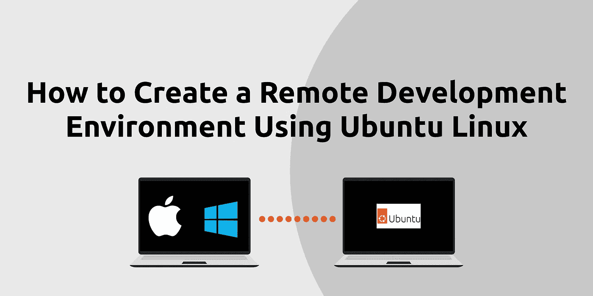

# 如何使用 Ubuntu Linux 创建远程开发环境

> 原文：<https://javascript.plainenglish.io/how-to-create-a-remote-development-environment-using-ubuntu-linux-bd256c3c735b?source=collection_archive---------2----------------------->



拥有您自己的本地 Linux 开发环境有很多好处，您可以从您的主机操作系统连接到该环境。因此，想象一个场景，假设您安装了 MacBook 和 macOS 作为您的主要操作系统。现在让我们假设你已经通过虚拟化工具安装了 Linux，比如 UTM 或 T2 的 Parallels，顺便提一下 T4，我写了一篇关于如何在苹果电脑上安装 Ubuntu Linux 的教程。

你可以使用安全外壳(SSH)从你的 Mac 操作系统连接到你的 Ubuntu 操作系统，这很酷。这将使你能够在你的控制台上做几乎任何事情，比如创建文件夹、设置项目、安装工具等。这相当于在 macOS 中使用你的控制台，所以你可以随意使用所有的命令，但现在是在你的 Ubuntu 设置中。

这是一个非常类似的设置，相当于使用 SSH 客户端连接到 Amazon AWS Linux 实例。但是这种方法的优点是 Linux 实例在您的本地计算机上，所以您不需要互联网连接就可以使用它。

这是一种很好的做法，它为您提供了一种使用付费云服务的选择。另一个好处是，甚至有一种方法可以通过互联网连接到你家的 Ubuntu 机器！因此，您有可能拥有自己的定制服务器，当然，您只需在离开房间之前打开电源，远程使用它即可！

# 将您的主操作系统连接到 Ubuntu Linux

# Ubuntu Linux SSH 设置

我们需要做的第一件事是登录我们的 Ubuntu Linux 操作系统。现在我们必须让 SSH 在我们的环境中工作。当第一次安装 Ubuntu Linux 时，通过 SSH 的远程访问在默认情况下是禁用的。在 Ubuntu Linux 中启用 SSH 是一个简单的过程。要在您的 Ubuntu Linux 系统上安装并启用 SSH，请以 root 用户或拥有 sudo 权限的用户的身份完成以下说明:

转到应用程序并打开终端现在更新和安装软件包，你看到如下。

```
sudo apt update
sudo apt install openssh-server
```

Ubuntu 有一个名为 UFW 的防火墙设置工具。如果您的系统有防火墙，请确保 SSH 端口是打开的。

```
sudo ufw allow ssh
```

安装完成后，SSH 服务将自动启动。您可以使用这段代码来检查 SSH 是否正在运行。

```
sudo systemctl status ssh
```

结果应该是一个输出，表明服务是活动的，并设置为在系统引导时启动，如下所示。

```
● ssh.service - OpenBSD Secure Shell server
     Loaded: loaded (/lib/systemd/system/ssh.service; enabled; vendor preset: e>
     Active: active (running) since Fri 2022-12-30 18:06:34 UTC; 1min 58s ago
       Docs: man:sshd(8)
             man:sshd_config(5)
    Process: 810 ExecStartPre=/usr/sbin/sshd -t (code=exited, status=0/SUCCESS)
   Main PID: 843 (sshd)
      Tasks: 1 (limit: 2236)
     Memory: 4.7M
        CPU: 34ms
     CGroup: /system.slice/ssh.service
             └─843 "sshd: /usr/sbin/sshd -D [listener] 0 of 10-100 startups"
```

完成了，你现在可以使用 SSH 从任何工作站连接到你的 Ubuntu 系统。任何 SSH 客户端工具都应该足够了，我在下面列出了几个。

[Visual Studio Code Remote—SSH](https://marketplace.visualstudio.com/items?itemName=ms-vscode-remote.remote-ssh)
ITER m2
[hyper](https://hyper.is/)
苹果终端(预装 OS)
Linux 终端(预装 OS)
[Windows 终端](https://apps.microsoft.com/store/detail/windows-terminal/9N0DX20HK701?hl=en-gb&gl=gb)
[PuTTY](https://www.putty.org/)

# 使用 SSH 连接到 Ubuntu Linux

现在是有趣的部分了！让我们从我们的主操作系统连接到 Ubuntu Linux。上面的任何工具都应该工作，但是我们将使用 Visual Studio Code Remote — SSH 扩展，因为我们将能够在 Visual Studio 代码中打开项目文件夹！我们还可以保存连接设置，这意味着我们不必每次都输入连接设置。

如果您还没有安装 Visual Studio Code Remote-SSH 扩展，请安装它。现在只有一个极其重要的步骤，我们必须先做。我们需要知道我们的 Ubuntu 电脑的 IP 地址，以便我们可以通过 LAN(局域网)连接到它。这个命令看起来很像这个`ssh username@ip_address`，你的 Ubuntu Linux 用户名和 IP 地址也是如此。见下面这个假例子。

```
linuxuser@12.3.4.56
```

要获得你的 IP 地址，在 Ubuntu Linux 中使用下面的命令。

```
ip a
```

在输出中寻找类似这样的内容。

```
# Output
inet 192.123.34.5/67

# Remove the slash and number at the end and use this one
inet 192.123.34.5

# The example SSH connection string replace with your details
ssh linuxuser@192.123.34.5
```

回到您的主操作系统，您可以做一个快速测试，看看 IP 地址是否可达。使用此处的代码 ping IP 地址，但根据您的情况将其更改为 IP 地址。如果您看到字节返回，并且没有说超时或类似的话，您就知道它在工作。

```
ping 192.123.34.5
```

好了，足够的测试，让我们现在连接它！最快的方法是将 SSH 连接代码放在命令行中，例如`ssh linuxuser@192.123.34.5`。输入 yes 并输入你的 Ubuntu Linux 安装的密码，安装完成后你就可以连接了！现在您可以使用所有常用的 BASH 命令了。

现在让我们尝试使用 Visual Studio Code Remote — SSH 扩展，这样您就可以访问代码编辑器中的任何文件夹。只需启动并运行它，然后输入相同的连接字符串。像以前一样输入您的密码，您应该在 Visual Studio 代码中连接。现在使用 Visual Studio 代码终端访问您的 Ubuntu Linux 操作系统。

如果你喜欢这篇文章，你可能也会喜欢我的帖子、推文和内容。如果你好奇，看看我的 [*社交媒体简介*](https://limey.io/andrewbaisden) *别忘了订阅和关注，因为我正在分享编程和激励资源和知识，以支持你实现你的目标💫*

*更多内容看* [***说白了。报名参加我们的***](https://plainenglish.io/) **[***免费周报***](http://newsletter.plainenglish.io/) *。关注我们关于* [***推特***](https://twitter.com/inPlainEngHQ) ，[***LinkedIn***](https://www.linkedin.com/company/inplainenglish/)*，*[***YouTube***](https://www.youtube.com/channel/UCtipWUghju290NWcn8jhyAw)*，以及* [***不和***](https://discord.gg/GtDtUAvyhW) ***。*****

***有兴趣缩放你的软件启动*** *？检查出* [***电路***](https://circuit.ooo/?utm=publication-post-cta) *。*