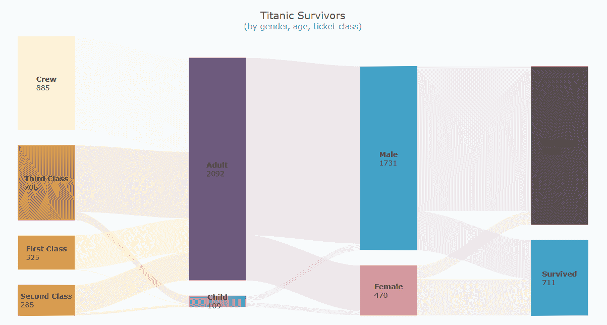
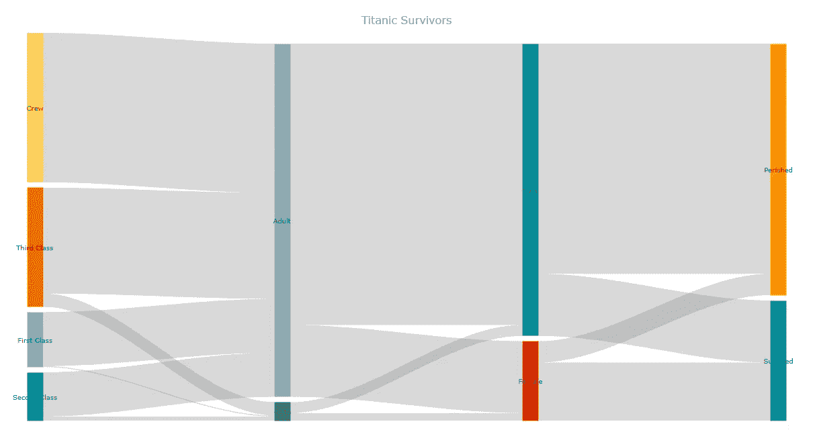
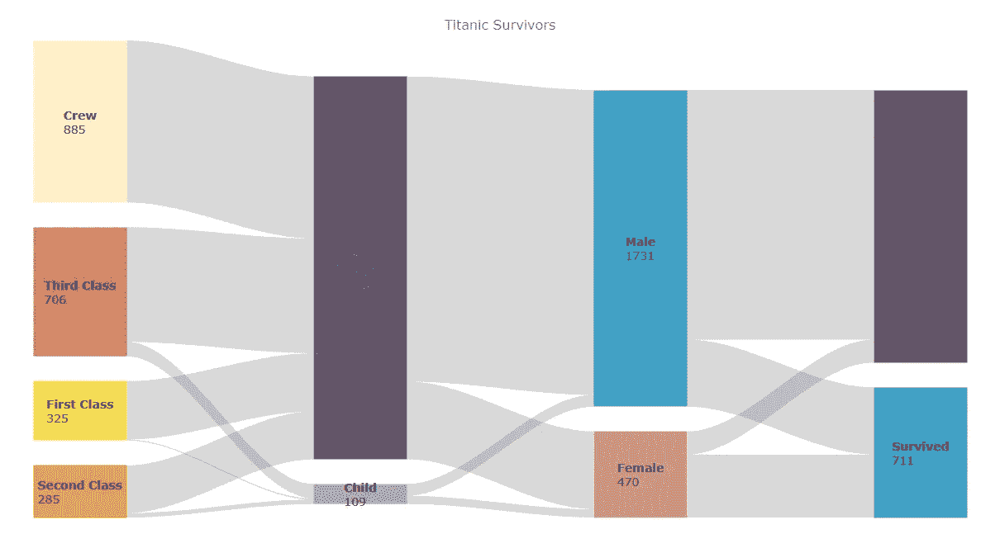
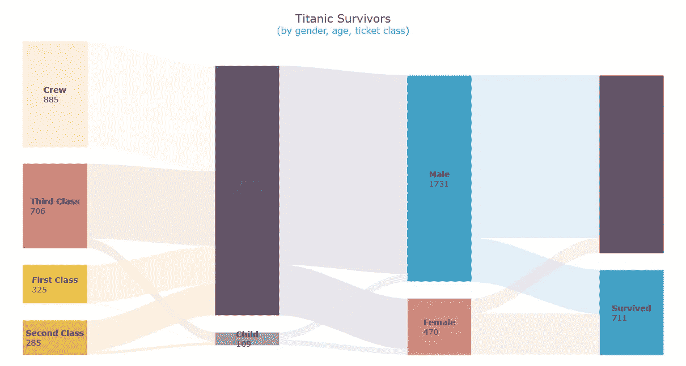

# 如何创建桑基图(用 JavaScript)

> 原文：<https://javascript.plainenglish.io/how-to-create-a-sankey-diagram-with-javascript-ca4fb8a66594?source=collection_archive---------15----------------------->


你想学习如何快速创建一个非常酷的图表，称为桑基图吗？你来对地方了！我们将一起使用 JavaScript 构建一个优雅的[桑基图表](https://www.anychart.com/chartopedia/chart-type/sankey-diagram/)，然后你将能够毫不费力地自己制作这样的数据可视化。

Sankey 图描述了值从一个集合到另一个集合的流动，当您需要图形化地表示两个域或多个阶段的多个路径之间的多对多映射时，它是理想的选择。因此，制作它们的能力将是处理[数据可视化](https://www.anychart.com/blog/2018/11/20/data-visualization-definition-history-examples/)设计和开发的任何人的技能集的一大补充。

在 1912 年 4 月 15 日沉没 110 年后,[泰坦尼克号](https://en.wikipedia.org/wiki/Titanic)仍然让我们着迷，激发着人们的想象力。现在，我们将使用 JS Sankey 图表技术来查看其乘客和机组人员，并根据性别、年龄和机票等级找出幸存者和遇难者。跟着走！

# 桑基图预览

看一看我们将在本教程结束时构建的 Sankey 图:



现在，旅程开始了——继续阅读，了解如何使用纯 JavaScript 构建这样的桑基图！

# 构建一个基本的 JS 桑基图

Sankey 图看起来非常令人兴奋，并且很容易用 JS 创建。web 技术的一些基本知识在交互式数据可视化中总是有益的。但在现实中，一切都不复杂，即使你是初学者，你也会明白这一切。

创建基于 JavaScript 的 Sankey 图的过程可以分为四个步骤:

1.  创建一个 HTML 页面。
2.  添加脚本。
3.  设置数据。
4.  写一些 JS 代码。

让我们一起来过一遍。

## 1.创建 HTML 页面

首先，创建一个基本的 HTML 页面来保存预期的 Sankey 图表，并在其中定义一个 block 元素。

为了在后面的代码中引用这个`<div>`，给它一个标识属性(在这个例子中是“container”)并设置所需的样式属性(这里，宽度和高度是 100%，这将让图表伸展到整个 web 页面)。

```
<html>
  <head>
    <title>JavaScript Sankey Diagram</title>
    <style type="text/css">      
      html, body, #container { 
        width: 100%; height: 100%; margin: 0; padding: 0; 
      } 
    </style>
  </head>
  <body>
    <div id="container"></div>
  </body>
</html>
```

## 2.添加脚本

下一步是添加必要的脚本。

在本教程中，我使用的是 [AnyChart JavaScript 库](https://www.anychart.com)。由于其全面的[文档](https://docs.anychart.com/)以及许多现成的[图表示例](https://www.anychart.com/products/anychart/gallery/)，它非常灵活且易于使用。

AnyChart 是模块化的，它允许您通过连接您实际需要的图表类型和特性来最小化在您的网页上运行的 JavaScript 代码的大小，仅此而已。对于桑基图表开发，您只需要[核心模块](https://docs.anychart.com/Quick_Start/Modules#core)以及特定的[桑基模块](https://docs.anychart.com/Quick_Start/Modules#sankey_diagram)。将两者都添加到 HTML 页面的`<head>`部分。

```
<html>
  <head>
    <title>JavaScript Sankey Diagram</title>
    <script src="https://cdn.anychart.com/releases/8.11.0/js/anychart-core.min.js"></script>
    <script src="https://cdn.anychart.com/releases/8.11.0/js/anychart-sankey.min.js"></script>
    <style type="text/css">      
      html, body, #container { 
        width: 100%; height: 100%; margin: 0; padding: 0; 
      } 
    </style>
  </head>
  <body>  
    <div id="container"></div>
    <script>
 ***// All the code for the JS Sankey Diagram will come here.***    </script>
  </body>
</html>
```

## 3.设置数据

本教程的数据取自 Kaggle 上的[泰坦尼克号数据集](https://www.kaggle.com/datasets/ibrahimelsayed182/titanic-dataset)。我只是把它放在一个适合桑基图的形式中。

数据集并不大，可以就这样直接添加到代码中。(当然，对于特定的任务，你可以选择另一种方式[处理数据](https://docs.anychart.com/Working_with_Data/Overview)。)

```
const data = [
  {from: 'First Class', to: 'Child', value: 6},
  {from: 'Second Class', to: 'Child', value: 24},
  {from: 'Third Class', to: 'Child', value: 79},
  {from: 'Crew', to: 'Child', value: 0},
  {from: 'First Class', to: 'Adult', value: 319},
  {from: 'Second Class', to: 'Adult', value: 261},
  {from: 'Third Class', to: 'Adult', value: 627},
  {from: 'Crew', to: 'Adult', value: 885},
  {from: 'Child', to: 'Female', value: 45},
  {from: 'Child', to: 'Male', value: 64},
  {from: 'Adult', to: 'Female', value: 425},
  {from: 'Adult', to: 'Male', value: 1667},
  {from: 'Female', to: 'Survived', value: 344},
  {from: 'Female', to: 'Perished', value: 126},
  {from: 'Male', to: 'Survived', value: 367},
  {from: 'Male', to: 'Perished', value: 1364},
]
```

好了，大家都准备好了，现在是时候通过编写几行 JS 图表代码扬帆起航了！

## 4.写一些 JS 代码

如果你没有太多的编写代码的经验，你可能会觉得很难。但是对于一个优雅的 Sankey 图，一些非常简单的基本代码就足够了。

在做任何事情之前，添加包含所有代码的`anychart.onDocumentReady()`函数，这确保了只有当页面准备就绪时，其中的所有内容才会运行。里面首先要补充的是数据。

```
anychart.onDocumentReady(function () { ***// add data***  const data = [
    {from: 'First Class', to: 'Child', value: 6},
    {from: 'Second Class', to: 'Child', value: 24},
    {from: 'Third Class', to: 'Child', value: 79},
    {from: 'Crew', to: 'Child', value: 0},
    {from: 'First Class', to: 'Adult', value: 319},
    {from: 'Second Class', to: 'Adult', value: 261},
    {from: 'Third Class', to: 'Adult', value: 627},
    {from: 'Crew', to: 'Adult', value: 885},
    {from: 'Child', to: 'Female', value: 45},
    {from: 'Child', to: 'Male', value: 64},
    {from: 'Adult', to: 'Female', value: 425},
    {from: 'Adult', to: 'Male', value: 1667},
    {from: 'Female', to: 'Survived', value: 344},
    {from: 'Female', to: 'Perished', value: 126},
    {from: 'Male', to: 'Survived', value: 367},
    {from: 'Male', to: 'Perished', value: 1364},
  ] ***// everything else goes here*** 
});
```

现在，使用内置的图表功能创建一个 Sankey diagram 实例并加载数据。

```
let chart = anychart.sankey();
chart.data(data);
```

一些填充可以确保标签不会被剪掉，图表标题总是很有帮助。

```
chart.padding(20, 40);  
chart.title('Titanic Survivors');
```

最后，只需引用容器元素来显示 Sankey 图表需要显示的位置，并绘制结果可视化。

```
chart.container('container');
chart.draw();
```

瞧啊。一个奇妙而实用的基于 JavaScript 的 Sankey 图已经准备好了！



看看这个在 AnyChart Playground 上的初始 JS Sankey 图表，其中有完整的 JS/CSS/HTML 代码(为了方便起见，也在下面提供)。

```
<html>
  <head>
    <title>JavaScript Sankey Diagram</title>
    <script src="https://cdn.anychart.com/releases/8.11.0/js/anychart-core.min.js"></script>
    <script src="https://cdn.anychart.com/releases/8.11.0/js/anychart-sankey.min.js"></script>
    <style type="text/css">      
      html, body, #container { 
        width: 100%; height: 100%; margin: 0; padding: 0; 
      } 
    </style>
  </head>
  <body>  
    <div id="container"></div>
    <script>
      anychart.onDocumentReady(function () {

 ***// add data***        const data = [
          {from: "First Class", to: "Child", value: 6},
          {from: "Second Class", to: "Child", value: 24},
          {from: "Third Class", to: "Child", value: 79},
          {from: "Crew", to: "Child", value: 0},
          {from: "First Class", to: "Adult", value: 319},
          {from: "Second Class", to: "Adult", value: 261},
          {from: "Third Class", to: "Adult", value: 627},
          {from: "Crew", to: "Adult", value: 885},
          {from: "Child", to: "Female", value: 45},
          {from: "Child", to: "Male", value: 64},
          {from: "Adult", to: "Female", value: 425},
          {from: "Adult", to: "Male", value: 1667},
          {from: "Female", to: "Survived", value: 344},
          {from: "Female", to: "Perished", value: 126},
          {from: "Male", to: "Survived", value: 367},
          {from: "Male", to: "Perished", value: 1364}
        ];

 ***// create a sankey diagram instance***        let chart = anychart.sankey(); ***// load the data to the sankey diagram instance***        chart.data(data); ***// set the chart's padding***        chart.padding(20, 40);

 ***// add a title***        chart.title('Titanic Survivors');

 ***// set the chart container id***        chart.container("container"); ***// draw the chart***        chart.draw();

      });
    </script>
  </body>
</html>
```

# 自定义 JavaScript 桑基图

使用健壮的 JS 图表库的一个巨大优势是创建初始数据可视化的简易性和进一步定制的灵活性。让我们看看如何增强 Sankey 图的功能，并通过一些简单的修改来调整它的外观。

## 1.调色板

首先，为什么不添加比默认颜色看起来更直观的颜色呢？您可以通过简单地列出您想要的颜色来创建自己的调色板。添加颜色时要注意顺序。

```
chart.palette([
  "#f5dc50",
  "#e1a03c",
  "#c87d5a",
  "#fff0c8",
  "#aa96b4",
  "#6e5a7d",
  "#e19196",
  "#419bd2",
  "#46afaa",
  "#5a5050"
]);
```

## 2.节点

现在你已经有了一个个性化的调色板，让我们增加节点的宽度，使它们更加突出。对于较大的节点，还可以在它们之间进行更大的填充。

```
chart.nodeWidth("40%");
chart.nodePadding(30);
```

更大的标签可能看起来也更好。另外，对于每个节点，您可以显示数据中相应的值，并利用 HTML 来格式化文本。

```
chart.node().normal().labels().fontSize(14);
chart.node().labels().useHtml(true);
chart
  .node()
  .labels()
  .format("<span style='font-weight:bold'>{%name}</span><br>{%value}");
```



在 [AnyChart 游乐场](https://playground.anychart.com/2NjCcNFk)上看看这个定制的基于 JavaScript 的 Sankey 图的代码。

## 3.链接

现在是时候增强链接的外观了。让我们用和它们的源节点一样的颜色来给它们着色。此外，当鼠标悬停在链接上时，链接会显得稍微暗一些。

```
chart.flow({
  normal: {
    fill: function () {
      return anychart.color.lighten(this.sourceColor, 0.5) + " " + 0.3;
    }
  },
  hovered: {
    fill: function () {
      return this.sourceColor + " " + 0.8;
    }
  }
});
```

悬停在一个节点或一个链接上会触发一个工具提示，它甚至不需要修改，因为它非常有用，默认情况下看起来很好。

## 4.标题

对于最后的定制，让我们应用基于 HTML 的格式来突出标题，并添加一个副标题来更清楚地说明 Sankey 图可视化的内容。

```
chart
  .title()
  .enabled(true)
  .useHtml(true)
  .text(
    '<span style = "color: #2b2b2b; font-size:20px;">Titanic Survivors</span>' +
      '<br/><span style="color:#00bfa5; font-size: 16px;">(by gender, age, ticket class)</span>'
  );
```

仅此而已！现在桑基图看起来非常个性化和迷人，不是吗？



查看下面的交互式 JavaScript Sankey 图的最终代码，并在 [AnyChart 游乐场](https://playground.anychart.com/fiKvNzuZ)上玩得开心。

```
<html>
  <head>
    <title>JavaScript Sankey Diagram</title>
    <script src="https://cdn.anychart.com/releases/8.11.0/js/anychart-core.min.js"></script>
    <script src="https://cdn.anychart.com/releases/8.11.0/js/anychart-sankey.min.js"></script>
    <style type="text/css">      
      html, body, #container { 
        width: 100%; height: 100%; margin: 0; padding: 0; 
      } 
    </style>
  </head>
  <body>  
    <div id="container"></div>
    <script>
      anychart.onDocumentReady(function () {

 ***// add data***        const data = [
          {from: "First Class", to: "Child", value: 6},
          {from: "Second Class", to: "Child", value: 24},
          {from: "Third Class", to: "Child", value: 79},
          {from: "Crew", to: "Child", value: 0},
          {from: "First Class", to: "Adult", value: 319},
          {from: "Second Class", to: "Adult", value: 261},
          {from: "Third Class", to: "Adult", value: 627},
          {from: "Crew", to: "Adult", value: 885},
          {from: "Child", to: "Female", value: 45},
          {from: "Child", to: "Male", value: 64},
          {from: "Adult", to: "Female", value: 425},
          {from: "Adult", to: "Male", value: 1667},
          {from: "Female", to: "Survived", value: 344},
          {from: "Female", to: "Perished", value: 126},
          {from: "Male", to: "Survived", value: 367},
          {from: "Male", to: "Perished", value: 1364}
        ];

 ***// create a sankey diagram instance***        let chart = anychart.sankey(); ***// load the data to the sankey diagram instance***        chart.data(data); ***// set the chart's padding***        chart.padding(20, 40); ***// configure a custom color palette***        chart.palette([
          "#f5dc50",
          "#e1a03c",
          "#c87d5a",
          "#fff0c8",
          "#aa96b4",
          "#6e5a7d",
          "#e19196",
          "#419bd2",
          "#46afaa",
          "#5a5050"
        ]);

 ***// customize the nodes:
        // set the width***        chart.nodeWidth("40%");
 ***// set the padding***        chart.nodePadding(30);
 ***// customize the labels***        chart.node().normal().labels().fontSize(14);
        chart.node().labels().useHtml(true);
        chart
          .node()
          .labels()
          .format("<span style='font-weight:bold'>{%name}</span><br>{%value}"); ***// customize the links***        chart.flow({
          normal: {
            fill: function () {
              return anychart.color.lighten(this.sourceColor, 0.5) + " " + 0.3;
            }
          },
          hovered: {
            fill: function () {
              return this.sourceColor + " " + 0.8;
            }
          }
        }); ***// add a title and customize it***        chart
          .title()
          .enabled(true)
          .useHtml(true)
          .text(
            '<span style = "color: #2b2b2b; font-size:20px;">Titanic Survivors</span>' +
              '<br/><span style="color:#00bfa5; font-size: 16px;">(by gender, age, ticket class)</span>'
          );

 ***// set the chart container id***        chart.container("container"); ***// draw the chart***        chart.draw();

      });
    </script>
  </body>
</html>
```

# 结论

桑基是如此迷人的图表类型。创造一个美丽的是如此简单！

实际上，这只是冰山一角，所以继续下去，看看更多的桑基图的[示例，并查看](https://www.anychart.com/products/anychart/gallery/Sankey_Diagram)[桑基图文档](https://docs.anychart.com/Basic_Charts/Sankey_Diagram)来学习如何做一些关于它们的其他事情。此外，请随意查看其他图表类型。

如有任何疑问或建议，请与我们联系。

AnyChart 的团队感谢数据设计师 Shachee Swadia 创建了这个伟大的 Sankey 图解教程。

***如果你想写一篇很酷的客座博文，请将你的想法发送到我们的*** [***支持团队***](https://www.anychart.com/support/) ***。***

***查看我们博客上更多***[***JavaScript 制图教程***](https://www.anychart.com/blog/category/javascript-chart-tutorials/) ***。***

*原载于 2022 年 5 月 25 日 https://www.anychart.com*[](https://www.anychart.com/blog/2022/05/25/sankey-diagram-js/)**。**

**更多内容看* [***说白了。报名参加我们的***](https://plainenglish.io/) **[***免费周报***](http://newsletter.plainenglish.io/) *。关注我们关于*[***Twitter***](https://twitter.com/inPlainEngHQ)*和*[***LinkedIn***](https://www.linkedin.com/company/inplainenglish/)*。查看我们的* [***社区不和谐***](https://discord.gg/GtDtUAvyhW) *加入我们的* [***人才集体***](https://inplainenglish.pallet.com/talent/welcome) *。****