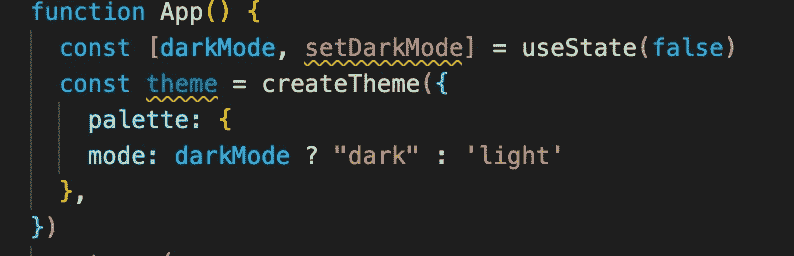

# 如何使用 Material-UI 为 React 应用程序创建一个简单的黑暗模式切换

> 原文：<https://javascript.plainenglish.io/how-to-create-a-simple-dark-mode-toggle-for-your-react-application-with-material-ui-108dcfded095?source=collection_archive---------2----------------------->

## 使用 Material-UI 为 React 应用程序创建一个简单的黑暗模式切换的指南。


似乎现在每个网站都有黑暗模式功能。拥有一个光滑的深色用户界面不仅在美学上令人愉悦，而且黑暗模式爱好者还宣传了一系列其他好处，从减轻眼睛疲劳和减少电池使用到提高用户的阅读理解能力。本文的重点将是使用[材质 UI](https://mui.com/) 设计一个非常简单的黑暗模式切换。

出于本教程的目的，我已经创建了一个非常基本的应用程序，只有两个卡片组件，当然，上面有狗。


第一步是安装材料 UI 的 npm 包，可以使用:

```
npm install [@mui/material](http://twitter.com/mui/material) [@emotion/react](http://twitter.com/emotion/react) [@emotion/styled](http://twitter.com/emotion/styled)
```

一旦它完成了将下列导入直接定义到 App.js 文件中:


ThemeProvider 是一个材质 UI 组件，它允许我们用新主题包装整个应用程序，这将使用 createTheme 函数来完成。这里我还导入了 useState 钩子来创建切换方面。

下一步是创建将在我们的页面上显示的主题，在本例中是黑暗模式。createTheme 接受一个对象的值，除了颜色之外，还有许多不同的属性可以在这里定义，但是开发人员方便地添加了包括黑暗模式的能力，只需将嵌套在“调色板”对象中的模式键设置为“黑暗”此外，如下所示，我创建了一个名为 darkMode 的状态，并将其设置为 false。



最终，上面发生的事情是，主题常量被设置为一个创建的主题，如果我们的黑暗模式状态为真，则模式被设置为“黑暗”，如果为假，则模式被设置为“光明”。

接下来，我们需要将组件包装在 ThemeProvider 组件中。然而，主题不能直接应用于 React 组件，它们必须应用于一个具体的 UI 组件，所以为了我们的目的，我们将使用 Paper。添加纸张导入，并用这些组件包装退货。将之前创建的主题状态作为主题道具添加到 ThemeProvider 组件中。


最后一步是添加我们的按钮，并让该按钮调用前面创建的 setDarkMode 函数。


给按钮添加一些文本，使其易于识别，单击它，然后…


你的页面现在有黑暗模式！但是，按钮有点丑。让我们使用材质界面使它更好一点。通过运行以下命令安装材质 UI 图标包:

```
npm i @mui/icons-material
```

对于任何引起你兴趣的图标，我喜欢使用亮度 7 和亮度 4。您还需要从 material UI 导入 IconButton 组件。创建一个三元表达式来确定显示哪个组件，并用 IconButton 组件替换前面创建的按钮。


有了这个，你现在有了一个按钮，可以根据主题设置为哪种模式来更改图标。如果您喜欢这个过程的工作方式，我强烈建议您查看 material UI 的文档，了解可以更改应用程序主题的其他方法，以及它们库中的其他有用组件。

*更物在* [***通俗地说就是***](http://plainenglish.io/) *。报名参加我们的* [***免费周报***](http://newsletter.plainenglish.io/) *。在我们的* [***社区纠纷***](https://discord.gg/GtDtUAvyhW) *获得独家写作机会和建议。*