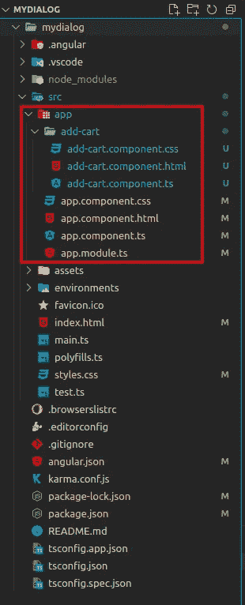
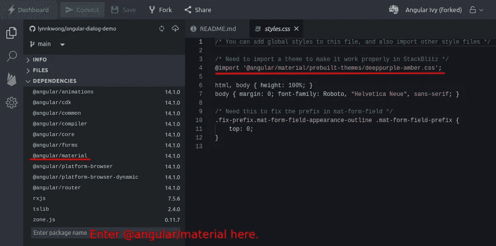
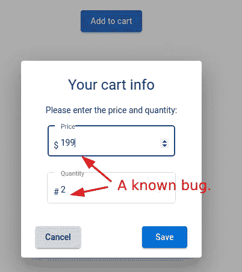
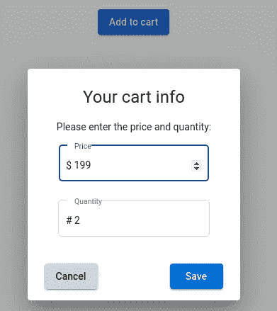

# 如何创建一个简单的对话框

> 原文：<https://javascript.plainenglish.io/how-to-create-a-simple-dialog-box-with-angular-material-8cd68440ddd1?source=collection_archive---------3----------------------->

## 你不必成为一个 CSS 大师来创建漂亮的对话框。


[Image by geralt in Pixabay](https://pixabay.com/illustrations/silhouettes-person-human-man-woman-776670/)

在 web 应用程序中，对话框是与用户交互的方便工具。如果使用得当，它可以吸引用户的注意力，并使你的网页看起来整洁。如果你想从头开始创建一个对话框，这需要一些高级的 CSS 知识。然而，使用 Angular 这样的框架，创建对话框是一项非常简单的任务，即使对于不是 CSS 专家的人来说也是如此。在这篇文章中，我们将演示如何用 Angular 创建一个简单的对话框。所有的细节以及一些注意事项都包括在内，这对你的实际工作会有帮助。

## 准备

如果你还没有安装 Angular CLI，你可能想看看[这个指南](https://angular.io/cli)。首先，您需要安装 [node.js](https://nodejs.org/en/) ，因为我们需要使用 [npm 工具](https://nodejs.org/en/knowledge/getting-started/npm/what-is-npm/)来安装 [Angular CLI](https://angular.io/cli#installing-angular-cli) 。

```
$ npm install -g [@angular/cli](http://twitter.com/angular/cli)
```

或者，如果您不想在本地完成，您可以在 [StackBlitz](https://stackblitz.com/) 中创建项目。

## 创建所需的工作空间和组件

角度应用是在角度工作空间的背景下开发的。我们需要首先创建一个:

```
$ ng new mydialog
```

工作区基本上是一个包含各种样板代码的项目文件夹。目前，您还不需要检查代码。如果您使用 StackBlitz，当您选择 Angular 框架时，默认情况下会为您创建一个工作空间。

将为我们创建一个默认的`NgModule` ( `AppModule`)，它包括应用程序的模块、组件、服务等。此外，还创建了一个默认组件(`AppComponent`)，作为应用程序的入口点。

我们需要创建一个新组件来处理对话框的逻辑:

```
$ ng generate component add-cart
```

将在新组件(`AddCartComponent`)的`app`文件夹内创建一个新文件夹，其中包括该组件的文件。



不要被这里显示的大量文件吓到，我们通常只关注上面显示的红框中的文件。

## 安装角形材料

在这篇文章中，我们将关注功能和数据逻辑，而不是样式。尽管如此，我们将使用[棱角分明的材料](https://material.angular.io/)来赋予我们的按钮和输入表单一些易于应用的漂亮样式。最重要的是，我们将使用`MatDialog`服务打开带有材质设计风格和动画的模态对话框。

要在您的项目中安装 Angular materiall，请使用 Angular CLI 运行以下命令:

```
$ ng add [@angular/material](http://twitter.com/angular/material)
```

在安装过程中，我们可以保留默认选择。您的项目文件如`package.json`、`index.html`和`styles.css`将自动更新以应用角度材质样式。

在 StackBlitz 中，我们需要添加角度材料的依赖关系:



按照上图所示的说明添加角度材料的依赖性。此外，我们需要在`[styles.css](https://github.com/lynnkwong/angular-dialog-demo/blob/main/src/styles.css)`中导入一个主题，让棱角分明的材质在 StackBlitz 中正常工作。

## 导入角度材料模块

在上一步中，Angular CLI 仅设置角度材料的全局配置。我们需要手动导入将在`app.module.ts`的应用程序中使用的模块:

## 创建一个按钮来触发对话框

首先，我们需要创建一些可以作为打开对话框的触发器的东西。在这种情况下，最好使用[按钮](https://material.angular.io/components/button/overview)。

在`app.component.html`中添加以下代码来创建按钮。此外，一旦对话框关闭，我们还将显示购物车数据。

数据逻辑包含在模型文件`app.compnent.ts`中:

代码应该是不言自明的，尤其是带有注释的代码。它可能看起来很简单，但是如果你想让它正常工作，没有错误，你需要非常小心所有的细节。这是我的第一篇前端帖子，我发现它比数据或后端帖子更难写😅。尽管如此，这篇文章还是包含了一些对你的工作有帮助的技巧，尤其是当你从后端切换到前端的时候。它可以用从实际项目中学到的一些实践经验来补充官方文档。

如果你想要这个例子中显示的精确样式，你需要写一些 CSS 代码，可以在[这个 repo](https://github.com/lynnkwong/angular-dialog-demo/blob/main/src/app/app.component.css) 中找到。

## 更新对话框模型和寺庙文件

让我们首先创建模型文件，它比模板文件简单。将以下代码添加到`add-cart.component.ts`:

这里值得一提的是，我们可以使用`@Inject(MAT_DIALOG_DATA)`语法将一些数据注入对话框组件。数据从打开对话框的组件中传递，如上所示，使用`data`配置。

而且模板文件稍微复杂一点，需要一些角和角材的基础知识，特别是 [mat-form-field](https://material.angular.io/components/form-field/overview) 和 [MatDialog](https://material.angular.io/components/dialog/overview) ，还有[模板驱动的表单](https://angular.io/guide/forms)。

同样，如果您想要获得本例中所示的精确样式，您需要编写一些 CSS 代码，这些代码可以在[本报告](https://github.com/lynnkwong/angular-dialog-demo/blob/main/src/app/add-cart/add-cart.component.css)中找到。

## 启动应用程序并修复一个烦人的 bug

实际上，我们可以也应该在开发阶段的最开始就加速应用程序的运行，这样你就可以实时看到结果并修复错误。

我们可以使用以下命令加速应用程序:

```
$ ng serve --open
```

浏览器会自动为您打开。当您点击“添加到购物车”按钮时，您将看到如下对话框:



正如我们看到的，输入框和前缀没有正确对齐。这是[一个已知的错误](https://github.com/angular/components/issues/12803)，应该被明确地修复。我们需要将下面的 CSS 代码添加到 ***全局*** 样式表`[styles.css](https://github.com/lynnkwong/angular-dialog-demo/blob/main/src/styles.css)`中:

然后我们需要将`fix-prefix` CSS 类添加到`mat-form-field`中，并为输入框添加一个前缀:

现在，应用程序应该看起来不错，正确的，干杯！



强烈建议你在本地下载这篇文章的回购协议，或者在 stack blitz 中使用 T2 现有的回购协议，以便更好地理解代码。试着改变代码，破坏它，然后修复它。当你开始编码时，你将学到比仅仅阅读文档或视频更多的东西。

*更多内容看* [***说白了就是***](https://plainenglish.io/) *。报名参加我们的* [***免费周报***](http://newsletter.plainenglish.io/) *。关注我们关于*[***Twitter***](https://twitter.com/inPlainEngHQ)*和*[***LinkedIn***](https://www.linkedin.com/company/inplainenglish/)*。查看我们的* [***社区不和谐***](https://discord.gg/GtDtUAvyhW) *加入我们的* [***人才集体***](https://inplainenglish.pallet.com/talent/welcome) *。*