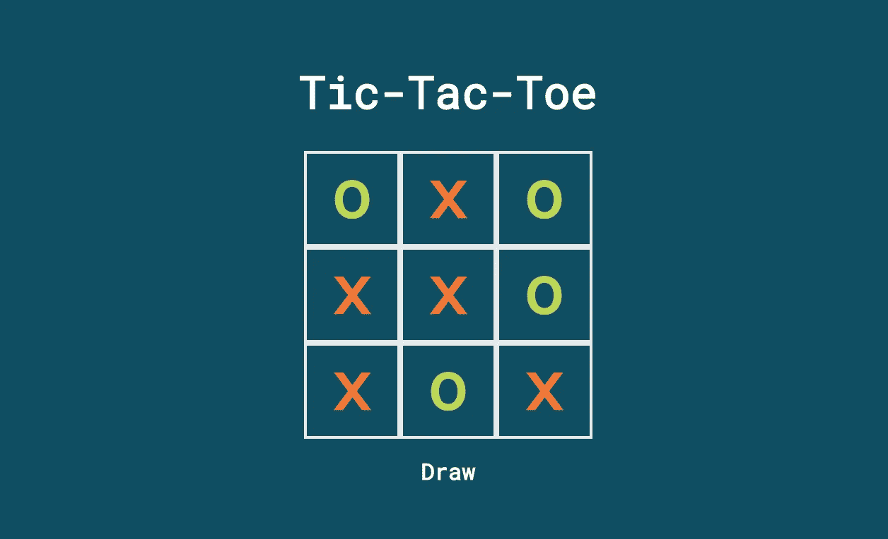
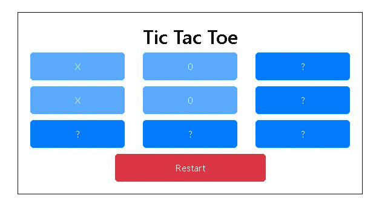

# 如何使用 JavaScript 创建一个简单的井字游戏

> 原文：<https://javascript.plainenglish.io/how-to-create-a-simple-tic-tac-toe-game-using-javascript-7bdb139d33c2?source=collection_archive---------14----------------------->

用 JavaScript 在 20 分钟内创建一个井字游戏。



Source: Google

在本教程中，我将展示如何通过几个步骤用 JavaScript 创建一个井字游戏。

在开始本教程之前，我们假设你已经很好地理解了基本的 Html、CSS 和 JavaScript。

本教程以一种非常简单的方式展示了如何创建井字游戏第二步。这个游戏只用前端构建，没有使用数据库。

首先创建一个***【index.html】***文件，在其中设置游戏的基本结构。

```
<!DOCTYPE html>
<html>
 <head>
 <link
 rel=”stylesheet”
 href=”[https://stackpath.bootstrapcdn.com/bootstrap/4.5.0/css/bootstrap.min.css](https://stackpath.bootstrapcdn.com/bootstrap/4.5.0/css/bootstrap.min.css)"
 integrity=”sha384–9aIt2nRpC12Uk9gS9baDl411NQApFmC26EwAOH8WgZl5MYYxFfc+NcPb1dKGj7Sk”
 crossorigin=”anonymous”
 />
 <link href=”./style.css” rel=”stylesheet” />
 <style></style>
 </head>
 <body style=”margin: 0px;”>
 <h1 class=”text-center” style=”margin-top: 20px; margin-bottom: 50px;”>
 Codingelements
 </h1>
 <div class=”container”>

 <div class=”row” style=”margin-top: 50px; margin-bottom: 50px;”>
 <div
 class=”col-sm-6 offset-sm-3"
 style=”border: 1px solid black; padding: 20px;”
 >
 <h2 class=”text-center”>Tic Tac Toe</h2>
 <div>
 <div class=”row” style=”margin-bottom: 10px;”>
 <div class=”col-sm-4">
 <button
 id=”1"
 style=”width: 100%;”
 class=”btn btn-primary”
 onclick=”game(event)”
 >
 ?
 </button>
 </div>
 <div class=”col-sm-4">
 <button
 style=”width: 100%;”
 class=”btn btn-primary”
 onclick=”game(event)”
 id=”2"
 >
 ?
 </button>
 </div>
 <div class=”col-sm-4">
 <button
 style=”width: 100%;”
 class=”btn btn-primary”
 onclick=”game(event)”
 id=”3"
 >
 ?
 </button>
 </div>
 </div>
 <div class=”row” style=”margin-bottom: 10px;”>
 <div class=”col-sm-4">
 <button
 style=”width: 100%;”
 class=”btn btn-primary”
 onclick=”game(event)”
 id=”4"
 >
 ?
 </button>
 </div>
 <div class=”col-sm-4">
 <button
 style=”width: 100%;”
 class=”btn btn-primary”
 onclick=”game(event)”
 id=”5"
 >
 ?
 </button>
 </div>
 <div class=”col-sm-4">
 <button
 style=”width: 100%;”
 class=”btn btn-primary”
 onclick=”game(event)”
 id=”6"
 >
 ?
 </button>
 </div>
 </div>
 <div class=”row” style=”margin-bottom: 10px;”>
 <div class=”col-sm-4">
 <button
 style=”width: 100%;”
 class=”btn btn-primary”
 onclick=”game(event)”
 id=”7"
 >
 ?
 </button>
 </div>
 <div class=”col-sm-4">
 <button
 style=”width: 100%;”
 class=”btn btn-primary”
 onclick=”game(event)”
 id=”8"
 >
 ?
 </button>
 </div>
 <div class=”col-sm-4">
 <button
 style=”width: 100%;”
 class=”btn btn-primary”
 onclick=”game(event)”
 id=”9"
 >
 ?
 </button>
 </div>
 </div>
 <div class=”row”>
 <div class=”col-sm-6 offset-sm-3">
 <button
 class=”btn btn-danger”
 style=”width: 100%;”
 onclick=”restart”
 >
 Restart
 </button>
 </div>
 </div>
 </div>
 </div>
 </div>
 </div>
 <script
 src=”[https://code.jquery.com/jquery-3.5.1.slim.min.js](https://code.jquery.com/jquery-3.5.1.slim.min.js)”
 integrity=”sha384-DfXdz2htPH0lsSSs5nCTpuj/zy4C+OGpamoFVy38MVBnE+IbbVYUew+OrCXaRkfj”
 crossorigin=”anonymous”
 ></script>
 <script
 src=”[https://cdn.jsdelivr.net/npm/popper.js@1.16.0/dist/umd/popper.min.js](https://cdn.jsdelivr.net/npm/popper.js@1.16.0/dist/umd/popper.min.js)”
 integrity=”sha384-Q6E9RHvbIyZFJoft+2mJbHaEWldlvI9IOYy5n3zV9zzTtmI3UksdQRVvoxMfooAo”
 crossorigin=”anonymous”
 ></script>
 <script
 src=”[https://stackpath.bootstrapcdn.com/bootstrap/4.5.0/js/bootstrap.min.js](https://stackpath.bootstrapcdn.com/bootstrap/4.5.0/js/bootstrap.min.js)”
 integrity=”sha384-OgVRvuATP1z7JjHLkuOU7Xw704+h835Lr+6QL9UvYjZE3Ipu6Tp75j7Bh/kR0JKI”
 crossorigin=”anonymous”
 ></script>
 <script src=”main.js”></script>
 </body>
</html>
```

将上述代码粘贴到 index.html 文件中**之后，创建一个 ***main.js*** 文件，游戏的所有逻辑都写在这个文件中。**

```
function spChange(e) {
 console.log(e.target.value);
}
function cpChange(e) {
 console.log(e.target.value);
}let counter = 1;
function showHistory() {
 let element = document.getElementById(“history”);
 $(“#history”).empty();
 let len = history.length;
 let p = document.createElement(“p”);
 if (len > 0) {
 if (history[len — counter]) {
 p.innerText = history[len — counter];
 } else {
 p.innerText = “No further history available”;
 }
 element.appendChild(p);
 counter++;
 }
}let playerCounter = 0;
function game(e) {
 let currentPlayer = getPlayer();
 $(`#${e.target.id}`).text(currentPlayer);
 $(`#${e.target.id}`).prop(“disabled”, true);
 playerCounter++;
 won();
}
function getPlayer() {
 if (playerCounter % 2 === 0) {
 return “X”;
 } else {
 return “0”;
 }
}
function won() {
 if (
 $(“#1”).text() === “X” &&
 $(“#2”).text() === “X” &&
 $(“#3”).text() === “X”
 ) {
 alert(“Player X won”);
 }
}
```

这是第三步，也是最后一步，创建一个 ***style.css*** 文件，用来设计游戏，让它看起来更有吸引力。

```
th {
 color: teal;
}
#heading4 {
 color: yellow;
}
.brown {
 color: brown;
}
.yellow {
 color: yellow;
}
.background-yellow {
 background-color: yellow;
 font-size: 40px;
}.demo {
 font-size: 10px;
}.layout {
 min-height: 100vh;
 background-color: black;
 color: white;
 background-image: url(“[https://img.icons8.com/cute-clipart/1064/000000/facebook-new.png](https://img.icons8.com/cute-clipart/1064/000000/facebook-new.png)");
 background-repeat: no-repeat;
 background-size: contain;
 background-position: center;
}.btn {
 padding: 10px;
 min-width: 50px;
 border-radius: 5px;
}[@media](http://twitter.com/media) only screen and (min-width: 600px) {
 .background-yellow {
 background-color: lightblue;
 font-size: 20px;
 }
}[@media](http://twitter.com/media) only screen and (min-width: 700px) {
 .background-yellow {
 background-color: red;
 font-size: 20px;
 }
}
```

## 输出:



## 结论:

井字游戏是一个很好的项目，不仅适合初学者，也适合中级程序员。如果您觉得这篇文章有用，请在下面发表评论，并订阅时事通讯以获取最新的文章更新。

谢谢！

*更多内容请看* [***说白了就是***](http://plainenglish.io/) *。报名参加我们的* [***免费每周简讯***](http://newsletter.plainenglish.io/) *。在我们的* [***社区不和谐***](https://discord.gg/GtDtUAvyhW) *获得独家获取写作机会和建议。*