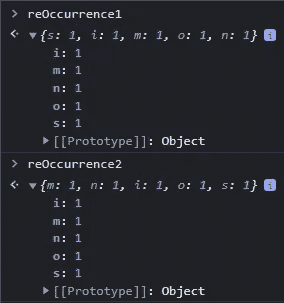
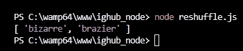

# 如何用 JavaScript 创建一个简单的文字解读器

> 原文：<https://javascript.plainenglish.io/how-to-create-a-simple-word-unscrambler-with-javascript-86bcd52c9c2c?source=collection_archive---------13----------------------->


Photo by Brett Jordan on Unsplash

假设给你一长串字母，看起来像是一个乱码，你被要求解读它，你会如何解读这个单词？

今天，我将向您展示如何构建一个函数来帮助您解读任何单词，只要该单词存在于我们的字典中。

# 入门指南

我们需要通过安装一个非常好的字典来设置我们的项目，该字典将用于过滤单词。

在您的本地服务器上，

*   安装 npm 软件包“an-array-of-english-words”

```
$ npm install an-array-of-english-words
```

*   或者从 Github 下载

[](https://github.com/words/an-array-of-english-words) [## GitHub-words/an-array-of-English-words:大约 275，000 个英文单词的列表

### 约 275，000 个英语单词的列表。来源于活版单词表。npm 安装一个英文单词数组会产生…

github.com](https://github.com/words/an-array-of-english-words) 

# 构建我们的功能

现在我们已经安装了字典，我们需要构建一个函数来帮助我们解读一个单词，利用字典中的单词。

这个函数只有一个参数，即要解读的单词。

# 导入我们的词典

现在我们需要将我们的字典导入到函数中，以帮助我们根据我们的逻辑过滤单词。

> *如果在您的开发环境中不允许使用* `*require*` *语句，您必须导入字典并将其作为一个模块使用。*

# 通过字典过滤

这是我们职能中最重要的部分。在这一节中，我将编写非常简单的逻辑来过滤字典并返回我们正在寻找的单词。

我将在字典上使用`Array.filter()`，第一步是检查我们试图解读的单词的长度是否等于字典中当前条目的长度。这将节省我们大量的时间和内存，并使我们的逻辑更整洁。

# 处理重复发生的事件

因为我不知道你想解读的那个词；

*   我将在词典中检索当前条目
*   使用`split()`方法将其转换为一个数组
*   遍历数组
*   然后将每个字母的重复出现次数存储在变量`reOccurence1`中

我会做同样的事情，但在一个不同的变量`reOccurence2`提供的加扰字。

# 分解它

为了让你理解上面的代码，举个例子，字典里有一个名字叫“simon”的词，你在努力解读“mnios”这个词。

如果我们的函数应该执行到 reoccurrence 部分，我们将正好有这两个对象包含每个字母和它们重复的次数。



仅仅通过观察这些物体，你会注意到它们是相等的，这意味着我们找到了一个与打乱的字母相匹配的单词。

# 解读这个词

了解了如何存储和处理重复出现的字母后，我们现在必须遍历第一个对象，检查字母的重复出现次数是否与另一个对象相同。

如果它们是相同的，那么毫无疑问，字典中的当前条目就是我们正在寻找的单词。

我将创建一个变量作为我们的计数器。在对象中循环时，每找到一个匹配，此计数器就增加一次。

现在，如果计数器等于数组中键的数量，我们将返回字典中的当前项，因为这是我们正在寻找的单词。

这是完整的代码

# 测试我们的功能

假设我有这些字母“izrbera”，我想解读它。这是我调用函数的方式。

```
console.log( unscramble("izrbera") );
```

这就是结果

*   奇异的
*   火盆



这个函数返回一个包含与被打乱的字母相匹配的单词的`array`，如果没有找到单词，则返回一个空的`array`。

你已经到达我的文章的结尾。

点击这里查看该功能的现场演示

[](https://octagon-simon.github.io/projects/unscrambler/) [## 西蒙·乌戈吉的文字解读器

### 用这个字解读器解读任何字

八角形-simon.github.io](https://octagon-simon.github.io/projects/unscrambler/) 

点击这里查看 NPM 套餐

[](https://www.npmjs.com/package/word-unscrambler) [## 文字解读器

### 这个包有助于解读任何单词，只要这个单词存在于字典中。最新版本:1.0.2，最新…

www.npmjs.com](https://www.npmjs.com/package/word-unscrambler) 

感谢您的阅读。

*更多内容看* [***说白了。报名参加我们的***](https://plainenglish.io/) **[***免费周报***](http://newsletter.plainenglish.io/) *。关注我们关于* [***推特***](https://twitter.com/inPlainEngHQ)[***LinkedIn***](https://www.linkedin.com/company/inplainenglish/)*[***YouTube***](https://www.youtube.com/channel/UCtipWUghju290NWcn8jhyAw)*[***不和***](https://discord.gg/GtDtUAvyhW) *。*****