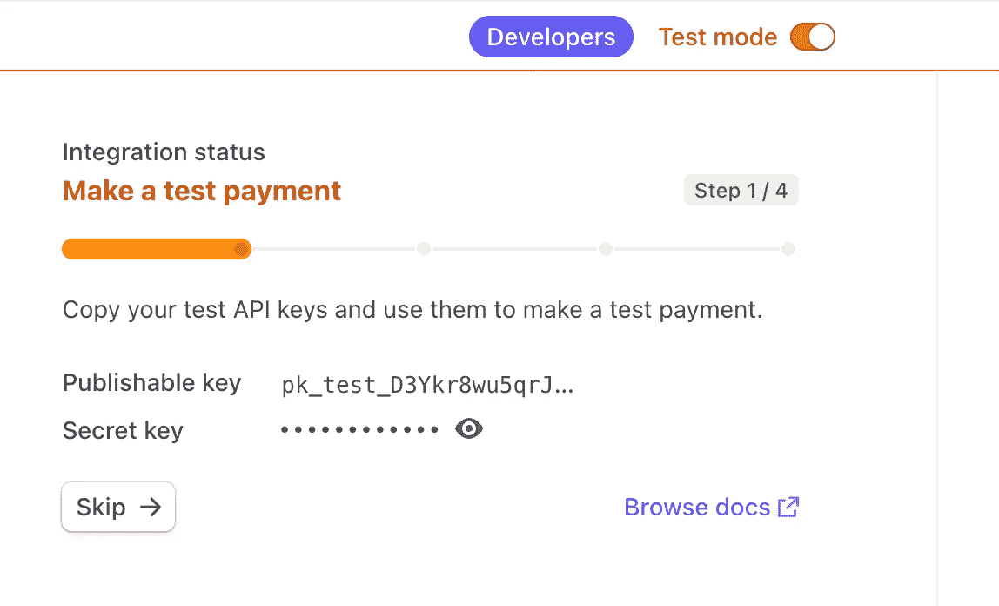
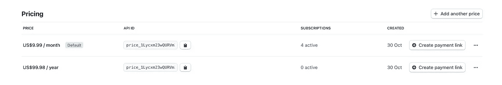
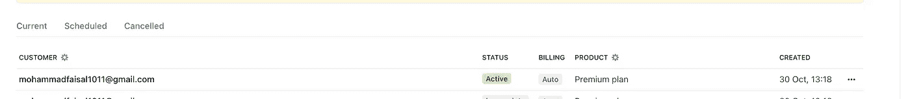

# 如何使用 React 和 Node.js 创建条带订阅

> 原文：<https://javascript.plainenglish.io/how-to-create-a-stripe-subscription-with-react-and-node-js-b7c5e5e24967?source=collection_archive---------1----------------------->

## 使用 React 和 Node.js 中的 Stripe 向您的客户收取定期付款。


Photo by [Towfiqu barbhuiya](https://unsplash.com/@towfiqu999999?utm_source=unsplash&utm_medium=referral&utm_content=creditCopyText) on [Unsplash](https://unsplash.com/s/photos/payment?utm_source=unsplash&utm_medium=referral&utm_content=creditCopyText)

Stripe 是收集客户付款的最受欢迎的方法之一。它简单易用，是任何 web 开发人员的必备技能。

在上一篇文章[中，我们看到了如何在 React 应用程序中收款](https://medium.com/p/27c5a858b7f7)。

[](/how-to-integrate-stripe-with-a-react-application-27c5a858b7f7) [## 如何将 Stripe 与 React 应用程序集成

### 为您的企业接受和处理付款从未如此简单！

javascript.plainenglish.io](/how-to-integrate-stripe-with-a-react-application-27c5a858b7f7) 

今天，我们将学习如何创建一个订阅，并使它变得非常简单。

我们开始吧！

```
This story was originally published [here](https://www.mohammadfaisal.dev/blog/how-to-create-a-stripe-subscription-with-reactjs-and-nodejs)
```

# 第一步

要设置订阅，首先，您需要 Stripe dashboard 中的两个秘密值



Stripe dashboard

对于前端:

```
STRIPE_PUBLISHABLE_KEY
```

对于后端:

```
STRIPE_SECRET_KEY
```

存储这些值，因为我们很快就会用到它们！

# 创建产品和价格

下一步。转到您的仪表板并创建一个产品。

在本例中，我们为该产品设置了两个价格。一个月一次，一年一次。



Product Pricing

现在获取价格的 API ID。该键以`price_somerandomstuff`开始

# 实际流量

整个订阅工作流程有几个步骤。

1.  首先，你从前端收集用户`name`和`email`以及他们的计划。
2.  在最后一步中，我们希望收集用户选择的`price API ID`。
3.  用户还填写他们的支付细节。为了收集他们的付款细节，我们使用了`CardElement`。Stripe SDK 提供了这个组件。
4.  然后我们将这 4 条信息(`name`、`email`、`paymentDetails`和`priceid`)发送到后端。
5.  后端创建一个包含姓名、电子邮件和支付细节的`customer`。您可以将此步骤中创建的客户存储在您自己的数据库中。
6.  然后后端使用这个`customer`和`pricedId`创建一个`subscription`，并将它传递回`clientSecret`给前端。
7.  前端使用那个`clientSecret`创建一个`paymentIntent`。
8.  如果成功，您将在条带控制面板上看到订阅处于活动状态。

这需要很多步骤，所以让我们开始吧。

# 准备后端

首先，安装依赖项:

```
yarn add stripe
```

然后用您的密钥初始化条带:

```
import Stripe from 'stripe'const stripe = new Stripe('your_stripe_secret_key')
```

然后创建一个接受 post 请求的路由。

```
app.post('/create-subscription', ( req  ,res ) => { createSubscription(req);})
```

然后是创建订阅的实际函数

createSubscription.ts

# 准备前端

我们正在创建与 ReactJs 应用程序的集成。您需要安装两个库。

```
yarn add [@stripe/react-stripe-js](http://twitter.com/stripe/react-stripe-js) [@stripe/stripe-js](http://twitter.com/stripe/stripe-js)
```

然后初始化 Stripe 实例并包装您的应用程序。

注意我们有一个`CheckoutForm`组件。让我们来创造它。它会照顾整个流程。

让我们来看看主要功能

createSubscription.ts

在此功能中:

1.  我们通过使用 Stripe 提供的`CardElement`获取详细信息来创建支付方法。
2.  然后我们调用后端，在那里会为我们创建一个订阅。
3.  然后我们从后台取回`clientSecret`，可以用来确认支付。
4.  如果一切顺利，那么我们将有一个工作订阅！



Active Subscription

就是这样！

# 最终代码:

最终的组件将是这样的。

大概就是这样。希望你今天学到了新东西！

```
You can reach out to me via [**LinkedIN**](https://www.linkedin.com/in/56faisal/) or my [**Personal Website**](https://www.mohammadfaisal.dev/blog)
```

[](/45-npm-packages-to-solve-16-react-problems-a9ab18946224) [## 45 个 NPM 软件包解决 16 个 React 问题

### 关于如何选择完美的 npm 包的深入指导

javascript.plainenglish.io](/45-npm-packages-to-solve-16-react-problems-a9ab18946224) 

## 资源:

[https://stripe . com/docs/billing/subscriptions/build-subscriptions？ui =结帐](https://stripe.com/docs/billing/subscriptions/build-subscriptions?ui=checkout)