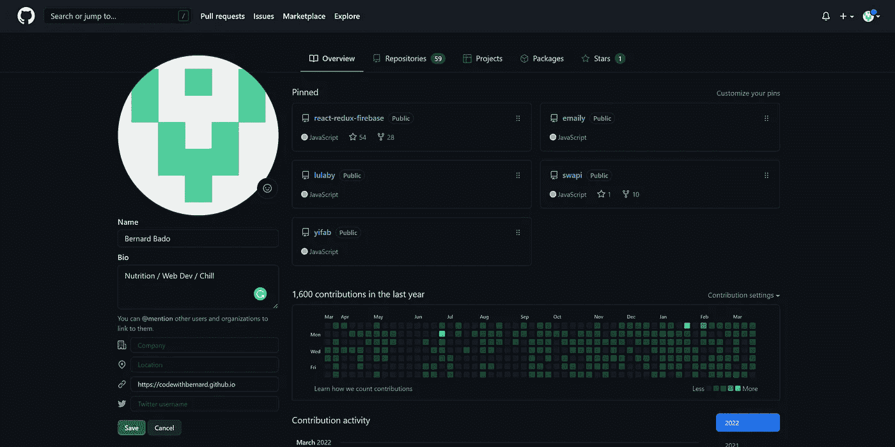
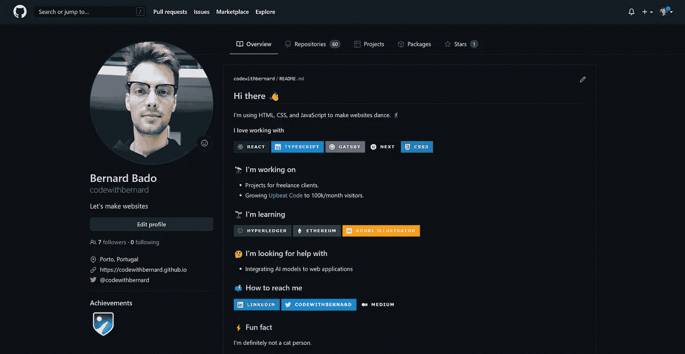
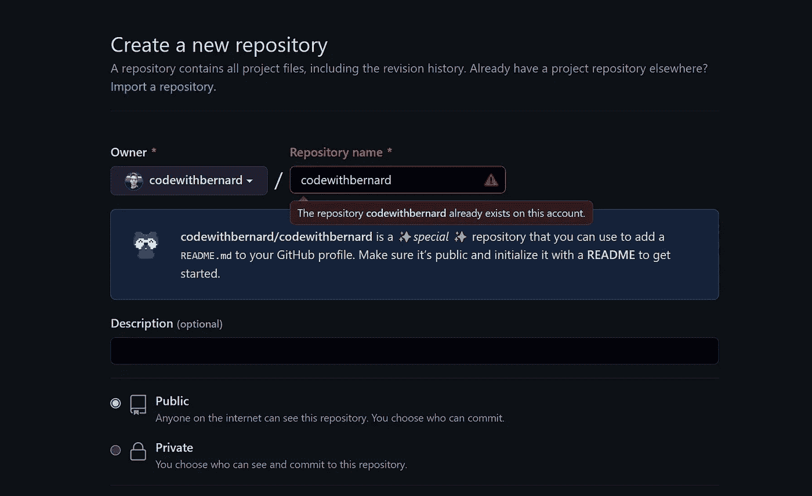

# 如何创建令人惊叹的 Github 简介

> 原文：<https://javascript.plainenglish.io/how-to-create-a-stunning-github-profile-43567d1342f1?source=collection_archive---------5----------------------->

## 我会告诉你怎么做。

Credits: [Pixabay](https://www.pexels.com/sk-sk/@pixabay?utm_content=attributionCopyText&utm_medium=referral&utm_source=pexels) on [Pexels](https://www.pexels.com/sk-sk/fotka/cit-clovek-den-denny-cas-207569/?utm_content=attributionCopyText&utm_medium=referral&utm_source=pexels)

要被软件公司雇佣，你不一定要成为一名优秀的程序员。事实上，在过去的几个月里，我听说了许多人在工作的头几周被解雇的故事。原因不外乎是缺乏经验。

事实是，**公司已经绝望了，他们给** **几乎所有的开发商**机会。我们需要做的就是抓住他们的注意力。

一个有效的方法是使用一个很棒的 GitHub 配置文件。今天，我将向你展示如何建立一个。

但是如果你不相信我，你自己去看看吧，问问你自己这个问题。你更愿意雇佣谁？

这个开发商？

Captured by author

还是这个？

Captured by author

我相信差别是相当明显的。我只用了 5 分钟就完成了这个最终造型。如果你不相信我，启动计时器，跟着做吧！

# 秘密 Git 仓库

为了让 Github 配置文件看起来不像是 80 年代制作的，我们首先需要创建一个新的存储库。而且必须和你的 Github 账号同名。除此之外，存储库需要是公开的。

这个 repo 将由一个 markdown 文件组成，Github 会将其视为您的个人资料登录页面。换句话说，我们放在 markdown 文件中的内容会出现在你的 Github 个人资料中。

Captured by author

一旦回购建立起来，我们就可以开始用我们的成就、技能、希望和梦想来填充它。

因为 README 是属于`.md`文件的类型，所以我们可以自由地使用标准的 markdown 语法。如果你像我一样容易忘记，请随意使用这个可怕的[备忘单。](https://www.markdownguide.org/cheat-sheet/)

除了标准的 markdown 语法，我们还可以使用 HTML。这是一个好消息，它使我们能够在我们的个人资料中设计和定位元素，以达到令人惊叹的效果。

# 创建吸引人的个人资料信息

现在一切都已准备就绪。是时候停下来思考一下你的个人资料想要传达的信息了。

如果你想被一家公司录用。你可能想写下你的技能、成就和你喜欢使用的技术。

如果你想被解雇。你想列出你所有的坏习惯和以前同事的不良推荐。

或者你现在还不确定。如果你只是想让你的个人资料看起来不错，你可以遵循个人资料的一般结构，这和我做的是一样的。

## 添加友好的问候

最好以友好的方式说“你好”,并写一两句话来描述你是谁和你做什么。

这会立刻让任何访问你的个人资料的人对你有所了解。最重要的是，这会让他们在你的个人资料中感到受欢迎，这将激励他们进一步阅读。

## 展示你的优势

你个人资料中最重要的部分是你说明作为一名开发人员你能做什么。所以我们要把它写在问候语下面。

我们将列出我们说得最流利的编程语言。我们可以将它与我们熟悉的框架结合起来。这将让你立即知道你是哪种类型的开发人员。作为一个个体，你能带来什么

## 告诉我你做了什么

既然大家都认识你，知道你的技术是什么。是时候告诉你目前是如何利用它们的了。

这是你列出你目前职业的地方。你不必提及你工作的公司或你就读的大学。

只要提到你是做什么的，你现在的角色是什么。

## 提及你不知道的

不熟悉一切也没什么。作为开发人员，我们也在不断学习新的东西。

提及你目前正在学习的东西总是一个好主意。这表明你正在积极努力，努力提高自己。最重要的是，它让你知道你职业生涯的下一步可能是什么。

如果你目前正在学习一些新技能，那就提出来！

## 向他人伸出援手

在这一点上，我们提供了足够的信息。但我们还是可以更上一层楼。我们可以通过伸出手寻求帮助来做到这一点。

我们不会乞求，我们只是要提到，我们正在寻找一些特定主题的帮助。谁知道呢？也许阅读我们简介的人正是我们要找的人。

我们的侧写看起来已经很可靠了，但是还缺少一样东西。你知道那是什么吗？

## 联系信息

我们分享了很多关于自己的事情，但其他人仍然不知道如何联系我们。在这里，我们将列出我们活跃的社交平台。

尽可能多的放进去。这只会让联系你更容易。

## 樱桃在上面

如果你想玩一点，你可以说一些有趣或有趣的事情来结束你的个人资料。

这可能是一个关于你自己的有趣事实，或者是一些只有你才能做到的特殊技能。让你内心的孩子成为这里的向导。

以这种方式完成你的个人资料将会缓解紧张。这也表明你毕竟是个人。而不仅仅是一些面向目标的编程机器。

# 个人资料展示

把这些放在一起，我们就有了自己的 Github 档案。请随意重复使用下面的 markdown，并根据自己的情况进行调整。

# 总结想法

我听到太多次谈论 Github 是开发者的社交平台。我不认为这是夸大其词。就我个人而言，我不知道有哪个开发者没有 Github 概要文件。

如果您已经有了一个 Github 概要文件，您还可以利用它。通过遵循我分享的步骤，并重用我提供的 markdown，您将很快让您的 Github 个人资料看起来棒极了。

我鼓励你，停下你正在做的一切，花 5 分钟调整你的 Github 个人资料，并与每个人分享最终结果！

***我等着在评论里看到你 Github 个人资料的链接。***

*我希望你喜欢这个故事。如果你想从我这里听到更多或阅读更多，请考虑使用* [***此链接***](https://bernardbad.medium.com/membership) ***成为一名中等会员。***

*更多内容请看* [***说白了就是***](https://plainenglish.io/) *。报名参加我们的* [***免费每周简讯***](http://newsletter.plainenglish.io/) *。关注我们*[***Twitter***](https://twitter.com/inPlainEngHQ)*和*[***LinkedIn***](https://www.linkedin.com/company/inplainenglish/)*。加入我们的* [***社区不和谐***](https://discord.gg/GtDtUAvyhW) *。*