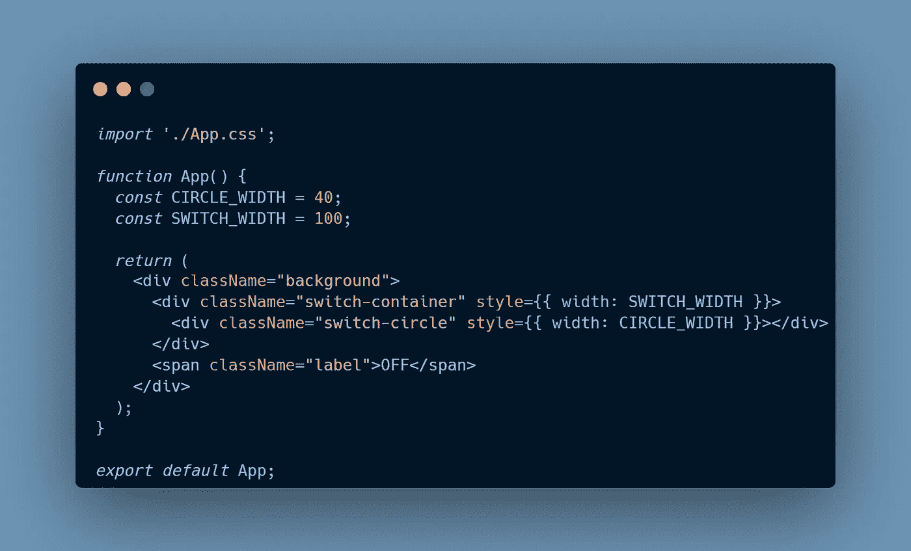

# 如何在 React 中使用 GSAP 从头开始创建交换机

> 原文：<https://javascript.plainenglish.io/how-to-create-a-switch-from-scratch-using-gsap-in-react-20c0de3c041b?source=collection_archive---------2----------------------->


你有没有想过自己创造一个拨动开关？从左向右移动拇指或者从右向左移动拇指的酷动画？或者，你是那个简单地使用一个库来快速添加开关并完成它的人吗？😏


外观简单的开关！虽然它们很棒，但我们可以做得比这更好。


我们可以从零开始自己做这样的东西🤩😎。

所以，让我们开始做这个。前提条件呢？我将使用 GSAP 和反应来创建这个。React 是完全可选的，它也可以用普通的 JavaScript 轻松实现。🙃

也可以看这个视频，按代码操作。😎

# 项目设置

我将使用 [Vite](https://vitejs.dev/) 来创建项目，因为它比它的对手快得多。冷启动和热重启也很快。

您可以使用此命令创建应用程序。

```
yarn create vite
```

然后，它会询问您想要使用的项目名称和模板类型。目前，它支持这些模板—

*   香草/香草-ts
*   vue / vue-ts
*   反应/反应-ts
*   预测/预测-ts
*   文学/文学 ts
*   苗条身材

同样，您可以选择其中任何一个。我选 React。

创建项目后，执行以下命令:

```
cd <project-name>
yarn # To install the deps or npm install
yarn run dev # To run the dev server
```

该项目将在端口 3000 上运行。*本地主机:3000*

项目设置部分已经完成，所以我们可以转到基本的 UI 部分。

# UI 部件

我们将为用户界面添加 JSX 和 CSS。



Switch-UI-JSX

很简单，一个 **div** 作为背景。一个**格**为开关容器的，最后一个为**开关拇指圈**。

标签的**跨度**，数值**关闭**。稍后我们会将其更改为 **FF** 和 **N** 。🙃

我们在变量中使用了 **CIRCLE_WIDTH** 和 **SWITCH_WIDTH** ，因为我们将在动画制作时使用它们。

接下来是应用程序的 CSS。


Switch-UI-CSS

输出会是这样的—


下一步是添加状态、引用和切换功能。


Switch-state-refs-function

我们为 switch-container、switch thumb 和 label 创建了 refs，因为我们将选择这三个东西的 DOM 元素。创建引用后，我们将**引用**附加到各自的标签上。

对于 toggle，我们创建了一个名为 **switchState** 的状态，并赋予其默认值“off”。在这个状态值的帮助下，我们可以更改标签中的文本。

最后，为了改变 **switchState 的**值，我们创建了一个名为 **handleClick** 的函数，并将其附加到类名为 **"switch-container"** 的 **div** 中。它只是检查**开关状态**的当前值，并将其更新为当前值的相反值。

下一步也是最后一步是将动画添加到静态开关中🤩

# 动画部分

我们将添加动画，并删除一些 CSS，因为它将由动画处理。

但是首先，如果你还没有安装 GSAP，那么你应该:

```
yarn add gsap
```

这将把 GSAP 添加到我们的项目中，现在我们可以将它导入到我们的文件中。我们将使用 GSAP 时间线。你可以在这里了解更多[。](https://greensock.com/docs/v3/GSAP/Timeline)


Switch-animation

首先，我们从 **gsap 模块中导入 **GSAP** 和**弹性**。弹性**用于提供缓和值([三次贝塞尔](https://cubic-bezier.com/#.17,.67,.83,.67)曲线值)。

然后，我们创建了时间轴变量。

```
const t1 = gsap.timeline()
```

有了这个变量，我们可以添加动画链。

接下来，我们引入了 **useEffect** 钩子，因为每当 **switchState** 将要改变时，我们都要调用我们的动画。

我们根据**开关状态**的当前状态运行不同的动画。

让我们一次选取一个动画点来了解发生了什么。

```
t1.to(
  circleRef.current,
  {
    duration: 0.5,
    x: SWITCH_WIDTH - CIRCLE_WIDTH,
    backgroundColor: '#51ff0d',
    ease: Elastic.easeOut.config(1, 0.6),
   },
   'start'
 )
```

**。to()** 意味着我们要将当前值改为这些值。🙃

我们在此**中使用了 3 个参数。到()。**

*   第一个是我们想要添加动画的目标。我们给了它**开关拇指**的 DOM 元素。
*   第二个是选项对象，我们在其中提供了各种 CSS 转换或 GSAP 选项(持续时间、放松等)。
*   第三个是标签，也可以是别的，比如，'【T32 '，'-=0.1 '。如果我们给它一个类似“start”的字符串，并给其他一些**提供相同的值。to()** 那么两者将在同一时间点开始。

让我们看看关于动画选项对象的更多信息:

*   **持续时间—** 0.5，以秒为单位的值，这意味着动画需要 0.5 秒才能完成。
*   **x —** 与 X 轴平移相同，我们使用**SWITCH _ WIDTH—CIRCLE _ WIDTH**的值。
*   **backgroundColor —** 改变切换滑块的颜色
*   **缓和—** 动画贝塞尔曲线值


黄色的宽度是**开关宽度**，红色的是**圆宽度**。我们想把圆移到右边，所以我们减去这些值来得到距离。这个距离可以用来告诉 GSAP，我们将移动这个拇指这么多。

我们来看下一段动画。

```
.to(
  switchRef.current, 
  {
    duration: 0.5,
    borderColor: '#51ff0d',
  },
  'start'
)
```

这里，我们的目标是**开关容器**的 DOM 元素。我们只是改变了边框的颜色。标签与前一个块相同，因为我们希望同时开始这两个动画。

在状态下进入**的下一个也是最后一个程序块。**

```
.fromTo(
  labelRef.current,
  { y: 20, opacity: 0, color: 'white' },
  { y: 0, opacity: 1, color: '#51ff0d', duration: 0.5 },
  'start'
);
```

该模块具有不同的**时间线**功能。**。fromTo()** 函数意味着我们要将值**从“this”更改为“this”**。

因此，在这里，我们的目标是 label 的 DOM 元素。我们将标签从 20 的**“y”**移动到 0 的**“y”**，不透明度从 0 到 1，颜色也有一些变化。

duration 参数将出现在第二个对象中，表示该动画将持续 0.5 秒。

同样，我们使用相同的标签，因为我们希望它与其他两个动画一起开始。

**else 部分动画完全相同，我们所做的只是颠倒动画的顺序。**

例如，不是将切换滑块从:

**0 — >(开关宽度—圆宽度)**

我们将它从:

**(开关宽度—圆宽度)— > 0**

做完这一切后，你就可以见证这个看起来很酷的开关了。😎


就这样，这就是我们旅程的终点。我希望你能达到这一点。😃

谢谢！敬请关注更多关于动画的文章。🤩😎

最后，这个动画的 Github repo 。

你可以在 Twitter 上关注我的更多内容，或者订阅我在 Medium 上的邮件列表。😁

*更多内容请看*[***plain English . io***](https://plainenglish.io/)*。报名参加我们的* [***免费周报***](http://newsletter.plainenglish.io/) *。关注我们关于*[***Twitter***](https://twitter.com/inPlainEngHQ)*和*[***LinkedIn***](https://www.linkedin.com/company/inplainenglish/)*。加入我们的* [***社区不和谐***](https://discord.gg/GtDtUAvyhW) *。*