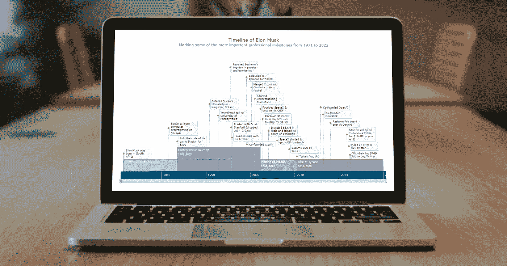
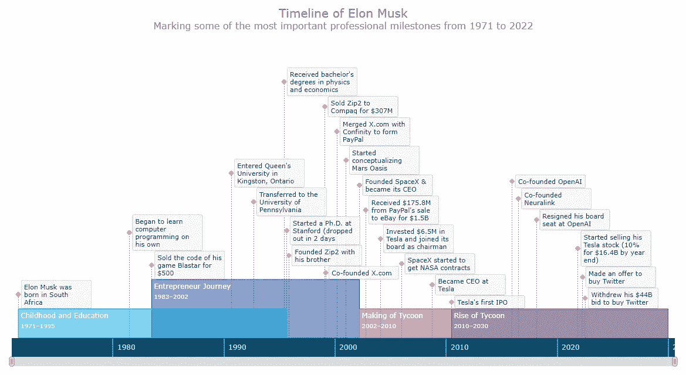
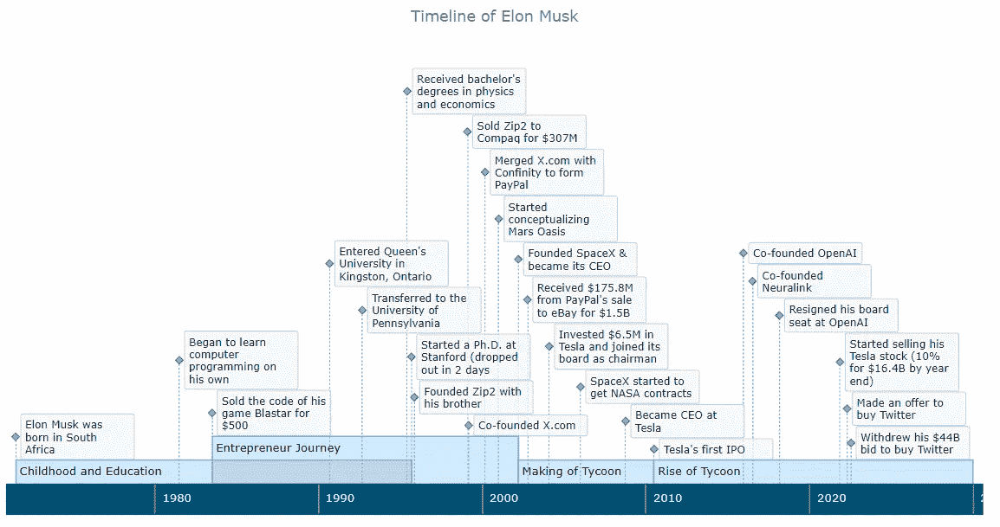

# 如何创建时间线图表(用 JavaScript)

> 原文：<https://javascript.plainenglish.io/how-to-create-a-timeline-chart-in-javascript-b4c956eaaf1f?source=collection_archive---------10----------------------->



时间线图表是按时间顺序表示重要事件和时期的绝佳方式。现在，让我教你如何使用 JavaScript 轻松创建一个优雅的交互式可视化！

为了让本教程既有帮助又有娱乐性，我决定采用真实数据。请和我一起在 JS 时间表中一步一步地想象埃隆·马斯克的生活，重点关注他作为企业家和投资者职业生涯中最重要的事件。

# 时间线图表预览

看看我将在本教程中创建的漂亮的 JavaScript 时间轴图表，并继续阅读了解如何创建！



# 构建基本 JS 时间表的 4 个步骤

创建一个交互式的基于 JavaScript 的时间线图表，即使是一个基本的图表，看起来也是一项艰巨的任务。但是现在，您将看到如何轻松地做到这一点。

在本教程中，构建 JS 时间线图表的过程分为四个步骤:创建网页、添加脚本、设置数据和配置可视化。

一个惊人的基本时间表图表将安排在短短几行易于理解的代码。然后我将向您展示如何定制它(也没有太多的复杂性)。跟我来。

## 1.创建网页

首先，我用 HTML 块元素制作了一个简单的网页。我的基于 JavaScript 的时间线图表将出现在那里。

我为这个元素提供了一个 ID，并将它的高度和重量设置为 100%,这样可视化就占据了整个页面。

```
<html>
  <head>
    <title>JavaScript Timeline Chart</title>
    <style type="text/css">      
      html, body, #container { 
        width: 100%; height: 100%; margin: 0; padding: 0; 
      } 
    </style>
  </head>
  <body>
    <div id="container"></div>
  </body>
</html>
```

## 2.添加脚本

其次，我将所有我要用来构建时间表图表的脚本添加到 HTML 页面的`<head>`部分。

在本教程中，我将使用 [AnyChart JS Charts](https://www.anychart.com/) ，这是一个强大的 JavaScript 图表库，具有巨大的开箱即用功能，可以轻松快速地可视化包括时间线在内的[几十种图表类型](https://docs.anychart.com/Quick_Start/Supported_Charts_Types)中的数据。

这里，我需要核心和时间轴[模块](https://docs.anychart.com/Quick_Start/Modules)。

```
<html>
  <head>
    <title>JavaScript Timeline Chart</title>
    <script src="https://cdn.anychart.com/releases/8.11.0/js/anychart-core.min.js"></script>
    <script src="https://cdn.anychart.com/releases/8.11.0/js/anychart-timeline.min.js"></script>
    <style type="text/css">      
      html, body, #container { 
        width: 100%; height: 100%; margin: 0; padding: 0; 
      } 
    </style>
  </head>
  <body>  
    <div id="container"></div>
    <script>
 ***// All the JS code for the timeline chart will go here.***    </script>
  </body>
</html>
```

## 3.设置数据

第三，我在 JS 时间线图表中设置我想要可视化的数据。

将有两个不同类型的系列，范围和时刻。每个都将通过单独的功能添加。

范围系列用于期间。每个数据点都有一个名称以及开始和结束日期。

```
function rangeData() {
  return [
    {
      name: "Childhood and Education",
      start: "1971/06/28",
      end: "1995/09/01"
    },
    {
      name: "Entrepreneur Journey",
      start: "1983/06/28",
      end: "2002/03/13"
    },
    {
      name: "Making of Tycoon",
      start: "2002/03/14",
      end: "2010/06/28"
    },
    {
      name: "Rise of Tycoon",
      start: "2010/06/29",
      end: "2030/01/01"
    }
  ];
}
```

力矩系列是针对个人项目的。每个数据点都有日期和文本。

```
function momentData() {
  return [
    ["1971/06/28", "Elon Musk was born in South Africa"],
    ["1981/06/28", "Began to learn computer programming on his own"],
    ["1983/06/28", "Sold the code of his game Blastar for $500"],
    ["1990/09/01", "Entered Queen's University in Kingston, Ontario"],
    ["1992/09/01", "Transferred to the University of Pennsylvania"],
    ["1995/06/01", "Received bachelor's degrees in physics and economics"],
    ["1995/09/01", "Started a Ph.D. at Stanford (dropped out in 2 days"],
    ["1995/11/06", "Founded Zip2 with his brother"],
    ["1999/02/01", "Sold Zip2 to Compaq for $307M"],
    ["1999/03/01", "Co-founded X.com"],
    ["2000/03/01", "Merged X.com with Confinity to form PayPal"],
    ["2001/01/01", "Started conceptualizing Mars Oasis"],
    ["2002/03/14", "Founded SpaceX & became its CEO"],
    ["2002/10/03", "Received $175.8M from PayPal's sale to eBay for $1.5B"],
    ["2004/02/01", "Invested $6.5M in Tesla and joined its board as chairman"],
    ["2006/01/01", "SpaceX started to get NASA contracts"],
    ["2008/10/01", "Became CEO at Tesla"],
    ["2010/06/29", "Tesla's first IPO"],
    ["2015/12/11", "Co-founded OpenAI"],
    ["2016/07/01", "Co-founded Neuralink"],
    ["2018/02/21", "Resigned his board seat at OpenAI"],
    ["2021/11/06", "Started selling his Tesla stock (10% for $16.4B by year end)"],
    ["2022/04/13", "Made an offer to buy Twitter"],
    ["2022/07/08", "Withdrew his $44B bid to buy Twitter"]
  ];
}
```

好吧！我们已经准备好了页面、脚本和数据。现在，是时候添加一些 JavaScript 图表代码来完成预期的交互式时间轴图表可视化了！

## 4.配置可视化

首先，我们添加上一步的数据。然后，我们使用一个函数来确保当网页已经被加载时，配置时间线图的后续代码被执行。

```
<script>

 ***// set the range series data***  function rangeData() {
    return [
      {
        name: "Childhood and Education",
        start: "1971/06/28",
        end: "1995/09/01"
      },
      {
        name: "Entrepreneur Journey",
        start: "1983/06/28",
        end: "2002/03/13"
      },
      {
        name: "Making of Tycoon",
        start: "2002/03/14",
        end: "2010/06/28"
      },
      {
        name: "Rise of Tycoon",
        start: "2010/06/29",
        end: "2030/01/01"
      }
    ];
  }

 ***// set the moment series data***  function momentData() {
    return [
      ["1971/06/28", "Elon Musk was born in South Africa"],
      ["1981/06/28", "Began to learn computer programming on his own"],
      ["1983/06/28", "Sold the code of his game Blastar for $500"],
      ["1990/09/01", "Entered Queen's University in Kingston, Ontario"],
      ["1992/09/01", "Transferred to the University of Pennsylvania"],
      ["1995/06/01", "Received bachelor's degrees in physics and economics"],
      ["1995/09/01", "Started a Ph.D. at Stanford (dropped out in 2 days"],
      ["1995/11/06", "Founded Zip2 with his brother"],
      ["1999/02/01", "Sold Zip2 to Compaq for $307M"],
      ["1999/03/01", "Co-founded X.com"],
      ["2000/03/01", "Merged X.com with Confinity to form PayPal"],
      ["2001/01/01", "Started conceptualizing Mars Oasis"],
      ["2002/03/14", "Founded SpaceX & became its CEO"],
      ["2002/10/03", "Received $175.8M from PayPal's sale to eBay for $1.5B"],
      ["2004/02/01", "Invested $6.5M in Tesla and joined its board as chairman"],
      ["2006/01/01", "SpaceX started to get NASA contracts"],
      ["2008/10/01", "Became CEO at Tesla"],
      ["2010/06/29", "Tesla's first IPO"],
      ["2015/12/11", "Co-founded OpenAI"],
      ["2016/07/01", "Co-founded Neuralink"],
      ["2018/02/21", "Resigned his board seat at OpenAI"],
      ["2021/11/06", "Started selling his Tesla stock (10% for $16.4B by year end)"],
      ["2022/04/13", "Made an offer to buy Twitter"],
      ["2022/07/08", "Withdrew his $44B bid to buy Twitter"]
    ];
  }

  anychart.onDocumentReady(function() {
 ***// The (following) timeline charting code lands here.***  });

</script>
```

然后，在`anychart.onDocumentReady()`函数中，我使用`timeline()`函数创建了一个时间线图表实例，设置了两个系列，并使范围系列标签显示了`name`属性。

```
***// create a timeline chart*** let chart = anychart.timeline();***// create a range series*** let rangeSeries = chart.range(rangeData());***// create a moment series*** let momentSeries = chart.moment(momentData());

***// configure the range series label settings*** rangeSeries.labels().format("{%name}");
```

也是在这里，我添加了几行来命名时间线图，为它定义一个容器，最后，命令来绘制结果图形。

```
***// set the chart title*** chart.title("Timeline of Elon Musk");***// set the chart container id*** chart.container("container");***// draw the chart*** chart.draw();
```

# 结果:基本 JS 时间表图表

这就对了。一个很酷的交互式 JavaScript 时间线图表可视化已经准备好了。建造一个并不难，不是吗？



这是这个时间表图表的完整代码。在 [AnyChart 游乐场](https://playground.anychart.com/PN5uw6p2)也有。

```
<html>
  <head>
    <title>JavaScript Timeline Chart</title>
    <script src="https://cdn.anychart.com/releases/8.11.0/js/anychart-core.min.js"></script>
    <script src="https://cdn.anychart.com/releases/8.11.0/js/anychart-timeline.min.js"></script>
    <style type="text/css">      
      html, body, #container { 
        width: 100%; height: 100%; margin: 0; padding: 0; 
      } 
    </style>
  </head>
  <body>  
    <div id="container"></div>
    <script> ***// set the range series data***      function rangeData() {
        return [
          {
            name: "Childhood and Education",
            start: "1971/06/28",
            end: "1995/09/01"
          },
          {
            name: "Entrepreneur Journey",
            start: "1983/06/28",
            end: "2002/03/13"
          },
          {
            name: "Making of Tycoon",
            start: "2002/03/14",
            end: "2010/06/28"
          },
          {
            name: "Rise of Tycoon",
            start: "2010/06/29",
            end: "2030/01/01"
          }
        ];
      } ***// set the moment series data***      function momentData() {
        return [
          ["1971/06/28", "Elon Musk was born in South Africa"],
          ["1981/06/28", "Began to learn computer programming on his own"],
          ["1983/06/28", "Sold the code of his game Blastar for $500"],
          ["1990/09/01", "Entered Queen's University in Kingston, Ontario"],
          ["1992/09/01", "Transferred to the University of Pennsylvania"],
          ["1995/06/01", "Received bachelor's degrees in physics and economics"],
          ["1995/09/01", "Started a Ph.D. at Stanford (dropped out in 2 days"],
          ["1995/11/06", "Founded Zip2 with his brother"],
          ["1999/02/01", "Sold Zip2 to Compaq for $307M"],
          ["1999/03/01", "Co-founded X.com"],
          ["2000/03/01", "Merged X.com with Confinity to form PayPal"],
          ["2001/01/01", "Started conceptualizing Mars Oasis"],
          ["2002/03/14", "Founded SpaceX & became its CEO"],
          ["2002/10/03", "Received $175.8M from PayPal's sale to eBay for $1.5B"],
          ["2004/02/01", "Invested $6.5M in Tesla and joined its board as chairman"],
          ["2006/01/01", "SpaceX started to get NASA contracts"],
          ["2008/10/01", "Became CEO at Tesla"],
          ["2010/06/29", "Tesla's first IPO"],
          ["2015/12/11", "Co-founded OpenAI"],
          ["2016/07/01", "Co-founded Neuralink"],
          ["2018/02/21", "Resigned his board seat at OpenAI"],
          ["2021/11/06", "Started selling his Tesla stock (10% for $16.4B by year end)"],
          ["2022/04/13", "Made an offer to buy Twitter"],
          ["2022/07/08", "Withdrew his $44B bid to buy Twitter"]
        ];
      } anychart.onDocumentReady(function () {

 ***// create a timeline chart***        let chart = anychart.timeline(); ***// create a range series***        let rangeSeries = chart.range(rangeData()); ***// create a moment series***        let momentSeries = chart.moment(momentData()); ***// configure the range series label settings***        rangeSeries.labels().format("{%name}"); ***// set the chart title***        chart.title("Timeline of Elon Musk"); ***// set the chart container id***        chart.container("container"); ***// draw the chart***        chart.draw(); }); </script>
  </body>
</html>
```

# 创建自定义 JS 时间线图表

时间线看起来很吸引人。但是总有进步的空间！我将向您展示如何很好地定制这样一个 JavaScript 时间轴图表的某些部分，同样没有太多麻烦。

## 1.时间线图表颜色

个性化图表时，一个简单而有效的更改是修改颜色。

首先，我将属性`fill`和`stroke`添加到系列数据中，时间线图表将自动应用相应的值:

```
function rangeData() {
  return [
    {
      name: "Childhood and Education",
      start: "1971/06/28",
      end: "1995/09/01",
      fill: "#00a8e0 0.5",
      stroke: "#00a8e0"
    },
    {
      name: "Entrepreneur Journey",
      start: "1983/06/28",
      end: "2002/03/13",
      fill: "#1c4598 0.5",
      stroke: "#1c4598"
    },
    {
      name: "Making of Tycoon",
      start: "2002/03/14",
      end: "2010/06/28",
      fill: "#a05e9c 0.6",
      stroke: "#a05e9c"
    },
    {
      name: "Rise of Tycoon",
      start: "2010/06/29",
      end: "2030/01/01",
      fill: "#6e4c82 0.65",
      stroke: "#6e4c82"
    }
  ];
}
```

第二，我用下面的方法改变矩系列标记的颜色:

```
momentSeries.normal().markers().fill("#ffdd0e");
momentSeries.normal().markers().stroke("#e9ae0b");
```

## 2.范围系列标签和高度

接下来，我想为范围系列标签的内容提供相应期间的开始和结束年份。使用 HTML 格式化标签也很容易。看看这个。

```
rangeSeries
  .labels()
  .useHtml(true)
  .fontColor("#fff")
  .format(
    '{%name}<br><span style="font-size: 85%">{%start}{dateTimeFormat:YYYY}–{%end}{dateTimeFormat:YYYY}</span>'
  );
```

让我也增加范围系列的高度，以便新添加的信息可以整齐地适应。这只用一行代码就完成了。

```
rangeSeries.height(50);
```

## 3.时间线图表标题

为了给出更多关于时间线显示的信息，我使用 HTML 定制了图表标题。

```
chart
  .title()
  .enabled(true)
  .useHtml(true)
  .text(
    '<span style = "color: #e12026; font-size:20px;">Timeline of Elon Musk</span>' +
    '<br/><span style="font-size: 16px;">Marking some of the most important professional milestones from 1971 to 2022</span>'
  );
```

现在基于 JS 的时间线图有了小标题，整个标题部分都美化了。

## 4.时间线图表工具提示

之后，我想对时间线图表工具提示做一些调整，包括范围和时刻系列。

对于每个系列，我为工具提示文本创建一个基于 HTML 的格式模式，启用 HTML，并应用配置的格式。为了简洁、完美的外观，我删除了工具提示标题和分隔符。

```
***// format the range series tooltip*** let rangeTooltipFormat =
  "<span style='font-weight:600;font-size:10pt'>" +
  "{%name}</span><br><br>From " +
  "{%start}{dateTimeFormat:YYYY} to " +
  "{%end}{dateTimeFormat:YYYY}";
rangeSeries.tooltip().useHtml(true);
rangeSeries.tooltip().format(rangeTooltipFormat);
rangeSeries.tooltip().title().enabled(false);
rangeSeries.tooltip().separator().enabled(false);***// format the moment series tooltip*** let momentTooltipFormat =
  "<span>{%x}{dateTimeFormat: MMMM YYYY}</span>";
momentSeries.tooltip().useHtml(true);
momentSeries.tooltip().format(momentTooltipFormat);
momentSeries.tooltip().title().enabled(false);
momentSeries.tooltip().separator().enabled(false);
```

## 5.时间线滚动条

当您可以轻松地仔细查看某个时期时，浏览时间线图表会更容易。在这里，您可以使用鼠标滚轮来放大和缩小。但是也可以在时间线下面添加一个滚动条，这只需要一个快捷行。

```
chart.scroller().enabled(true);
```

## 6.上下文菜单和导出

最后，让我添加一个更酷的东西，一个带有保存和共享时间线图选项的上下文菜单。

我只是引用这些 JS 和 CSS 文件以及网页的`<head>`部分中已经存在的其他文件，图表库的默认设置会处理剩下的事情。

```
<script src="https://cdn.anychart.com/releases/8.11.0/js/anychart-ui.min.js"></script><script src="https://cdn.anychart.com/releases/8.11.0/js/anychart-exports.min.js"></script><link rel="stylesheet" href="https://cdn.anychart.com/releases/8.11.0/css/anychart-ui.min.css"><link rel="stylesheet" type="text/css" href="https://cdn.anychart.com/releases/8.11.0/fonts/css/anychart-font.min.css"/>
```

# 结果:自定义 JS 时间表图表

仅此而已。一个优雅的交互式 JavaScript 时间轴图表已经准备好了！


查看下面的时间表图表的代码。它也可以在 [AnyChart 游乐场](https://playground.anychart.com/TB932Zei)上获得，在那里你可以通过进一步调整可视化、添加数据等等来继续掌握 JS 时间线。

```
<html>
  <head>
    <title>JavaScript Timeline Chart</title>
    <script src="https://cdn.anychart.com/releases/8.11.0/js/anychart-core.min.js"></script>
    <script src="https://cdn.anychart.com/releases/8.11.0/js/anychart-timeline.min.js"></script>
    <script src="https://cdn.anychart.com/releases/8.11.0/js/anychart-ui.min.js"></script>
    <script src="https://cdn.anychart.com/releases/8.11.0/js/anychart-exports.min.js"></script>
    <link rel="stylesheet" href="https://cdn.anychart.com/releases/8.11.0/css/anychart-ui.min.css">
    <link rel="stylesheet" type="text/css" href="https://cdn.anychart.com/releases/8.11.0/fonts/css/anychart-font.min.css"/>
    <style type="text/css">      
      html, body, #container { 
        width: 100%; height: 100%; margin: 0; padding: 0; 
      } 
    </style>
  </head>
  <body>  
    <div id="container"></div>
    <script> ***// set the range series data***      function rangeData() {
        return [
          {
            name: "Childhood and Education",
            start: "1971/06/28",
            end: "1995/09/01",
            fill: "#00a8e0 0.5",
            stroke: "#00a8e0"
          },
          {
            name: "Entrepreneur Journey",
            start: "1983/06/28",
            end: "2002/03/13",
            fill: "#1c4598 0.5",
            stroke: "#1c4598"
          },
          {
            name: "Making of Tycoon",
            start: "2002/03/14",
            end: "2010/06/28",
            fill: "#a05e9c 0.6",
            stroke: "#a05e9c"
          },
          {
            name: "Rise of Tycoon",
            start: "2010/06/29",
            end: "2030/01/01",
            fill: "#6e4c82 0.65",
            stroke: "#6e4c82"
          }
        ];
      } ***// set the moment series data***      function momentData() {
        return [
          ["1971/06/28", "Elon Musk was born in South Africa"],
          ["1981/06/28", "Began to learn computer programming on his own"],
          ["1983/06/28", "Sold the code of his game Blastar for $500"],
          ["1990/09/01", "Entered Queen's University in Kingston, Ontario"],
          ["1992/09/01", "Transferred to the University of Pennsylvania"],
          ["1995/06/01", "Received bachelor's degrees in physics and economics"],
          ["1995/09/01", "Started a Ph.D. at Stanford (dropped out in 2 days"],
          ["1995/11/06", "Founded Zip2 with his brother"],
          ["1999/02/01", "Sold Zip2 to Compaq for $307M"],
          ["1999/03/01", "Co-founded X.com"],
          ["2000/03/01", "Merged X.com with Confinity to form PayPal"],
          ["2001/01/01", "Started conceptualizing Mars Oasis"],
          ["2002/03/14", "Founded SpaceX & became its CEO"],
          ["2002/10/03", "Received $175.8M from PayPal's sale to eBay for $1.5B"],
          ["2004/02/01", "Invested $6.5M in Tesla and joined its board as chairman"],
          ["2006/01/01", "SpaceX started to get NASA contracts"],
          ["2008/10/01", "Became CEO at Tesla"],
          ["2010/06/29", "Tesla's first IPO"],
          ["2015/12/11", "Co-founded OpenAI"],
          ["2016/07/01", "Co-founded Neuralink"],
          ["2018/02/21", "Resigned his board seat at OpenAI"],
          ["2021/11/06", "Started selling his Tesla stock (10% for $16.4B by year end)"],
          ["2022/04/13", "Made an offer to buy Twitter"],
          ["2022/07/08", "Withdrew his $44B bid to buy Twitter"]
        ];
      } anychart.onDocumentReady(function () {

 ***// create a timeline chart***        let chart = anychart.timeline(); ***// create a range series***        let rangeSeries = chart.range(rangeData());

 ***// create a moment series***        let momentSeries = chart.moment(momentData()); ***// configure the range series label settings***        rangeSeries
          .labels()
          .useHtml(true)
          .fontColor("#fff")
          .format(
            '{%name}<br><span style="font-size: 85%">{%start}{dateTimeFormat:YYYY}–{%end}{dateTimeFormat:YYYY}</span>'
          );

 ***// customize the moment series marker***        momentSeries.normal().markers().fill("#ffdd0e");
        momentSeries.normal().markers().stroke("#e9ae0b"); ***// set the range series bar height***        rangeSeries.height(50); ***// format the range series tooltip***        let rangeTooltipFormat =
          "<span style='font-weight:600;font-size:10pt'>" +
          "{%name}</span><br><br>From " +
          "{%start}{dateTimeFormat:YYYY} to " +
          "{%end}{dateTimeFormat:YYYY}";
        rangeSeries.tooltip().useHtml(true);
        rangeSeries.tooltip().format(rangeTooltipFormat);
        rangeSeries.tooltip().title().enabled(false);
        rangeSeries.tooltip().separator().enabled(false);

 ***// format the moment series tooltip***        let momentTooltipFormat =
          "<span>{%x}{dateTimeFormat: MMMM YYYY}</span>";
        momentSeries.tooltip().useHtml(true);
        momentSeries.tooltip().format(momentTooltipFormat);
        momentSeries.tooltip().title().enabled(false);
        momentSeries.tooltip().separator().enabled(false);

 ***// set the chart title***        chart
          .title()
          .enabled(true)
          .useHtml(true)
          .text(
            '<span style = "color: #e12026; font-size:20px;">Timeline of Elon Musk</span><br/>' +
            '<span style="font-size: 16px;">Marking some of the most important professional milestones from 1971 to 2022</span>'
          );

 ***// enable the scroller***        chart.scroller().enabled(true); ***// set the chart container id***        chart.container("container"); ***// draw the chart***        chart.draw();

      }); </script>
  </body>
</html>
```

# 结论

当您知道如何使用 JavaScript 时，创建和定制漂亮的交互式时间线图表是非常简单的。我希望我已经在本教程中正确地解释和说明了这一点。要了解更多信息，请查看[时间图表文档](https://docs.anychart.com/Basic_Charts/Timeline_Chart)，不要错过这些很酷的[时间图表示例](https://www.anychart.com/products/anychart/gallery/Timeline_Chart/)。

总而言之，我们不需要成为埃隆·马斯克来构建令人惊叹的可视化。因此，让我们继续前进，并带来一些数据生活！事实上，有许多方法可以可视化数据，并且有多种图表类型可供选择。

如果有什么需要澄清的，欢迎在评论中提问。干杯。

我们感谢 Shachee Swadia 为我们的博客制作了这个奇妙的时间表指南。

***我们的博客上有更酷的***[***JavaScript 图表教程***](https://www.anychart.com/blog/category/javascript-chart-tutorials/) ***，你可能很想看看。***

[](https://www.anychart.com/support/)****如果你想写一篇客座博文，请给我们留言。****

**原载于 2022 年 8 月 4 日*[*https://www.anychart.com*](https://www.anychart.com/blog/2022/08/04/timeline-chart/)*。**

**更多内容请看*[***plain English . io***](https://plainenglish.io/)*。报名参加我们的* [***免费周报***](http://newsletter.plainenglish.io/) *。关注我们关于* [***推特***](https://twitter.com/inPlainEngHQ)[***领英***](https://www.linkedin.com/company/inplainenglish/)**和* [***不和***](https://discord.gg/GtDtUAvyhW) ***。*****