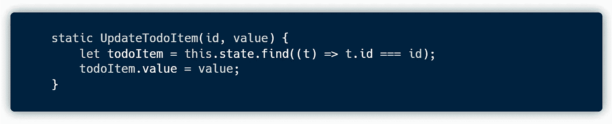

# 如何使用 JavaScript Web 组件创建待办事项列表

> 原文：<https://javascript.plainenglish.io/how-to-create-a-to-do-list-using-javascript-web-components-501306e68c8c?source=collection_archive---------5----------------------->

## 如何使用 JavaScript Web 组件和 ES 模块创建待办事项应用程序？


一个基本的待办事项列表应用程序由一个待办事项列表组成。新项目可以添加到列表中，现有项目可以从列表中删除。我们可以编辑一个项目，也可以将它标记为选中。


我们使用 JavaScript **Web 组件**来创建一个具有上述特性的待办事项列表应用程序。我们遵循本文 中 [**解释的基于组件的架构来创建待办事项应用程序。**](/component-based-architecture-for-dynamic-html-websites-857c21f0c95a)

> 该项目的完整代码可在 [**GitHub**](https://github.com/savinuvijay/todo-list) 上获得。


`index.html`和`script.js`的内容是架构中描述的样板代码。`style.css`包含了应用程序的所有基本样式。

## **应用模块**

`AppModule`包含基本组件(`app-root`和`todo-item`组件的定义。


## **AppComponent**


它从`AppTemplate`的定义开始。这里，我们首先导入`appComponent.css`样式并定义 **app-component** 主体。 **app-component** 的主体由**页面标题**组成，即*‘待办事项列表’*，一个保存待办事项列表的 **div** 标签，以及最后一个**添加(+)** 新待办事项的按钮。


我们通过调用`AppComponent`的构造函数中的`TodoListDataService.initializeState()`将待办事项列表状态初始化为一个空数组。我们还使用`querySelector()`设置了`todoList`、`todoItems`和`addTodoItemBtn`变量，以指向其各自的 HTML 元素。


在`connectedCallback()`中，我们将`addTodoItem()`事件处理程序附加到`addTodoItemBtn`按钮上。


`addTodoItem(e)`方法处理`addTodoItemBtn` `**[click]**`。它首先创建一个新的`todo-item`组件作为 HTML 元素，它的值被传递给`newTodoItem`变量。然后`todoIdCount`变量被初始化为`**0**`，如果还没有初始化的话。然后`todoIdCount`增加**一个**并设置为`newTodoItem.id`。最后，将`newTodoItem`作为子元素添加到`todoItems`中。


## **TodoItemComponent**


首先，我们导入`todoItemComponent.css` **样式**并定义`todo-item` **模板体**。`todo-item`模板由`checkbox`、`todo-content`和`deleteTodoItem`按钮组成。

通过点击**内容文本**可以将待办事项切换到**编辑模式**。点击后，Todo 内容切换到包含相同文本的**输入框**。待办事项内容可以在此模式下编辑。通过单击待办事项外的任意位置，可以保存编辑的内容。这也将待办事项切换回**显示模式**。


`TodoItemComponent`类的构造函数将`editingContent`初始化为`**false**`，将`mouseDownEl`初始化为`**null**`。这些变量用于处理**编辑**和**显示**模式之间的`todo-content`切换。

我们还使用`querySelector()`设置了`todoItem`、`todoCheck`、`todoContent`、`contentInput`、`contentDisplay`和`deleteTodoItemBtn`变量，以指向其各自的 HTML 元素。


在`connectedCallback()`方法中，`contentInput`和`contentDisplay`被初始化为`"Task " + taskId`。我们还使用`TodoListDataService.AddTodoItem()`将当前的`todoItem`添加到商店/数据库中。最后，我们将**事件处理程序**附加到监听器上。


# **事件处理方法**

## **todoitemmicked(e)**

`todoItemClicked(e)`方法处理`todoItem` `**[mouseDown]**`。它将`mouseDownEl`的值设置为点击目标。这保存了被点击到`mouseDownEl`的 HTML 元素，以备后用。


## **文档点击(e)**

`documentClicked(e)`方法处理`document` `**[mouseDown]**`。编辑 todo 项目后，当用户单击外部的任何位置时，编辑的内容将被保存。这是基于`mouseDownEl`发生的。

当用户点击文档中 todo 项目之外的任意位置时，`mouseDownEl`的值将是`**null**`。当用户在 todo 项目中单击时，`mouseDownEl`得到一个非空的**值。**

当`mouseDownEl`的值为`**null**`或`content-input`以外的值时，输入框的值保存为 todo 内容。


## **编辑内容(e)**

`editContent(e)`方法处理`contentDisplay`和`**[click]**`。如上所述，通过点击 todo 项目，可以对其内容进行编辑。点击后`editingContent`标志变为`**true**`，`contentDisplay`变为**隐藏**，`contentInput`变为**可见**。现在，用户可以编辑待办事项内容。


## **保存内容(e)**

当要保存输入内容时，在`documentClicked(e)`事件处理程序中调用`saveContent(e)`方法。在这个方法中，第一步是将`editingContent`标志设置为 false。接下来，将`contentInput`值设置为 interhtml 中的`contentDisplay` **。然后，`contentInput`隐藏，`contentDisplay`可见。最后，我们使用`todoItmeDataService`更新 todo 项数据。**


## **deleteTodoItem(e)**

`deleteTodoItem(e)`方法处理`deleteTodoItemBtn` `**[click]**`。当点击该按钮时，如果当前项目有一个有效的`parentNode`并且`parentNode`属于类`todo-items`，则使用`removeChild()`方法从`todo-items`中删除当前待办事项。从父项中删除待办事项之前，使用`TodoListDataService`从待办事项数据中删除待办事项。


## **toggleChecked(e)**

`toggleChecked(e)`方法处理`todoCheck` `**[click]**`。这里，使用`TodoListDataService`在待办事项数据中更新待办事项选中状态。


# **TodoListDataService**

`todoListDataService`定义了一个静态数组，它保存了待办事项列表的瞬时状态和一组可用于操作状态的静态方法。待办事项列表状态可以定义如下。

```
state = [
    {
        id: **0**,
        value: **"Task 0"**,
        checked: **false**
    },
    {
        id: **1**,
        value: **"Task 1"**,
        checked: **false**
    }
]
```

它是一个对象数组，每个对象包含`**id**`、`**value**`和`**checked**`。`**id**`是保存待办事项 id 的数字，`**value**`是保存待办事项内容的字符串，`**checked**`是保存待办事项的选中状态的布尔值。


## **静态方法**

`initilalizeState(state)`方法接受状态数组作为参数，并使用它来初始化静态状态数组。


`AddTodoItem(id, value, checked)`方法接受待办事项列表项的`**id**`、`**value**`和`**checked**`状态，并将其推入状态。


`UpdateTodoItem(id, value)`方法接收`**id**`和更新后的`**value**`，通过 id 找到相应的`todoItem`，并将其值更新为新值。



`CheckTodoItem(id, checked)`方法接受`**id**`和新的`**checked**`状态，通过 id 找到相应的`todoItem`并将其检查状态更新为新的状态。


`DeleteTodoItem(id)`方法接收`**id**`并根据 id 从状态数组中过滤出项目。


# 结论

最后，我们看了如何使用 JavaScript Web 组件创建待办事项列表应用程序。我们遵循本文 中 [**解释的基于组件的架构来创建待办事项列表应用程序。我们还实现了一个数据服务，它将待办事项列表的状态存储到一个外部源。**](/component-based-architecture-for-dynamic-html-websites-857c21f0c95a)

> 该项目的完整代码可在 [**GitHub**](https://github.com/savinuvijay/todo-list) 上获得。

*更多内容请看*[***plain English . io***](https://plainenglish.io/)*。报名参加我们的* [***免费周报***](http://newsletter.plainenglish.io/) *。关注我们关于*[***Twitter***](https://twitter.com/inPlainEngHQ)*和*[***LinkedIn***](https://www.linkedin.com/company/inplainenglish/)*。查看我们的* [***社区不和谐***](https://discord.gg/GtDtUAvyhW) *加入我们的* [***人才集体***](https://inplainenglish.pallet.com/talent/welcome) *。*