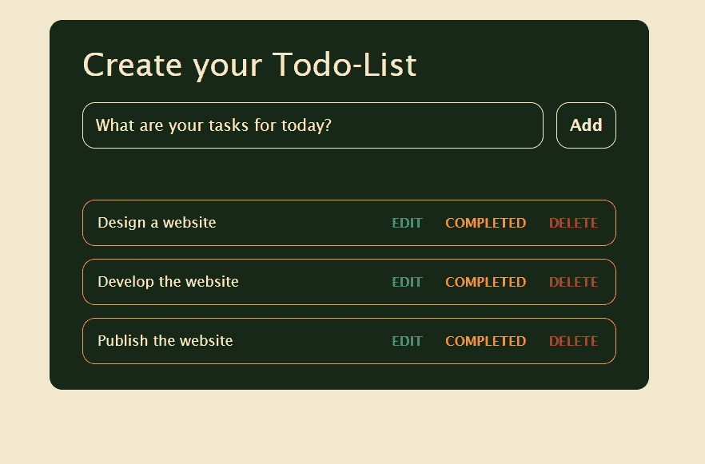

# 如何使用 JavaScript 创建待办事项列表

> 原文：<https://javascript.plainenglish.io/how-to-create-a-todo-list-using-javascript-5e126a93483?source=collection_archive---------0----------------------->

## 关于如何使用 HTML5、CSS3 和 JavaScript 构建待办事项列表的教程。

Photo by [Thomas Bormans](https://unsplash.com/@thomasbormans?utm_source=unsplash&utm_medium=referral&utm_content=creditCopyText) on [Unsplash](https://unsplash.com/s/photos/to-do-list?utm_source=unsplash&utm_medium=referral&utm_content=creditCopyText)

## 你今天的任务是什么？

你有没有遇到过这样的情况，你有很多事情要做，但不知道从哪里开始？嗯，这在我们人类中是很常见的事情。不知道该做什么会导致拖延或降低生产力。根据 Brian Tracy 的《吃掉那只青蛙》,克服拖延症和提高生产率的一个有效方法是将你的日常活动分解成具体的分步任务。本文将提供关于如何使用 HTML5、CSS3 和 JavaScript 构建待办事项列表的信息。本文面向熟悉 HTML5、CSS3 和 JavaScript 基础知识的人。本文不包括对 HTML5、CSS3 和 JavaScript 的详细阐述，但会提供源代码。

## **让我们开始吧**

首先，我们需要使用 HTML5 和 CSS3 创建 UI。

[**示例代码为 HTML**](https://gist.github.com/Firdaus85/f9fa2d0dd587f7a13335d4012dd9c05f)

**CSS 的示例代码**

**这是实现 HTML 和 CSS 后的样子**

Implementation of the html and Css code above

**现在是 JavaScript 的示例代码**

**最后，**这是添加 JavaScript 后的样子。

*点击“编辑”按钮将允许您编辑任务，点击“已完成”按钮将在该任务上划一条线表示完成，点击“删除”按钮将删除该特定任务。*

Implementation of the HTML, CSS, and JavaScript

**恭喜你，**你做到了。你建立了一个待办事项列表。

*更多内容请看*[***plain English . io***](https://plainenglish.io/)*。报名参加我们的* [***免费周报***](http://newsletter.plainenglish.io/) *。关注我们关于*[***Twitter***](https://twitter.com/inPlainEngHQ)[***LinkedIn***](https://www.linkedin.com/company/inplainenglish/)*[***YouTube***](https://www.youtube.com/channel/UCtipWUghju290NWcn8jhyAw)*[***不和***](https://discord.gg/GtDtUAvyhW) *。***