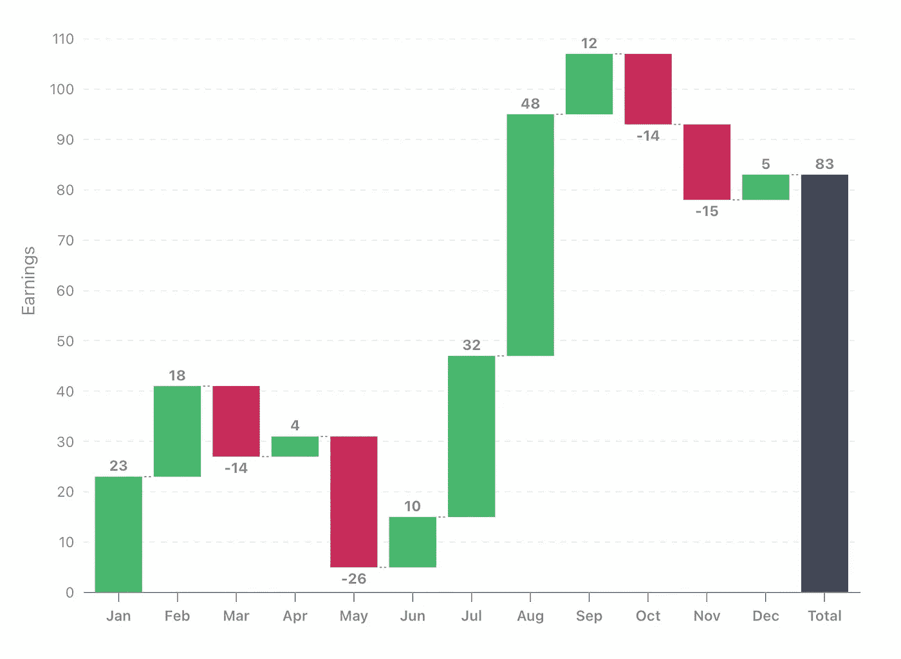
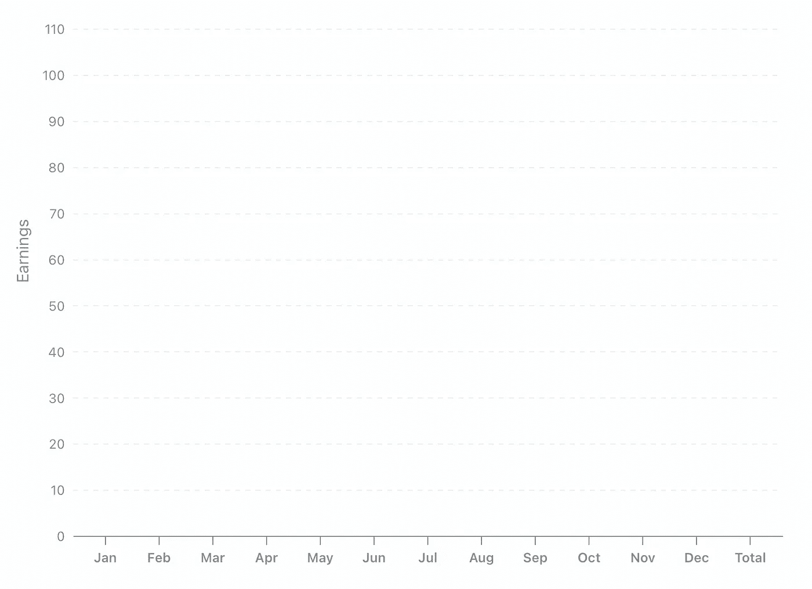
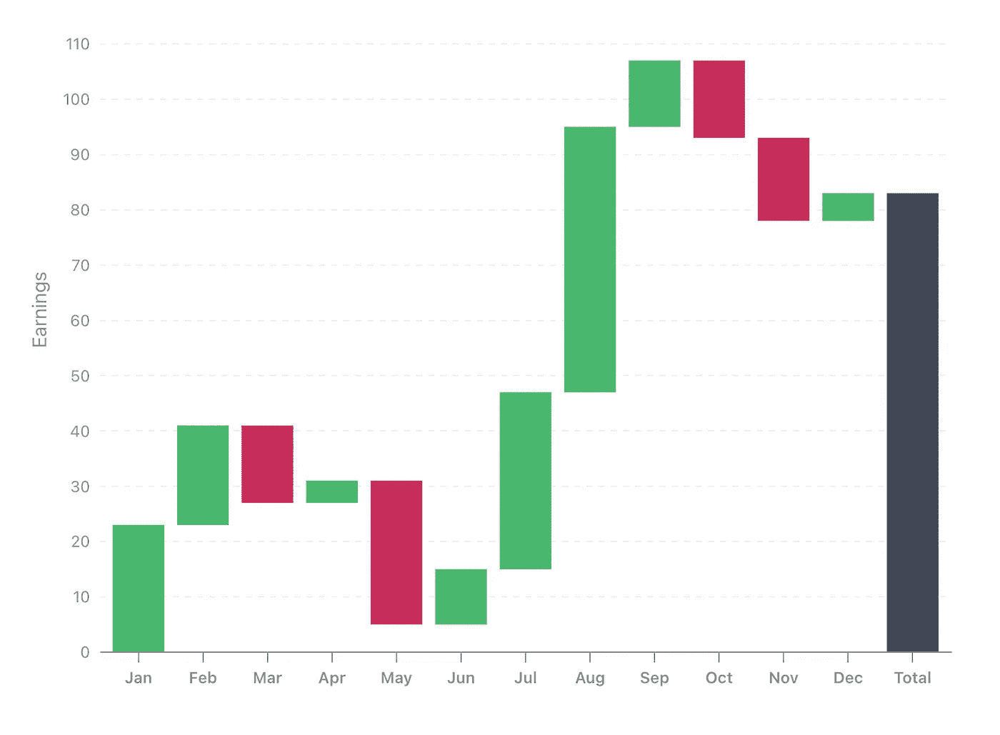
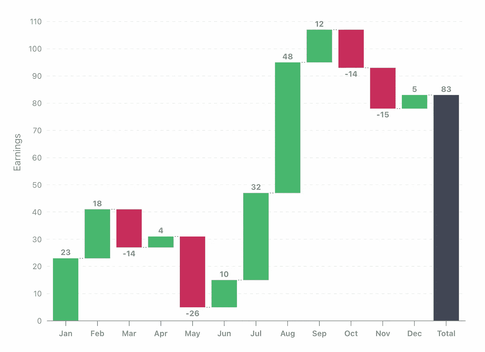

# 如何用 visx 创建瀑布图

> 原文：<https://javascript.plainenglish.io/how-to-create-a-waterfall-chart-in-react-with-visx-51ed1721dc77?source=collection_archive---------5----------------------->

## 关于如何使用 Airbnb 的 visx 库为 React web 应用程序创建瀑布图的教程。

# 介绍

在本教程中，我们将了解如何为 React web 应用程序创建瀑布图。首先，我们来了解一下什么是瀑布图。

# 什么是瀑布图？

瀑布图类似于条形图，除了它的累积性质。它显示了一系列的步骤，因此在每一步当前值被增加或减少，显示了累积的结果。图表的最后一条代表总值。



A waterfall chart we are going to build

# 技术

我们将使用 Airbnb 构建的 visx 库。Visx 是一组底层的可视化原语，它使用 d3 进行数学运算，使用 React 进行高效的 DOM 管理。与 eCharts、Recharts 和类似的库不同，它不提供一组现成的图表。即使它们提供了高质量的可定制图表，也不可能构建与这些库所提供的完全不同的全新可视化类型。另一方面，visx 提供了一组方便的构建块来创建任何定制的可视化。

# 项目设置

## 1.创建新的 React 项目

使用 create-react-app CLI 初始化 React + TypeScript 项目。

```
yarn create react-app waterfall-chart --template typescript
```

## 2.安装依赖项

安装所需的 visx 和 d3 阵列依赖项。

```
yarn add [@visx/axis](http://twitter.com/visx/axis) [@visx/grid](http://twitter.com/visx/grid) [@visx/group](http://twitter.com/visx/group) [@visx/scale](http://twitter.com/visx/scale) [@visx/shape](http://twitter.com/visx/shape) [@visx/text](http://twitter.com/visx/text) [@visx/responsive](http://twitter.com/visx/responsive) d3-arrayyarn add --dev [@types/d3-array](http://twitter.com/types/d3-array)
```

## 3.创建项目框架

我们将从创建瀑布图的基础开始。在 src 文件夹下创建以下文件:

Project boilerplate

该代码使用来自`@visx/responsive`包的`ParentSize` 组件，其目的是测量其父元素的尺寸，并将它们提供给子`WaterfallChart`组件。

# 构建瀑布图

在接下来的步骤中，我们将设计组件 API，并从轴和网格开始逐步构建图表，最后呈现数据标签。

## 1.定义组件 API

我们的图表应该支持可视化任意数据集。为了用类型安全支持它，让我们用描述数据形状的`TDatum`类型参数使组件通用化。我们还需要指定访问器函数来从单个数据点中检索 X 和 Y 值。

WatercallChart component API

## 2.计算瀑布条形图

下一步是从原始数据计算瀑布步骤。这可以通过使用累积值跟踪对数据进行顺序枚举来实现。在每一步，前一个累积值表示列的起点，终点通过加上或减去当前数据点值来表示。

Calculating waterfall steps from raw data

## 3.构建图表刻度

现在，当我们有实际值要呈现时，我们可以计算图表比例。 **Scale** 是一个将数据集值映射成可视值的函数，在我们的例子中是坐标。

对于`xScale`，我们的域是一组瀑布步骤，它们将映射到`[0, innerWidth]`的坐标范围内。`padding`参数定义条间距。

另一方面，为了计算 Y 轴域，我们需要遍历起始值和结束值，找到它们之间的最小值和最大值。然后我们将它映射到`[innerHeight, 0]`的坐标范围内。`nice`参数扩大了域间隔，以使用舍入值来更好地理解图形。

Creating chart scale functions

## 4.呈现图表轴

使用 scale 函数，我们能够呈现图表轴和背景网格。visx 库为我们将要使用的组件提供了现成的可配置组件。



Chart axes and a background grid

## 5.渲染瀑布台阶

使用图表刻度和先前计算的步骤，我们可以计算图表条的坐标及其高度，如下所示。

Rendering waterfall steps



Almost ready waterfall chart

## 6.添加标签和步骤连接

添加数据标签可以提高图表的可读性。下面的代码在条形的上方呈现正值，下方呈现负值。作为点睛之笔，让我们用虚线连接酒吧。

Render bars with data labels



The final result

# 结论

在本指南中，我们了解了什么是瀑布图，以及如何使用 visx 的低级原语来帮助 React 应用程序创建瀑布图。我希望你觉得这个指南有用。感谢您的阅读。

完整的源代码可以在我的 GitHub 上找到:[https://github.com/alxnddr/waterfall-chart-example](https://github.com/alxnddr/waterfall-chart-example)

*更多内容看* [***说白了。报名参加我们的***](https://plainenglish.io/) **[***免费周报***](http://newsletter.plainenglish.io/) *。关注我们关于* [***推特***](https://twitter.com/inPlainEngHQ) ，[***LinkedIn***](https://www.linkedin.com/company/inplainenglish/)*，*[***YouTube***](https://www.youtube.com/channel/UCtipWUghju290NWcn8jhyAw)*，* [***不和***](https://discord.gg/GtDtUAvyhW) *。***