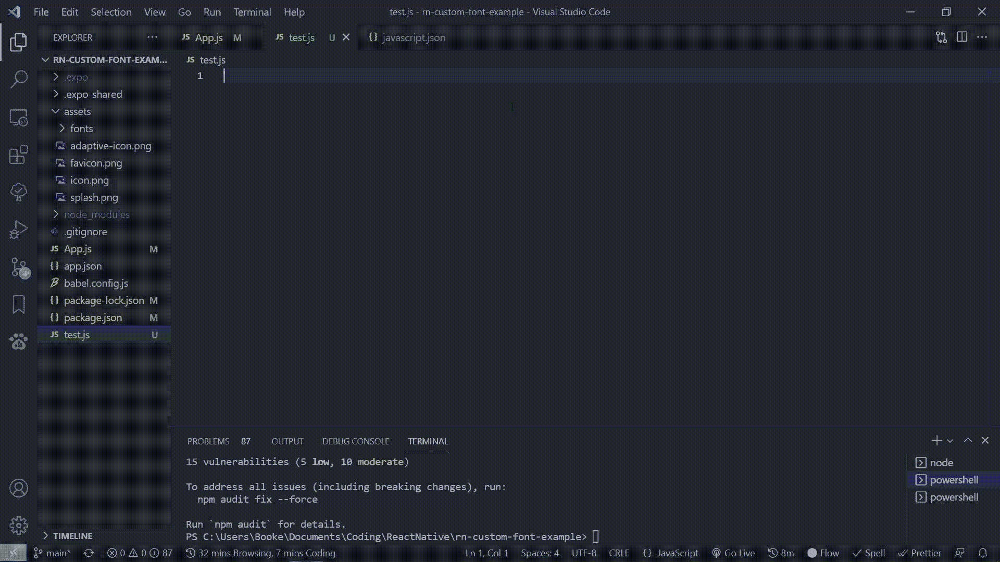
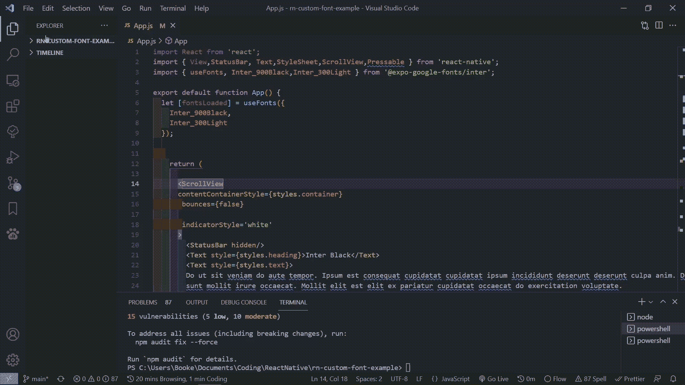
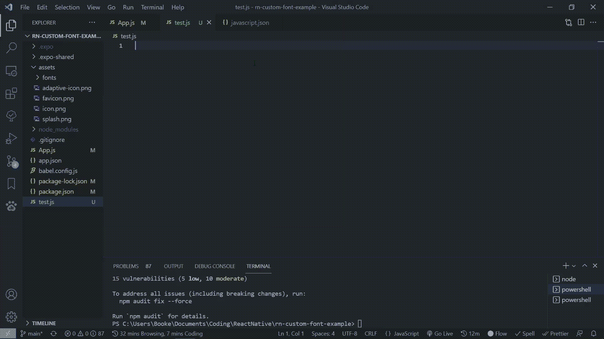

# 如何在 VSCode 中创建非常棒的定制代码片段

> 原文：<https://javascript.plainenglish.io/how-to-create-absolutely-awesome-custom-code-snippets-in-vscode-d26a420a452a?source=collection_archive---------5----------------------->

## 创建您自己的可重用代码行


Photo by [Luca Bravo](https://unsplash.com/@lucabravo?utm_source=medium&utm_medium=referral) on [Unsplash](https://unsplash.com?utm_source=medium&utm_medium=referral)

> 代码片段是开发人员提高工作效率的最简单的方法之一。

代码段是一小段可重用的代码，它可以使您不必键入重复的代码。

下面是一个在 vs 代码中使用代码片段的例子:



Example of using a Code Snippet in VSCode

为了理解 VSCode 中的代码片段，我们将创建一个代码片段，该代码片段创建一个包含 3 种情况和一个默认情况的 switch 语句。

# 理解片段的结构

在我们开始在 VSCode 中创建代码片段之前，我们首先需要理解代码片段的结构。

VSCode 中的代码片段是用 JSON 编写的，格式如下:

```
"TestSnippet": {
   "prefix": "tsn",
   "body": "console.log('This is from a test snippet!);",
   "description": "testing a snippet"
}
```

## 片段的不同部分

代码片段由四个不同的部分组成:前缀、正文、描述和名称。

**前缀**是一个字符串，当输入时将显示代码片段。

**主体**是代码片段被调用时显示的内容。

**描述**是由智能感知提供的可选描述。

和一个**名称**，它是代码片段的名称，如果描述为空，则在 IntelliSense 中使用。

# 创建我们的代码片段

既然我们对代码片段的构成有了基本的了解，那么是时候制作我们自己的自定义代码片段了。

## 打开代码片段菜单

VSCode 有一个专用于用户代码段的菜单。

如果你在 windows 上，菜单在**文件>首选项>用户片段**

在 mac 上，同样的菜单可以在**代码>偏好设置>用户片段**中找到

之后，您会看到一个下拉菜单，要求您输入代码片段的语言。对于本教程，我们将选择 JavaScript。



Opening the Snippet Menu in VSCode

## 向 Javascript.json 添加自定义代码段

现在我们已经导航到了正确的文件，是时候创建我们的代码片段了。

该片段的代码如下:

## 使用我们的自定义片段

我们的片段现在完成了。

我们所要做的就是在 VSCode 中进行测试

为此，在一个 javascript 文件中键入前缀 **sws** ，当您看到它出现在 IntelliSense 中时，按 enter 键。



Using our Custom Snippet

# 结论

感谢您阅读完我的文章**“如何在 VSCode 中创建非常棒的定制代码片段”**。如果你有任何问题，请随意提问，我会尽快回答。

我希望你有美好的一天。如果你刚接触媒体，你可以点击这里的链接[加入。](https://bookeraziz.medium.com/membership)

*更多内容看* [*说白了. io*](http://plainenglish.io/) *。报名参加我们的* [*免费每周简讯*](http://newsletter.plainenglish.io/) *。在我们的* [*社区*](https://discord.gg/GtDtUAvyhW) *获得独家写作机会和建议。*