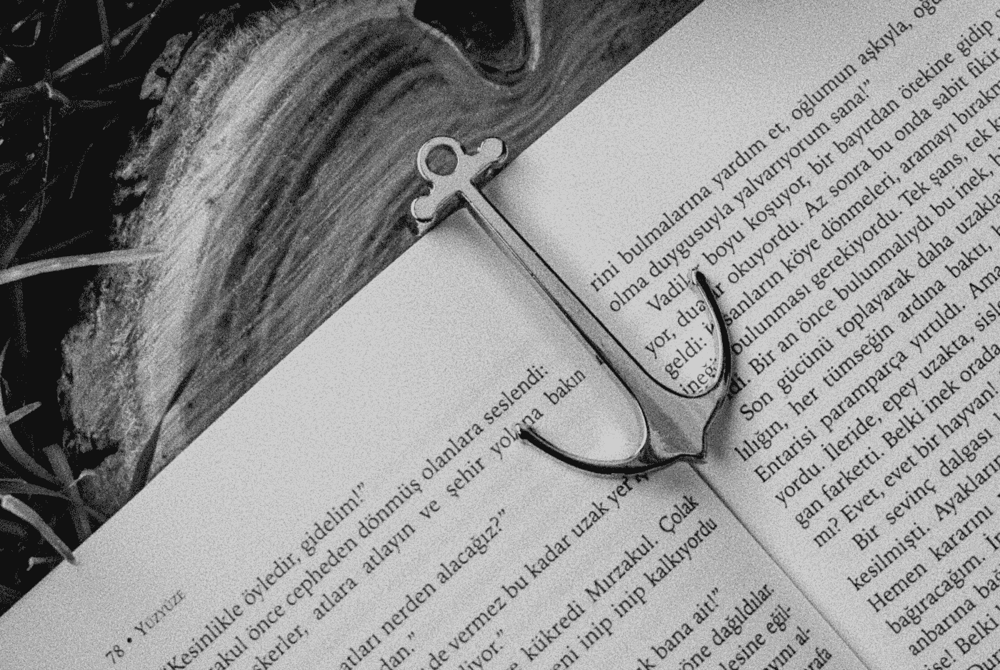
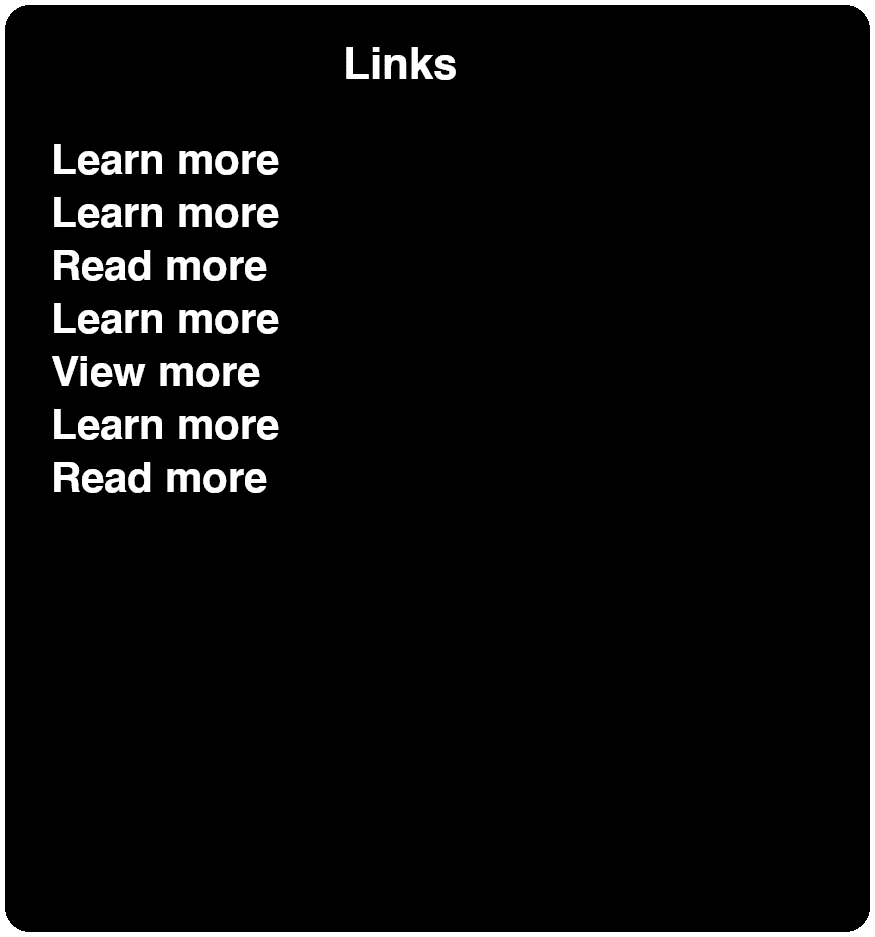
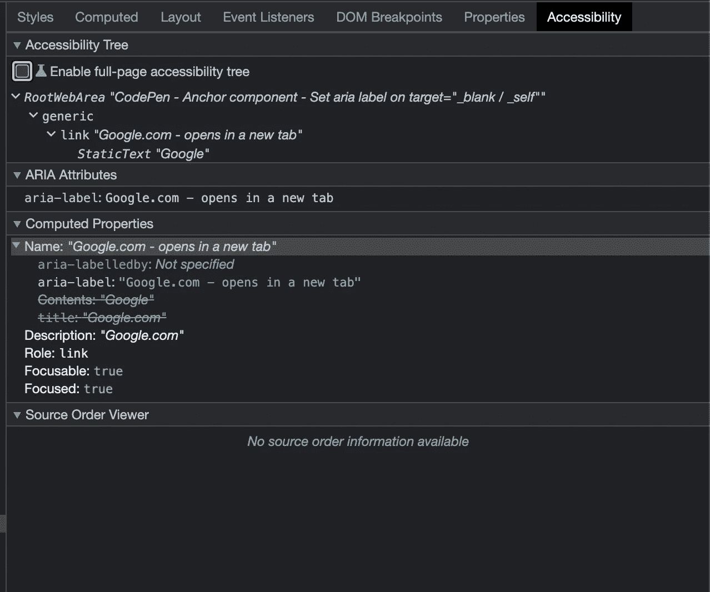

# 如何创建可访问的链接

> 原文：<https://javascript.plainenglish.io/how-to-create-accessible-links-427f449e3384?source=collection_archive---------10----------------------->

## 网页可访问性

## 深入改进 HTML 锚的可访问性

作为 web 开发人员，我们倾向于考虑代码可维护性、用户界面和满足最后期限。经常被忽视的是可访问性和安全性。在本文中，我想强调 HTML 锚元素的一些可访问性和安全性问题，以及我们如何在项目中快速解决这些问题。

## 在新标签页或窗口中打开链接

大多数 web 开发人员都知道，通过将锚点上的`target`属性分别设置为“ *_blank* ”或“ *_self* ”，可以在新的标签页或窗口中打开链接。

不太为人所知的是这对使用屏幕阅读器技术的人有什么影响。简单的答案是，屏幕阅读器不会提前通知用户这一点，当这种情况意外发生时，会令人沮丧。

有几种简单的方法可以解决这个问题。有些人建议使用 CSS 或 JavaScript 通过一个`:after`选择器添加隐藏文本，或者在锚内添加一个``元素，指示链接将在一个新标签中打开。

我相信这正是`aria-label`属性的用途。我们可以在每个链接上手动设置，如下例所示。

如果你想自动化这个，你也可以将这个逻辑添加到一个锚组件中，这样就可以确保它被自动添加。让我们看一个带有本地 web 组件的简单示例。

## 使用正确的链接文本

同样的问题也适用于锚文本。对于使用辅助工具的人来说，如果他们收到的关于链接的唯一上下文是例如以下文本之一，这不是一个好的体验:

*   点击这里
*   阅读更多
*   更大的
*   点击查看详情
*   了解更多信息

这在 web 设计的上下文中很有意义，但在屏幕阅读器用户要求页面上的链接列表时肯定没有意义。

Screenshot of a list of links on a page as shown by a screen reader.

这同样适用于使用实际的 URL 作为锚文本。这绝不是个好主意。

如果链接文本不能用来提供正确的上下文，那么这是另一个可以使用`aria-label`为盲人用户添加正确上下文的地方。如果你想知道给定元素的确切上下文，你可以使用 Chrome 开发者工具中的可访问性树特性。

Accessibility Tree feature in the Chrome Developer Tools

## 不要将链接中的所有字母大写

使锚文本完全大写可以成为一个链接或按钮在用户界面上看起来很棒的设计元素。对于屏幕阅读器来说，这要困难得多。通常，屏幕阅读器会一个字母一个字母地阅读这个单词。完全大写的文本通常是应该独立发音的字母组合，如 FBI、USA、UK、GB 和 EU。

为了达到同样的视觉效果，最好使用`text-transform: uppercase;` CSS 属性。

## 处理图像链接

一般不建议用图片做链接。链接的上下文更难传达给用户，尤其是没有视力的用户。然而，如果你需要使用图片作为链接，你至少可以尽可能清晰地描述信息。

通常，图像应该包含描述图像的替代文本。如果图像恰好是一个链接，那么它应该包含链接上下文。大多数屏幕阅读器将使用 alt 文本作为链接锚文本，这已经说明了为什么图像不应该首先用作链接。

Demo of two links with different alt text displaying context for the link.

## 从视觉上将链接与其他元素区分开来

强烈建议将链接与页面上的其他元素区分开来。最常见的方法是给链接另一种颜色。

链接的颜色应该足够不同，使得患有某种色盲的人仍然能够区分主文本颜色和链接文本颜色。链接和周围文本之间的对比度必须至少为 3:1。

如果您选择不对链接使用不同的颜色，您也可以选择始终给文本加下划线。但是如果这与你的用户界面冲突，并且你不想要这些东西，WCAG 指南提供了一些规则。

*   悬停时必须出现非彩色指示器，如下划线
*   周围文本和背景之间的对比度必须至少为 4.5:1
*   链接和背景之间的对比度必须至少为 4.5:1
*   链接和周围文本之间的对比度必须至少为 3:1。

## 焦点样式

当用户使用键盘浏览网站时，他们应该有清晰的焦点样式来指示他们当前关注的内容。在现代 web 开发中，移除焦点上使用的默认浏览器`outline`样式是很常见的。

虽然，去掉这个没问题。确保实现一个清晰的焦点样式，让你的用户可以看到和区分。

## 结论

对于网站开发者来说，考虑网站的可访问性是非常重要的。只需一点点努力，就能极大地改善使用某种辅助技术的用户的体验。

我希望你从这篇文章中学到了一些东西。如果你有任何补充或反馈，请在评论中告诉我。

如果你喜欢我的内容并想支持我的努力，考虑通过[我的会员链接](https://medium.com/@WesleySmits/membership)成为一个媒体订阅者。这不会花费你任何额外的费用，但 Medium 会把部分收益给我，让我推荐你。

如果你愿意，你可以在 [LinkedIn](https://www.linkedin.com/in/wesley-robert-smits/) 或 [Twitter](https://twitter.com/iamwesleysmits) 上与我联系！

 [## 通过我的推荐链接加入 Medium-Wesley Smits

### 阅读韦斯利·斯密特(以及媒体上成千上万的其他作家)的每一个故事。您的会员费直接支持…

medium.com](https://medium.com/@WesleySmits/membership) 

*更多内容看* [***说白了就是***](https://plainenglish.io/) *。报名参加我们的* [***免费周报***](http://newsletter.plainenglish.io/) *。关注我们关于* [***推特***](https://twitter.com/inPlainEngHQ) ， [***领英***](https://www.linkedin.com/company/inplainenglish/) *，*[***YouTube***](https://www.youtube.com/channel/UCtipWUghju290NWcn8jhyAw)*，以及* [***不和***](https://discord.gg/GtDtUAvyhW) *。对增长黑客感兴趣？检查* [***电路***](https://circuit.ooo/) *。*