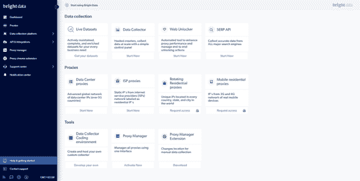
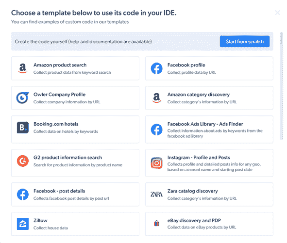

# 如何使用数据收集器创建亚马逊产品搜索 API

> 原文：<https://javascript.plainenglish.io/how-to-create-an-amazon-product-search-api-with-data-collectors-7d8b03676a52?source=collection_archive---------10----------------------->

## 如何利用 Bright Data 的数据收集器来收集 Amazon.com 的数据，然后创建一个产品搜索 API，你可以将它部署到网络上并从中获利。

# API 简介

API(应用程序编程接口)是两台或多台计算机之间的一种通信方式，目的是将请求的数据从一台计算机传递到另一台计算机。API 可以共享一个文档片段，该文档片段随后可以被发出请求的计算机作出相应的反应。


文档可以代表可以从一台计算机安全传输(授权技术)到另一台计算机的私有数据。

## 为什么公司使用 API 很重要？

API 是创建数据驱动的管理系统的一种很好的方式，因为我们可以创建自己的数据处理系统，它可以在不需要开发人员不断观察的情况下进行自我管理。

端点的响应可能因请求正文(POST 请求)、URL 参数或 URL 查询(如果存在)而异。这意味着在响应对象中有多种方式可以返回数据。

API 解决了许多公司可能面临的现实问题，其中之一就是数据自动化。开发人员使用数据自动化来创建请求的自动处理，这样就不需要单独的部分或第三方服务来处理请求。

## 谁能从 API 的存在中获益？

创建 API 的好处是可以真正帮助公司和个人项目管理数据。

我们可以使用 API 在所有公司的应用程序之间进行数据集成，以便从端点检索的数据在发出请求的任何地方都是实时的。它们为在一个地方检索和管理数据提供了一种清晰的方式，我们可以将最终产品用于一个公司中的多个数据消费平台。

另一个很棒的特性是开发人员体验，从开发人员的角度来看，实现更改和关注 API 是很简单的，因为每个特性都有一个相应的地方，在发布之前可以在那里实现和测试更改。

# 刮 Amazon.com

Web 抓取用于从网站的 DOM 元素值中提取数据。抓取 web 的抓取者可以获得 DOM 结构中某些元素的直接路径，并提取元素的值。收集的值可以传递给 API 的响应。

例如，如果一家公司想在他们的网站上展示受欢迎的产品，我们可以为亚马逊的网站制作一个抓取 API。那里的一些产品有一个“畅销”指示标签，一旦我们收集了所有这些产品，我们就可以在一个响应对象中返回它们。

## 从哪里可以获得 API 数据？

我们需要一个工具，可以用特定的产品搜索来搜索亚马逊的网站，然后返回所有符合搜索要求的产品以及它们的标题、评论、评级和价格。

网络上有各种各样的选项可以用来抓取网站，但我们将使用 Bright Data 的[数据收集器服务](https://brightdata.grsm.io/data-collector8081)，它可以做得更多。Bright Data 使用机器人通过一组我们可以定义的特定指令来抓取 web。机器人按顺序遵循这些指令，然后返回一个抓取值的列表。

## 数据收集器

前往 BrightData.com[的](https://brightdata.grsm.io/3k8dv4026g8z)，点击*注册*按钮，注册一个新账户。注册后，您将被重定向到您的主页，在这里您将选择数据收集器部分下的*立即开始*按钮。



在这里，我们可以管理所有的数据收集器。要创建一个新的，点击*开发一个自我管理的收集器*，会出现一个弹出窗口，里面有各种预建的模板。如果我们想要创建一个定制的 scraper，单击*从头开始*按钮，但是在这种情况下，我们将使用*亚马逊产品搜索*模板。有各种各样的社交媒体、酒店和商店模板可供我们使用。



# 在 Node.js 中创建 API

在本教程中，我们将使用 Node.js(带有 Express 和 Axios 包)来创建一个 API 服务器。该服务器将只有一个带有自定义参数的端点，该参数将指示我们要搜索的产品。

## 创建应用程序

我们将从一个空目录开始，并在那里打开命令行。假设我们的计算机上安装了 Node.js，我们将运行命令 *npm init -y* 来启动一个新的 Node.js 项目。

```
npm init -y
```

一旦启动了一个目录，我们需要在其中安装 Express 和 Axios 包。Express 用于创建带有自定义端点的服务器，Axios 用于创建对 web 的 REST 请求。

```
npm i express express axios
```

现在，我们可以创建一个 index.js 文件来保存服务器信息。首先，我们需要将之前安装的包导入到我们的项目中。

```
*const* **express** = require('express');
const **axios** = require('axios').default;
```

导入包之后，我们需要建立一个 Express server 应用程序，方法是将导入的包作为一个函数调用，并在一个自定义端口监听它。

```
const **express** = require(‘express’);
const **axios** = require(‘axios’).default;
const **app** = express();app.**listen**(8080, () => console.log(‘Listening on port 8080.’));
```

现在，我们将最终创建一个带有自定义产品参数的 async-await 端点。我们需要首先从 URL 获取参数，然后向 Bright Data 的服务器数据收集器发出 get 请求，以启动新的抓取操作。请求需要包含一个产品关键字和一个带有 API 令牌的授权头。请求完成后，我们得到一个带有 *collection_id* entry 对象的响应，并将其存储到一个变量中。

```
const **express** = require(‘express’);
const **axios** = require(‘axios’).default;
const **app** = express();app.**get**(‘/:product’, async(req, res) => {
    const { **product** } = req.params; const **collector** = await axios.post(
        ‘https://api.brightdata.com/dca/trigger?collector=ID',
        [{ ‘keyword’: product }],
        { headers: { ‘Authorization’: ‘Bearer API_TOKEN’ }   
    });
});app.**listen**(8080, () => console.log(‘Listening on port 8080.’));
```

现在，我们可以创建我们的第二个请求，它将是 POST 类型，并将被定向到保存这个 API 搜索的数据的特定数据集。从前面的请求中，我们需要提取出 *collection_id* 条目，并将其传递给第二个请求的 URL。这个请求将只包含具有相同 API 令牌的授权头。

```
const **express** = require(‘express’);
const **axios** = require(‘axios’).default;
const **app** = express();app.**get**(‘/:product’, async(req, res) => {
    const { product } = req.params;

    const **collector** = await axios.post(
        ‘https://api.brightdata.com/dca/trigger?collector=ID',
        [{ ‘keyword’: product }],
        { headers: { ‘Authorization’: ‘Bearer API_TOKEN’ }
    }); const **dataset** = await axios.get(
        `https://api.brightdata.com/dca/dataset?id=
        ${collector.data.collection_id}`,
        { headers: { ‘Authorization’: ‘Bearer API_TOKEN’ }
    });
});app.**listen**(8080, () => console.log(‘Listening on port 8080.’));
```

在每个请求的 URL 的末尾，我们需要用数据收集器的 ID 替换 ID，我们可以在 URL 的最后一个查询中找到该信息。在授权头中，我们还需要将 API_TOKEN 替换为您帐户的 API 令牌，我们可以在 API 令牌部分下的帐户设置中创建一个。

现在，我们需要用 *res.json()* 返回数据收集器从端点的产品搜索中收集的值。

```
const **express** = require(‘express’);
const **axios** = require(‘axios’).default;
const **app** = express();app.**get**(‘/:product’, async(req, res) => {
    const { product } = req.params;

    const **collector** = await axios.post(
        ‘https://api.brightdata.com/dca/trigger?collector=ID',
        [{ ‘keyword’: product }],
        { headers: { ‘Authorization’: ‘Bearer API_TOKEN’ }
    }); const **dataset** = await axios.get(
        `https://api.brightdata.com/dca/dataset?id=
        ${collector.data.collection_id}`,
        { headers: { ‘Authorization’: ‘Bearer API_TOKEN’ }
    });return res.**json**(dataset.data);
});app.**listen**(8080, () => console.log(‘Listening on port 8080.’));
```

# 部署 API

部署 API 是将数据管理系统上传到互联网的过程。一旦全部上传完毕，您的数据消费平台就可以访问您的 API，并最终发出真实的请求。

## 刮网合法吗？

你可能想知道从网上抓取信息是否合法，这听起来像“剑桥分析”的情况，但我可以向你保证它不是。根据美国上诉法院的裁决，任何在网络上公开的信息都可以出于不同的目的而被收集。

另一方面，当你试图恶意获取任何私人或个人信息时，会给你带来麻烦。

## 在哪里部署和货币化你的 API？

将 API 部署到 web 对于请求应用程序的正确可达性至关重要。一旦它存在于 web 上，只有这样你的应用程序才能访问并请求你的 API(除非有意在本地运行它)。

我们可以在 Heroku.com 的[平台上免费托管我们的 API，要在那里创建一个应用程序，你首先需要注册。在您的仪表盘上，点击*新建*按钮，并选择*创建新应用*选项。填写信息并点击*创建*。现在，如果您在 GitHub 上有 API 存储库，选择该选项，连接它，并在页面底部选择 *Deploy Branch* 。](http://heroku.com/)

网络上有很多选择来赚钱访问你的 API，但是最流行的是 RapidAPI.com。在另一次注册之后，您可以转到*我的 API*选项卡，创建一个新项目，然后按照步骤将其与您的 API 集成。

# 结论

创建具有从 web 抓取信息能力的 API，会使您的业务在传输信息、收集信息和开发人员体验方面变得更加强大。

你应该为你的公司或你自己创建一个 API 的原因有很多，但是保持简单，一个词——集成。

我希望这篇文章对你尝试为自己创建一个 API 有足够的价值，并且你会从中得到一些建议。