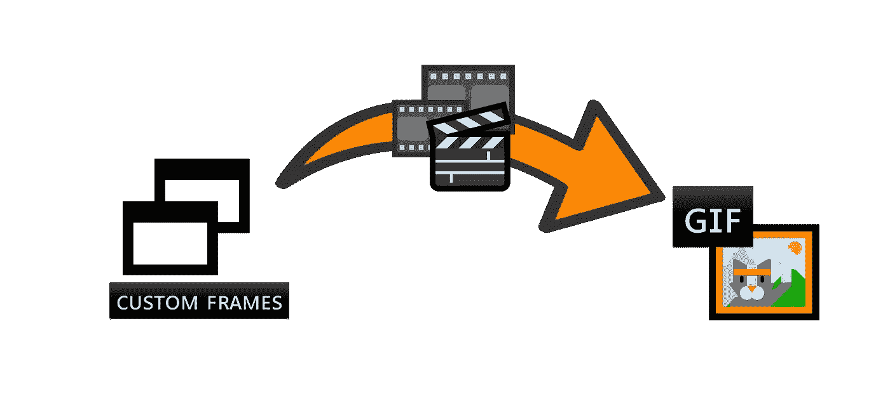
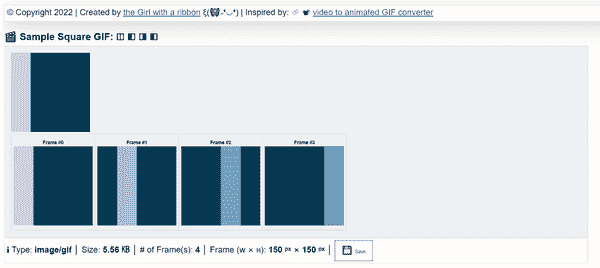
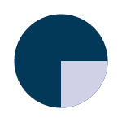

# 如何使用客户端 JavaScript 从自定义画布帧创建动画 GIF

> 原文：<https://javascript.plainenglish.io/how-to-create-an-animated-gif-from-custom-canvas-frames-with-client-side-javascript-696b1ba933ba?source=collection_archive---------0----------------------->

## 基于浏览器的离线实现指南，包含完整代码。



Illustration by Author | An overview of the creation process which involves merging multiple canvas frames into a single GIF file

在我最近的一篇文章中，我探索了如何使用 [GIFEncoder.js](https://raw.githubusercontent.com/incubated-geek-cc/video-to-GIF/main/js/GIFEncoder.js) 来转换一个短视频剪辑 **(.mp4，。avi 等。)**转换成 [**图形交换格式【GIF】**](https://docs.fileformat.com/image/gif/)**文件并详细讲解了分步教程:**

**[](/how-to-convert-a-video-clip-to-a-gif-file-with-client-side-javascript-56575d093191) [## 如何使用客户端 JavaScript 将视频剪辑转换为 GIF 文件

### 基于浏览器的离线实现。包含完整代码的链接。

javascript.plainenglish.io](/how-to-convert-a-video-clip-to-a-gif-file-with-client-side-javascript-56575d093191) 

本质上，上面的文章展示了以下 **3 个 JavaScript 插件**的主要功能:

*   [GIFEncoder.js](https://raw.githubusercontent.com/incubated-geek-cc/video-to-GIF/main/js/GIFEncoder.js)
*   [LZWEncoder.js](https://raw.githubusercontent.com/incubated-geek-cc/video-to-GIF/main/js/LZWEncoder.js)
*   [NeuQuant.js](https://github.com/incubated-geek-cc/video-to-GIF/blob/main/js/NeuQuant.js)

**参考消息:**这些插件最初是由 GitHub 用户 [Kevin Kwok](https://github.com/antimatter15) (创建者)从 GitHub repo [jsgif](https://github.com/antimatter15/jsgif) 中检索出来的。

> 然而，在本文中，我希望通过展示一个替代用例来展示完全相同的插件的多功能性——即使用自定义画布框架从头开始创建 GIF 图像。



Image by Author | The above is a sample preview of the output browser tool from this tutorial. The appearance of GIF rendered such as colours and shape can be altered according to preferences on the code level.

## GIF 创建概述

## 先决条件:包含在以上 3 个文件中+ [b64.js](https://raw.githubusercontent.com/antimatter15/jsgif/master/b64.js) 如下:

```
<script type="text/javascript" src="LZWEncoder.js"></script>
<script type="text/javascript" src="NeuQuant.js"></script>
<script type="text/javascript" src="GIFEncoder.js"></script>
<script type="text/javascript" src="b64.js"></script>
```

(可选)*由于最终渲染的 GIF 包含不同颜色深浅的* ***帧*** *，请随意使用插件*[*color brewer . js*](https://colorbrewer2.org/export/colorbrewer.js)*进行颜色选择。*

```
<script type="text/javascript" src="LZWEncoder.js"></script>
<script type="text/javascript" src="NeuQuant.js"></script>
<script type="text/javascript" src="GIFEncoder.js"></script>
<script type="text/javascript" src="b64.js"></script>

<script type='text/javascript' src='js/colorbrewer.js'></script>
```

Code Snippet by Author | The above renders all colour palettes present in [*colorbrewer.js*](https://colorbrewer2.org/export/colorbrewer.js) *where* **colorbrewerDisplay** is an HTML DOM element `**<p id=’colorbrewerDisplay’></p>**`

## 技术实施—总共 4 个步骤

## 步骤(1):创建一个 HTML 画布元素

由于`GIFEncoder`实例合并了通过`[**CanvasRenderingContext2D**](https://developer.mozilla.org/en-US/docs/Web/API/CanvasRenderingContext2D)`渲染的每一帧，因此有必要在 JavaScript 代码中初始化一个`<canvas></canvas>`元素。

```
const canvas = document.createElement('canvas');
const w=150;
const h=150;

canvas.width=w;
canvas.height=h;
const ctx = canvas.getContext('2d');
```

*   请注意，画布元素的尺寸以像素为单位。在这种情况下，为简单起见，将其设置为 **150px × 150px** 。

## 步骤(2):实例化 GIFEncoder 实例，定义其他变量。

输出 GIF 的高度(`h`)和宽度(`w`)都是在前面的步骤中定义的。

假设总共有 **4 帧(** `**noOfFrames = 4**` **)** ，**包含在数组`colorPalette`中的 4 种不同色调**必须为每一帧定义如下:

```
const colorPalette=['#d0d1e6','#a6bddb','#74a9cf','#3690c0'];
const baseColor='#023858';
```


Image by Author | The above values are retrieved from the [*colorbrewer.js*](https://colorbrewer2.org/export/colorbrewer.js) *library as illustrated above. | Category of the sequential palette is* ***PuBu*** *which refers to* purple-blue colors with increasing saturation.

## 步骤(3):实例化 GIFEncoder 实例和其他变量。

为了存储每个画布帧并生成后续的 GIF 输出，创建一个`GIFEncoder`实例:

```
const encoder = new GIFEncoder(w, h);
encoder.setRepeat(0);
encoder.setDelay(500); // in milliseconds
encoder.start();
```

*   `encoder.setDelay(500)`表示过渡到下一帧之前的时间间隔(即半秒)

```
const slice = h / noOfFrames; // h = 150 | noOfFrames = 4
const squareBackground = () => { // ctx refers to Canvas context
    ctx.fillStyle = baseColor;
    ctx.fillRect(0, 0, w, h);
};
const generateSquareFrame = (frameIndex) => { // frameIndex starts at 0
    squareBackground();
    ctx.fillStyle = colorPalette[frameIndex];
    ctx.fillRect(slice*frameIndex, 0, slice, h);
    encoder.addFrame(ctx);
};
```

*   `slice`指彩色矩形的宽度，因为输出 GIF 图像实际上是每帧呈现一个不同阴影的矩形


Preview by Author | There are 4 different colour shades being flashed in total (1 shade per frame) | Note that each coloured rectangle is exactly ¼ of the GIF’s width ⇾ 150px ÷ 4 = 37.5px | `baseColor` refers to the background colour of the entire GIF which is area not occupied by the moving coloured rectangle.

*   函数`generateSquareFrame`根据帧序列(`frameIndex`)渲染矩形切片的颜色阴影和位置
*   `encoder.start()`参数设定后

## 步骤(4):生成和合并所有 4 帧，以创建 GIF 输出

最后，在通过 for 循环创建并合并每个帧后，事件`ended`将在`GIFEncoder`调用方法`finish()`时发出:

```
for(let f=0;f<noOfFrames;f++) {
    generateSquareFrame(f);
}
encoder.finish();
```

为了从`encoder`中提取出所有帧*(即 GIF 输出)*的合并版本，需要实现以下 JavaScript 代码片段:

```
var fileType='image/gif';
var readableStream=encoder.stream();
var binary_gif=readableStream.getData();
var b64Str='data:'+fileType+';base64,'+encode64(binary_gif);
```

*   `encode64()`是 [b64.js](https://raw.githubusercontent.com/antimatter15/jsgif/master/b64.js) 中的一个方法，用于将`GIFEncoder`捕获的流数据转换为 Base64 格式。
*   `b64Str`指的是通过合并`GIFEncoder`中出现的所有帧为 GIF 文件编码的数据。因此，在 HTML 代码中，继续包含:``来预览输出的 GIF 文件。

## GIF 文件的下载链接创建如下:

```
let dwnlnk = document.createElement('a');
dwnlnk.download = fileName;
dwnlnk.innerHTML = `💾 <small>Save</small>`;
dwnlnk.className = 'btn btn-outline-dark';
dwnlnk.href = b64Str;
```

## 仅供参考:完整的代码实现在我的 GitHub:[canvas-frames-to-GIF](https://github.com/incubated-geek-cc/canvas-frames-to-GIF)(随意★它或🔱叉起来！)或者在 [demo](https://incubated-geek-cc.github.io/canvas-frames-to-GIF/) 查看！** 

## **个人评论**

*   **虽然本文的演示展示了一个正方形的 GIF 输出，但是完全可以根据个人喜好改变形状和颜色。**

****

**Preview by Author | Instead of a square, I chose to render the shape of a circle for the GIF output instead.**

## **关于变换画布形状的更多提示和技巧，请参考 [HTML 画布教程](https://www.html5canvastutorials.com/)。**

**现在你知道了！非常感谢你坚持到这篇文章的结尾！❤希望你觉得这个指南有用，如果你想了解更多 GIS、数据分析& Web 应用相关的内容，请随时[关注我的 Medium](https://medium.com/@geek-cc) 。会非常感激—😀**

**— 🌮请给我买一份玉米卷🎀˶❛◡❛)**

**[](https://geek-cc.medium.com/membership) [## 通过我的推荐链接加入灵媒——李思欣·崔

### 获得李思欣·崔和其他作家在媒体上的所有帖子！😃您的会员费直接…

geek-cc.medium.com](https://geek-cc.medium.com/membership) 

*更多内容请看* [***说白了。报名参加我们的***](https://plainenglish.io/) **[***免费周报***](http://newsletter.plainenglish.io/) *。关注我们*[***Twitter***](https://twitter.com/inPlainEngHQ)*和*[***LinkedIn***](https://www.linkedin.com/company/inplainenglish/)*。加入我们的* [***社区不和谐***](https://discord.gg/GtDtUAvyhW) *。*****