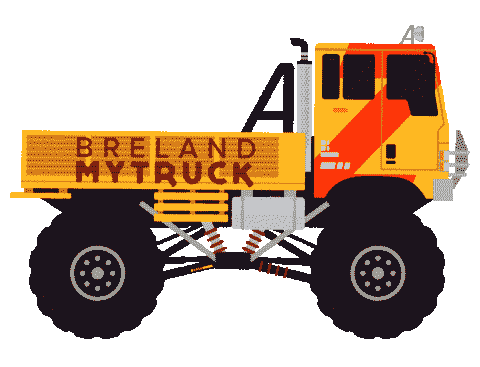

# 如何使用 CSS 和 HTML 创建动画道路交通

> 原文：<https://javascript.plainenglish.io/how-to-create-an-animated-road-traffic-using-css-and-html-ee41239bd09a?source=collection_archive---------5----------------------->

## 两步指南创建动画道路只使用 HTML 和 CSS。

交通被描述为车辆中的汽车或人，以及延迟，包括通过某个位置的运输或移动。

你有没有想过我们是否可以使用计算机语言来创造动画道路交通？那么，我们开始吧。

我想向你展示只用基本的 HTML 和 CSS 就能为动画道路交通创建一个动画设计是多么容易。

因此，在这篇文章中，我将向你展示如何通过 2 个步骤来创建它。

## 步骤 01

创建一个 index.html 文件，并编写下面的代码。

## 第二步:

创建一个 style.css 文件来设计样式，并编写下面的代码。

确保所有的图像、mp3 文件和 CSS 文件完美链接。

你可以在这里下载背景图片。

background.jpg

你可以在这里下载这些树的图片。

trees.png

你可以在这里下载这条路的图片。

road.png

你可以在这里下载巴士的图片。

bus.png

你可以在这里下载这辆车的图片。

car.png

你可以在这里下载轮子的图片。

wheel.png

你可以在这里下载这辆自行车的 gif 图片。

bike.gif

你可以在这里下载这辆自行车的 gif 图片。

bicycle.gif

你可以在这里下载卡车的 gif 图片。

lorry.gif

您可以在此下载道路交通声音的声音 1 和声音 2 mp3 曲目。

[声音 01](https://elements.envato.com/traffic-jam-with-honking-E9D7WYX)

[声音 02](https://elements.envato.com/city-traffic-1-LFDMFJ7)

希望这对你有帮助。如果你在实现这个过程中有任何困难或者你需要任何帮助，请联系我。

*更多内容看* [***说白了就是***](http://plainenglish.io/) *。报名参加我们的* [***免费周报***](http://newsletter.plainenglish.io/) *。在我们的* [***社区获得独家访问写作机会和建议***](https://discord.gg/GtDtUAvyhW) *。*