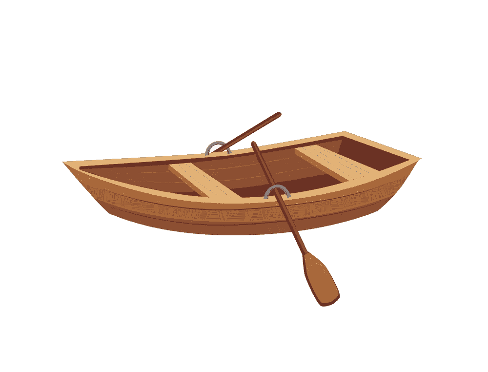

# 如何使用 CSS 和 HTML 创建一个动画海洋

> 原文：<https://javascript.plainenglish.io/how-to-create-an-animated-sea-using-css-html-8f9996170331?source=collection_archive---------11----------------------->

## 两步指南创建动画海只使用 HTML 和 CSS。

暴露在阳光和海洋空气中对你的精神健康有益。“冲浪疗法”已经被证明可以改善你的情绪。进入水中并四处走动有助于你更加清醒，同时也得到一些锻炼。它有助于缓解紧张。

你有没有考虑过我们可以用计算机语言创造一个动画海洋？那么，让我们开始吧…

我想向你展示只使用基本的 HTML 和 CSS 就能为动画海洋创建一个动画设计是多么容易。

因此，在这篇文章中，我将向你展示如何通过 2 个步骤来创建它。

## 步骤 01

创建一个 index.html 文件，并编写下面的代码。

## 第二步:

创建一个 style.css 文件来设计样式，并编写下面的代码。

确保所有的图片和 CSS 文件链接完美。

你可以在这里下载这艘船的图片。

ship.png

你可以在这里下载这艘船的图片。

boat.png

你可以在这里下载天空背景的图片。

sky.jpg

你可以在这里下载水背景的图片。

water.png

希望这对你有帮助。如果你在实现这个过程中有任何困难或者你需要任何帮助，请联系我。

*更多内容看* [*说白了. io*](http://plainenglish.io/) *。报名参加我们的* [*免费每周简讯*](http://newsletter.plainenglish.io/) *。在我们的* [*社区*](https://discord.gg/GtDtUAvyhW) *获得独家写作机会和建议。*