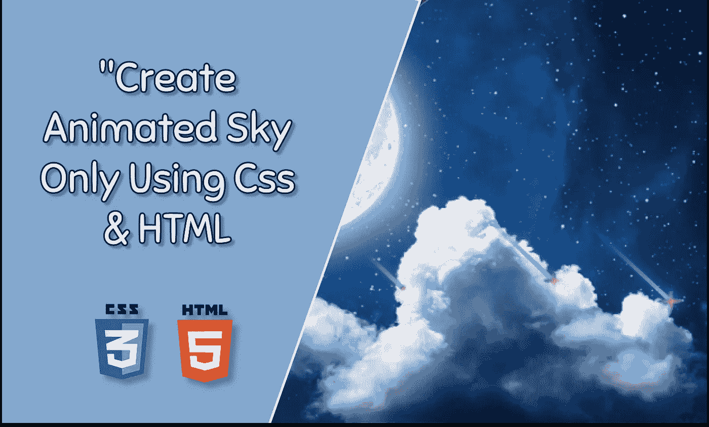
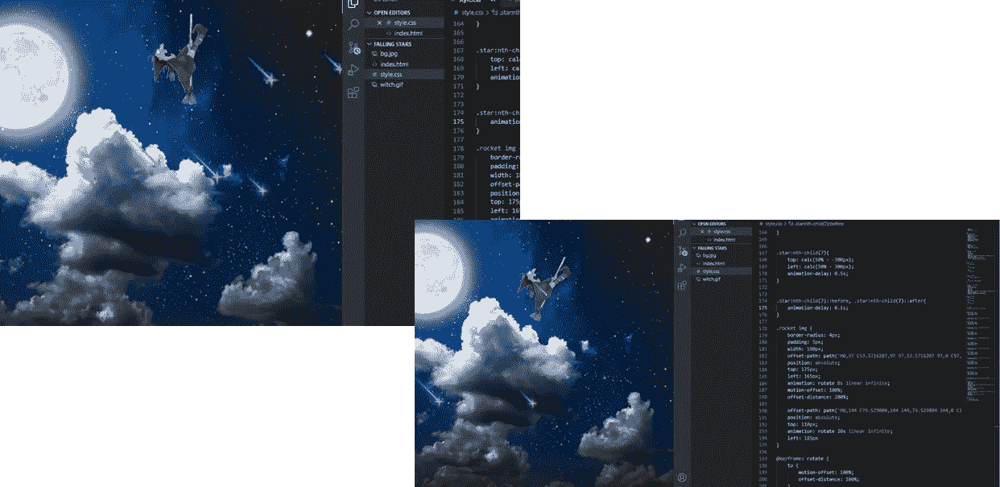
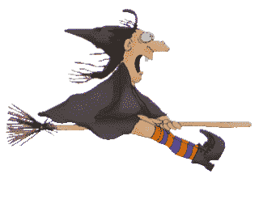

# 如何使用 CSS 和 HTML 创建一个动画天空

> 原文：<https://javascript.plainenglish.io/how-to-create-an-animated-sky-using-css-and-html-bd75acef16a8?source=collection_archive---------9----------------------->

## 两步指南创建动画天空只使用 HTML 和 CSS。

事实证明，凝视天空可以帮助你正确看待自己的感受，从而缓解压力。

根据生态心理学家莎拉·康恩的说法，仅仅意识到天空可能会帮助有压力的人在更大的背景下看待他们的问题。

你有没有想过我们是否可以用计算机语言来创造动画天空？那么，我们开始吧。

我想向你展示，只用基本的 HTML 和 CSS 就能为动画天空创建一个动画设计是多么容易。

因此，在这篇文章中，我将向你展示如何通过 2 个步骤来创建它。

## 步骤 01

创建一个 index.html 文件，并编写下面的代码。

## 第二步:

创建一个 style.css 文件来设计样式，并编写下面的代码。

确保所有的图像、mp3 文件和 CSS 文件完美链接。

你可以在这里下载背景图片。

bg.jpg

你可以在这里下载女巫的 gif。

witch.gif

希望这对你有帮助。如果你在实现这个过程中有任何困难或者你需要任何帮助，请联系我。

*更多内容请看*[***plain English . io***](https://plainenglish.io/)*。报名参加我们的* [***免费周报***](http://newsletter.plainenglish.io/) *。关注我们关于*[***Twitter***](https://twitter.com/inPlainEngHQ)*和*[***LinkedIn***](https://www.linkedin.com/company/inplainenglish/)*。加入我们的* [***社区不和谐***](https://discord.gg/GtDtUAvyhW) *。*