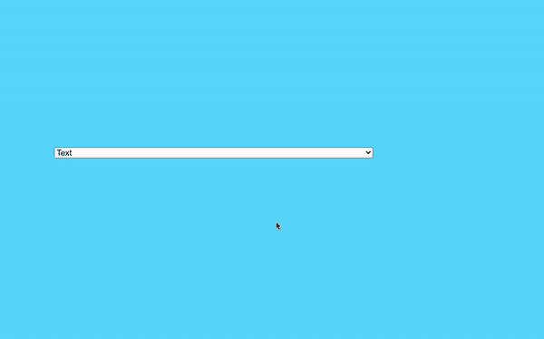

# 如何创建可自动调整大小的选择框(无 jQuery)

> 原文：<https://javascript.plainenglish.io/how-to-create-an-auto-resizable-selectbox-no-jquery-db4bf4fff5d0?source=collection_archive---------13----------------------->

## SelectBox 的一个有趣问题

Photo by [Lautaro Andreani](https://unsplash.com/@lautaroandreani?utm_source=medium&utm_medium=referral) on [Unsplash](https://unsplash.com/?utm_source=medium&utm_medium=referral)

你有没有遇到过这样的问题，你认为这个问题很简单，但当你试图实现它时，你却面临一些意想不到的问题？。最近我就是这种情况。我在做一个简单的任务。它是如此简单，我想它可能需要不到 30 分钟。但是当我开始的时候，我发现了一个有趣的问题。今天我将谈论这一点。

# 1.工作

有一个列表，我必须以某种方式显示该列表，以便用户可以选择它。很简单，不是吗？。知道这个问题后，我想到的第一个解决方案是，我只需要使用`<select></select>`标签，用户就可以从列表中选择。我认为这是显而易见的选择。

# 2.问题

当我开始实施时，我发现了一些有趣的事情。选择框总是采用最长内容的宽度。

但是我的组长不接受。他告诉我以某种方式改变它，以便选择框的宽度将根据所选项目的内容宽度而改变。

# 3.解决办法

显然，我的首选是在 StackOverflow 中搜索。我已经找到了几个解决方案，但是大多数都是使用 jQuery 解决的。但是我不想使用 jQuery。所以我得想办法解决。求解步骤如下:

1.  获取 select 元素并为更改设置一个侦听器。
2.  创建一个临时的 select 元素和选项，并将文本传递给它。
3.  将临时选项添加到临时选择中。
4.  通过`offsetWidth`获得临时选择元素的宽度
5.  基于临时选择元素的宽度设置原始选择元素的宽度。
6.  删除临时选择元素。

# 4.你说得太多了。给我看看代码！

好吧好吧。让我们看看代码。

我相信代码是不言自明的。如果你有任何疑问，请在评论中告诉我。如果您运行代码，您会发现类似这样的内容。

牛逼？不是吗？

还有其他几种方法可以实现这一功能。如果你有任何其他解决方案，请分享。

今天到此为止。希望这能帮到一个人。你的意见和建议对我很有价值。所以如果可能的话请分享一下。直到我们再次见面…干杯！

***想要连接？***

*如果你愿意，可以在*[***Twitter***](https://twitter.com/FarhanT99598254)**或*[***LinkedIn***](https://www.linkedin.com/in/farhan-tanvir-b08520151/)***上与我联系。****

**更多内容请看*[***plain English . io***](https://plainenglish.io/)*。报名参加我们的* [***免费周报***](http://newsletter.plainenglish.io/) *。关注我们关于*[***Twitter***](https://twitter.com/inPlainEngHQ)*和*[***LinkedIn***](https://www.linkedin.com/company/inplainenglish/)*。加入我们的* [***社区不和谐***](https://discord.gg/GtDtUAvyhW) *。**