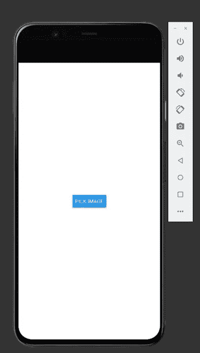

# 如何使用 Expo 在 React Native 中创建图像拾取器

> 原文：<https://javascript.plainenglish.io/how-to-create-an-image-picker-in-react-native-using-expo-4dd403e706bd?source=collection_archive---------2----------------------->

## [反应原生](https://bookeraziz.medium.com/list/react-native-3e476cc05fe3)

## *上传图片&React Native 中的视频变得简单*

Photo by [Thom Bradley](https://unsplash.com/@thombradley?utm_source=medium&utm_medium=referral) on [Unsplash](https://unsplash.com?utm_source=medium&utm_medium=referral)

我们将在 react native 中创建一个图像拾取器，它在任何应用程序开发人员的产品组合中都很棒。我们将使用世博包`[expo-image-picker](https://www.npmjs.com/package/expo-image-picker)`来实现这一目标。让我们直接进入编码。

如果你在任何时候迷路了，完整的代码在这篇文章的结尾。

# 项目设置

## 导入包

我们将使用`[expo-image-picker](https://www.npmjs.com/package/expo-image-picker)` 包来创建我们的图像拾取器。在控制台中运行以下命令:

`npm i expo-image-picker`

## 应用样板

接下来，我们将添加一些样板代码，这样我们就可以开始制作我们的图像拾取器。将以下代码添加到 App.js 文件中:

App Boilerplate Code

您应该会看到以下屏幕:

What you should see on your screen

# 创建我们的图像拾取器

## 存储对图像的引用

在我们开始从我们的设备读取图像之前，我们首先需要一种方法来保存我们的图像 URI。图像 URI 是一个字符序列，允许我们的图像嵌入到我们的应用程序中

我们将使用 useState 来完成这项工作。将以下代码行添加到组件的顶部:

`Const [Image,SetImage]=useState(null)`

## 创建我们的异步函数

下一步是运行我们设备的图像拾取器。为此我们将使用`[expo-image-picker](https://www.npmjs.com/package/expo-image-picker)` [**launchgimagelibraryasync**](https://docs.expo.dev/versions/latest/sdk/imagepicker/#imagepickerlaunchimagelibraryasyncoptions)函数。

该函数返回图像的 URI，我们将把它保存在我们的**图像**状态中。这方面的代码如下:

Async Functions

*注意:如果您想自定义图像拾取器，您可以编辑各种字段，如* ***允许编辑*** *和* ***媒体类型。*** *你可以在 documentation*[*这里*](https://docs.expo.dev/versions/latest/sdk/imagepicker/#mediatypeoptions) *了解更多关于这个的内容。*

# 展示我们的形象

现在我们已经完成了异步函数，我们要做的就是显示我们选择的图片。为了实现这一点，我们将在我们的应用程序中做一些[条件渲染](/how-to-implement-conditional-rendering-in-react-and-react-native-the-right-way-f00e2fa7a730)。

在组件的 return 语句中添加以下代码:

Conditionally Rendering our Image

*注意:如果我们的图像状态不为空，我们在这里做的只是渲染我们的图像。因为我们的图像状态只有在我们选择图像时才变得不为空，所以我们不必担心在得到 URI 之前渲染图像*

# 测试我们的图像拾取器

现在是时候测试我们的图像拾取器了。如果你点击这个按钮，你应该被重定向到你的手机画廊，在那里你应该可以选择一张图片。这个图像应该会出现在 react 本地应用程序中。

这里有一个例子:

Testing our Image Picker

*注意:因为这个例子是在模拟器上运行的，所以没有可供选择的照片。如果您在物理设备上运行此程序，您将能够显示图像*

# 完整代码

以下是完整的代码:

# 结论

感谢您阅读完我的文章**“如何使用 Expo 在 React Native 中创建图像拾取器”**。如果你有任何问题，请随意提问，我会尽快回答。

我希望你有美好的一天。如果你刚接触媒体，你可以点击这里的链接[加入。](https://bookeraziz.medium.com/membership)

## 资源

1.  [世博摄像师](https://docs.expo.dev/versions/latest/sdk/imagepicker/#mediatypeoptions)

*更多内容看* [***说白了。报名参加我们的***](https://plainenglish.io/) **[***免费周报***](http://newsletter.plainenglish.io/) *。关注我们*[***Twitter***](https://twitter.com/inPlainEngHQ)*和*[***LinkedIn***](https://www.linkedin.com/company/inplainenglish/)*。加入我们的* [***社区***](https://discord.gg/GtDtUAvyhW) *。***