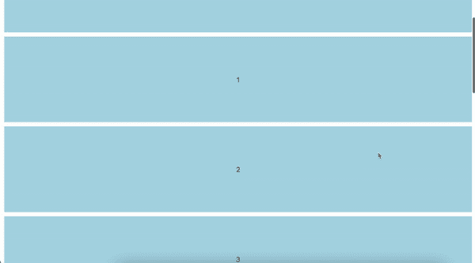

# 如何使用 React 创建无限滚动效果

> 原文：<https://javascript.plainenglish.io/how-to-create-an-infinite-scroll-effect-using-react-524d2b6fcde4?source=collection_archive---------4----------------------->

Photo by [Kerde Severin](https://www.pexels.com/@kseverin/) on [pexels](https://www.pexels.com/photo/selective-focus-photography-of-person-using-iphone-x-1542252/)

在这篇博客中，我将回顾我是如何在 React 中创建无限滚动效果的。

Final product we will be creating

首先，我创建了一个 express API。该 API 有一个带有请求参数 page 的端点。端点将返回一个包含十个数据元素的数组，这些数据元素对应于特定的页面。服务器代码如下所示。

接下来，我们将使用下面的命令`npx create-react-app client —-template typescript`创建 React 应用程序。

注:如果您正在使用`React version 18.1.0`，您可能需要移除。`<React.StrictMode>`标签来自`index.tsx`。在 React 的最近一次更新之后，您会注意到组件在第一次挂载时被挂载、卸载和重新挂载。你可以在这里阅读更多关于这些变化的信息[。下面你可以看到`index.tsx`文件应该是什么样子。](https://github.com/facebook/react/blob/main/CHANGELOG.md#react-1,)

接下来，我们可以在`App.tsx`开始编码。我们将从创建三种状态开始:页面、数据和加载。页面状态将包含一个数字，随着我们不断检索更多的数据，这个数字将会更新。数据状态将是一个数组，它保存将要显示的所有数据。在我的例子中，这个数据数组将是一个数字数组。最后，加载状态将是一个布尔值，用于显示加载动画。

接下来，我们还将创建一个函数，该函数将生成卡片来显示我们的数据，以及一个 useEffect，该函数将用于在页面发生变化时更新数据状态。你的`App.tsx`最后应该是这样的，显示前十张卡片。

一旦我们有了这些，我们就可以开始研究当我们滚动到列表底部时自动获取更多数据的逻辑。为此，我们将使用[交集观察者 API](https://developer.mozilla.org/en-US/docs/Web/API/Intersection_Observer_API) 和 [React 的 useRef 钩子](https://reactjs.org/docs/hooks-reference.html#useref)。

相交观察器应用编程接口检测观察到的元素何时在视图中。一旦观察到的元素在视图中，我们将更新页面状态，触发 useEffect 获取更多数据。在这种情况下，我只想观察一个元素，列表的最后一个元素。这意味着我必须不断地将观察到的元素更新为列表中的最后一个元素。为此，我们可以添加一个新的状态，我称之为`elem`并将`setElem`添加到列表的最后一个元素中。这可以通过修改`createCard`功能和用于渲染卡片的地图语句来完成。我们还将创建一个具有`useRef`的相交观察者对象。通过使用`useRef`我们将能够在重新渲染时跟踪`observer`对象。在下面，您可以看到所做的更改。

最后，我们还将创建一个 useEffect，用于更新 observe 元素。它将首先检查当前是否有可以观察到的元素。如果有，它将更新观察者以便观察当前元素。一旦观察到的元素进入视图，交集观察者回调将被触发，更新页码并获取更多数据。这将渲染更多的牌，触发`setElem`。它将从观察前一个元素开始，然后观察列表中的最后一个元素，从开始开始循环。在下面，您可以看到 useEffect 应该是什么样子。

结合所有这些，`App.tsx`应该是这样的。

希望本指南能有所帮助。直到下次。快乐编码！

*更多内容请看*[***plain English . io***](https://plainenglish.io/)*。报名参加我们的* [***免费周报***](http://newsletter.plainenglish.io/) *。关注我们关于*[***Twitter***](https://twitter.com/inPlainEngHQ)*和*[***LinkedIn***](https://www.linkedin.com/company/inplainenglish/)*。查看我们的* [***社区不和谐***](https://discord.gg/GtDtUAvyhW) *加入我们的* [***人才集体***](https://inplainenglish.pallet.com/talent/welcome) *。*