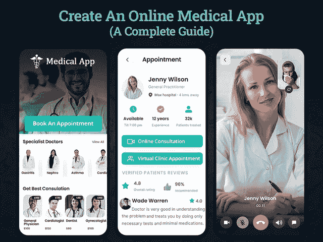

# 如何在 2022 年创建在线医疗应用程序:终极指南

> 原文：<https://javascript.plainenglish.io/how-to-create-an-online-medical-app-in-2022-the-ultimate-guide-d42fbd8cf078?source=collection_archive---------2----------------------->

## 如何在 24 小时内建立一个在线医疗诊所？

在疫情事件之后，可以说医疗保健行业正在快速重组。不断变化的用户行为和全球强加的限制改变了人们咨询医生的方式。人们现在害怕去诊所，不敢碰任何东西，甚至不敢站在袖手旁观一边。这就是你需要考虑利用市场的特点，将你的传统医疗实践转移到在线医疗咨询业务的地方。

如果你想知道如何开始，在建立一个在线医疗咨询业务时要考虑什么，那么这个博客将帮助你得到以下问题的答案。

**本博客目录:**

*   *简介:为什么你需要创建一个在线医疗咨询业务？*
*   *移动医疗解决方案的重要市场统计数据*
*   *如何在不到 24 小时内建立在线医疗咨询业务？*
*   *创办一家在线医疗咨询公司需要多少成本？*
*   *结论:准备推出在线健康咨询业务*

为了更好地理解，让我们深入了解每一点的细节…

## **简介:你为什么需要创建在线医疗咨询业务？**

在现代，生存需要网络平台的关注。从商业到医疗咨询，如果你想在这个竞争激烈的世界生存下去，一切都需要在线。今天，越来越多的病人和遭受健康问题折磨的人更喜欢在他们舒适的家中从他们的健康专家那里得到建议。而随着每个企业都在网上，虚拟咨询得到了极大的发展。

了解到医疗保健行业需求的激增，医疗顾问已经在多个在线平台上扩大了他们的服务范围。他们已经开始向患者提供远程医疗、在线咨询等服务。总体而言，这促使医疗保健专家建立了一个在线医疗咨询平台，以满足市场不断变化的需求，并将您的业务转变为一个潜在的业务平台。如果你仍然处于为什么需要创建在线医疗咨询业务的困境，那么你需要先睹为快医疗保健行业。

**医疗保健行业的市场份额**

*   据统计，全球健康产业预计将从 2018 年的 8.45 万亿美元急剧转向 2022 年的 10 万亿美元以上。
*   根据调查报告，最大的医疗保健支出约为人均 10，224 美元。
*   物联网(IoT)每年可以减少 1000 亿美元的临床低效运营成本。
*   全球数字医疗市场价值约为 1750 亿美元，预计到 2025 年将达到近 6600 亿美元。
*   84%的消费者像信任个人推荐一样信任评论。
*   预约医疗保健的病人比没有预约的病人多运行了三倍多的搜索。

有了这些事实和数据，你必须了解医疗保健行业是如何逐步发展到下一个水平的。如果你期待入门在线医疗咨询平台，那么你可以聘请一家 [**手机 app 开发公司**](https://www.xicom.biz/services/mobile-app-development/) 。他们可以很容易地改变你创建远程患者预约的想法。有了这个平台，医生可以虚拟地连接到他们的病人，甚至通过数字平台治疗他们。

在疫情之后，许多医疗机构已经意识到对虚拟平台的需求，并推出了在线医疗应用。你知道为什么吗？因为那个时代需要那些解决方案！

*然而，现在的问题是如何在已经有数百个在线医疗咨询应用程序运行的市场中脱颖而出？*

## **如何在不到 24 小时的时间内建立在线医疗咨询业务？**

将你的业务迁移到在线平台可以给你带来很多好处，并使整个运营更容易。在线医疗咨询使医疗专家能够轻松评估、诊断并为患者提供更好的医疗服务。但是你们中的许多人想知道，已经有许多应用程序服务于这个目的，那么你如何使自己与众不同呢？

因此，如果你准备好改变，那么这里有一个完整的指南，在不到 24 小时内建立一个在线医疗咨询业务。

# **开发在线医生咨询 App 的分步指南**

***第一步:*** *选择可扩展的咨询平台*

***第 2 步:*** *关注灵活的定制和功能*

***第三步:*** *为您的在线远程医疗平台增加多种支付可能性*

***第四步:*** *拥抱正确的技术，让它完美运行*

***第五步:*** *找到合适的 App 开发团队*

让我们深入这些细节，了解如何定制和设置在线远程医疗平台…

## **第一步:选择可扩展的咨询平台**

随着 Amwell、Doctor on Demand、MDLive 等流行远程医疗应用的出现，是时候考虑创建一个超越现有应用的平台了。为了开始开发过程，你需要雇佣一个 [**应用程序开发公司**](https://www.xicom.biz/services/mobile-app-development/) 来帮助你以一种新的方式传递想法。

专家不仅会建议开始的最佳选择，还会向你揭示成功的秘诀。但是如果你是问我们，那么作为一个 IT 专家，我会建议你寻找独特的机会，并正确地实施它们。这将有助于你抓住用户的注意力，让他们参与更长时间。

> 除此之外，以下是一些提示，帮助您定制一个平台:

*   *易于访问和简单导航；*
*   *安卓和 iOS 用户均可使用；*
*   *提供进行视频/音频通话的灵活性；*
*   *能够通过聊天机器人确保 24*7 的客户支持；*
*   *提供分析数据驱动的打包报告；*
*   *培养对健康问题的意识；*
*   *灵活提供文字咨询等。*

了解了所有这些功能，你一定很好奇想知道如何入门？你可以去找专家，让他们把你的应用想法变成现实。毫无疑问，一个专业的应用开发者可以实现最好的方法，但是你必须知道路线图。

让我们进行下一步吧！

## **第 2 步:寻找灵活的定制和功能**

不同的企业有不同的方法，因此，首先你需要了解你的目标和要求。例如，如果你是一名皮肤科医生，而你的市场平台展示了访问整形外科的选项，这是一个值得考虑的正确方法吗？这不仅会让你的病人感到困惑，还会让你的所有努力付之东流。

创建一个拥有定制功能和灵活性的虚拟诊所，将有助于你与病人建立牢固的关系。定制的正确选择将有助于您培养与患者的关系。

*   **简易** **挂号**:始终确保患者顺利、简易、快速、无障碍的入院。您的患者可以使用他们的手机号码或电子邮件地址轻松注册。当你构建一个医生咨询 app 的时候，更注重终端用户体验而不是业务需求。
*   **上传** **在线** **处方**:允许患者上传医疗处方，并能够讨论剂量说明和可能的副作用。此外，通过当地药店在互联网上配药的能力提供了惊人的便利。
*   **选择** **主题** **面向** **市集**:为了让你的市集易于理解和简单访问，你可以选择一个合适的主题。
*   **日历** **管理**:这将是你的应用程序中最关键的元素，因为创建虚拟诊所的简单想法就是在线管理预约。你可以 [**雇佣手机应用开发者**](https://www.xicom.biz/offerings/hire-mobile-developers/) 向客户提供这项功能，让用户在特定日期查看你的空闲时间。允许患者在日历上做标记，并提前锁定日期，这样你的诊所就可以相应地管理预约。
*   **安排** **和** **重新安排**预约:允许灵活地安排与适当医生的预约，并发送咨询请求。根据特定日期的可用性，医生将确认预约。将提供内置的聊天功能，以便患者可以直接从医生那里讨论其他问题或疑问。一旦医生和病人在会议前讨论了所有的事情。之后，医生可以确认预约。
*   **视频** **聊天** **对于** **医生** **和** **患者**:高效的沟通是成功的关键。确保您创建了一个平台，使您能够与医生咨询进行视频通话。该应用程序提高了用户留存率，并方便患者与医生直接互动。
*   **监控** **治疗** **进展**:当你决定建立一个虚拟诊所时，确保市场与所有这些功能相集成，并允许患者保留每次医疗的记录。
*   **文件** - **共享**:该功能允许患者扫描报告、医疗处方、付款收据等
*   **症状** **检查器和** **疾病** **诊断**:你可能知道 AI 和 ML 技术的流行，但是实施这些技术来建立虚拟诊所将会改变你的市场发展理念。它将帮助您收集用户信息，根据症状诊断疾病，并允许患者直接与相关医生联系。
*   **简单的** **电子账单** **和** **支付** **网关**:确保您的诊所拥有简单的账单功能，并允许医生创建账单。此外，允许医生通过信用卡、借记卡、Google Pay 等多种方式接受支付。
*   **搜索** **过滤器** **和** **栏**:允许患者针对不同的健康问题搜索医生。此外，允许患者根据疾病、症状等关键词搜索医生。
*   **电子处方生成**:在医生咨询市场，医生应该直接通过在线处方开出所需的药物。
*   **多** - **语言** **支持**:因为你正在开发一个虚拟诊所，患者可以在全球范围内访问。因此，确保市场可以用多种当地语言访问。

## **第三步:为您的在线远程医疗平台增加多种支付方式**

你是自己的虚拟诊所的老板，所以你将决定你的市场在咨询费、优惠和预十亿程序方面向患者提供的灵活性。根据您的计费和支付方式，您可以选择预计费预约或咨询后收费。

由于人们使用不同的支付方式，确保向患者提供灵活的支付选择将提供更好的患者响应。他们更喜欢使用接受多种支付方式的平台。为了让它完美地工作，您可以选择雇佣一家 [**软件开发公司**](https://www.xicom.biz/) 来帮助您定制平台，通过利用便捷的支付选项来确保改善地理覆盖范围。对多种支付功能的增强访问将确保出色的用户体验。

*现在您已经了解了功能、特性以及支付和结算流程。那么到底是什么阻止了你呢？当然是技术！*

## **第四步:选择合适的技术来建立一个在线诊所**

你有没有想过到底是什么让其他应用程序完美运行？是的，这是技术的选择和应用程序开发人员的技能，使市场像一台润滑良好的机器一样工作。但是，当你急着在 24 小时内建立一个市场时，你就需要寻找那些不会让你付出昂贵代价，并能让你快速启动的技术。

在这里，我们列出了正确的技术套件，永远不会让您的在线咨询业务失望。以下是构建在线远程医疗应用程序所需的技术:

*   **前端开发:** Java，Swift，Angular，Java，CSS，HTML，React
*   **热门** **平台**:安卓、iOS、网络应用
*   **后端** **开发** : Python，Laravel，Node.js
*   **推送** **通知**、短信、应用内消息:Batch、Twillo、Push.io
*   **支付** **处理** : PayPal API、Stripe API、Braintree SDK 等电子钱包
*   **数据库** : MongoDB、Cassandra、HBase 和 Postgres
*   **云**环境:谷歌云、AWS、Azure
*   **位置** **追踪**:iOS 版 MapKit 框架，Android 版 Google Maps SDK
*   **真实** - **时间** **追踪** : BigData、Cisco、Hadoop、Spark、Apache Flink、IBM、Google Maps API
*   **社交** **登录**:脸书、谷歌、推特 API

## **第五步:找到合适的应用开发团队**

现在的问题是，在 2022 年，你需要什么类型的团队来创建一个成熟的虚拟诊所？当谈到加入开发团队时，你主要有三种选择。要么去找自由职业者，外包一个应用程序开发公司，要么找一个专门的开发团队。由于我们的目标是在 24 小时内推出一个虚拟诊所，我们需要一个完整的应用程序开发团队，致力于为您的项目工作，没有任何沟通障碍。

所以你现在只剩下两个选择。然而，在你着手 [**雇佣一个应用程序开发团队**](https://www.xicom.biz/services/mobile-app-development/) 之前，你必须知道他们会根据他们工作的小时数向你收费。当你已经有了一个应用程序，并且正在寻找进一步的更新时，这种类型的方法会更好。

外包一家 app 开发公司将是一个理想的选择。他们将为您提供一个完整的团队，包括业务分析师、应用程序开发人员、项目经理、应用程序测试人员、UI/UX 设计师等等。他们与 prime focus 合作，在不影响应用程序质量的情况下按时交付项目。

现在你最关心的是在 24 小时内创建一个虚拟诊所要花多少钱？

## **建立一个在线健康咨询公司需要多少钱？**

当然，许多医疗保健投资者都在好奇地寻找这个问题的答案。创建一个虚拟诊所要花多少钱？开发一个在线咨询市场的成本从基础版到高级版会有很大的不同。

如果用明确的话来说，创建一个医疗咨询市场的平均成本在 20，000 美元到 30，000 美元以上。创建一个医疗保健应用程序的成本当然取决于你计划开发的医疗保健应用程序的类型。

但是，我们仍然听到了很多“如何开发一个不损失投资者资金的咨询应用程序？”。

降低损失风险的简单方法是寻找能帮助你在市场中脱颖而出的现代功能和特性。在医疗保健行业，有许多技术需要关注，尤其是在建立虚拟诊所的过程中。但是，这样会增加 app 开发的成本。

你将再次面临一个问题:它将花费你多少钱？

确定建立虚拟诊所的平均成本并不是火箭科学。你所需要的只是知道实际影响开发成本的因素。这些因素可能包括应用程序的复杂性、特性和功能、应用程序开发团队的每小时成本、应用程序的 UI/UX 设计、技术等等。

由于每个企业都需要一个独特的开发方法，因此值得与专家预约一个免费的咨询时段来获得真实的评估。

## **结论:准备推出在线健康咨询业务**

随着医疗保健行业新兴技术的出现，医疗服务无疑正在快速转型。人们更喜欢使用在线咨询、远程医疗，而不是去诊所。也就是说，可以有把握地说，开发虚拟诊所是一个有价值的决定。但你所需要的只是雇佣一个 [**手机 app 开发公司**](https://www.xicom.biz/services/mobile-app-development/) 。它使您能够实现使您与众不同的特性和功能。

此外，通过了解患者对使用在线预约、医疗信息或远程医疗选项的兴趣日益增长。你会更好地实现你企业的基本目标。因此，如果你对如何创建虚拟诊所有任何想法或疑问，那么你可以在下面标记评论。

=====================================

*更多内容请看*[***plain English . io***](http://plainenglish.io/)*。报名参加我们的* [***免费周报***](http://newsletter.plainenglish.io/) *。在我们的* [***社区***](https://discord.gg/GtDtUAvyhW) *获得独家获得写作机会和建议。*