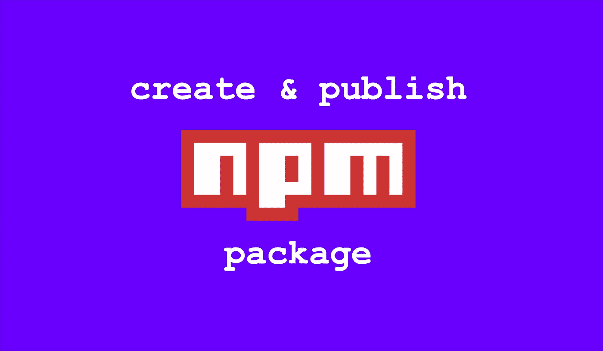
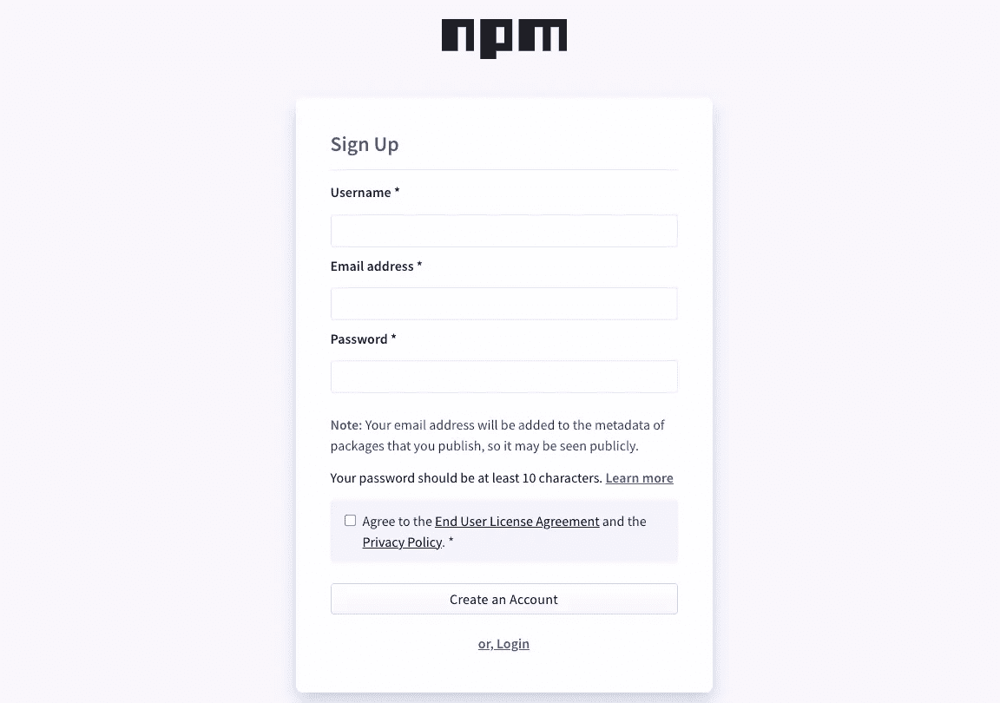
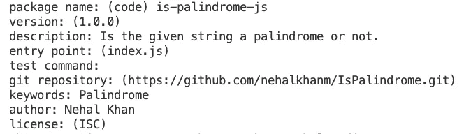
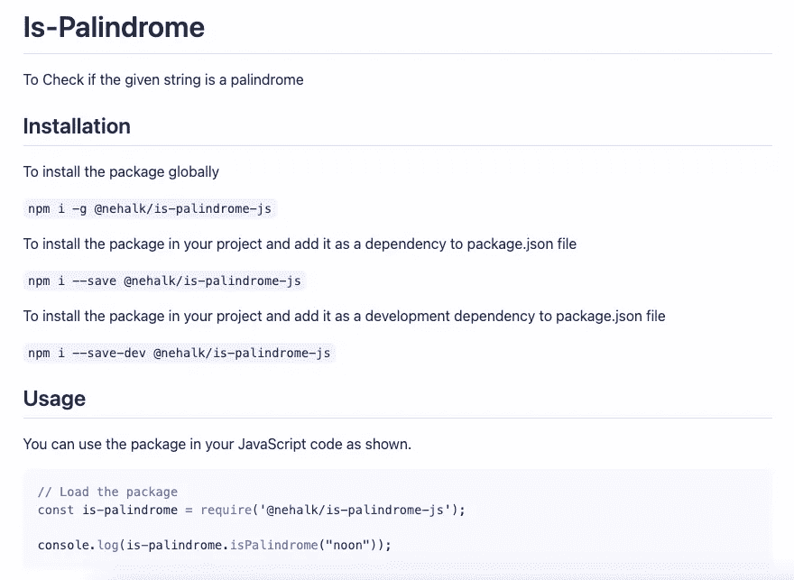
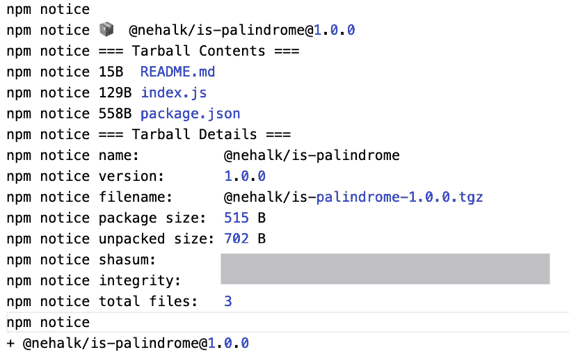

# 如何在 7 分钟内创建并发布自己的 NPM 包

> 原文：<https://javascript.plainenglish.io/how-to-create-and-publish-your-own-npm-package-in-7-minutes-7e123507cb7d?source=collection_archive---------10----------------------->

## 创建和发布 NPM 包的详细指南



Image created by the author | Logo credits: [GitHub.com](https://github.com/npm/logos/tree/master/npm%20logo/classic)

如果你使用过 Node.js 或者其他 JavaScript 框架，比如 Angular，React 等等。，那么您一定使用了节点程序包管理器(NPM)。它有一个命令行工具和一个开源的公共注册中心，以 npm 包的形式托管各种实用程序、库和框架。

你有没有想过如何创建自己的 npm 包？那么这篇文章只适合你。我们将查看从创建您的包到将其发布到 npm 注册中心的详细的一步一步的过程。

我们开始吧！

## 1.设置 NPM 账户

在我们开始之前，请确保您已经安装了 Node.js，如果您没有，请到[官方网站](https://nodejs.org/en/)安装最新版本。

您需要有一个 npm 帐户才能在 NPM 注册表上发布您的软件包。你可以去 npm [注册页面](https://www.npmjs.com/signup)用你的基本信息注册。



Sign-Up page for NPM account (Screenshot by the author)

注册过程完成后，转到您首选的终端。我们将在您的计算机上配置和链接最近创建的 npm 帐户。

您现在可以使用`npm adduser`或`npm login`命令。它会提示输入用户名、密码和电子邮件地址。请提供在 npm 帐户设置过程中给出的准确细节。这将在本地`**.npmrc**`配置文件中添加用户的登录细节。

## 2.初始化和创建 npm 包

为您的新 npm 软件包创建一个新目录。在您首选的代码编辑器中打开此目录。在我的例子中是 VS 代码。

我们必须在发布包的同时维护带有版本管理的代码库。你可以选择你想要的服务。在这个例子中，我将使用 GitHub。

作为本文的一个例子，我们将创建一个包来检查给定的字符串是否是回文(不是很有用)。但是，作为一个例子，理解这个过程就足够了。你可以用你的任何想法遵循同样的过程。

在 GitHub 上创建一个与首选包名同名的存储库，并添加描述。

在您的编辑器中，打开一个终端来初始化您的 GitHub 库并添加一个 README 文件。我们将使用这个 readme markdown 文件来描述我们的软件包，如何使用它，以及所有其他细节。

一旦初始化了存储库并将初始提交推送到存储库，现在就可以初始化 npm 包了。

使用`npm init`命令。它会提示您输入一些信息，如下所示:



Prompt with details for npm init command (Screenshot by the author)

您可以为一些字段(名称、描述、关键字、作者)提供适当的详细信息。您可以保留一些默认值(版本、入口点、git 存储库、许可证)，并跳过其中一些(测试命令)。您也可以使用`npm init -y`在没有提示的情况下获取默认值。

`npm init`命令创建一个 **package.json** 文件，这是 npm 包的一个关键文件。该文件包含与 npm 软件包相关的所有必要信息，如您之前提供的信息、软件包所需的依赖项(如果有)以及您可以在 npm 软件包中配置和运行的脚本。

您还可以为`npm init`设置默认值，以便在初始化`package.json`文件时使用这些值。你可以看到下面的例子:

```
npm config set init-author-name "Nehal Khan"npm config set init-license "MIT"
```

你可以查看更多可用的初始化属性，你可以在这里配置。

根据初始化期间给定的入口点值，创建一个文件作为代码的入口点。根据我们的示例，它将是 **index.js** 。

在这个文件中，您可以为想要创建的包添加代码。根据例子，这将是检查字符串是否是回文的代码。你可以看到下面的代码:

```
function isPalindrome(string) {
  return string == string.split("").reverse().join("");
}module.exports = { isPalindrome };
```

## 3.测试 npm 包

现在我们已经为我们的包添加了代码，让我们测试一下代码是否如预期的那样工作。因为我们还没有发布它，你可以使用`npm link`在你的本地电脑上使用它。

当您运行`npm link`时，它在当前目录中为这个包创建一个到全局包文件夹的符号链接。

现在，您可以在计算机上创建一个新目录来测试您的 npm 软件包。进入目录后，运行`npm link <package-name>`命令。根据我们的例子，它将是`npm link is-palindrome-js`。它将通过将较早的链接目录作为其源来安装软件包。

创建一个新的 javascript 文件来测试您的包。你可以看到下面的用法:

```
const ispal = require('is-palindrome-js');console.log(ispal.isPalindrome("america")); // false
console.log(ispal.isPalindrome("noon")); // true
console.log(ispal.isPalindrome("english")); // false
console.log(ispal.isPalindrome("malayalam")); // true
```

你可以用 chai 和 mocha 在你的包里添加一些单元盒，但是我现在将跳过这一部分。

## 4.更新自述文件并将代码推送到 GitHub

现在，您已经为代码创建并测试了一些场景，您需要更新自述文件。你可以描述你的软件包是做什么的，如何安装，以及如何使用它。

一旦您更新了文件，它将如下所示。



Output for the updated README file (Screenshot by the author)

现在您可以提交所做的更改，并将您的更改推送到 GitHub 存储库。

## 5.向国家预防机制登记处发布

现在代码可以工作了，并且您已经将它推送到了存储库。您可以将软件包发布到 npm 注册表。

您可以使用`npm publish`命令来发布您的包。但是当您尝试这样做时，您会得到如下所示的错误。

```
npm ERR! code E403
npm ERR! 403 403 Forbidden - PUT [https://registry.npmjs.org/is-palindrome-js](https://registry.npmjs.org/is-palindrome-js) - You do not have permission to publish "is-palindrome-js". Are you logged in as the correct user?
npm ERR! 403 In most cases, you or one of your dependencies are requesting
npm ERR! 403 a package version that is forbidden by your security policy, or
npm ERR! 403 on a server you do not have access to.
```

由于您已经登录到您的 npm 帐户，根据给定的错误，这可能是因为同名的软件包可能已经存在。当您检查 npm 注册表时，您可以看到已经有一个同名的包。由于您不是这个现有 npm 包的所有者，它会抛出一个 403 禁止错误。

在这种情况下，您可以使用不同的名称，或者将其发布为限定范围的包。这意味着你可以在你的 npm 包的名字前加上一个作用域，就像 angular 框架所做的那样。你可以看到他们添加了一个`@angular`作为他们不同包的作用域。

在我们的例子中，我们可以添加一个作用域，将您的用户名作为您的包名的前缀。所以根据我们的例子，应该是`@nehalk/is-palindrome-js`。您需要在 **package.json** 文件中更新这个名称。

现在，如果您尝试发布它，您将会得到如下所示的错误。

```
npm ERR! code E402npm ERR! 402 Payment Required - PUT https://registry.npmjs.org/@nehalk%2fis-palindrome - You must sign up for private packages
```

***注意:*** *每当您尝试发布作用域的包时，npm 都会假设它们是私有包。在撰写本文时，npm 不支持任何免费的私有包，您需要选择付费的 npm 帐户。*

因为您不希望您的包是私有的，并且需要它对公众是可访问的，所以您可以在发布时使用`--access=public`标志。此标志让 npm 命令知道这不是私有包，而是作用域公共包。

所以最后的命令是`npm publish --access=public`。完成此操作后，您可以看到您的包已发布到 npm 注册表中..



Output for npm publish — access=public command (Screenshot by the author)

你可以去你的 npm 账户验证一下。

## 结论

您已经成功地创建并发布了使用 javascript 编写的 npm 包。现在可以使用下面的命令在 JavaScript 项目中使用该模块。

```
npm install @nehalk/is-palindrome-js --save
```

你可以在我的 GitHub 库[这里](https://github.com/nehalkhanm/IsPalindrome)找到代码，在这里找到发布的 npm 包[。](https://www.npmjs.com/package/@nehalk/is-palindrome-js)

我希望这篇文章对你有用。

感谢️reading！

还不是会员？如果你想支持我这个作家，可以考虑[报名成为媒介会员](https://nehalk.medium.com/membership)。你也可以[订阅](https://nehalk.medium.com/subscribe)来获取我发布的类似文章。

*更多内容请看*[***plain English . io***](https://plainenglish.io/)*。报名参加我们的* [***免费周报***](http://newsletter.plainenglish.io/) *。关注我们关于*[***Twitter***](https://twitter.com/inPlainEngHQ)[***LinkedIn***](https://www.linkedin.com/company/inplainenglish/)*[***YouTube***](https://www.youtube.com/channel/UCtipWUghju290NWcn8jhyAw)*[***不和***](https://discord.gg/GtDtUAvyhW) *。***