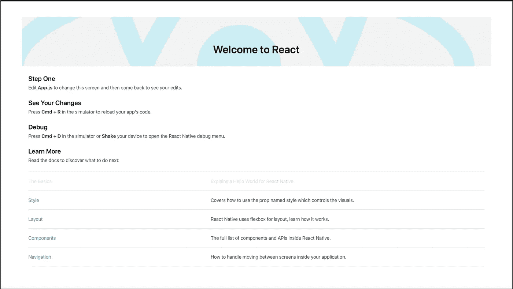

# 如何使用 React Native 创建 Apple TV 应用程序

> 原文：<https://javascript.plainenglish.io/how-to-create-apple-tv-application-with-react-native-291d5739028e?source=collection_archive---------5----------------------->

## 为 Apple TV 创建 React 原生应用程序，如何运行它，如何启动开发菜单，以及如何使用 Siri 遥控器与应用程序交互。

React Native 正在不断发展，它非常适合开发通用应用程序。当涉及到跨平台应用程序开发时，react native 是开发人员的主要选择之一，因为它支持开发支持移动平台、现代网络和电视的应用程序。

我决定撰写一系列文章来帮助您在 React Native 中构建跨平台的应用程序，在这篇文章中，我将介绍如何在 Apple TV 上构建和运行应用程序。不要再拖延了，让我们开始吧。

*[react-native-tvos](https://www.npmjs.com/package/react-native-tvos) NPM 包应该用于创建 react 本地应用程序，它在[社区报告](https://github.com/react-native-tvos/react-native-tvos)中管理。*

*此前该包是 React 原生核心回购的一部分，但自 2019 年以来，它被移出并由 React 原生社区维护。更多详情请点击此处[https://reactnative.dev/blog/2020/03/26/version-0.62](https://reactnative.dev/blog/2020/03/26/version-0.62)*

# ***创建新项目***

*使用 react-native-tvos 为 Apple TV 创建新项目很容易。它使用与 iOS 相同的 CLI 和步骤。这个新项目将适用于 iOS 手机和苹果电视。*

*先决条件:*

*使用 React Native environment 安装指南在您的计算机中安装 React Native 开发环境。[https://reactnative.dev/docs/environment-setup](https://reactnative.dev/docs/environment-setup)*

*创建应用程序有两种方法*

# *使用@react-native-community/cli 包*

1.  *确保您在全局范围内安装了 CLI。CLI 安装只需进行一次。*

```
*npm install -g @react-native-community/cli*
```

*2.创建应用程序*

```
*react-native init MyApp — template=react-native-tvos*
```

**注意:要下载特定版本，请在 react-native-tvos 后使用@versionNumber，如果您想获得最新版本，请添加@latest**

*3.在 tvOS 模拟器中启动应用程序*

```
*cd MyApp && react-native run-ios — simulator “Apple TV” — scheme “MyApp-tvOS”*
```

**注意:这只适用于 macOS 机器**

**

*React Native Application Running in Apple TV*

# ***使用 react-native-cli 包***

1.  *确保您在全局范围内安装了 CLI。CLI 安装只需进行一次。*

```
*npm install -g react-native-cli*
```

*2.创建应用程序(如果您不使用全局 CLI，请使用“npx”运行给定命令)*

```
*react-native init MyApp — version=react-native@npm:react-native-tvos*
```

**注意:要下载特定版本，请在 react-native-tvos 后使用@versionNumber，如果您想获得最新版本，请添加@latest**

*3.现在启动 tvOS 模拟器中的应用程序*

```
*cd MyApp && react-native run-ios — simulator “Apple TV” — scheme “MyApp-tvOS”*
```

**注意:这只适用于 macOS 机器**

**

*React Native Application running in Apple TV*

# ***如何在现有项目中使用 react-native-tvos***

1.  *要为 Apple TV 构建您的项目， ***，您应该将您的 package.json imports 更改为 import react-native****，如下所示，以便使用此包而不是核心 react-native 包。**

```
**“react-native”: “npm:react-native-tvos@latest”,**
```

**2.删除节点模块和 io/pod**

**3.在项目文件夹内**

```
**yarn install**
```

**4.ios 内部/**

```
**pod install**
```

***注意:M1 用户如果遇到任何问题，请按照安装指南中的说明进行操作。*[*https://reactnative.dev/docs/environment-setup*](https://reactnative.dev/docs/environment-setup)**

**5.像运行新应用程序一样运行它。**

**需要记住的要点:**

1.  **您不能在一个项目中同时使用这个包和核心 react-native 包。**
2.  **您还应该全局安装 yarn，因为在 React 本地项目中应该使用它来代替 npm。**

# **如何使用 Xcode 运行应用程序**

**React 原生 Xcode 项目将具有 Apple TV 构建目标，其名称以字符串'-tvOS '结尾。选择它，选择目标设备/模拟器，并选择运行或点击⌘R.**

# **如何打开开发菜单**

**在模拟器上，cmd-D 会调出开发者菜单，类似于 iOS。要在真正的 Apple TV 设备上播放，请长按遥控器上的播放/暂停按钮。**

# **如何与应用程序交互**

**你可以使用 Siri 遥控器与应用程序进行交互，根据箭头键的输入或 Siri 遥控器触摸板的滑动， ***焦点引擎*** 决定哪个控件将获得焦点。当用户点击遥控器或按回车键时，高亮显示的项目将被选择/激活。**

**在本文中，我们介绍了如何为 Apple TV 创建 React 原生应用程序，如何运行它，如何启动开发菜单，以及如何使用 Siri 遥控器与应用程序进行交互。我将在接下来的文章中围绕它做一些事情。**

**我很感激你能做到这一步。我希望这有所帮助。如果你喜欢这篇文章，感谢使用鼓掌按钮。这将通知我，我正在帮助你的反应母语学习之旅。**

***更多内容请看*[***plain English . io***](https://plainenglish.io/)*。报名参加我们的* [***免费周报***](http://newsletter.plainenglish.io/) *。关注我们关于*[***Twitter***](https://twitter.com/inPlainEngHQ)[***LinkedIn***](https://www.linkedin.com/company/inplainenglish/)*[***YouTube***](https://www.youtube.com/channel/UCtipWUghju290NWcn8jhyAw)*[***不和***](https://discord.gg/GtDtUAvyhW) *。对增长黑客感兴趣？检查* [***电路***](https://circuit.ooo/) *。*****