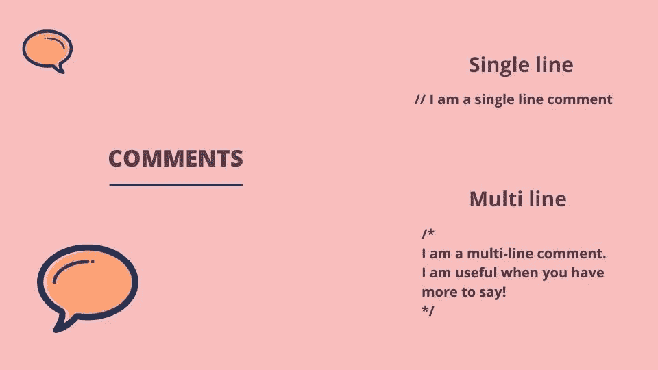

# 如何用 JavaScript 创建注释

> 原文：<https://javascript.plainenglish.io/how-to-create-comments-in-javascript-dfe7a3b46b88?source=collection_archive---------4----------------------->

## 理解单行和多行注释



## 什么是评论？

你还记得当你在学校的时候，你在课本上写满了笔记来帮助复习吗？

代码中的注释可以以类似的方式工作。当我们写代码的时候，很容易忘记我们或者其他人可能在以后需要一些更清晰的东西。我们也可能只是想留下一个便条，提醒自己一些需要重温的代码。

JavaScript 有两种类型的注释。单行注释和多行注释。

## 单行注释

如果我们的笔记只有几个简短的单词，单行注释就很棒。如果要深入一些更大的细节，多行注释会更合适。

为了创建单行注释，我们使用两个正斜杠。代码运行时，前斜线后面的所有内容都将被忽略。让我们来看看。

```
function add() {
  //I am a single line comment
   return 1 + 2;
}
```

在上面的例子中，我们创建了一个名为 *add* 的函数。在函数内部，我们使用两个正斜杠添加一行注释。如果我们想给自己留一个提醒，我们可以将它改为使用 todo，如下所示。

```
function add() {
  //TODO: I am a single line comment
   return 1 + 2;
}
```

## 多行注释

为了创建多行注释，我们使用正斜杠和星号开始注释，然后使用星号和正斜杠结束注释。两个星号之间的所有内容都将是注释的一部分，在代码运行时将被忽略。让我们给前面使用的例子添加一个多行注释。

```
function add() {
  /*
    I am 
    a multi line
    comment.
  */
  return 1 + 2;
}
```

这一次，我们在函数中的代码运行之前使用了多行注释。我们将注释跨越多行，并以星号和正斜杠结束。

我希望你喜欢这篇文章。如果你想看这篇文章的视频，你可以在这里看。

请随时发表任何评论、问题或反馈，并关注我以获取更多内容！

*更多内容看* [***说白了。报名参加我们的***](https://plainenglish.io/) **[***免费周报***](http://newsletter.plainenglish.io/) *。关注我们关于*[***Twitter***](https://twitter.com/inPlainEngHQ)*和*[***LinkedIn***](https://www.linkedin.com/company/inplainenglish/)*。加入我们的* [***社区***](https://discord.gg/GtDtUAvyhW) *。***