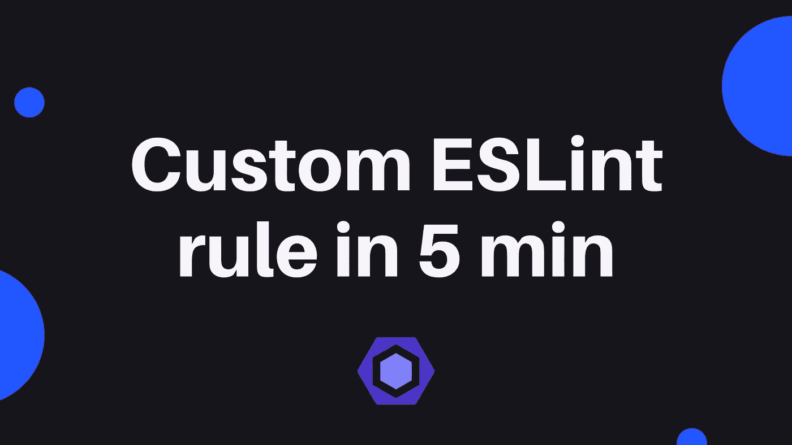
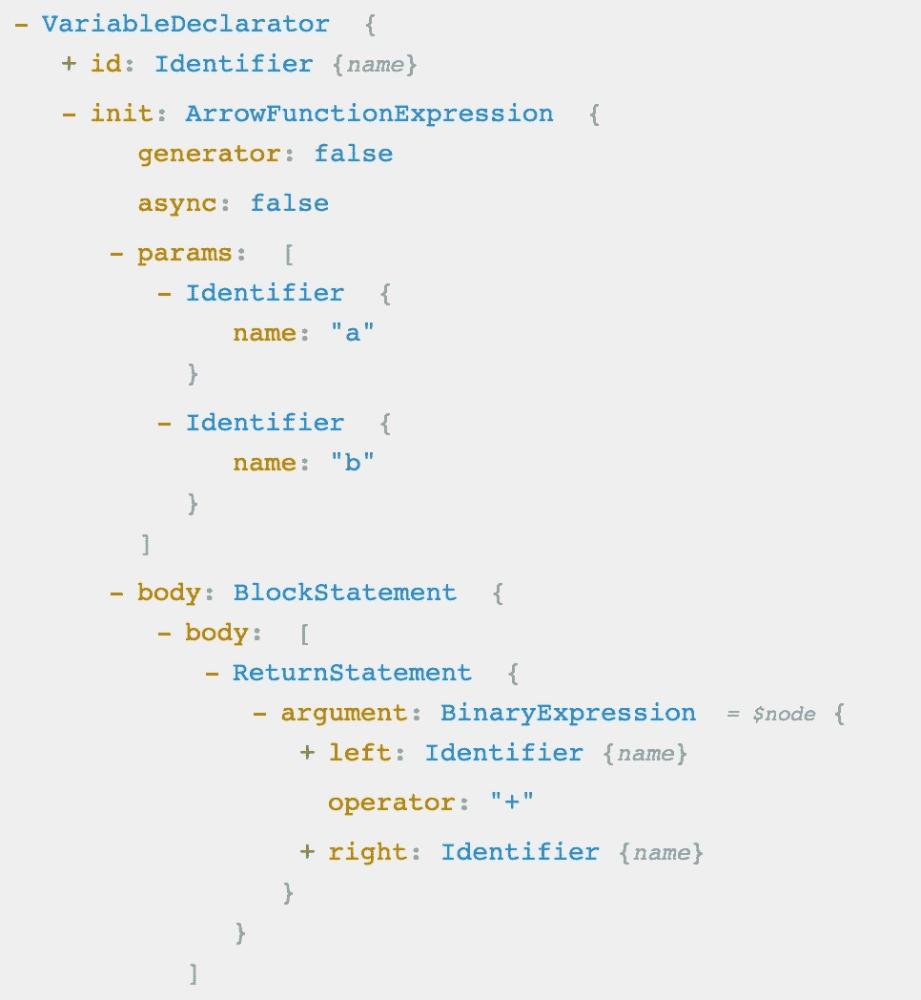
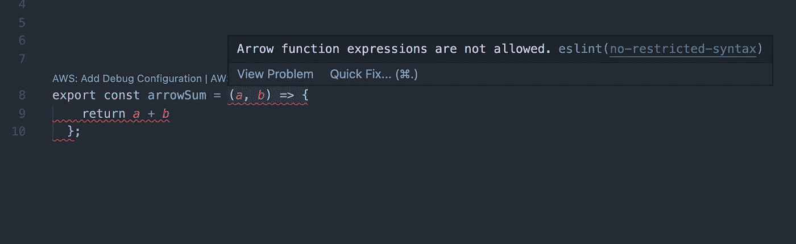
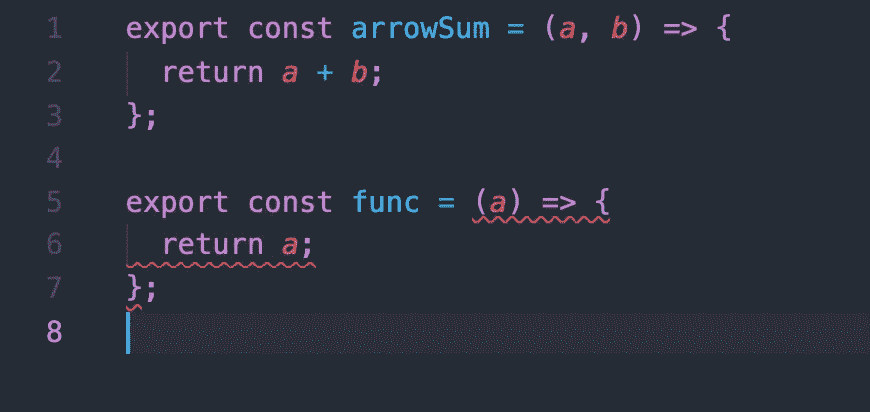
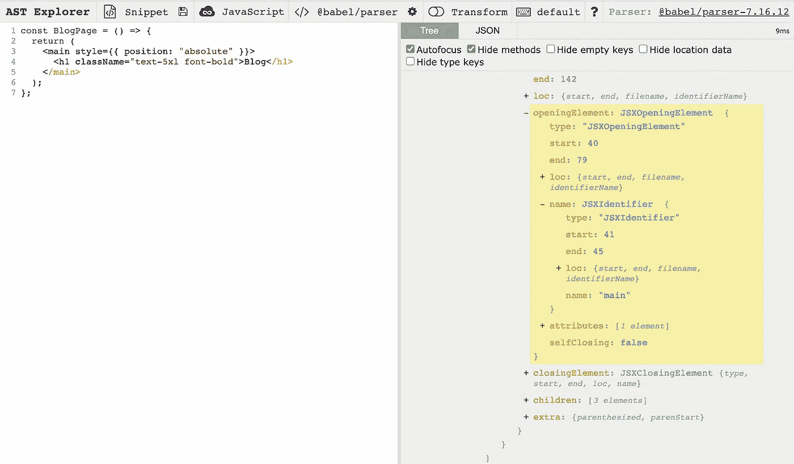
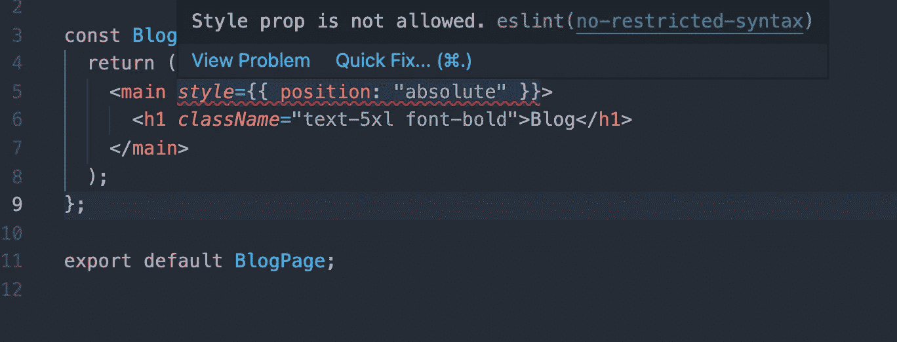

# 如何在 5 分钟内创建自定义 ESLint 规则

> 原文：<https://javascript.plainenglish.io/how-to-create-custom-eslint-rules-in-5-minutes-763f14cb9b5?source=collection_archive---------4----------------------->



静态分析是软件开发的一个很好的工具。我们不需要等待运行的代码来发现是否有不好的事情发生。通常，我们可以在开发过程的早期发现错误。此外，静态分析工具总是用在 CI/CD 管道中(我希望😁).

ESLint 是一个开源项目，帮助我们自动检测 JavaScript 项目中的问题。它由 Nicholas C. Zakas 和来自世界各地的贡献者创建和维护。ESLint 规则也是开源的，所以您可以在项目中使用它们来创建规则约定。此外，最常见的方法是安装社区支持的预定义规则集，例如 Airbnb、StandartJS 和其他应用程序。但是，如果您有一个独特的案例，或者需要扩展 ESLint 的功能，您可以创建自己的自定义规则。

ESLint 有一个插件系统，我们可以编写自己的规则，并在项目中使用。但是插件架构好像很复杂，在不太了解 NodeJS 和 ESLint API 的情况下，开始编写 ESLint 的规则并不容易。

在本文中，我们将在 5 分钟内了解如何添加定制的 ESLint 规则，而无需编写任何特殊的模块、文件和脚本。

# 在您决定创建自己的规则之前

许多开发人员创建自定义规则来实施他们自己的编码标准。然而，并不是每个人都知道社区已经创建了一个庞大的规则集，并且通常这些规则已经默认包含在 ESLint 中。在您决定创建自己的规则之前，首先搜索规则列表和任何其他可用的 ESLint 插件。其他人可能已经创建了您正在寻找的规则。

以下是帮助您查找规则和配置的链接:

*   [官方 ESLint 规则](https://eslint.org/docs/rules/)
*   [awesome-eslint](https://github.com/dustinspecker/awesome-eslint)—eslint 预置、配置、插件和规则的集合

# 创建自定义规则

一般来说，创建与不寻常的语法连接的自定义规则。例如，当您开发一个项目时，您的个人方法可能是:

*   您不想使用的遗留模块或方法
*   你只是想限制使用一些方法或模块。

对于所有这些情况，我们不需要通过编写新的模块来开发新的规则。我们可以使用一个特殊的统一内置规则`no-restricted-syntax`

## 使用`no-restricted-syntax`

这条规则允许我们限制 JavaScript 语法的任何部分。

通常，我们的 JS 代码部分或元素由抽象语法树(AST)中的 ESTree 节点表示。当解析器分析我们的代码时，它们创建 AST，并且代码的每个部分都用一个特殊的节点名标记。

对我们来说，这种代码很常见，我们每天都会遇到:

```
const arrowSum = (a,b) => {
  return a + b 
};
```

但是对于解析器来说，它表示为:

*   `const arrowSum` -变量说明
*   `(a, b) => {...}` -箭头函数表达式

此外，每个节点都包含属性并描述所有语句和值。该示例的抽象语法树如下所示:



Abstract Syntax Tree

这里你可以看到**变量声明**有“init”值**箭头函数表达式**。该函数包含参数“a”和“b”以及作为 **BlockStatement** 的主体，其中我们有带表达式的 **ReturnStatement** 节点。这就是我们的捆绑器、编译器如何看待我们的代码以及 ESLint。

## 基本用法

回到我们的`no-restricted-syntax`规则，我们可以通过指定节点名和条件来配置它，以定义新的限制。所有配置都可以在`.eslintrc.json`文件中应用。让我们试着在我们的项目中限制使用箭头函数:

```
"rules": {
     "no-restricted-syntax": [
       "error",
       {
         "selector": "ArrowFunctionExpression",
         "message": "Arrow function expressions are not allowed."
       }
     ]
}
```

该规则接受对象，其中指定了选择器和可选的自定义消息。让我们看看结果— IDE 将我们的函数标记为错误，并显示一条消息:



VSCode with ESLint extension

这是一个非常简单的例子，我们实际上不想限制使用箭头函数，但是我们可以指定复杂的条件，让我们试着创建一些更复杂的例子。在选择器中的节点名称之后，我们可以指定条件:

```
"selector": "ArrowFunctionExpression[params.length<2]",
```

该示例将查找少于 2 个参数的箭头函数:



按照这种方式，我们将能够限制使用语法的任何部分。

## 避免在 React 组件中使用道具

让我们试着避免在 React 组件中使用一些道具。通过这个例子，我将向您展示查找节点名和其他属性是多么容易。

这里我们有一个简单的组件:

```
const BlogPage = () => {
   return (
     <main style={{ position: "absolute" }}>
       <h1 className="text-5xl font-bold">Blog</h1>
     </main>
   );
};
```

让我们试着限制在`main`组件中使用`style`道具。为此，我们需要知道 AST 节点名。AST 节点名称的完整列表可以在 [GitHub](https://github.com/eslint/espree/blob/main/lib/ast-node-types.js) 上获得，并且 [AST Explorer](https://astexplorer.net/) 可以用来识别您的代码包含什么类型的节点。我建议使用 AST Explorer，下面是我们组件的样子:



AST Explorer

接下来，我们需要点击`style` prop，你会看到包含另一个属性节点的 **JSXAttribute** 节点。我们可以通过`name.name`参数找到的`styles`属性节点名。在我们规则的选择器配置中，我们可以添加嵌套选择，只需用空格将它们分开。

我们的配置将会是什么样子:

```
"no-restricted-syntax": [
       "error",
       {
         "selector": "JSXOpeningElement[name.name='main'] JSXAttribute[name.name='style']",
         "message": "Style prop is not allowed."
       }  
]
```

选择器向 ESLint 提供了一个规则，它说——任何名为`main`的 JSX 元素和名为`style`的 JSX 属性都应该用提供的消息标记为错误。

我们规则的结果:



就是这样！这就是你如何用一行配置创建规则并限制代码的任何部分。

*更多内容看* [***说白了。报名参加我们的***](http://plainenglish.io/) **[***免费周报***](http://newsletter.plainenglish.io/) *。在我们的* [***社区获得独家访问写作机会和建议***](https://discord.gg/GtDtUAvyhW) *。***