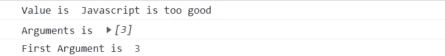
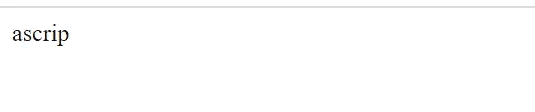

# 如何在 Angular 中创建自定义管道

> 原文：<https://javascript.plainenglish.io/how-to-create-custom-pipes-in-angular-15e49dea125f?source=collection_archive---------7----------------------->

## 如何在 Angular 中实现自定义管道的指南。


Photo by [Erlend Ekseth](https://unsplash.com/@er1end?utm_source=medium&utm_medium=referral) on [Unsplash](https://unsplash.com?utm_source=medium&utm_medium=referral)

在本系列的第 1 部分中，我们介绍了管道的基本概念，并讨论了一些内置管道。在这一部分中，我们将更进一步，看看如何实现定制管道。

我们将通过创建一个用例来学习定制管道。

***用例——假设我们需要显示基于开始和结束索引的字符串的修剪数据。如何使用管道实现同样的功能？***

***第一步:*** 用 angular-cli 创建一个管道。

```
ng g p stringSubstr
```

该命令将在我们的 Angular 应用程序中创建一个默认管道。让我们看看默认的代码结构:

```
import { Pipe, PipeTransform } from '@angular/core';@Pipe({ name: 'stringSubstr'                 // Line 1})export class StringSubstrPipe implements PipeTransform {  // Line 2transform(value: unknown, ...args: unknown[]): unknown {  // Line 3return null;                                              // Line 4}}
```

让我们来分析一下这个片段:

1.  管道装饰器，即@Pipe 有一个名为***“name”***的属性，它引用了管道名，然后在 HTML 文件中使用该管道名。(第一行)
2.  ***“Pipe transform”***是需要自定义管道实现的接口。(第二行)
3.  在第 3 行，我们实现了 PipeTransform 接口的"*方法。
    此转换方法包含两个参数，第一个是需要转换的值，即在 HTML 中应用管道的值，第二个是 rest 参数，包含传递到管道中的所有参数。(如果您不确定 rest 参数是如何工作的，请查看这篇[文章](https://medium.com/javascript-in-plain-english/javascript-rest-parameter-simplified-2054d7c49238)。)*
4.  *最后，确保在转换后返回值(第 4 行),否则您将得不到想要的结果。*

*因此，这是创建定制管道需要遵循的 4 个步骤。现在，让我们在上面提到的用例中使用它们。*

*我们将讨论两种场景:*

1.  ****单参数—*** 修剪从给定索引到字符串末尾的数据。*

*我们已经准备好了烟斗。现在，让我们开始同样的工作。*

*下面，我们在需要修剪的字符串上添加了管道，并在其中一个参数中作为 3 传递。*

```
*<div>{{pipeExample | stringSubstr : 3}} // pipeExample is defined in ts with value = 'Javascript is too good';</div>*
```

*让我们分析一下在应用了一些日志程序之后，我们的转换方法中存在什么值。*

```
*export class StringSubstrPipe implements PipeTransform {transform(value: string, ...args: number[]): unknown {console.log('Value is ', value); console.log('Arguments is ', args);console.log('First Argument is ', args[0]);return value;}}*
```

*因此，上述记录器的输出是:*

**

*Logger_Snapshot*

*如您所见，value 是我们想要转换的值(通过它添加自定义管道), args 是我们传递给管道的参数的完整列表。
参数可以按照它们在 HTML 中传递的顺序用索引来访问。*

*一旦你理解了上面的部分，剩下的就很简单了，就是普通的 JavaScript。*

*现在让我们看看完整的实现:*

```
*export class StringSubstrPipe implements PipeTransform {transform(value: string, ...args: number[]): string {let initialIndex = args[0];let subStr = value.substring(initialIndex);return subStr;}}*
```

*在初始索引中，我们获取传递的第一个参数，并在下一步中使用 JavaScript substring 方法对数据进行切片。*

*最后返回计算后的数据，这将在 HTML 中可见。*

*这是第一个场景，现在切换到第二个场景。*

*2. ***多参数—*** 从给定的起始索引到给定的结束索引修剪数据。*

*更改 HTML 以传入两个参数。*

```
*<div>{{pipeExample | stringSubstr : 3 : 9}}</div>*
```

*因此，在这里我们将第一个参数作为 3 传递，将第二个参数作为 9 传递。*

*现在，我们将在自定义管道中访问相同的内容:*

```
*export class StringSubstrPipe implements PipeTransform {transform(value: string, ...args: number[]): string {let initialIndex = args[0];let secondIndex = args[1];let subStr = value.substring(initialIndex, secondIndex);return subStr;}}*
```

*与第一种方法类似，我们提取单独变量中的参数，并使用 JavaScript substring 方法进行转换，最后返回值。*

*如预期的那样，输出是:*

**

*Multiple Argument*

*所以，简单地说，这就是你如何实现一个定制管道。希望你能在这里获得一些基本的理解。如果您有任何进一步的疑问或需要更多的澄清，请告诉我。*

*关于我——我是一个编程爱好者，喜欢阅读和写作前端设计、JavaScript 和 UI/UX 相关的东西。点击[这里](https://medium.com/@avinash.dev21987)阅读我所有的文章，并让我知道你的反馈。*

**更多内容看* [***说白了就是 io***](https://plainenglish.io/) *。报名参加我们的* [***免费周报***](http://newsletter.plainenglish.io/) *。关注我们关于* [***推特***](https://twitter.com/inPlainEngHQ) ， [***领英***](https://www.linkedin.com/company/inplainenglish/) *，以及* [***不和***](https://discord.gg/GtDtUAvyhW) *。**