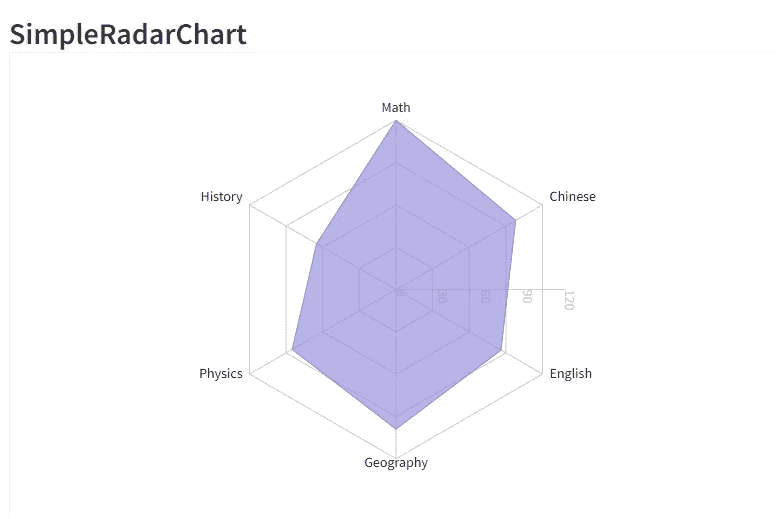

# 如何使用 ReChart 为您的项目轻松创建定制图表

> 原文：<https://javascript.plainenglish.io/how-to-create-customized-charts-easily-with-rechart-for-your-projects-bb542bb667c1?source=collection_archive---------10----------------------->

## 像 SimpleLineChart，SimpleAreaChart，TinyBarChart，SImpleScatterChart 等等。


Photo by [Lukas Blazek](https://unsplash.com/@goumbik?utm_source=medium&utm_medium=referral) on [Unsplash](https://unsplash.com?utm_source=medium&utm_medium=referral)

我最近完成了一个使用图表的客户项目。它更类似于处理客户数据的 CRM 或管理面板。它有助于提供销售、销售线索等方面的信息。

因此，根据所提供的数据，我必须生成一些图表。是的，我在以前的项目中使用了 Chart.js 和 Apex Chart。但我听说过 Rechart，想把它派上用场。

而且难度也小了很多。我只是从页面上复制并粘贴了代码，并做了一些小的修改。

*请记住，没有加盟链接，平台不是付钱给我推广 Recharts 的。此外，下面的代码是从官方网站获得的，因此代码的全部信用属于他们。*

# 1.简单线图

首先，我想制作一个比较两个参数的基本折线图。
我在这个例子中使用了 Typescript，但是你也可以使用 JavaScript。

我们来做一个 data.tsx 文件。因为图表需要数据。

```
const data = [
{
name: "Page A",
uv: 4000,
pv: 2400,
amt: 2400
},{
name: "Page B",
uv: 3000,
pv: 1398,
amt: 2210
},{
name: "Page C",
uv: 2000,
pv: 9800,
amt: 2290
},{
name: "Page D",
uv: 2780,
pv: 3908,
amt: 2000
},{
name: "Page E",
uv: 1890,
pv: 4800,
amt: 2181
},{
name: "Page F",
uv: 2390,
pv: 3800,
amt: 2500
},{
name: "Page G",
uv: 3490,
pv: 4300,
amt: 2100
}];export default data;
```

在 App.tsx 文件中。

```
import "./styles.css";
import React from "react";
import { LineChart, Line, XAxis, YAxis, CartesianGrid, Tooltip, Legend } from "recharts";
import data from "./data";function App() { 
return (
<LineChart 
width={500} 
height={300} 
data={data} 
margin={{ top: 5, right: 30, left: 20, bottom: 5 }} ><CartesianGrid strokeDasharray="3 3" />
<XAxis dataKey="name" />
<YAxis />
<Tooltip />
<Legend />
<Line type="monotone" dataKey="pv" stroke="#8884d8" 
activeDot={{ r: 8 }} /><Line type="monotone" dataKey="uv" stroke="#82ca9d" /></LineChart>
);}export default App;
```

这是输出。


Src: Recharts

这里有一个[演示](https://codesandbox.io/s/simple-line-chart-kec3v)的链接。你甚至可以玩它。

# 2.简单区域图表

你也可以做一个简单的面积图。数据文件不会改变，因此使用相同的 data.tsx 文件。

在 App.tsx 文件中:

```
import React, { PureComponent } from 'react';
import { AreaChart, Area, XAxis, YAxis, CartesianGrid, Tooltip, ResponsiveContainer } from 'recharts';import data from "./data";class Example extends PureComponent {
render() {
return (<ResponsiveContainer width="100%" height="100%">
<AreaChart 
width={500} 
height={400} 
data={data} 
margin={{ top: 10, right: 30, left: 0, bottom: 0,}}><CartesianGrid strokeDasharray="3 3" />
<XAxis dataKey="name" />
<YAxis />
<Tooltip />
<Area type="monotone" dataKey="uv" stroke="#8884d8" fill="#8884d8" /></AreaChart></ResponsiveContainer>
);}}export default Example;
```

这是输出。


Src: Recharts

这里有一个[演示](https://codesandbox.io/s/simple-area-chart-4ujxw)的链接。你甚至可以玩它。

# 3.TinyBarChart

```
import React, { PureComponent } from 'react';import { BarChart, Bar, Cell, XAxis, YAxis, CartesianGrid, Tooltip, Legend, ResponsiveContainer } from 'recharts';import data from "./data";class Example extends PureComponent {
render() {
return (
<ResponsiveContainer width="100%" height="100%">
<BarChart width={150} height={40} data={data}>
<Bar dataKey="uv" fill="#8884d8" /></BarChart>
</ResponsiveContainer>
);}}export default Example;
```

这是输出。


Src: Rechart

这里有一个[演示](https://codesandbox.io/s/tiny-bar-chart-35meb)的链接。你甚至可以玩它。

# 4.简单散点图

```
import React, { PureComponent } from 'react';
import { ScatterChart, Scatter, XAxis, YAxis, CartesianGrid, Tooltip, ResponsiveContainer } from 'recharts';const data = [
{ x: 100, y: 200, z: 200 },
{ x: 120, y: 100, z: 260 },
{ x: 170, y: 300, z: 400 },
{ x: 140, y: 250, z: 280 },
{ x: 150, y: 400, z: 500 },
{ x: 110, y: 280, z: 200 },
];export default class Example extends PureComponent {
render() {
return (<ResponsiveContainer width="100%" height="100%"><ScatterChart
width={400}
height={400}
margin={{top: 20,right: 20,bottom: 20,left: 20,}}>
<CartesianGrid />
<XAxis type="number" dataKey="x" name="stature" unit="cm" />\
<YAxis type="number" dataKey="y" name="weight" unit="kg" />
<Tooltip cursor={{ strokeDasharray: '3 3' }} />
<Scatter name="A school" data={data} fill="#8884d8" /</ScatterChart></ResponsiveContainer>
);}}
```

这是输出。


Src: Rechart

# 5.SimpleRadarChart

将以下数据添加到 data.tsx 文件中。

```
const data = [{
subject: 'Math',
A: 120,
B: 110,
fullMark: 150,
},
{
subject: 'Chinese',
A: 98,
B: 130,
fullMark: 150,
},
{
subject: 'English',
A: 86,
B: 130,
fullMark: 150,
},
{
subject: 'Geography',
A: 99,
B: 100,
fullMark: 150,
},
{
subject: 'Physics',
A: 85,
B: 90,
fullMark: 150,
},
{
subject: 'History',
A: 65,
B: 85,
fullMark: 150,
},];export default data;
```

在 App.tsx 文件中。

```
import React, { PureComponent } from 'react';
import { Radar, RadarChart, PolarGrid, PolarAngleAxis, PolarRadiusAxis, ResponsiveContainer } from 'recharts';import data from "./data";class Example extends PureComponent {
render() {
return (
<ResponsiveContainer width="100%" height="100%">
<RadarChart cx="50%" cy="50%" outerRadius="80%" data={data}>
<PolarGrid />
<PolarAngleAxis dataKey="subject" /><PolarRadiusAxis />
<Radar name="Mike" dataKey="A" stroke="#8884d8" fill="#8884d8" fillOpacity={0.6} />
</RadarChart>
</ResponsiveContainer>
);}}export default Example;
```

这是输出。



Src: Rechart

这里有一个[演示](https://codesandbox.io/s/simple-radar-chart-rjoc6)的链接。你甚至可以玩它。

[这里](https://recharts.org/en-US/examples/)还有几个例子，你可以浏览一下，放在自己的网页里。

[*如果你喜欢看这样的故事，并想帮助我成为一名作家，可以考虑成为一名中等会员*](https://nitinfab.medium.com/membership) *。每月 5 美元，你可以无限制地访问媒体内容**[*。如果你通过我的链接注册，我会得到一点佣金。*](https://nitinfab.medium.com/membership)*

*就这些——谢谢。*

**更多内容请看*[***plain English . io***](https://plainenglish.io/)*。报名参加我们的* [***免费周报***](http://newsletter.plainenglish.io/) *。关注我们关于*[***Twitter***](https://twitter.com/inPlainEngHQ)*和**[***LinkedIn***](https://www.linkedin.com/company/inplainenglish/)*。加入我们的* [***社区***](https://discord.gg/GtDtUAvyhW) *。***