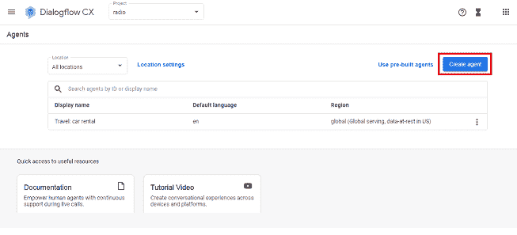
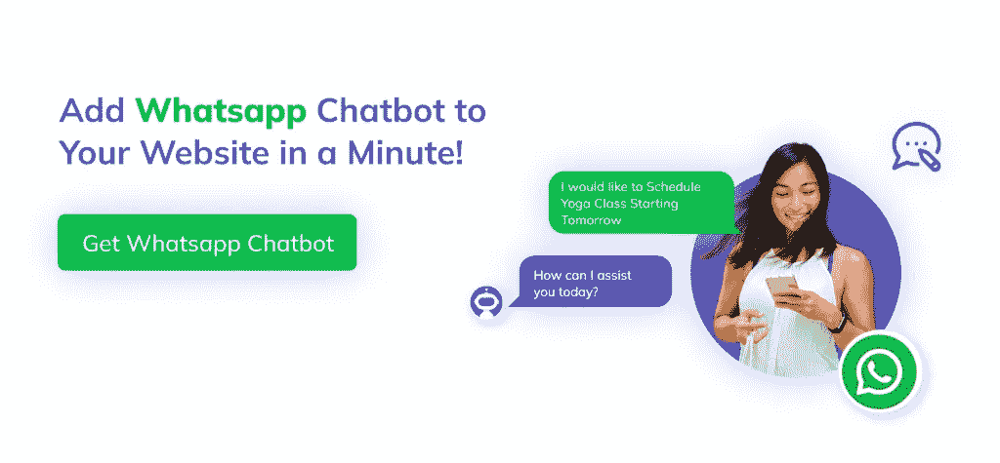
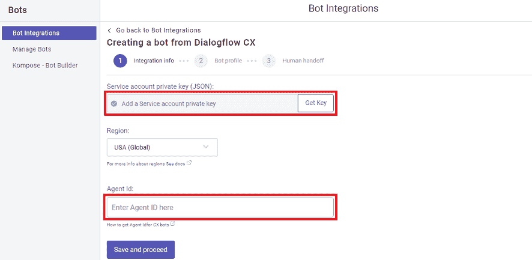
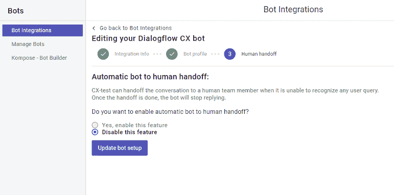
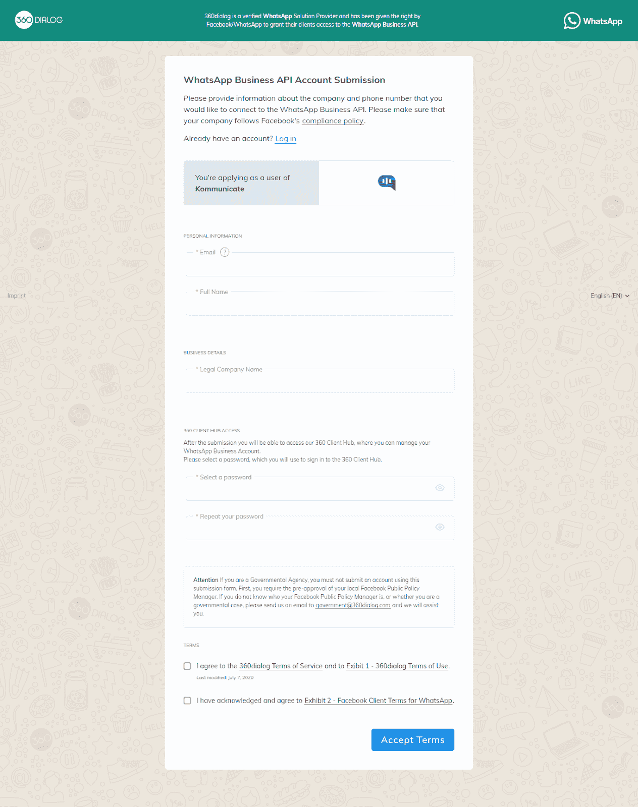

# 如何创建 Dialogflow Whatsapp 聊天机器人

> 原文：<https://javascript.plainenglish.io/how-to-create-dialogflow-whatsapp-chatbot-29e5e2a4cd73?source=collection_archive---------7----------------------->

聊天机器人是可以在互联网上与用户交谈的对话代理或程序。在本文中，我将带您了解在 360Dialog 平台上创建 WhatsApp 聊天机器人的过程，我们将利用谷歌的 Dialogflow CX 来构建能够解释人类语言的智能机器人。

## 先决条件

1.  **Dialogflow 账户:**如果你没有，你需要在谷歌的 Dialogflow CX 控制台上创建一个。除非你想要更高级的功能，比如情绪分析，否则这项服务是免费的。
2.  **komunicate 账户:**要从 WhatsApp 管理客户对话，使用 komunicate 账户。此外，使用 Kommunicate 的客户支持自动化平台，聊天机器人和人类可以完美和谐地工作。你可以在这里注册

## 步骤 1:准备好你的对话流 CX 聊天机器人和凭证

打开 Dialogflow CX 控制台，创建一个新项目或选择一个现有项目。一旦选择了项目，您可以通过单击 Create Agent 按钮创建一个新的代理，或者选择一个现有的代理。

在将 Dialogflow CX 与 Kommunicate 集成之前，请确保您已经在 Dialogflow CX 控制台中为 Dialogflow CX 代理创建了一个项目。然后必须为您的项目启用 Dialogflow API，并且必须生成服务帐户密钥。

**创建服务账户密钥文件的步骤:**

启用 API:
https://cloud.google.com/dialogflow/cx/docs/quick/setup#api[✔️](https://cloud.google.com/dialogflow/cx/docs/quick/setup#api)

✔️Get 服务帐户密钥文件如下:

[https://cloud . Google . com/dialog flow/CX/docs/quick/setup # auth](https://cloud.google.com/dialogflow/cx/docs/quick/setup#auth)

更多信息请参考 komunitae[文档](https://docs.kommunicate.io/docs/bot-dialogflow-integration#integration-using-dialogflow-cx)。

**注意**:与 Dialogflow ES 不同，Dialogflow CX 需要一个代理 ID 才能与 Kommunicate 集成；下面是如何获得一个。
转到 *Dialogflow CX 控制台* > > *选择项目* > >导航到您创建的代理*‘复制 ID’*。代理的名称将采用以下格式，最后一个字母数字字符串是名称中的代理 ID。

项目/测试-covid-rwvr/位置/全局/代理/**e2c 5d 8 a 3-f416–4f 32-bfc 9-d 986d 540 abdb where**。

## 步骤 2:将 Dialogflow CX 机器人集成到通信中

登录后，导航到您的通信仪表板的机器人集成部分。移动到对话流 CX 部分，并选择集成机器人。

*   上传“服务帐户密钥”
*   选择“区域”
*   在相应的给定中提及“代理 ID”。

点击保存继续。您可以在接下来的 bot profile 部分中为您的 bot 提供一个名称和身份。当机器人与您的客户交互时，他们会看到这个名称。要完成设置，请单击保存并继续下一步。在下面的步骤中，您可以配置您的聊天机器人配置文件和自动聊天机器人。

## 第三步:连接 Kommunicate 和 360Dialog 进行 WhatsApp 集成。

360Dialog 是一个 API 提供者，直接与 WhatsApp 集成。Kommunicate 与 360Dialog 合作，为客户提供易于使用的 WhatsApp 集成，并为企业提供购买电话号码和 WhatsApp 官方 API 帐户。

要将您的 Whatsapp 号码连接到 Kommunicate，请填写下面链接中的表格，并发送电子邮件至 support @ kommunicate.io，提供所需信息。

创建 WhatsApp API 的步骤

*   填写表格:[https://hub.360dialog.com/lp/whatsapp/rKRgFhPA](https://hub.360dialog.com/lp/whatsapp/rKRgFhPA)
*   在[supp](mailto:support@kommunicate.io)[o](mailto:support@kommunicate.io)[rt @ komunicate . io](mailto:support@kommunicate.io)与我们分享以下细节
*   Whatsapp 号码(whatsappSender)
*   DIALOG360 API 密钥(d360ApiKey)
*   帐户命名空间(d360 命名空间)
*   您的通信帐户 APP_ID，点击[此处](https://dashboard.kommunicate.io/settings/install)获取 APP_ID

当 Kommunicate 支持团队收到这些信息时，他们会帮助您将 WhatsApp 号码与您的帐户关联起来。

瞧啊。！！..设置完成后，发送到您的 360Dialog WhatsApp 号码的任何消息都将在您的 Kommunicate 仪表盘中接收。

注意:WhatsApp 消息模板是企业用来向选择接收通知的人发送通知或客户关怀消息的特定消息格式。约会提醒、运输信息、问题解决和付款更新都是消息的例子。

更多信息可以在这里找到:[https://developers . Facebook . com/docs/whatsapp/API/messages/message-templates/](https://developers.facebook.com/docs/whatsapp/api/messages/message-templates/)

最初发表于 2021 年 10 月 22 日 https://www.kommunicate.io/

*更多内容请看*[***plain English . io***](https://plainenglish.io/)*。报名参加我们的* [***免费周报***](http://newsletter.plainenglish.io/) *。关注我们关于*[***Twitter***](https://twitter.com/inPlainEngHQ)[***LinkedIn***](https://www.linkedin.com/company/inplainenglish/)*[***YouTube***](https://www.youtube.com/channel/UCtipWUghju290NWcn8jhyAw)*[***不和***](https://discord.gg/GtDtUAvyhW) *。对增长黑客感兴趣？检查* [***电路***](https://circuit.ooo/) *。***