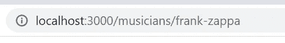
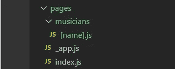

# 如何在 Next.js 中创建动态路由

> 原文：<https://javascript.plainenglish.io/how-to-create-dynamic-routes-in-next-js-26b498275453?source=collection_archive---------6----------------------->

## 关于在 Next.js 中创建动态路径的指南

Photo by [Florian Olivo](https://unsplash.com/@florianolv?utm_source=medium&utm_medium=referral) on [Unsplash](https://unsplash.com?utm_source=medium&utm_medium=referral)

动态路由基于一组公共信息(如数据库表)来抽象路由的命名。这使得 RESTful 路径更好，代码更简洁，因为可以创建一个组件布局，用所需的数据填充页面。React 通常以制作单页应用程序而闻名，像 React Router 这样的包需要用来制作自定义 URL。输入 Next.js，它能够创建现成的动态路由。

Next.js 中的路由使用页面格式。`pages`目录中的组件将根据文件名生成一个静态路由。例如，`pages/about.js`将有一条对应于`/about`的路线，而`pages/welcome.js`将是`/welcome`。

名为`index.js`的文件将自动传送到`/`。嵌套路由就像在`pages`中创建一个目录一样简单。如果一个名为`musicians`的新目录被放置在`pages`中，`musicians`中的文件将被嵌套。示例:`pages/musicians/info.js`将路由到`/musicians/info`。

这些只是静态路由。如果有一个音乐家的数据库，根据他们的名字有一个动态的路线就好了。如果弗兰克·扎帕的页面被路由到`/musicians/frank-zappa`，那就太好了。为了在 Next.js 中进行设置，我们将在`musicians`中创建一个文件名为`[name].js`的组件。方括号表示页面将使用动态路由。

The file must have square brackets around the name.

在`[name].js`内部为音乐家页面制作组件，将他们的数据作为道具。

这里的目的是让路线成为音乐家名字的一部分。为了实现这一点，Next.js 需要使用两个函数:`getStaticPaths()`和`getStaticProps()`。

## getStaticPaths()

这个函数被设计成接受一个带有所需参数的对象数组并生成路径。在这个例子中，我们将使用一个名为`fetchMusicians()`的函数从数据库中获取所有的音乐家，并创建一个对象数组，每个音乐家的名字作为一个 slug。

让我们解开这段代码。从数据库中获取音乐家对象的数组。然后将名为 slugged 的 params 对象数组赋给`paths`并返回。

**重要:**这里返回的对象数组*必须*有`params`作为一个有自己键的对象的键。在这种情况下，它是`params.name`,其值是被签名的音乐家的名字。这将生成所有可能的路线。`fallback: false`的目的是，如果所访问的路线与该函数生成的路径列表中的任何一条都不匹配，则显示 404 错误。

## getStaticProps()

该函数用于抓取页面所需的必要数据。在这里的例子中，我们想要获取路线的名称，它是用`getStaticPaths()`生成的，并使用它来查询数据库并呈现正确的音乐家信息。

想象一下参观`/musicians/frank-zappa`。路线在`params`内被识别，因此作为参数被输入`getStaticProps()`。必须将`params.name`的值 frank-zappa 转换回音乐家名字的原始形式，以便它可以用于查询数据库和检索弗兰克·扎帕的信息。然后检索数据，并使用这些数据完全呈现页面。

完成动态路由都需要两个函数`getStaticPaths()`和`getStaticProps()`。记住，`getStaticPaths()`基于某个属性创建一个路线列表。在这个例子中，我们使用了一个人名的缩写，但是也可以使用数据库 id。只需将`[name].js`更改为`[id].js`，并在 params 对象中创建一个`id`键，而不是使用适当的 id 作为值的`name`。

将所有这些与`[name].js`文件放在一起应该是这样的:

确保`export`和`async`在`getStaticPaths()`和`getStaticProps()`之前，否则它们将无法正常工作。现在，访问一个音乐家的页面会根据他们的名字以动态路线呈现他们的信息。

Next.js 简化了动态呈现和路由页面的过程。它让开发人员可以自由地创建现成的可定制的 RESTful 路线。这很容易做到，保持代码干净简洁，并提供更好的用户体验。

*更多内容请看*[***plain English . io***](https://plainenglish.io/)*。报名参加我们的* [***免费周报***](http://newsletter.plainenglish.io/) *。关注我们关于*[***Twitter***](https://twitter.com/inPlainEngHQ)*和*[***LinkedIn***](https://www.linkedin.com/company/inplainenglish/)*。加入我们的* [***社区不和谐***](https://discord.gg/GtDtUAvyhW) *。*