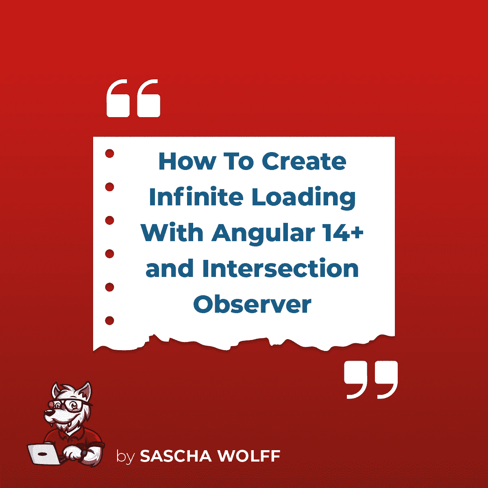

# 如何使用 Angular 14+和交集观察者创建无限滚动列表

> 原文：<https://javascript.plainenglish.io/how-to-create-infinite-loading-with-angular-14-and-intersection-observer-3e0e679ade4c?source=collection_archive---------1----------------------->



如果您经常开发 Angular 应用程序，那么您迟早会遇到这样的需求，即当用户滚动到列表末尾时，应该动态获取新元素。

这种行为也被称为**无限滚动**。

当然，你可以用 good ol ' T0 来做这件事。然而，这种解决方案相当糟糕，此外，在 2022 年已经有了一种更优雅的方法:T1。

[](https://developer.mozilla.org/en-US/docs/Web/API/Intersection_Observer_API) [## 交叉点观察器 API-Web API | MDN

### 交叉点观察器 API 提供了一种异步观察目标元素交叉点变化的方法…

developer.mozilla.org](https://developer.mozilla.org/en-US/docs/Web/API/Intersection_Observer_API) 

使用`IntersectionObserver`你还可以做其他事情，比如通过`lazyload`重新加载图像，但是现在有一个更好的方法:

[](https://developer.mozilla.org/en-US/docs/Web/Performance/Lazy_loading#images_and_iframes) [## 延迟加载- Web 性能| MDN

### 通常情况下，网页包含许多图像，这些图像会影响数据的使用和页面加载的速度。这些中的大多数…

developer.mozilla.org](https://developer.mozilla.org/en-US/docs/Web/Performance/Lazy_loading#images_and_iframes) 

在下文中，我将向您展示如何自己构建一个`Directive`，它将在用户到达列表末尾时触发一个事件:

## 该指令

确切地说，有两个指令，稍后我会更详细地解释。第一个做实际工作，第二个仅作为(可选)标记，如果事件不应该附加到`document`。

```
// scroll-end.directive.tsimport { Directive, ElementRef, ***EventEmitter***, Input, OnDestroy, OnInit, Optional, Output } from '@angular/core';
import { ScrollEndRootDirective } from './scroll-end-root.directive';export enum SCROLLEND_DIRECTION {
  *DOWN* = 'down',
  *UP* = 'UP',
}

@Directive({
  selector: '[scrollEnd]',
})
export class ScrollEndDirective implements OnInit, OnDestroy {
  @Output() scrollEnd: ***EventEmitter***<any> = new ***EventEmitter***();

  @Input() rootMargin = '0px 0px 0px 0px';
  @Input('direction') desiredDirection: SCROLLEND_DIRECTION = SCROLLEND_DIRECTION.*DOWN*;

  observer: IntersectionObserver;
  previousEntry: IntersectionObserverEntry;
  scrollDirection: SCROLLEND_DIRECTION;

  constructor(
    private el: ElementRef,
    @Optional() private scrollEndRoot: ScrollEndRootDirective,
  ) { }

  ngOnInit(): void {
    this.observer = new IntersectionObserver(entries => {
      entries.forEach(entry => {
        this.scrollDirection = this.previousEntry?.boundingClientRect.bottom > entry.boundingClientRect.bottom ? SCROLLEND_DIRECTION.*DOWN* : SCROLLEND_DIRECTION.*UP*;

        if (!this.previousEntry?.isIntersecting && entry.isIntersecting && this.scrollDirection === this.desiredDirection) {
          this.scrollEnd.emit();
        }

        this.previousEntry = entry;
      });
    }, {
      root: this.scrollEndRoot?.el.nativeElement,
      rootMargin: this.rootMargin,
    });

    this.observer.observe(this.el.nativeElement);
  }

  ngOnDestroy(): void {
    this.observer.disconnect();
  }
} // scroll-end-root.directive.tsimport { Directive, ElementRef } from '@angular/core';

@Directive({
  selector: '[scrollEndRoot]',
})
export class ScrollEndRootDirective {
  constructor(
    public el: ElementRef,
  ) {
  }
}
```

## 使用

例如，让我们假设一个要动态重新加载的通知列表:

```
<div class="notifications" scrollEndRoot>
  <div *ngFor="let notification of notifications$ | async">...</div>
  <div (scrollEnd)="loadMore()" rootMargin="0px 0px 100px 0">
    <loading-spinner *ngIf="loading$ | async)"></loading-spinner>
  </div>
</div>
```

## 它是如何工作的？

关于整个事情如何运作的问题仍然存在:

在我们的示例中，`div.notifications`具有固定的高度(例如 500px)和`overflow: auto`。当`notifications$`列表结束时，带有`<loading-spinner>`的`div`出现。一旦发生这种情况，`scroll-end.directive.ts`中的`IntersectionObserver`被触发，并将事件传递给`(scrollEnd)`。

注意确保只有当用户向相反方向滚动或者元素至少一次被滚出屏幕时才触发该事件。

顺便说一句，在`desiredDirection="UP"`的帮助下，你也可以逆转这个行为。

另外，你可以在`rootMargin`的帮助下使用一个缓冲到边距。在我们的例子中,`0px 0px 100px 0px`确保了当列表的结尾仍然在`100px`视窗之外时，事件已经被触发。

也可以省去`scrollEndRoot`。然后`IntersectionObserver`会自动附加到浏览器的视窗中。这很有用，例如，如果整个页面上只有一个全屏幕表格。

# 摘要

如您所见，使用角度指令和`IntersectionObserver`开发一个无限负载并不困难。

如果你有任何问题，不要害怕给我回复或在 Twitter 上联系我，电话: [@saschawolff1](http://twitter.com/saschawolff1) 。

如果你想看更多精彩的文章，试试这篇:

[https://medium . com/@ sascha . Wolff/utility-first-CSS-snally-fast-front-end-development-for-almost-every-design-503130 D8 fefc](https://medium.com/@sascha.wolff/utility-first-css-ridiculously-fast-front-end-development-for-almost-every-design-503130d8fefc)

*更多内容看* [***说白了。报名参加我们的***](https://plainenglish.io/) **[***免费周报***](http://newsletter.plainenglish.io/) *。关注我们关于*[***Twitter***](https://twitter.com/inPlainEngHQ)*和*[***LinkedIn***](https://www.linkedin.com/company/inplainenglish/)*。查看我们的* [***社区不和谐***](https://discord.gg/GtDtUAvyhW) *加入我们的* [***人才集体***](https://inplainenglish.pallet.com/talent/welcome) *。***